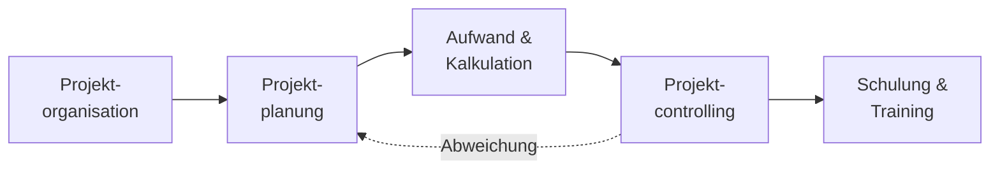

# Projekte & Koordination

Integrationsarbeit passiert fast nie als Einzelkampf am Schreibtisch. Eine neue Anlage anbinden, ein System ablösen, eine Cloud-Umgebung aufbauen – das sind **Projekte**: mit Zielen, Terminen, Budget, mehreren Beteiligten und jeder Menge Schnittstellen. In diesem Block geht es darum, wie du ein **Teilprojekt der Systemintegration** organisierst, planst, kalkulierst, steuerst und begleitest – und wie du am Ende die Menschen mitnimmst, die mit dem Ergebnis arbeiten sollen.

Stell dir das wie einen **Umzug** vor: Erst klärst du, wer was entscheidet und wer betroffen ist (Organisation), dann machst du einen Plan mit Reihenfolge und Terminen (Planung), schätzt Kisten, Helfer und Mietwagen (Aufwand), behältst am Umzugstag den Überblick und reagierst auf Verzögerungen (Controlling) – und am Schluss zeigst du allen, wo jetzt was steht (Schulung).

!!! abstract "Was du in diesem Block lernst"
    - welche **Organisationsformen** es gibt (klassisch und agil) und wie ein Teilprojekt sauber ins Gesamtprojekt passt
    - wie du einen **Projektplan** strukturierst, den **kritischen Pfad** findest und den Verlauf sichtbar machst
    - wie du den **Ressourcenbedarf** erkennst und an einer **Kalkulation** mitwirkst
    - wie du mit **Kennzahlen** (Earned Value, Burn-Down) steuerst und **Abweichungen** früh erkennst
    - wie du **Schulungen und Unterweisungen** vorbereitest, damit das Ergebnis auch genutzt wird

---

## Wie wichtig ist dieser Block?

Vertiefung &nbsp; Projektarbeit ist die **Klammer um die Technik**: Sie taucht selten als eigene Aufgabe auf, prägt aber, wie eine Integration geplant, begründet und übergeben wird. Wer hier sicher ist, kann technische Lösungen überzeugend einordnen und steuern.

!!! note "Status: Platzhalter in Arbeit"
    Die Struktur dieses Blocks steht, die einzelnen Seiten werden Schritt für Schritt mit Inhalten gefüllt. Du siehst hier schon, **welche Themen kommen** und **wie sie zusammenhängen** – damit du den roten Faden kennst, bevor die Details folgen.

---

## Seiten in diesem Block

| Seite | Inhalt | Relevanz |
|-------|--------|----------|
| [Projektorganisation](projektorganisation.md) | Klassische und agile Organisationsformen, Teilprojekte führen, Schnittstellen, Stakeholder- und Umfeldanalyse | Vertiefung |
| [Projektplanung](projektplanung.md) | Projektplan, Strukturierung, kritischer Pfad, Verlaufsdarstellung, Einsatzplanung, projektbegleitende Doku | Vertiefung |
| [Aufwand & Kalkulation](aufwand-und-kalkulation.md) | Ressourcenbedarf erkennen, Aufwandsschätzung, Mitwirkung an der Kalkulation | Praxis |
| [Projektcontrolling](controlling.md) | Kennzahlen, Trend- und Soll-Ist-Analysen, Abweichungen verfolgen und eskalieren, Statusberichte | Vertiefung |
| [Schulung & Training](schulung-und-training.md) | Qualifikationsformen, Bedarfe ermitteln, Schulungen vorbereiten, Unterweisungen | Praxis |

---

## Roter Faden

Wir bauen das Bild **vom Aufsetzen bis zur Übergabe**: erst klären, wer mitspielt und wie das Projekt organisiert ist, dann einen Plan bauen, den Aufwand dafür schätzen und kalkulieren, im Verlauf steuern und nachsteuern – und am Ende die Anwender qualifizieren. Stellt das Controlling eine Abweichung fest, geht es zurück in die Planung.

---

## Wie hängt das mit den anderen Blöcken zusammen?

- **[IT-Sicherheit & Risiko](../it-sicherheit/risikomanagement.md)** liefert das Werkzeug, um Projektrisiken zu bewerten – Risikomanagement ist auch Projektmanagement.
- **[Tests & Qualität](../testen-qualitaet/index.md)** schließt direkt an: Was hier geplant und gesteuert wird, wird dort getestet, abgenommen und übergeben.
- Die **technischen Blöcke** (Netzwerke, Virtualisierung, Docker) liefern den Inhalt der Teilprojekte – dieser Block liefert den Rahmen, in dem sie umgesetzt werden.

---

## Voraussetzungen

- Keine harten Vorkenntnisse. Wer schon einmal in einem Team an einer größeren Aufgabe gearbeitet hat, erkennt vieles wieder.
- Bereitschaft, **in Zielen, Terminen und Beteiligten** zu denken – nicht nur in der technischen Lösung.

---

## Leitfrage

> **Ich bekomme ein Teilprojekt übertragen – wie sorge ich dafür, dass es im Zeit-, Kosten- und Qualitätsrahmen bleibt und am Ende wirklich genutzt wird?**

Wer diese Frage strukturiert beantwortet – mit Plan, Kennzahlen und einem Blick für die beteiligten Menschen – arbeitet wie eine Fachkraft, die Projekte trägt, statt nur Aufgaben abzuarbeiten.
