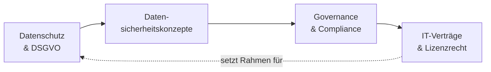

# Recht & Datenschutz

Technik kennt keine Landesgrenzen, das Recht schon. Sobald du Systeme integrierst, fließen darin **personenbezogene Daten**, du arbeitest mit **Verträgen** für Hardware, Software und Dienstleistungen und dein Handeln muss zu **gesetzlichen und internen Regeln** passen. Dieser Block zieht die organisatorischen und rechtlichen Leitplanken um die Systemintegration: Was darfst du mit Daten tun, wie hältst du Maßnahmen prüfbar, wer gibt die Spielregeln vor – und was steht eigentlich in den Verträgen, die das alles tragen?

!!! info "Wird von anderer Seite unterrichtet"
    Dieser Themenschwerpunkt gehört nicht zur Spezialisierung, sondern wird von einer
    anderen Lehrkraft unterrichtet. Die Seiten hier geben dir nur einen **Überblick**,
    damit du die Verbindungen zu den technischen Themen siehst – sie ersetzen den
    Unterricht nicht.

    Warum das trotzdem wichtig ist: In der Prüfung berührt **jede Aufgabe alle fünf
    Qualifikationsschwerpunkte**. Siehe [Weitere Prüfungsthemen](../weitere-themen.md).

Stell dir das wie die Straßenverkehrsordnung vor: Du kannst noch so gut fahren – ohne die Regeln zu kennen, fährst du irgendwann ins Risiko. Genau diese Regeln schauen wir uns hier an.

!!! abstract "Was du in diesem Block lernst"
    - welche **Datenschutzgesetze** gelten (allen voran die EU-DSGVO) und wie du Daten nach Schutzbedarf einordnest
    - wie du **Datensicherheitskonzepte** liest, prüfst und sinnvoll verbesserst – im Spannungsfeld aus Nutzen, Kosten und Recht
    - was **IT-Governance** und **IT-Compliance** bedeuten und wie Audits die Einhaltung sichtbar machen
    - welche **Vertragsarten** in der IT vorkommen und welche Rechtsfolgen an einer **Abnahme** hängen
    - warum Recht und Organisation kein lästiges Beiwerk sind, sondern angewandte Informationssicherheit

---

## Wie wichtig ist dieser Block?

Vertiefung &nbsp; Dieser Block vertieft das Verständnis und gibt den anderen Themen ihren rechtlichen Rahmen. Er ist kein Selbstzweck, aber wer ihn überspringt, plant Systeme ohne Leitplanken – und das fällt spätestens beim Datenschutz oder bei der Abnahme auf die Füße.

!!! note "Status: Platzhalter in Arbeit"
    Die Struktur dieses Blocks steht, die einzelnen Seiten werden Schritt für Schritt mit Inhalten gefüllt. Du siehst hier schon, **welche Themen kommen** und **wie sie zusammenhängen** – damit du den roten Faden kennst, bevor die Details folgen.

---

## Seiten in diesem Block

| Seite | Inhalt | Relevanz |
|-------|--------|----------|
| [Datenschutz & DSGVO](datenschutz-dsgvo.md) | Datenschutzgesetze (EU-DSGVO), branchenspezifische Regelungen, Schutzbedarf und Datenklassifizierung, Best Practices | Prüfungsrelevant |
| [Datensicherheitskonzepte](datensicherheitskonzepte.md) | Konzepte verstehen und optimieren, Balance aus Nutzen/Kosten/Recht, konkrete Maßnahmen, regelmäßige Überprüfung | Vertiefung |
| [Governance & Compliance](governance-und-compliance.md) | IT-Governance (COBIT, Leitbild, Ethik), IT-Compliance, Umgang mit Verstößen, interne und externe Audits | Vertiefung |
| [IT-Verträge & Lizenzrecht](it-vertraege.md) | Vertragsgegenstände, Vertragsarten nach BGB/HGB, Claim-Management, Rechtsfolgen der Abnahme | Praxis |

---

## Roter Faden

Wir bauen das Bild **vom Gesetz zur Umsetzung und zurück zum Vertrag**: erst klären, welche Regeln für Daten gelten (Datenschutz), daraus ein prüfbares Konzept ableiten (Datensicherheit), dieses in einen organisatorischen Rahmen einbetten (Governance & Compliance) und am Ende die Verträge betrachten, die das Ganze rechtlich tragen. Die Verträge wiederum legen oft fest, welche Schutzpflichten überhaupt gelten – der Kreis schließt sich.

---

## Wie hängt das mit den anderen Blöcken zusammen?

- **[IT-Sicherheit & Risiko](../it-sicherheit/index.md)** liefert die Denkweise hinter Schutzzielen und Maßnahmen. Datenschutz ist im Kern **angewandte Informationssicherheit mit Gesetzescharakter** – hier kommt die rechtliche Verpflichtung dazu.
- **[Infrastruktur & Architektur](../infrastruktur-planung/index.md)** trifft sich beim Thema [Lizenzmodelle](../infrastruktur-planung/lizenzmodelle.md): Was dort technisch und finanziell geplant wird, hat hier seine vertragliche und rechtliche Seite.
- **Jede Planungsentscheidung** verschiebt auch rechtliche Pflichten – deshalb gehört dieser Block früh mit an den Tisch, nicht erst zum Schluss.

---

## Voraussetzungen

- Keine juristische Vorbildung nötig. Wer den Block [IT-Sicherheit & Risiko](../it-sicherheit/index.md) kennt, erkennt die Parallelen zwischen Schutzzielen und Datenschutz schneller.
- Bereitschaft, in **Regeln, Nachweisen und Verantwortlichkeiten** zu denken – nicht nur in Technik.

---

## Leitfrage

> **Ein System verarbeitet personenbezogene Daten und stützt sich auf gekaufte Software und Dienstleistungen – welche Regeln, Konzepte und Verträge muss ich beachten, damit das rechtssicher und nachweisbar läuft?**

Wer diese Frage strukturiert beantwortet – statt Recht und Organisation als Bremse zu sehen – denkt wie eine Fachkraft, die Verantwortung für mehr als nur die Technik trägt.
