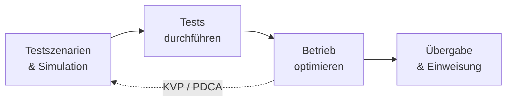

# Tests & Qualität

Ein integriertes System ist erst dann fertig, wenn jemand **nachgewiesen** hat, dass es tut, was es soll – und zwar nicht nur jede Komponente für sich, sondern im **Zusammenspiel**. Genau hier setzt dieser Block an. Du baust nicht nur, du prüfst: Funktioniert das Ganze unter Last? Verhält es sich auch im Grenzfall sauber? Und wie übergibst du es so, dass die Leute danach damit arbeiten können?

Stell dir einen Neuwagen vor: Der Motor läuft, die Bremsen greifen, das Radio spielt – jedes Teil für sich ist getestet. Trotzdem fährt niemand vom Hof, bevor das Auto als **Ganzes** eine Probefahrt hinter sich hat. Tests & Qualität ist genau diese Probefahrt für dein System.

!!! abstract "Was du in diesem Block lernst"
    - wie man **Testfälle und Testanforderungen** sauber definiert und realitätsnahe Simulationsumgebungen auswählt
    - wie man **Integrations-, End-to-End- und komponentenübergreifende Tests** durchführt und automatisiert
    - wie man aus **Logs, Diagnoseberichten und Prozessdaten** Optimierungspotenzial herausliest
    - wie man einen **kontinuierlichen Verbesserungsprozess** (KVP / PDCA) aufsetzt
    - wie man ein System **zielgruppengerecht übergibt** und Anwender einweist

---

## Wie wichtig ist dieser Block?

Vertiefung &nbsp; Dieser Block vertieft das Verständnis dafür, wie aus einem *gebauten* System ein *abgenommenes und betriebsfähiges* System wird. Prüfen, optimieren und übergeben gehört zu jeder ernsthaften Integration dazu – auch wenn die reine Technik woanders entsteht.

!!! note "Status: Platzhalter in Arbeit"
    Die Struktur dieses Blocks steht, die einzelnen Seiten werden Schritt für Schritt mit Inhalten gefüllt. Du siehst hier schon, **welche Themen kommen** und **wie sie zusammenhängen** – damit du den roten Faden kennst, bevor die Details folgen.

---

## Seiten in diesem Block

| Seite | Inhalt | Relevanz |
|-------|--------|----------|
| [Testszenarien & Simulation](testszenarien.md) | Testfälle und -anforderungen definieren, Testarten unterscheiden, Grenz- und Fehlerfälle planen, Testumgebungen und Testdaten wählen, Validität der Ergebnisse sichern | Vertiefung |
| [Tests durchführen](tests-durchfuehren.md) | Integrations-, End-to-End- und komponentenübergreifende Tests, Automatisierung, Fehlerklassifizierung, Testbericht, Nachtest und Abnahme | Vertiefung |
| [Übung: Testkonzept](uebung-testkonzept.md) | Gruppenübung: Testkonzept für die Anbindung einer neuen Warenwirtschaft an Lager und Buchhaltung – mit Vorlage, Hilfekarten und Musterlösung | Praxis |
| [Betrieb optimieren](optimierung.md) | Datenanalyse, Mustererkennung, Handlungsempfehlungen, kontinuierliches Monitoring (KVP / PDCA) | Vertiefung |
| [Übergabe & Einweisung](uebergabe-und-training.md) | Zielgruppengerechte Übergabe, Lehr- und Lernmaterialien, Feedbackschleifen, Nachbetreuung | Praxis |

---

## Roter Faden

Wir bauen das Bild **von der Planung zur Übergabe**: erst definieren, *was* und *wie* geprüft wird, dann die Tests tatsächlich durchführen und auswerten, daraus den laufenden Betrieb optimieren – und am Ende sauber an die Anwender übergeben. Weil Optimierung nie endet, führt der rote Faden über KVP wieder zurück zu neuen Testszenarien.

---

## Wie hängt das mit den anderen Blöcken zusammen?

- **[CI/CD](../ci-cd/index.md)** ist die natürliche Heimat automatisierter Tests: Was du hier konzeptionell als Test definierst, läuft dort in der Pipeline bei jedem Commit automatisch durch.
- **[Betrieb & Verfügbarkeit](../betrieb/index.md)** liefert die Daten, aus denen Optimierung entsteht – Monitoring, Logs und Betriebskennzahlen sind der Rohstoff dieses Blocks.
- **Übergabe und Einweisung** greifen direkt in das Projektgeschäft hinein: Wer schult, plant Termine, Material und Zielgruppen – das ist klassische Projektarbeit.

---

## Voraussetzungen

- Keine harten Vorkenntnisse. Wer schon ein System **gebaut oder integriert** hat, erkennt schneller, warum die Tests am Ende so wichtig sind.
- Ein Gespür dafür, dass **„läuft bei mir“ kein Nachweis** ist – sondern erst ein reproduzierbarer Test.

---

## Leitfrage

> **Woran erkenne ich – nachweisbar und nicht nur gefühlt –, dass mein integriertes System funktioniert, performt und übergeben werden kann?**

Wer diese Frage mit Testfällen, Messwerten und einer sauberen Übergabe beantwortet – statt mit „hat bisher funktioniert“ – arbeitet wie eine Fachkraft, die für Qualität geradesteht.
