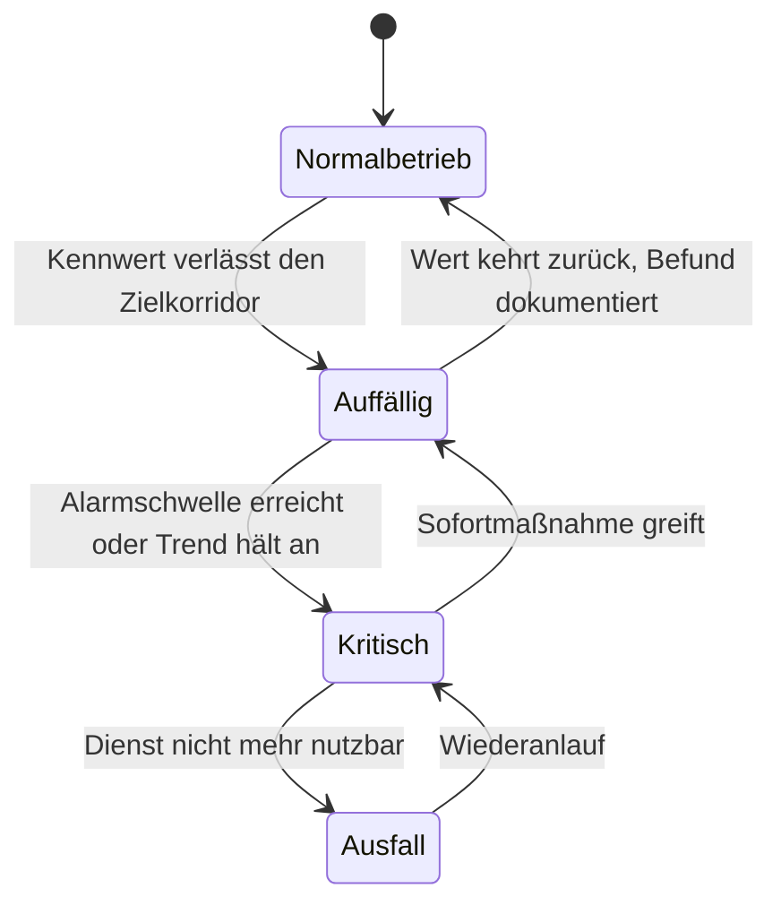
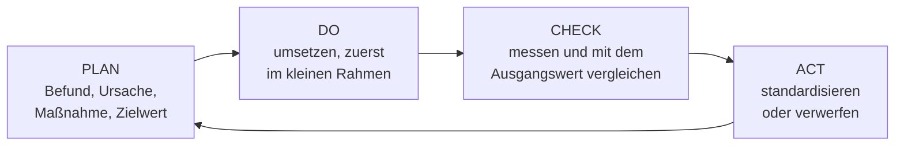

# Betrieb optimieren

<span class='badge badge-vertiefung'>Vertiefung</span> &nbsp; Ein System, das läuft, ist nicht automatisch ein System, das **gut** läuft. Optimierung heißt: aus Daten lesen, wo es klemmt – und gezielt nachsteuern.

Nach der Abnahme beginnt der Teil, der am längsten dauert. Ein System steht dann fünf, sieben, manchmal zehn Jahre im Betrieb, und in dieser Zeit verändert sich alles um es herum: Die Datenmenge wächst, es kommen Nutzer dazu, ein Nachbarsystem wird ausgetauscht, ein Prozess wird umgestellt. Das System selbst tut weiter, was es am ersten Tag getan hat – nur passt das immer weniger zu dem, was der Betrieb inzwischen von ihm braucht. Optimierung ist der organisierte Umgang mit dieser Schere.

Der Unterschied zur Störungsbehebung ist wichtig, weil er die ganze Arbeitsweise bestimmt. Bei einer **Störung** ist etwas kaputt: Das System erfüllt seine Vorgabe nicht mehr, und die Aufgabe lautet, den vereinbarten Zustand wiederherzustellen. Bei einer **Optimierung** ist nichts kaputt: Die Vorgabe wird erfüllt, aber es ginge schneller, günstiger, sparsamer oder zuverlässiger. Deshalb hat Optimierung keinen Alarm, der sie auslöst. Sie beginnt immer damit, dass jemand hinsieht.

!!! abstract "Was du auf dieser Seite lernst"
    - warum jede Optimierung mit einer **Messung** beginnt und ohne Ausgangswert wertlos bleibt
    - wie man **Betriebszustände** festlegt: was normal ist, was auffällig, was kritisch
    - welche **Datenquellen** es gibt – Systemprotokolle, Diagnoseberichte, Prozessdaten – und warum die **Zeitsynchronisation** die Voraussetzung für ihre Zusammenführung ist
    - wie man **Muster, Trends und Korrelationen** deutet, ohne Korrelation mit Ursache zu verwechseln
    - wie eine **Engpassanalyse** funktioniert und warum das Aufrüsten der falschen Komponente nichts bringt
    - wie man **Über- und Unterdimensionierung** erkennt und die richtige Größe bestimmt
    - wie eine **Handlungsempfehlung** aufgebaut ist: Befund, Ursache, Maßnahme, erwarteter Effekt, Erfolgskontrolle
    - wie **KVP und der PDCA-Zyklus** aus Einzelmaßnahmen einen Kreislauf machen
    - wie man **Wirtschaftlichkeit und Nachhaltigkeit** einer Maßnahme bewertet

---

## Optimieren heißt messen, nicht raten

In Besprechungen fällt regelmäßig der Satz „Das System ist langsam geworden“. Er ist der Anfang von zwei sehr verschiedenen Geschichten. In der ersten fragt jemand zurück: seit wann, für wen, bei welcher Tätigkeit, wie viel langsamer? In der zweiten kauft jemand Arbeitsspeicher.

Die zweite Geschichte endet häufiger, als man denkt, mit einem unveränderten System und einer bezahlten Rechnung. Der Grund ist nicht Unfähigkeit, sondern eine Lücke in der Beweiskette: **Ohne einen Messwert von vorher gibt es kein Nachher.** Wer nicht weiß, wie lange die Auftragserfassung vor der Maßnahme gedauert hat, kann hinterher nicht sagen, ob sie schneller geworden ist – und wird sich stattdessen auf Eindrücke verlassen. Eindrücke aber folgen der Erwartung: Wer weiß, dass gerade optimiert wurde, empfindet das System als schneller.

!!! tip "Die Werkstatt-Analogie"
    Eine Kfz-Werkstatt, die einen Motor optimieren soll, stellt das Fahrzeug zuerst auf den Prüfstand und misst Leistung und Verbrauch. Danach wird geschraubt. Danach wird **erneut gemessen**, unter denselben Bedingungen. Erst die zweite Messung entscheidet, ob die Arbeit etwas gebracht hat – und nur weil es die erste gibt, ist die zweite überhaupt aussagekräftig.

    Im Betrieb ist der Prüfstand die Kennzahl aus dem laufenden System. Wer ohne Ausgangsmessung anfängt, schraubt an einem Motor, dessen Leistung niemand kennt.

Der Rohstoff der Optimierung sind also **Betriebsdaten**: Messwerte, Protokolle, Berichte, Prozesszahlen. Sie entstehen ohnehin, sie kosten fast nichts, und sie sind in fast jedem Betrieb reichlich vorhanden. Was fehlt, ist meistens nicht die Datenmenge, sondern die Frage, mit der man an sie herangeht – und ein Vergleichswert, vor dem eine Zahl überhaupt eine Bedeutung bekommt. Wie man Kennzahlen bildet, Baseline und Benchmark unterscheidet und warum Perzentile ehrlicher sind als Mittelwerte, steht ausführlich auf [Betriebsdaten analysieren](../betrieb/betriebsdaten-analysieren.md). Diese Seite setzt darauf auf und fragt: **Was macht man mit dem Befund?**

---

## Betriebszustände definieren: normal, auffällig, kritisch

Bevor man Abweichungen erkennen kann, muss festgelegt sein, wovon abgewichen wird. Genau das leistet ein **Betriebszustand**: eine benannte Lage des Systems, an die eine Erwartung und eine Handlung geknüpft ist.

Die meisten Betriebe kommen mit drei Zuständen aus, ergänzt um den vierten, den niemand haben will:

| Zustand | Woran man ihn erkennt | Wer handelt | Welche Handlung |
|---|---|---|---|
| **Normalbetrieb** | alle Kennwerte im vereinbarten Zielkorridor | niemand | beobachten, Werte für die Baseline sammeln |
| **Auffällig** | ein Kennwert verlässt den Korridor oder ein Trend läuft auf eine Grenze zu | Betrieb, im Tagesgeschäft | Ursache klären, Beobachtung verdichten, Maßnahme vorbereiten |
| **Kritisch** | ein Kennwert überschreitet die Alarmschwelle, die Vorgabe ist gefährdet | Betrieb, sofort | Sofortmaßnahme, Meldung an Fachbereich, Wartungsfenster planen |
| **Ausfall** | der Dienst ist nicht mehr nutzbar | Störungsprozess | Wiederanlauf nach Notfallplan, danach Ursachenanalyse |

Der Sprung von „auffällig“ zu „kritisch“ ist kein Gefühl, sondern eine vorher getroffene Festlegung. Ein Beispiel für einen Dateidienst: Antwortzeit im Normalkorridor unter 200 Millisekunden, auffällig ab 300, kritisch ab 500 – gemessen als 95. Perzentil über fünf Minuten. Belegung des Speichers: normal bis 75 Prozent, auffällig ab 75, kritisch ab 90. Diese Zahlen sind keine Naturkonstanten; sie stammen aus der Vereinbarung mit dem Fachbereich und aus der eigenen Messhistorie.



Der Pfeil, an dem Optimierung hängt, ist der von **Normal nach Auffällig**. Er ist der einzige Zeitpunkt, an dem man ein Problem noch in Ruhe bearbeiten kann: Es ist sichtbar, aber es tut noch nicht weh. Betriebe ohne definierten Zwischenzustand kennen nur „läuft“ und „brennt“ – und arbeiten deshalb dauerhaft im Störungsmodus.

!!! warning "Drei Fehler beim Festlegen von Schwellen"
    **Ein Wert für alle Zeiten.** Eine CPU-Auslastung von 90 Prozent ist am Vormittag ein Befund und während des nächtlichen Sicherungslaufs der gewünschte Zustand. Schwellen brauchen einen Zeitbezug, sonst erzeugen sie Alarme, die man abschalten muss – und mit ihnen die echten.

    **Kein Rückschaltabstand.** Liegt die Schwelle bei genau 80 Prozent und pendelt der Wert um diesen Punkt, meldet das System im Minutentakt Alarm und Entwarnung. Abhilfe ist ein Abstand zwischen Ein- und Ausschaltpunkt – auslösen bei 80, entwarnen erst bei 70 – und eine Mindestdauer, etwa „fünf Minuten am Stück“.

    **Alarme ohne Adressat.** Jede Schwelle braucht eine Person und eine erwartete Handlung. Eine Meldung, auf die niemand reagieren soll, ist keine Überwachung, sondern Rauschen – und Rauschen macht die wichtigen Meldungen unsichtbar.

---

## Daten sammeln und zusammenführen

Optimierung scheitert selten daran, dass Daten fehlen. Sie scheitert daran, dass die vorhandenen Daten in getrennten Systemen liegen und niemand sie nebeneinanderlegt. Vier Quellen sind fast immer verfügbar:

| Quelle | Was darin steht | Wofür sie taugt |
|---|---|---|
| **Systemprotokolle (Logs)** | Ereignisse mit Zeitstempel: Anmeldungen, Fehler, Neustarts, abgebrochene Aufträge, Änderungen | den Hergang rekonstruieren; Häufungen und Wiederholmuster finden |
| **Metriken / Zeitreihen** | regelmäßig gemessene Zahlenwerte: Auslastung, Antwortzeit, Durchsatz, Temperatur | Trends, Spitzen und Korrelationen erkennen; Zustände bestimmen |
| **Diagnoseberichte** | Selbstauskunft der Geräte: Datenträgerzustand (SMART), Batterietest der USV, Lüfterdrehzahl, Fehlerzähler auf Switch-Ports, Herstellerprotokolle | beginnenden Verschleiß erkennen, bevor er zum Ausfall wird |
| **Prozessdaten** | Zahlen aus der Fachanwendung: Aufträge je Stunde, Belege je Lauf, Kommissionierzeiten, Ausschussquote | die technische Messung in die Sprache des Betriebs übersetzen |

Die vierte Zeile ist die, die im Alltag am häufigsten fehlt – und die den Unterschied macht. Eine Antwortzeit von 2,4 Sekunden ist eine technische Auskunft. Erst zusammen mit der Prozesszahl „ein Sachbearbeiter erfasst 140 Positionen am Tag, jede Position kostet ihn zwei Wartevorgänge“ wird daraus eine Aussage, mit der man in eine Budgetbesprechung geht: rund elf Minuten Wartezeit je Person und Tag.

Die interessanten Fragen lassen sich fast nie aus einer einzigen Quelle beantworten. „Warum brechen die Bestellabrufe des Lieferanten manchmal ab?“ braucht das Anwendungsprotokoll (welcher Fehler), die Netzmetrik (war die Leitung ausgelastet), den Diagnosebericht des Switches (Portfehler) und die Prozessdaten (wie viele Abrufe liefen gleichzeitig). Diese Zusammenführung heißt **Datenkonsolidierung**, und sie hat eine harte technische Voraussetzung.

### Ohne gemeinsame Zeit keine gemeinsame Auswertung

Sobald Daten aus zwei Systemen nebeneinanderliegen, hängt jede Aussage über die **Reihenfolge** daran, ob beide Uhren dasselbe anzeigen. Und Reihenfolge ist bei der Ursachensuche alles: Was zuerst kam, kann Ursache sein; was danach kam, nicht.

Geht die Uhr des Anwendungsservers 90 Sekunden vor, erscheint der Anwendungsfehler in der zusammengeführten Auswertung **vor** dem Speicherproblem, das ihn ausgelöst hat. Die Analyse dreht sich dann um die Anwendung, während die Ursache im Speichersystem sitzt. Der Fehler ist besonders tückisch, weil beide Datensätze für sich genommen völlig plausibel aussehen.

Drei Festlegungen verhindern das:

- **Eine Zeitquelle für alle.** Alle Systeme beziehen ihre Zeit per **NTP** aus derselben betriebseigenen Quelle, die ihrerseits an einer verlässlichen Referenz hängt. Wo es genauer sein muss – Messtechnik, Automatisierung –, gibt es **PTP** nach IEEE 1588.
- **Protokolle in UTC schreiben**, erst bei der Anzeige in Ortszeit umrechnen. Sonst gibt es bei der Zeitumstellung im Herbst eine Stunde, die doppelt in den Logs steht, und im Frühjahr eine, die fehlt.
- **Den Zeitabgleich überwachen.** Ein Server, dessen Uhr wegläuft, meldet das nicht von sich aus. Der Abgleich gehört zu den Werten, für die es eine Schwelle gibt.

Neben der Zeit braucht die Zusammenführung noch **gemeinsame Bezeichner**: Dieselbe Anlage heißt im ERP „Anlage 4711“, im Monitoring `prod-cnc-04` und in der Gebäudetechnik „Halle 2 Nord“. Ohne eine gepflegte Zuordnung lässt sich nichts verknüpfen. Beides – Zeitbasis und Bezeichner – ist unspektakuläre Vorarbeit, ohne die der Rest nicht funktioniert.

---

## Auswertung: Muster erkennen, Zusammenhänge prüfen

Sind die Daten sauber und vergleichbar, geht es um die Frage, was sich in ihnen abzeichnet. Vier Muster tauchen immer wieder auf:

- Ein **Trend** ist eine gerichtete Veränderung über einen längeren Zeitraum. Er ist die einzige Auswertung, die nach vorn zeigt – aus „Platte zu 85 Prozent belegt“ wird durch Umrechnung in Zeit „in rund 24 Wochen voll“, und daraus wird ein Budgetantrag statt eines Notfalls.
- Ein **saisonales Muster** ist eine regelmäßige Schwankung mit fester Periode: Vormittagsspitze, ruhiges Wochenende, Monatsabschluss, Weihnachtsgeschäft. Wer es nicht kennt, vergleicht falsch. Die Regel lautet: immer gegen dieselbe Phase des Zyklus vergleichen, also diesen Dienstag gegen die letzten vier Dienstage.
- Ein **Ausreißer** ist ein einzelner Wert weit außerhalb des Üblichen. Er kann ein Messfehler sein oder genau das Ereignis, das man sucht – beides muss geprüft werden, bevor man ihn wegrechnet.
- Eine **Korrelation** liegt vor, wenn sich zwei Kurven gemeinsam bewegen. Sie ist ein guter Anfang und ein schlechter Schluss.

### Der teure Kurzschluss: Korrelation ist keine Ursache

Zwei Kurven, die gemeinsam steigen, lassen mindestens vier Erklärungen zu: A verursacht B, B verursacht A, ein Drittes verursacht beide – oder es ist Zufall, denn bei genügend vielen Messgrößen korreliert irgendetwas immer mit irgendetwas.

!!! example "Die Speichererweiterung, die nichts gebracht hat"
    Ein Verlag betreibt ein Redaktionssystem. Über mehrere Wochen klagen die Redakteure über zähe Suchvorgänge. Die Auswertung zeigt einen sauberen Zusammenhang: Immer wenn die Speicherbelegung des Datenbankservers über 85 Prozent steigt, gehen die Antwortzeiten hoch. Die beiden Kurven laufen fast deckungsgleich.

    Die Schlussfolgerung liegt nahe: zu wenig Arbeitsspeicher. Der Server wird von 64 auf 128 Gigabyte aufgerüstet, Kosten rund 6.000 Euro plus ein Wartungsfenster am Wochenende. Ergebnis: Die Speicherbelegung fällt auf 45 Prozent. **Die Antwortzeiten bleiben, wie sie waren.**

    Die tatsächliche Ursache war ein Drittes: Ein nächtlicher Bildimport der Agentur lief seit einer Vertragsumstellung deutlich länger und reichte bis in den Vormittag hinein. Er belegte den Speicher – und sättigte gleichzeitig die Anbindung des Speichersystems. Der Import verursachte beide Kurven; der Arbeitsspeicher war nie das Problem.

    Die Prüfung, die das verhindert hätte, kostet zehn Minuten: **die Gegenprobe.** Gab es Zeiträume mit hoher Speicherbelegung und trotzdem schnellen Antwortzeiten? Ja – an Sonntagen, wenn der Import früh fertig war. Ein einziger solcher Zeitraum widerlegt die einfache Ursachenannahme.

Drei Fragen machen aus einer Beobachtung eine belastbare Ursachenvermutung:

1. **Reihenfolge:** Beginnt A tatsächlich *vor* B? Das setzt synchronisierte Uhren voraus – siehe oben.
2. **Mechanismus:** Lässt sich erklären, *wie* A auf B wirkt? Ohne plausiblen Wirkweg bleibt es eine Beobachtung.
3. **Gegenprobe:** Gibt es Zeiträume, in denen A auftrat und B ausblieb?

!!! danger "Der Preis des Kurzschlusses"
    Eine falsch zugeordnete Ursache kostet dreifach: das Geld für die wirkungslose Maßnahme, die Zeit des Wartungsfensters – und den Glauben des Fachbereichs an die nächste Empfehlung. Der dritte Posten ist der teuerste, weil er beim nächsten Mal die richtige Maßnahme mitblockiert.

---

## Engpassanalyse: wo der Flaschenhals wirklich sitzt

Eine Kette aus Komponenten ist immer so schnell wie ihre **langsamste Stelle**. Das klingt trivial, hat aber eine unbequeme Folge: Jede Verbesserung an einer anderen Stelle als dem Engpass ändert am Gesamtergebnis fast nichts – sie kostet nur Geld.

!!! tip "Die Autobahn-Analogie"
    Bei einer Baustelle mit Verengung auf eine Spur staut es sich davor, nicht danach. Wer nun die vierspurige Strecke vor der Baustelle auf sechs Spuren erweitert, hat die Fahrzeuge schneller im Stau, aber nicht schneller hindurch. Ändern lässt sich die Reisezeit nur an der Verengung selbst.

    Dieselbe Logik gilt für jede technische Kette. Und wie auf der Autobahn erkennt man den Engpass nicht daran, wo es voll ist, sondern daran, **wo sich etwas staut**.

Genau darin liegt der häufigste Denkfehler: Auslastung ist nicht gleich Engpass. Eine CPU, die während eines Stapellaufs zu hundert Prozent rechnet, tut genau das, was sie soll. Ein Engpass zeigt sich an **Wartezeit** – daran, dass etwas auf etwas anderes wartet.

| Verdächtige Stelle | Woran man den Engpass erkennt | Was man misst |
|---|---|---|
| **Prozessor** | Prozesse warten auf einen freien Kern | Länge der Warteschlange, Wartezeit auf Zuteilung; bei virtuellen Maschinen die Bereitstellungszeit („CPU Ready“) |
| **Arbeitsspeicher** | das System lagert auf den Datenträger aus | Auslagerungsaktivität, Seitenfehler je Sekunde – nicht die reine Belegung |
| **Datenträger / Speichersystem** | Anfragen stehen in der Warteschlange | Wartezeit auf Ein-/Ausgabe, Latenz je Anfrage in Millisekunden, Warteschlangentiefe |
| **Netz** | Pakete gehen verloren oder werden wiederholt | Auslastung im Verhältnis zur Leitungskapazität, Wiederholungen, Latenz und deren Schwankung |
| **Anwendung / Datenbank** | Anfragen warten auf Sperren oder auf eine freie Verbindung | ausgeschöpfter Verbindungspool, Sperrwartezeiten, Laufzeit der teuersten Abfragen |
| **Mensch und Prozess** | die Technik wartet nicht, die Freigabe fehlt | Liegezeit zwischen Bearbeitungsschritten im Vorgang |

Die letzte Zeile wird gern übersehen, ist aber in Integrationsprojekten oft die richtige Antwort: Wenn ein Auftrag technisch in vier Sekunden durchläuft und trotzdem zwei Tage bis zum Versand braucht, liegt der Engpass nicht im Rechenzentrum.

### Das Zeitbudget: Wo die Sekunden bleiben

Der belastbarste Weg zum Engpass ist, die Gesamtzeit entlang der Kette aufzuteilen. Für einen Suchvorgang in einer Fachanwendung sieht das so aus:

```text
Gesamte Antwortzeit, gemessen als 95. Perzentil        2,40 s

  Aufbereitung im Browser                              0,15 s
  Netzweg Arbeitsplatz - Rechenzentrum                 0,10 s
  Anwendungsserver (Verarbeitung)                      0,35 s
  Datenbank (Abfrage)                                  1,70 s
  Aufbau der Ergebnisliste                             0,10 s
                                                      -------
  Summe                                                2,40 s
```

Jetzt lassen sich zwei Maßnahmen vergleichen, statt über sie zu diskutieren:

```text
Variante A: Anwendungsserver doppelt so schnell (mehr Kerne)
  0,35 s  ->  0,175 s     Gesamt: 2,225 s     Verbesserung: rund 7 %

Variante B: fehlender Index in der Datenbank ergaenzt
  1,70 s  ->  0,25 s      Gesamt: 0,95 s      Verbesserung: rund 60 %
```

Variante A kostet eine Hardwareerweiterung und Lizenzen je Kern, Variante B eine halbe Stunde Arbeit. Ohne Zeitbudget hätte die Diskussion vermutlich über Hardware stattgefunden, weil der Anwendungsserver das ist, was man sieht.

!!! note "Nach dem Engpass ist vor dem Engpass"
    Ist die Datenbank behoben, liegt die Gesamtzeit bei 0,95 Sekunden – und der größte Einzelposten ist nun der Anwendungsserver mit 0,35 Sekunden. Das ist kein Fehler der Analyse, sondern ihr normaler Verlauf: **Ein beseitigter Engpass wandert weiter.** Deshalb gehört nach jeder Maßnahme eine erneute Messung dazu, und deshalb endet Optimierung nie mit einem letzten Schritt, sondern mit einer Entscheidung, dass es jetzt gut genug ist.

---

## Ressourcennutzung bewerten: die richtige Größe finden

Zwischen „zu klein“ und „zu groß“ liegt kein Punkt, sondern ein Korridor. Beide Ränder kosten Geld, nur auf verschiedene Weise.

| | **Unterdimensioniert** | **Überdimensioniert** |
|---|---|---|
| **Woran man es erkennt** | anhaltende Wartezeiten, Warteschlangen, Alarme in Spitzenzeiten, kein Puffer für Ausfälle | dauerhaft niedrige Auslastung, Spitzen weit unter der Kapazität, Reserven, die nie gebraucht werden |
| **Was es kostet** | Verfügbarkeit, Arbeitszeit der Anwender, Vertrauen, im Ernstfall Vertragsstrafen | Anschaffung, Lizenzen je Kern oder je Kapazität, Strom, Kühlung, Wartung, Platz im Schrank |
| **Wer es merkt** | der Fachbereich, sofort und laut | die Buchhaltung, spät und leise |
| **Typische Ursache** | Wachstum wurde nicht fortgeschrieben, Spitzen wurden nicht gemessen | Sicherheitszuschlag auf einen Sicherheitszuschlag, Größe vom Vorgängersystem übernommen |

Dass Überdimensionierung „nur“ Geld kostet, stimmt bei virtuellen Maschinen nicht einmal. Weist man einer VM acht virtuelle Kerne zu, die sie nie braucht, muss der Hypervisor für jeden Rechenschritt acht Kerne gleichzeitig freihalten. Auf einem gut ausgelasteten Wirt wartet diese VM dadurch **länger** auf Zuteilung als mit zwei Kernen. Zu groß ist hier nicht nur teuer, sondern langsamer.

### Wie man die richtige Größe bestimmt

Vier Schritte, die sich in fast jedem Fall anwenden lassen:

1. **Über einen vollen Zyklus messen.** Ein Monatsabschluss, eine Inventur, ein Saisonhoch gehören in den Messzeitraum. Eine Woche im Sommer ist keine Grundlage für die Auslegung.
2. **Mit Perzentilen arbeiten, nicht mit Mittelwerten.** Der Mittelwert einer Auslastung verschweigt genau die Spitzen, für die man dimensioniert. Üblich sind das 95. oder 99. Perzentil.
3. **Reserven bewusst festlegen** – und getrennt begründen: Wachstumsreserve für die geplante Nutzungsdauer, Lastreserve für Spitzen, Ausfallreserve für den Verlust eines Knotens.
4. **Einen Zielkorridor definieren** statt einer Zahl, zum Beispiel: mittlere Auslastung zwischen 40 und 70 Prozent, 95. Perzentil unter 85 Prozent. Beides sind typische Richtwerte, keine Vorschriften – ein Cluster mit automatischer Lastverteilung verträgt mehr, ein einzelner Server mit harten Antwortzeitzusagen weniger.

Die Ausfallreserve wird am häufigsten vergessen. In einem Cluster aus vier Knoten mit gleicher Leistung gilt: Fällt ein Knoten aus, müssen die verbliebenen drei die gesamte Last tragen. Die Auslegungsgrenze liegt damit bei drei Vierteln der Gesamtkapazität, also 75 Prozent – wer bis 90 Prozent füllt, hat kein Cluster mehr, sondern vier Server, die gemeinsam ausfallen.

!!! example "Ein Rechenweg für die Neuauslegung"
    Eine virtuelle Maschine für einen Berichtsdienst hat acht virtuelle Kerne. Die Messung über einen vollen Monat ergibt: mittlere Auslastung 6 Prozent, 95. Perzentil 12 Prozent, höchster gemessener Wert 41 Prozent während des Monatsabschlusses.

    ```text
    Bedarf in Kernen zur Spitze:  8 Kerne x 0,41  =  3,3 Kerne
    Aufgerundet                                   =  4 Kerne
    ```

    Vier Kerne decken die gemessene Spitze vollständig ab und lassen Luft. Die Reduzierung von acht auf vier Kerne spart je nach Produkt Lizenzkosten, entlastet den Wirt – und verbessert häufig sogar die Antwortzeit der VM selbst. Wichtig ist der letzte Schritt: **Der höchste gemessene Wert stammt aus dem Monatsabschluss.** Wäre nur eine gewöhnliche Woche gemessen worden, hätte die Rechnung 12 Prozent ergeben und die VM wäre auf zwei Kerne geschrumpft worden – mit einem sehr unangenehmen Monatsende.

Wie man Ressourcen von Anfang an plant statt sie hinterher zu korrigieren, steht auf [Ressourcen planen](../infrastruktur-planung/ressourcen-planen.md); für die Speicherseite siehe [Speicherlösungen](../infrastruktur-planung/speicherloesungen.md).

---

## Die Handlungsempfehlung als Dokument

Eine Optimierung, die nur im Kopf des Administrators existiert, ist keine. Sie muss entschieden werden – und entscheiden kann nur, wer den Sachverhalt vorgelegt bekommt. Das Ergebnis der Analyse ist deshalb ein **Dokument** mit fünf Pflichtteilen. Genau diese fünf Teile verlangt auch eine Prüfungsaufgabe, wenn dort steht: „Leiten Sie eine Maßnahme ab und begründen Sie sie.“

| Teil | Was hineingehört | Woran man einen schwachen Teil erkennt |
|---|---|---|
| **1 Befund** | die Abweichung mit Zahl, Zeitraum, Bezugsgröße und Abgrenzung | „ist langsam“ statt „95. Perzentil von 0,9 auf 2,4 s, seit vier Wochen, nur in der Frühschicht“ |
| **2 Ursache** | die belegte Ursache, nicht die naheliegende Vermutung – mit der Prüfung, die sie stützt | eine Korrelation, die als Ursache ausgegeben wird |
| **3 Maßnahme** | was konkret getan wird, mit Aufwand in Geld und Zeit, Alternativen und Nebenwirkungen | eine Maßnahme ohne Alternative – dann ist es keine Entscheidung, sondern eine Vorlage zum Abnicken |
| **4 Erwarteter Effekt** | die Wirkung als Zahl, samt Restrisiko | „wird besser“ statt „Rückgang auf unter 1,2 s erwartet“ |
| **5 Erfolgskontrolle** | welche Kennzahl wann von wem gemessen und mit welchem Vorherwert verglichen wird | fehlt – der häufigste Mangel überhaupt |

!!! example "Eine Handlungsempfehlung in voller Länge"
    **Befund.** Die Kommissionierbestätigungen aus dem Lager erscheinen in der Warenwirtschaft verzögert. Gemessen über vier Wochen liegt die Übertragungsdauer im 95. Perzentil bei 6,4 Minuten; vereinbart sind höchstens 2 Minuten. Betroffen sind ausschließlich die Zeitfenster 6:00 bis 7:30 Uhr und 13:30 bis 15:00 Uhr, also die Schichtwechsel. Außerhalb dieser Fenster liegt der Wert bei 40 Sekunden.

    **Ursache.** Der Übertragungsdienst arbeitet die Meldungen einzeln und sequenziell ab. Zum Schichtwechsel werden alle offenen Bestätigungen der auslaufenden Schicht gleichzeitig gemeldet – bis zu 900 Stück in wenigen Minuten. Die Warteschlange baut sich auf und wird erst nach dem Ansturm wieder leer. Prüfung: Bei einer manuell erzeugten Serie von 900 Meldungen außerhalb der Schichtzeiten trat derselbe Rückstau auf; die Netz- und Datenbankmesswerte blieben dabei unauffällig. Damit sind Netz und Datenbank als Ursache ausgeschlossen.

    **Maßnahme.** Der Übertragungsdienst wird auf parallele Verarbeitung mit vier gleichzeitigen Vorgängen umgestellt (Konfigurationsänderung, kein Hardwarebedarf). Aufwand: etwa 6 Stunden inklusive Test in der Testumgebung, ein Wartungsfenster von 30 Minuten. Alternative 1: leistungsfähigerer Server – rund 7.000 Euro, wirkt jedoch nur auf die Verarbeitungszeit je Meldung, nicht auf die Serialisierung, und wird die Warteschlange deshalb nur teilweise abbauen. Alternative 2: Meldungen über den Tag verteilen – erfordert eine Prozessänderung im Lager und wurde vom Fachbereich abgelehnt.

    **Erwarteter Effekt.** Rückgang des 95. Perzentils der Übertragungsdauer auf unter 2 Minuten, damit Einhaltung der Vereinbarung. Restrisiko: Bei vier gleichzeitigen Vorgängen steigt die Last auf der Zieldatenbank; sollte deren Antwortzeit über 300 Millisekunden steigen, wird auf zwei gleichzeitige Vorgänge zurückgestellt.

    **Erfolgskontrolle.** Messung derselben Kennzahl über vier Wochen nach der Umstellung, getrennt nach Schichtwechselfenster und übriger Zeit. Vergleichswert ist der dokumentierte Ausgangswert von 6,4 Minuten. Zusätzlich wird als Gegenkennzahl die Antwortzeit der Zieldatenbank beobachtet. Verantwortlich: Betrieb; Auswertung nach vier Wochen im Betriebsbericht.

!!! warning "Eine Änderung auf einmal"
    Werden Speicheranbindung, Datenbankparameter und Sicherungsfenster im selben Wartungsfenster geändert und ist das System danach schneller, weiß niemand, welche der drei Änderungen gewirkt hat – und ob nicht eine davon die Lage sogar verschlechtert und die anderen den Schaden überdeckt haben. Wenn mehrere Änderungen aus Termingründen zusammen müssen, gehört das ausdrücklich ins Dokument: Der Wirkungsnachweis ist dann eingeschränkt.

---

## Der kontinuierliche Verbesserungsprozess: PDCA

Eine einzelne Handlungsempfehlung ist ein Vorgang. Ein **kontinuierlicher Verbesserungsprozess** – kurz **KVP** – ist die Haltung dahinter: Verbesserung entsteht nicht aus wenigen großen Projekten, sondern aus vielen kleinen, regelmäßigen Schritten, die von den Leuten kommen, die täglich mit dem System arbeiten.

Das Ablaufmodell dafür ist der **PDCA-Zyklus** (Plan – Do – Check – Act), der auf Walter A. Shewhart zurückgeht und durch W. Edwards Deming bekannt wurde. Er liegt vielen Managementsystemen zugrunde, vom Qualitätsmanagement bis zur Informationssicherheit.



| Phase | Leitfrage | Ergebnis | Typischer Fehler |
|---|---|---|---|
| **Plan** | Was genau weicht ab, woran liegt es, was tun wir, welchen Zielwert setzen wir? | die Handlungsempfehlung mit messbarem Ziel | ohne Zielwert planen – dann ist jede Wirkung „irgendwie besser“ |
| **Do** | Wie setzen wir es kontrolliert um? | die durchgeführte Änderung, dokumentiert, mit Rückweg | gleich flächendeckend umstellen statt erst an einem Standort |
| **Check** | Hat die Maßnahme die erwartete Wirkung erzielt? | der Vorher-Nachher-Vergleich derselben Kennzahl | die Messung überspringen, weil „man es ja merkt“ |
| **Act** | Machen wir es dauerhaft so – oder zurück auf Anfang? | geänderte Betriebsanweisung, angepasste Schwellen, Dokumentation | die Maßnahme wirkt, wird aber nie in den Standard übernommen |

Zwei Punkte werden regelmäßig missverstanden. Erstens bedeutet **Act** nicht „handeln“, sondern **entscheiden, was mit dem Ergebnis geschieht**: Bei Erfolg wird die Änderung zum Standard – sie geht in die Betriebsdokumentation, in die Schwellenwerte, in die Einweisung. Bei Misserfolg wird zurückgebaut und mit einer neuen Hypothese begonnen; auch das ist ein vollständiger Durchlauf und kein Scheitern. Zweitens läuft der Zyklus **immer wieder von vorn**. Ein PDCA ohne Wiederholung ist ein Projekt, und ein PDCA ohne Check ist ein Do-Do-Do.

!!! tip "Klein anfangen ist keine Zaghaftigkeit"
    Die Do-Phase auf einen Standort, eine Abteilung oder eine Maschinengruppe zu begrenzen, hat einen handfesten Grund: Wirkt die Maßnahme nicht oder hat sie Nebenwirkungen, ist der Schaden begrenzt und der Rückweg kurz. Gleichzeitig liefert der unveränderte Rest des Betriebs einen Vergleichswert, den man sonst nicht hätte.

---

## Erfolgskontrolle: hat es gewirkt?

Die Check-Phase ist der Punkt, an dem sich Optimierung von Aktionismus trennt. Damit sie etwas aussagt, braucht sie fünf Festlegungen, und zwar **vor** der Umsetzung:

1. **Dieselbe Kennzahl** wie im Befund, gemessen an derselben Stelle und in derselben Verdichtung. Wer vorher das 95. Perzentil betrachtet hat, darf nachher nicht den Mittelwert nehmen.
2. **Ein dokumentierter Ausgangswert.** Er gehört ins Empfehlungsdokument, nicht in die Erinnerung.
3. **Ein Messzeitraum, der einen vollen Zyklus abdeckt.** Drei ruhige Tage nach der Umstellung beweisen nichts, wenn der Engpass am Monatsabschluss auftritt.
4. **Vergleich gegen dieselbe Phase.** Die Woche nach der Änderung gegen die entsprechende Woche davor, nicht gegen die Betriebsruhe zwischen den Jahren.
5. **Mindestens eine Gegenkennzahl.** Sie beantwortet die Frage, ob die Verbesserung an anderer Stelle etwas verschlechtert hat.

Der letzte Punkt verdient eine eigene Erklärung. Fast jede Optimierung verschiebt etwas: Mehr gleichzeitige Übertragungen entlasten die Warteschlange und belasten die Datenbank. Eine aggressivere Zwischenspeicherung beschleunigt Leseanfragen und lässt Änderungen später sichtbar werden. Ein verschobenes Sicherungsfenster verbessert die Antwortzeiten am Morgen und bringt die Sicherung womöglich nicht mehr rechtzeitig zu Ende. Eine **Gegenkennzahl** ist der Messwert, der genau diese Nebenwirkung sichtbar macht – ohne sie misst man nur die Seite, die man sehen wollte.

| | Ausgangswert | Zielwert | Messung nach vier Wochen | Bewertung |
|---|---|---|---|---|
| **Übertragungsdauer, 95. Perzentil, Schichtwechsel** | 6,4 min | < 2 min | 1,4 min | Ziel erreicht |
| **Übertragungsdauer, übrige Zeit** | 0,7 min | unverändert | 0,6 min | unauffällig |
| **Gegenkennzahl: Antwortzeit Zieldatenbank** | 120 ms | < 300 ms | 180 ms | im Rahmen, weiter beobachten |

!!! warning "Auch ein Misserfolg ist ein Ergebnis"
    Eine Maßnahme, die nicht gewirkt hat, gehört genauso dokumentiert wie eine erfolgreiche – mit dem Messwert und der Vermutung, warum. Sonst wird sie in zwei Jahren von jemand anderem noch einmal vorgeschlagen, umgesetzt und bezahlt. Diese Dokumentation ist das billigste Wissen, das ein Betrieb besitzen kann, und das am häufigsten weggeworfene.

---

## Wirtschaftlichkeit und Nachhaltigkeit bewerten

Ob eine Maßnahme sinnvoll ist, entscheidet nicht ihre technische Eleganz. Sechs Kriterien gehören in die Bewertung:

| Kriterium | Leitfrage |
|---|---|
| **Wirkung** | Wie viel bringt sie, gemessen in der Kennzahl aus dem Befund? |
| **Aufwand** | Was kostet sie einmalig und was laufend – Anschaffung, Arbeitszeit, Lizenzen, Wartung? |
| **Risiko** | Was passiert, wenn sie schiefgeht, und wie sieht der Rückweg aus? |
| **Energie** | Wie verändert sie den Strom- und Kühlbedarf im Betrieb? |
| **Lebensdauer** | Verlängert sie die Nutzungsdauer vorhandener Technik oder verkürzt sie sie? |
| **Abhängigkeit** | Bindet sie den Betrieb enger an einen Anbieter, ein Produkt, eine Person? |

### Die Rechnung

Wirtschaftlichkeit heißt: Der Nutzen über die Nutzungsdauer übersteigt den Aufwand. Der Nutzen setzt sich aus vermiedenen Ausfallkosten, eingesparter Arbeitszeit, entfallenden Lizenzen und geringeren Betriebskosten zusammen. Die einfachste belastbare Form ist die **Amortisationsrechnung**: Wie lange dauert es, bis die Einsparung die Investition eingeholt hat?

!!! example "Zusammenlegung von zwölf alten Servern auf drei neue"
    ```text
    Leistungsaufnahme
      alt   12 Geraete x 180 W   =  2.160 W
      neu    3 Geraete x 320 W   =    960 W
      Einsparung                 =  1.200 W  =  1,2 kW

    Energie je Jahr
      1,2 kW x 8.760 h           =  10.512 kWh
      bei 0,30 EUR/kWh           =   3.153,60 EUR

    Kuehlung (Richtwert: je kWh IT-Strom rund 0,4 kWh Kuehlenergie)
      10.512 kWh x 0,4           =   4.204,80 kWh
      bei 0,30 EUR/kWh           =   1.261,44 EUR

    Wartungsvertraege
      alt   12 x 200 EUR         =   2.400 EUR je Jahr
      neu    3 x 350 EUR         =   1.050 EUR je Jahr
      Einsparung                 =   1.350 EUR je Jahr

    Einsparung gesamt je Jahr    =   5.765,04 EUR
    Investition                  =  21.000 EUR

    Amortisation  21.000 / 5.765,04  =  3,64 Jahre  (rund 3 Jahre und 8 Monate)
    ```

    Bei einer geplanten Nutzungsdauer von fünf Jahren amortisiert sich die Maßnahme also innerhalb der Nutzungsdauer – knapp, aber nachweisbar. Und das ist die ehrliche Fassung: Wer nur den Stromverbrauch rechnet, käme auf 6,7 Jahre und würde die Maßnahme fälschlich verwerfen; wer die Kühlung vergisst, unterschätzt die Einsparung um gut ein Fünftel. Die 0,30 Euro je Kilowattstunde und der Kühlfaktor 0,4 sind Annahmen – sie gehören mit ins Dokument, damit jemand widersprechen kann.

### Nachhaltigkeit ist mehr als Stromverbrauch

Der Energieverbrauch im laufenden Betrieb ist der sichtbarste Teil, aber nicht der einzige. Vier Gesichtspunkte gehören dazu:

- **Energie im Betrieb.** Wichtiger als der absolute Verbrauch ist die **Arbeit je Kilowattstunde**: Ein neuer Server, der doppelt so viel verbraucht und die vierfache Leistung bringt, ist die sparsamere Lösung. Ein wenig ausgelasteter Server ist dagegen fast immer die teuerste Form von Energieverbrauch, weil ein großer Teil der Leistungsaufnahme unabhängig von der Auslastung anfällt.
- **Kühlung und Abwärme.** Kühlung ist in kleinen Rechnerräumen ein erheblicher Posten. Höhere zulässige Raumtemperaturen senken ihn deutlich; die einschlägigen Empfehlungen für Rechenzentren nennen einen Bereich von etwa 18 bis 27 Grad Celsius als üblichen Auslegungskorridor. Wer bei 19 Grad kühlt, „weil das schon immer so war“, verschenkt Energie. Ob die Abwärme genutzt werden kann – etwa zur Vorwärmung von Brauchwasser –, ist bei Neubauten eine ernsthafte Frage.
- **Lebensdauer und Herstellung.** Ein erheblicher Teil des Energie- und Rohstoffaufwands eines Geräts entsteht bereits bei seiner Herstellung. Deshalb ist eine Maßnahme, die vorhandene Technik länger nutzbar macht – Speicheraufrüstung statt Neubeschaffung, Austausch eines Verschleißteils, ein zweites Leben in einer weniger kritischen Rolle –, ökologisch oft besser als der Kauf des sparsameren Nachfolgers.
- **Ende der Nutzung.** Ausmusterung gehört zur Maßnahme dazu: sichere Datenlöschung, Rückgabe an den Hersteller, Weitergabe oder fachgerechte Entsorgung als Elektroaltgerät. Für die Beschaffung gibt es Kennzeichen, die Energie- und Umwelteigenschaften vergleichbar machen, etwa **Energy Star**, **EPEAT** oder der **Blaue Engel**.

!!! warning "Optimierung darf keine stille Entscheidung über Verfügbarkeit sein"
    Viele Sparmaßnahmen kaufen ihren Nutzen mit Reserve: ein Knoten weniger im Cluster, ein längeres Sicherungsintervall, eine abgeschaltete zweite Leitung. Solche Maßnahmen verändern die vereinbarte Verfügbarkeit oder den tolerierbaren Datenverlust – und diese Entscheidung gehört nicht der IT, sondern dem Fachbereich und der Leitung. Sie muss ausdrücklich benannt, bewertet und freigegeben werden. Wie man den zugehörigen Schaden beziffert, steht im [Risikomanagement](../it-sicherheit/risikomanagement.md).

---

## Was du jetzt wissen solltest

- **Optimierung beginnt mit einer Messung, nicht mit einer Vermutung.** Ohne dokumentierten Ausgangswert lässt sich hinterher keine Wirkung nachweisen.
- **Betriebszustände sind Festlegungen:** normal, auffällig, kritisch, Ausfall – jeweils mit Kennwert, Schwelle, Zuständigkeit und erwarteter Handlung.
- **Die interessanten Fragen brauchen mehrere Datenquellen.** Systemprotokolle, Metriken, Diagnoseberichte und Prozessdaten ergänzen sich; ihre Zusammenführung setzt eine **gemeinsame Zeitbasis** und gemeinsame Bezeichner voraus.
- **Korrelation ist kein Beweis.** Reihenfolge, Mechanismus und Gegenprobe machen aus einer Beobachtung eine belegte Ursache.
- **Der Engpass zeigt sich in Wartezeit, nicht in Auslastung.** Verbesserungen abseits des Engpasses kosten Geld und ändern das Ergebnis kaum; das Zeitbudget entlang der Kette macht das sichtbar.
- **Über- und Unterdimensionierung kosten beide** – die eine Geld, die andere Verfügbarkeit. Gemessen wird über einen vollen Zyklus, ausgelegt wird mit Perzentilen, Reserven werden getrennt begründet.
- **Eine Handlungsempfehlung hat fünf Teile:** Befund, Ursache, Maßnahme, erwarteter Effekt, Erfolgskontrolle.
- **PDCA schließt den Kreis:** planen, umsetzen, prüfen, standardisieren oder verwerfen – und wieder von vorn.
- **Zur Erfolgskontrolle gehört eine Gegenkennzahl**, sonst misst man nur die Seite, die man sehen wollte.
- **Wirtschaftlichkeit und Nachhaltigkeit sind Bewertungskriterien**, nicht Beiwerk: Amortisation, Energie im Betrieb, Kühlung, Lebensdauer und Entsorgung gehören in die Entscheidung.

---

## Beispielfragen zur Selbstkontrolle

??? question "Frage 1: Ein Kollege meldet: 'Das Warenwirtschaftssystem ist langsam geworden, wir sollten den Server aufrüsten.' Welche fünf Rückfragen stellst du, bevor irgendetwas beschafft wird?"
    1. **Seit wann?** Ein Datum grenzt die möglichen Ursachen sofort ein – was hat sich in diesem Zeitraum geändert?
    2. **Für wen und bei welcher Tätigkeit?** Betrifft es alle Anwender oder nur eine Gruppe, alle Vorgänge oder nur die Suche? „Nur die Frühschicht“ ist mehr wert als jede weitere Metrik.
    3. **Wie viel langsamer, gemessen woran?** Ohne Zahl und ohne Vergleichswert gibt es keinen Befund, sondern einen Eindruck.
    4. **Wo bleibt die Zeit?** Das Zeitbudget entlang der Kette zeigt, ob der Server überhaupt der Engpass ist – häufig sitzt er in der Datenbank, im Netz oder in einem Prozessschritt.
    5. **Woran würden wir hinterher erkennen, dass es geholfen hat?** Wer diese Frage nicht beantworten kann, hat auch keine Grundlage für die Beschaffung.

??? question "Frage 2: Die Auswertung zeigt, dass die Antwortzeiten der Fachanwendung immer dann steigen, wenn die Netzlast auf der Standortverbindung hoch ist. Reicht das als Begründung, die Leitung zu verdoppeln?"
    Nein. Das ist eine **Korrelation**, und es gibt mindestens vier Erklärungen: Die Netzlast bremst die Anwendung; die langsame Anwendung erzeugt Wiederholungen und damit Netzlast; ein Drittes verursacht beides – etwa ein Datenabgleich, der gleichzeitig Bandbreite belegt und die Datenbank beschäftigt; oder es ist Zufall.

    Vor der Beschaffung gehören drei Prüfungen dazu: **Reihenfolge** – steigt die Netzlast nachweislich zuerst, bei synchronisierten Uhren? **Mechanismus** – ist die Leitung tatsächlich ausgelastet, oder liegt die Auslastung bei 40 Prozent und nur die Latenz steigt? **Gegenprobe** – gab es Zeiträume mit hoher Netzlast und normalen Antwortzeiten? Ergänzend hilft das Zeitbudget: Wenn vom Gesamtwert von 2,4 Sekunden nur 0,1 Sekunden auf den Netzweg entfallen, kann eine doppelte Leitung die Antwortzeit bestenfalls um 0,05 Sekunden verbessern.

??? question "Frage 3: Eine virtuelle Maschine hat 16 vCPU. Die Messung über einen Monat ergibt: Mittelwert 8 %, 95. Perzentil 15 %, Höchstwert 38 % (am Quartalsende). Wie legst du sie neu aus – und welchen Fehler musst du vermeiden?"
    Der Bedarf zur gemessenen Spitze beträgt 16 × 0,38 = 6,08 Kerne, aufgerundet **sieben, praktisch acht Kerne**. Acht vCPU decken die Spitze mit Reserve ab und halbieren die Zuteilung.

    Der Fehler wäre, nach dem Mittelwert oder dem 95. Perzentil auszulegen: 15 Prozent von 16 Kernen sind 2,4 Kerne – bei vier vCPU wäre die Maschine am Quartalsende hoffnungslos überlastet. **Der Messzeitraum muss einen vollen Zyklus abdecken**, und ausgelegt wird auf die darin enthaltene Spitze, nicht auf den Durchschnitt.

    Zusatz: Überdimensionierung ist bei virtuellen Maschinen nicht nur teuer. Der Hypervisor muss für jeden Rechenschritt alle zugewiesenen Kerne gleichzeitig freihalten; auf einem gut ausgelasteten Wirt wartet eine VM mit 16 unnötigen Kernen länger auf Zuteilung als eine mit acht.

??? question "Frage 4: Welche fünf Teile hat eine Handlungsempfehlung – und welcher fehlt in der Praxis am häufigsten?"
    **Befund** (Abweichung mit Zahl, Zeitraum, Bezugsgröße und Abgrenzung), **Ursache** (belegt, mit der Prüfung, die sie stützt), **Maßnahme** (konkret, mit Aufwand, Alternativen und Nebenwirkungen), **erwarteter Effekt** (als Zahl, mit Restrisiko) und **Erfolgskontrolle** (welche Kennzahl wann von wem gegen welchen Ausgangswert gemessen wird).

    Am häufigsten fehlt die **Erfolgskontrolle**. Die Folge ist ein Betrieb, der Maßnahmen umsetzt, ohne je zu erfahren, welche davon gewirkt haben – und der dieselbe wirkungslose Maßnahme nach ein paar Jahren erneut bezahlt. Am zweithäufigsten fehlt die belegte Ursache; an ihre Stelle tritt eine Korrelation.

??? question "Frage 5: Nach einer Optimierung ist die Antwortzeit der Anwendung von 2,4 auf 0,9 Sekunden gesunken. Warum reicht diese Zahl nicht als Erfolgsnachweis?"
    Sie kann richtig sein – belegt ist damit aber noch nichts. Vier Punkte fehlen:

    - **Vergleichbarkeit:** Wurde nach der Änderung dieselbe Kennzahl an derselben Stelle in derselben Verdichtung gemessen? Vorher 95. Perzentil, nachher Mittelwert wäre kein Vergleich.
    - **Zeitraum und Phase:** Deckt die Nachmessung einen vollen Zyklus ab, und wird gegen dieselbe Phase verglichen? Die Woche nach der Umstellung gegen die Betriebsruhe zu stellen, beweist nichts.
    - **Zurechenbarkeit:** Wurde nur diese eine Änderung vorgenommen? Bei drei gleichzeitigen Änderungen ist unklar, welche gewirkt hat.
    - **Gegenkennzahl:** Hat sich an anderer Stelle etwas verschlechtert – die Last auf der Zieldatenbank, die Dauer des Sicherungslaufs, die Aktualität der Daten?

??? question "Frage 6: Die Geschäftsführung fragt, ob sich der Austausch von zwölf alten Servern gegen drei neue rechnet. Wie baust du die Antwort auf?"
    Als **Amortisationsrechnung** mit offengelegten Annahmen. Auf der Aufwandsseite steht die Investition, auf der Nutzenseite die jährlichen Einsparungen: Strom (Differenz der Leistungsaufnahme × 8.760 Stunden × Strompreis), Kühlung (als Zuschlag auf den Stromverbrauch, üblicher Richtwert rund 40 Prozent in kleinen Rechnerräumen), Wartungsverträge, gegebenenfalls Lizenzen je Kern oder je Gerät.

    Für das Beispiel aus dieser Seite: 1,2 kW Einsparung ergeben 10.512 kWh je Jahr, mit Kühlung 14.716,8 kWh, bei 0,30 Euro je kWh rund 4.415 Euro; dazu 1.350 Euro Wartung – zusammen rund 5.765 Euro je Jahr. Bei 21.000 Euro Investition amortisiert sich das nach rund 3 Jahren und 8 Monaten, also innerhalb der Nutzungsdauer von fünf Jahren.

    Dazu gehören zwei Ergänzungen: die **nicht in Euro gerechneten Wirkungen** (weniger Geräte bedeuten weniger Ausfallpunkte, aber auch eine größere Auswirkung je Ausfall – die Auslegungsgrenze im Cluster ist zu beachten) und die **Annahmen** selbst, damit jemand ihnen widersprechen kann.

---

## Merksatz

!!! success "Merksatz"
    > **Optimieren heißt messen, nicht raten: erst der Ausgangswert, dann die Änderung, dann dieselbe Messung noch einmal. Betriebszustände werden vorher festgelegt – normal, auffällig, kritisch –, Daten aus mehreren Quellen brauchen eine gemeinsame Uhr, und eine Korrelation wird erst durch Reihenfolge, Mechanismus und Gegenprobe zur Ursache. Der Engpass zeigt sich in Wartezeit, nicht in Auslastung; alles andere aufzurüsten kostet Geld und ändert nichts. Die Empfehlung nennt Befund, Ursache, Maßnahme, erwarteten Effekt und Erfolgskontrolle – und der Kreis aus Plan, Do, Check, Act schließt sich erst, wenn gemessen wurde, was herausgekommen ist.**

---

## Weiterlesen

- [Betriebsdaten analysieren](../betrieb/betriebsdaten-analysieren.md): Datenqualität, Kennzahlen, Perzentile, Trend und Saison im Detail
- [Monitoring](../betrieb/monitoring.md): woher die Messwerte kommen und wie Alarme entstehen
- [Tests durchführen](tests-durchfuehren.md): die Messwerte aus der Abnahme, die den ersten Ausgangswert liefern
- [Übergabe & Einweisung](uebergabe-und-training.md): wie derselbe Verbesserungskreis für Schulung und Dokumentation läuft
- [Ressourcen planen](../infrastruktur-planung/ressourcen-planen.md): Dimensionierung, bevor sie korrigiert werden muss
- [Speicherlösungen](../infrastruktur-planung/speicherloesungen.md): Kapazitäts- und Leistungsplanung auf der Speicherseite
- [Hochverfügbarkeit & Redundanz](../betrieb/hochverfuegbarkeit.md): warum Reserven im Cluster keine Verschwendung sind
- [Risikomanagement](../it-sicherheit/risikomanagement.md): den Schaden beziffern, den eine Sparmaßnahme in Kauf nimmt
- [Monitoring-Praxis](../monitoring-praxis/index.md): dieselben Kennzahlen an einem laufenden Aufbau
