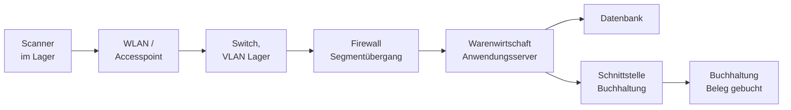

# Tests durchführen

<span class='badge badge-vertiefung'>Vertiefung</span> &nbsp; Jetzt wird geprüft: Aus den definierten Szenarien werden laufende Tests – und aus den Ergebnissen konkrete Rückschlüsse auf Systemleistung und Schwachstellen.

Zwischen einem guten Testplan und einem verwertbaren Ergebnis liegt eine Menge unspektakulärer Handarbeit. Sie entscheidet trotzdem darüber, ob am Ende ein Nachweis vorliegt oder ein Stapel Notizen. Denn ein Testergebnis ist kein Zustand, den man erlebt hat – es ist ein **Dokument**, das man einem Auftraggeber, einem Auditor oder dem Kollegen in der Rufbereitschaft hinlegen kann, ohne dabeizustehen und Fragen zu beantworten. Diese Seite beschäftigt sich mit allem, was zwischen „Testfall liegt vor" und „Abnahmeprotokoll ist unterschrieben" passiert.

!!! abstract "Was du auf dieser Seite lernst"
    - wie du den **Ausgangszustand** herstellst und warum ohne ihn kein Ergebnis reproduzierbar ist
    - was in ein **Testprotokoll** gehört – und warum „hat funktioniert" keine Dokumentation ist
    - wann sich **Automatisierung** rechnet, wann nicht, und wo der Rechenweg dafür liegt
    - wie **komponentenübergreifende und End-to-End-Tests** in Infrastrukturprojekten aussehen: Netzwerkpfade, Failover, Wiederherstellung
    - wie du **Fehler dokumentierst und klassifizierst** – und worin sich Schweregrad und Priorität unterscheiden
    - wie **Testprotokoll und Testbericht** aufgebaut sind und wer sie liest
    - wie aus Ergebnissen **Korrekturmaßnahmen** werden und was **Nachtest** von **Regressionstest** trennt
    - was ein **Abnahmeprotokoll** enthält und welche Bedeutung die Abnahme hat

---

## Vorbereitung: der Ausgangszustand

Ein Testfall beginnt nicht mit dem ersten Klick, sondern mit der Frage: **Ist der Zustand hergestellt, den die Vorbedingung beschreibt?** Wird sie übersprungen, misst man den Rest des vorherigen Tests mit.

Ein Beispiel, das in Integrationsprojekten regelmäßig passiert: Der Testfall zur Belegübergabe wird zum dritten Mal gefahren. Er schlägt fehl, weil der Beleg bereits existiert – aus den beiden Läufen davor. Der Fehler liegt nicht im System, sondern in der Vorbereitung. Zwei Stunden Fehlersuche später ist die einzige Erkenntnis, dass niemand aufgeräumt hat.

Zur Vorbereitung eines Testlaufs gehören fünf Dinge:

| Schritt | Was konkret zu tun ist |
|---|---|
| **Umgebung bestätigen** | Welche Umgebung, welcher Versionsstand, welche Konfiguration? Schriftlich festhalten – nicht „das Abnahmesystem", sondern „Abnahme, Anwendungsstand 2.4.1, Schnittstellenmodul 1.7" |
| **Ausgangszustand herstellen** | Datenbestand zurücksetzen: Snapshot einspielen, Rücksicherung fahren oder ein Aufräumskript laufen lassen. Der Weg ist egal, die Wiederholbarkeit nicht |
| **Vorbedingungen prüfen** | Dienste laufen, Konten sind angelegt, Berechtigungen sitzen, Schnittstellenpartner ist erreichbar |
| **Nebenläufigkeit klären** | Läuft gerade eine Sicherung, ein Update, ein Scan? Testfenster ankündigen, sonst misst man fremde Last mit |
| **Rückweg festlegen** | Was passiert, wenn der Test etwas beschädigt? Wie kommt die Umgebung in den Zustand vor dem Test? |

!!! tip "Der Ausgangszustand ist eine Investition, keine Pflichtübung"
    Wer den Zustand einmal automatisiert zurücksetzen kann – Snapshot, Skript, Container-Neustart –, spart ihn bei jedem weiteren Lauf. Und er gewinnt etwas Wichtigeres: die Möglichkeit, einen fehlgeschlagenen Test **sofort zu wiederholen**. Ein Fehler, den man reproduzieren kann, ist ein Fehler, den man beheben kann. Ein Fehler, der einmal auftrat und sich nicht wiederholen lässt, kostet Wochen und wird am Ende als „vermutlich behoben" geschlossen.

---

## Protokollieren: „hat funktioniert" ist keine Dokumentation

Der Satz taucht in jeder zweiten Projektdokumentation auf und trägt genau null Information. Was fehlt, sind die vier Angaben, die aus einer Beobachtung einen Nachweis machen: **was genau geprüft wurde, unter welchen Bedingungen, mit welchem Messwert, und wer das wann festgestellt hat.**

Denk an eine Wartung an einer Aufzugsanlage. Der Monteur schreibt nicht „Aufzug ging". Er schreibt: Anlagennummer, Datum, Prüfumfang, Messwerte der Bremsprobe, festgestellte Mängel, Unterschrift. Nicht weil er misstrauisch ist – sondern weil in zwei Jahren jemand nachvollziehen können muss, was geprüft wurde und was nicht. Ein Testprotokoll hat dieselbe Aufgabe.

### Das Testprotokoll je Testfall

| Feld | Beispiel |
|---|---|
| **Testfall** | TF-INT-007 – Belegübergabe mit 4.000 Positionen |
| **Umgebung / Version** | Abnahme, Anwendung 2.4.1, Schnittstellenmodul 1.7, Datenbestand `abn-voll-03` |
| **Prüfer** | M. Reinhardt |
| **Zeitpunkt** | Beginn und Ende des Laufs |
| **Tatsächliches Ergebnis** | 4.000 Positionen übergeben, Laufzeit 11 min 42 s, keine Fehlermeldung, Summe der Belegwerte in beiden Systemen identisch (2.417.883,40 EUR) |
| **Status** | bestanden |
| **Nachweis** | Bildschirmfoto der Abschlussmeldung, Auszug aus dem Übertragungsprotokoll, Ergebnis der Summenabfrage in beiden Systemen |
| **Bemerkung** | Lauf bei gleichzeitig aktiver nächtlicher Sicherung – ungünstigster geplanter Fall |

Der **Nachweis** ist das Feld, das am häufigsten fehlt und am meisten wert ist. Ein Bildschirmfoto, ein Protokollauszug, eine Summenabfrage in beiden Systemen: Das sind Belege, die auch dann noch tragen, wenn niemand mehr im Raum ist, der dabei war.

Für **Status** hat sich eine Einteilung in vier Werte bewährt, weil sie zwei häufige Verwechslungen verhindert:

| Status | Bedeutung |
|---|---|
| **bestanden** | Ist entspricht dem Soll |
| **fehlgeschlagen** | Ist weicht vom Soll ab – ein Fehler wird angelegt |
| **blockiert** | Der Test konnte nicht durchgeführt werden, weil eine Voraussetzung fehlte (Umgebung, Daten, ein anderer offener Fehler) |
| **nicht durchgeführt** | Der Test war geplant, kam aber nicht dran |

„Blockiert" und „nicht durchgeführt" werden gern zusammengeworfen und sind doch verschiedene Aussagen. Blockiert heißt: Es gibt ein Hindernis, das jemand beseitigen muss. Nicht durchgeführt heißt: Die Zeit hat nicht gereicht. Die erste Zahl ist ein Projektproblem, die zweite ein Planungsproblem – und beide gehören mit ihrer echten Zahl in den Testbericht, nicht unter „offen" versteckt.

!!! warning "Der Nachweis entsteht während der Durchführung, nicht danach"
    Wer erst alle Tests fährt und abends protokolliert, schreibt Erinnerungen auf. Die Messwerte sind ungenau, die Bemerkung zur ungewöhnlichen Meldung fehlt, das Bildschirmfoto wurde nicht gemacht. Protokolliert wird **während** des Laufs – notfalls handschriftlich und später übertragen. Das ist der langweiligste und wirksamste Ratschlag auf dieser Seite.

---

## Manuell gegen automatisiert

Automatisierung ist kein Wert an sich. Sie ist eine Investition, die sich ab einer bestimmten Zahl von Wiederholungen rechnet – und davor nicht.

| | **Manueller Test** | **Automatisierter Test** |
|---|---|---|
| Stärke | Erkunden, Beurteilen, Zwischentöne bemerken | Wiederholen, ohne müde zu werden |
| Aufwand je Lauf | hoch und konstant | sehr niedrig |
| Aufwand für die Erstellung | niedrig | hoch |
| Findet | Unerwartetes, Bedienbarkeit, unsinnige Ergebnisse, die formal korrekt sind | Abweichungen von dem, was jemand vorher als Soll formuliert hat |
| Blind für | die zwanzigste Wiederholung derselben Prüfung | alles, wonach nicht gefragt wurde |
| Sinnvoll bei | einmaligen Prüfungen, explorativem Testen, Abnahmetests mit Anwendenden | Regressionstests, Schnittstellen, Lasttests, allem in der Pipeline |

### Der Rechenweg

Ob sich Automatisierung lohnt, ist eine Rechnung – und die geht überraschend oft anders aus, als das Bauchgefühl vermutet. Ein Beispiel aus einem Anbindungsprojekt:

```text
Manuell
  40 Testfaelle x 3 Minuten                   =  120 Minuten  =  2,00 h je Durchlauf

Automatisiert
  Erstellung: 40 Testfaelle x 45 Minuten      = 1800 Minuten  = 30,00 h einmalig
  je Durchlauf: 8 min Laufzeit + 7 min Pflege =   15 Minuten  =  0,25 h je Durchlauf

Ersparnis je Durchlauf  =  2,00 h - 0,25 h    =  1,75 h

Gewinnschwelle  =  30,00 h / 1,75 h je Durchlauf  =  17,1 Durchlaeufe
```

Ab dem **18. Durchlauf** ist die Automatisierung günstiger. Die Probe: Nach 17 Durchläufen stehen manuell 34,00 Stunden gegen automatisiert 30,00 + 17 × 0,25 = 34,25 Stunden – die Automatisierung liegt noch knapp zurück. Nach 18 Durchläufen sind es 36,00 gegen 34,50 Stunden.

Was diese Rechnung nicht abbildet, ist trotzdem oft der entscheidende Punkt: **Der manuelle Test wird nach dem fünften Mal nicht mehr gefahren.** Nicht weil jemand faul wäre, sondern weil vier Stunden Regressionstest vor jeder Änderung an keinem realen Projekttag Platz finden. Der automatisierte Test läuft auch dann noch, wenn es unbequem ist. Der eigentliche Gewinn ist also nicht die eingesparte Stunde, sondern die Prüfung, die überhaupt stattfindet.

Umgekehrt gibt es klare Fälle **gegen** Automatisierung: eine einmalige Migration, die nie wiederholt wird. Eine Oberfläche, die sich im nächsten Ausbauschritt komplett ändert – die Testskripte wären schneller kaputt als benutzt. Prüfungen, bei denen ein Mensch beurteilen muss, ob ein Ergebnis fachlich sinnvoll ist. Und Abnahmetests, deren Zweck gerade darin besteht, dass Anwendende selbst durch das System gehen.

!!! warning "Der teuerste Testautomat ist der, dem niemand mehr glaubt"
    Automatisierte Tests haben eine eigene Krankheit: Wenn sie regelmäßig ohne echten Grund fehlschlagen – wegen Zeitproblemen, Testdaten, Umgebungsschwankungen –, gewöhnen sich alle daran, die roten Ergebnisse wegzuklicken. Ab diesem Moment kostet die Automatisierung Pflegeaufwand und liefert keine Aussage mehr. Ein unzuverlässiger Test ist schlimmer als gar keiner: Er verbraucht Vertrauen. Entweder er wird stabil gemacht, oder er wird abgeschaltet.

### Automatisierte Ausführung in Pipelines

Der natürliche Ort für automatisierte Tests ist die Auslieferungskette: Bei jeder Änderung läuft der Testsatz von selbst, und ein Stand, der die Tests nicht besteht, kommt nicht weiter. Damit verschiebt sich der Zeitpunkt, an dem ein Fehler auffällt, von der Abnahme in die Minuten nach der Änderung – und dort ist er um ein Vielfaches billiger.

Zwei Punkte sind aus Sicht der Testdurchführung wichtig:

- **Die Reihenfolge folgt den Kosten.** Schnelle, billige Prüfungen zuerst, teure zuletzt. Es ergibt keinen Sinn, einen zwanzigminütigen Integrationstest zu starten, wenn ein zehn Sekunden dauernder Funktionstest schon fehlschlägt.
- **Nicht alles gehört in die Pipeline.** Lasttests, Ausfalltests und Wiederherstellungstests brauchen eine produktionsnahe Umgebung, dauern lange und stören andere Läufe. Sie laufen in eigenen Fenstern, nicht bei jeder Änderung.

Wie eine solche Kette aufgebaut wird, welche Stufen sie hat und wie ein fehlgeschlagener Test den Stand aufhält, steht ausführlich im Block [CI/CD](../ci-cd/index.md) – insbesondere beim [Pipeline-Konzept](../ci-cd/pipeline-konzept.md).

---

## Komponentenübergreifende Tests und End-to-End-Tests

In Infrastrukturprojekten liegen die interessanten Fehler fast nie in einer Komponente, sondern **zwischen** ihnen. Jedes Teilsystem verhält sich für sich korrekt – und trotzdem funktioniert der Vorgang nicht, weil zwei Seiten unterschiedliche Annahmen über Zeichenkodierung, Zeitzone, Wiederholverhalten oder Zuständigkeit haben.

Ein **End-to-End-Test** folgt deshalb einem vollständigen Vorgang über alle beteiligten Bausteine hinweg – vom auslösenden Ereignis bis zum überprüfbaren Endzustand.



Der Testfall dazu lautet nicht „Schnittstelle prüfen", sondern: *Ein Lagermitarbeiter scannt eine Teilmenge zu Bestellung `B-2200`; nach dem Übergabelauf steht in der Buchhaltung ein Beleg mit dem passenden Betrag, und in der Warenwirtschaft steht die Bestellung auf „teilgeliefert" mit der richtigen Restmenge.* Geprüft wird also der **fachliche Endzustand an beiden Enden**, nicht die Aktivität in der Mitte.

Drei Testarten sind in der Infrastruktur besonders ertragreich.

### Netzwerkpfade prüfen

Ein Netzwerkpfad wird nicht dadurch bewiesen, dass ein Gerät antwortet, sondern dadurch, dass der **richtige Dienst über den richtigen Weg mit den richtigen Rechten** erreichbar ist – und dass alles andere es nicht ist. Zu einem vollständigen Pfadtest gehören deshalb immer zwei Richtungen:

| Prüfung | Erwartung |
|---|---|
| Erreichbarkeit des Dienstes vom Quellsegment aus | Verbindung kommt zustande, Antwort im erwarteten Format |
| Erreichbarkeit **aus einem Segment, das keinen Zugriff haben soll** | Verbindung wird abgewiesen – und der Versuch ist protokolliert |
| Namensauflösung aus dem Quellsegment | liefert die richtige Adresse (nicht die aus der Testumgebung) |
| Verhalten beim Ausfall des primären Wegs | Umschaltung auf den zweiten Weg, mit gemessener Dauer |
| Laufzeit und Paketverlust unter Last | innerhalb der vereinbarten Werte |

Die zweite Zeile ist die, die am häufigsten fehlt. Ein Sicherheitskonzept, das nur die erlaubten Wege prüft, hat nichts bewiesen: Gerade die **Gegenprobe** zeigt, ob die Segmentierung wirkt. Die technischen Grundlagen dazu stehen bei [Segmentierung & VPN](../netzwerke/segmentierung-und-vpn.md).

### Failover prüfen

Ein Ausfalltest beantwortet drei Fragen, von denen nur die erste offensichtlich ist:

1. **Übernimmt die Ersatzkomponente überhaupt?**
2. **Wie lange dauert die Umschaltung – und was sehen die Anwendenden in dieser Zeit?** Eine Umschaltung in 40 Sekunden ist ein anderes Ereignis als eine in 40 Millisekunden: Bei der einen laufen offene Vorgänge auf einen Fehler, bei der anderen nicht.
3. **Was passiert beim Zurückschalten?** Der Rückweg wird fast nie geprüft und ist oft der gefährlichere: Beide Seiten halten sich für zuständig, Datenstände laufen auseinander, Sitzungen brechen ein zweites Mal ab.

Dazu kommt eine unbequeme vierte Frage: **Woran hätte der Betrieb den Ausfall bemerkt, wenn er nicht geplant gewesen wäre?** Ein Failover, das funktioniert, aber niemandem gemeldet wird, führt dazu, dass ein Cluster monatelang einbeinig läuft – bis der zweite Knoten ausfällt und alle überrascht sind. Mehr dazu bei [Hochverfügbarkeit & Redundanz](../betrieb/hochverfuegbarkeit.md).

### Wiederherstellung aus der Sicherung prüfen

Der Wiederherstellungstest ist der Test, der am häufigsten im Plan steht und am seltensten stattfindet – weil er Zeit kostet, eine Ersatzumgebung braucht und unangenehme Ergebnisse liefert. Genau deshalb ist er wertvoll. Eine Sicherung, die nie zurückgespielt wurde, ist eine Vermutung.

Geprüft wird gegen die beiden Zielwerte aus der Anforderung – **RTO** (wie lange darf der Wiederanlauf dauern) und **RPO** (wie viel Datenverlust ist tolerierbar):

| Messpunkt | Wie gemessen wird |
|---|---|
| **Wiederanlaufzeit** | vom Feststellen des Ausfalls bis zur **fachlichen Freigabe** – nicht bis der Server bootet. Ein laufender Server, auf dem niemand arbeiten kann, ist kein Wiederanlauf |
| **Datenverlust** | über einen vorher gesetzten Prüfdatensatz mit bekanntem Zeitstempel: Welcher Stand kommt zurück? |
| **Vollständigkeit** | Sind Berechtigungen, Verknüpfungen, Schnittstellenkonfiguration und Aufgabenplanung mit zurückgekommen – oder nur die Nutzdaten? |
| **Nachvollziehbarkeit** | Konnte die Wiederherstellung **nach dem Handbuch** durchgeführt werden, oder brauchte es die eine Person, die es im Kopf hat? |

Der letzte Punkt ist der eigentliche Zweck der Übung. Ein Wiederherstellungstest prüft nicht nur die Technik, sondern das **Verfahren** – und findet zuverlässig die Stelle, an der die Dokumentation aufhört. Die Zusammenhänge stehen bei [Backup & Recovery](../betrieb/backup-und-recovery.md) und [Incident & BCM](../betrieb/incident-und-bcm.md).

!!! danger "Wiederherstellen auf dasselbe System beweist wenig"
    Wer eine Datenbank auf demselben Server zurückspielt, auf dem sie ohnehin lief, hat die Sicherungsdatei geprüft – mehr nicht. Der Ernstfall ist ein anderer: Die Hardware ist weg, das Betriebssystem muss neu, Lizenzschlüssel und Konfiguration fehlen, das Sicherungssystem selbst stand im selben Raum. Ein aussagekräftiger Wiederherstellungstest arbeitet deshalb **auf Ersatzhardware** und beginnt so weit vorn wie möglich.

---

## Fehler dokumentieren

Ein fehlgeschlagener Test erzeugt einen Fehlereintrag. Wie gut dieser Eintrag geschrieben ist, entscheidet darüber, ob der Fehler in einer Stunde behoben ist oder drei Tage zwischen zwei Teams hin- und herwandert.

| Feld | Was hineingehört | Häufiger Fehler |
|---|---|---|
| **Kurztitel** | ein Satz, der das Problem benennt | „Fehler in der Schnittstelle" – sagt nichts |
| **Umgebung und Version** | wo und mit welchem Stand beobachtet | fehlt fast immer, kostet fast immer Zeit |
| **Beschreibung** | erwartetes Verhalten, tatsächliches Verhalten, Unterschied | nur das tatsächliche Verhalten, ohne Soll |
| **Reproduktionsschritte** | nummeriert, mit den konkreten Daten, mit denen es auftritt | „passiert manchmal" |
| **Nachweis** | Bildschirmfoto, Protokollauszug, betroffener Datensatz | fehlt |
| **Schweregrad** | wie stark die Auswirkung auf den Betrieb ist | mit Priorität verwechselt |
| **Priorität** | wie dringend die Behebung ist | mit Schweregrad verwechselt |
| **Zugehöriger Testfall** | Bezeichner | fehlt – dann findet niemand den Nachtest |

Der wichtigste Teil sind die **Reproduktionsschritte**. Ein Fehler, der reproduzierbar ist, wird behoben. Ein Fehler, der es nicht ist, wird irgendwann als „nicht nachvollziehbar" geschlossen und tritt in der Produktion wieder auf. Zu guten Reproduktionsschritten gehören die konkreten Daten – nicht „ein Auftrag", sondern Auftrag `A-4711`, Kunde `K-0083`, Menge `0`.

### Schweregrad und Priorität sind zwei verschiedene Dinge

Das ist die Unterscheidung, die in Prüfungsaufgaben am häufigsten gefragt und im Alltag am häufigsten vermischt wird.

- Der **Schweregrad** (Severity) beschreibt die **Auswirkung**: Wie stark stört der Fehler den Betrieb? Er ist eine sachliche Feststellung und wird von der Person vergeben, die den Fehler findet.
- Die **Priorität** beschreibt die **Dringlichkeit der Behebung**: Was wird zuerst repariert? Sie ist eine Entscheidung und wird vom Auftraggeber oder von der Projektleitung vergeben – unter Berücksichtigung von Terminen, Aufwand, Abhängigkeiten und davon, wer den Fehler sieht.

Die vier Kombinationen machen den Unterschied greifbar:

| | **Priorität hoch** | **Priorität niedrig** |
|---|---|---|
| **Schweregrad hoch** | Der Buchungsexport bricht bei mehr als 1.000 Positionen ab. Betrifft jeden Monatsabschluss → **sofort** | Ein Absturz in einer Funktion, die erst in einem späteren Ausbauschritt genutzt wird → **wichtig, aber nicht jetzt** |
| **Schweregrad niedrig** | Der Firmenname ist im Kopf des Lieferscheins falsch geschrieben. Fachlich funktioniert alles – aber jeder Kunde sieht es → **sofort** | Ein Tippfehler in einem selten geöffneten Hilfetext → **auf die Mängelliste** |

Das Feld oben rechts und das Feld unten links sind der Grund, warum es zwei Angaben braucht. Wer nur eine Skala führt, kann entweder nicht ausdrücken, dass ein harmloser Schönheitsfehler sofort weg muss, oder nicht, dass ein Absturz warten kann.

### Fehlerklassifizierung

Für den Schweregrad hat sich eine vierstufige Einteilung eingebürgert. Sie ist **nicht genormt** – die genaue Definition gehört deshalb in den Testplan oder in den Vertrag, sonst streitet man später über die Einstufung statt über die Behebung.

| Klasse | Bezeichnung | Definition | Beispiel | Wirkung auf die Abnahme |
|---|---|---|---|---|
| **1** | kritisch | Der Betrieb ist unmöglich oder Daten gehen verloren; es gibt keine zumutbare Umgehung | Belegübergabe bricht ab und hinterlässt halb gebuchte Daten | Abnahme ausgeschlossen |
| **2** | schwer | Eine wesentliche Funktion ist gestört; eine Umgehung existiert, ist aber aufwendig | Sammelrechnung nur einzeln druckbar statt im Stapel | Abnahme nur mit vereinbartem Behebungstermin |
| **3** | leicht | Eine Funktion ist eingeschränkt, die Umgehung ist zumutbar | Sortierung einer Übersicht lässt sich nicht speichern | Mängelliste |
| **4** | kosmetisch | Darstellung oder Text, keine fachliche Auswirkung | Beschriftung abgeschnitten, Tippfehler | Mängelliste |

Zwei Regeln machen die Einteilung im Alltag belastbar. Erstens: **Die Umgehungsmöglichkeit gehört zur Einstufung.** Derselbe technische Fehler ist Klasse 1, wenn er den Vorgang blockiert, und Klasse 3, wenn es einen zumutbaren zweiten Weg gibt. Zweitens: **Datenverlust und stille Falschbuchungen sind immer Klasse 1** – auch wenn sie nur selten auftreten. Ein Fehler, der falsche Zahlen erzeugt, ohne dass jemand es merkt, ist gefährlicher als ein Absturz, weil der Absturz wenigstens auffällt.

---

## Testprotokoll und Testbericht

Diese beiden Dokumente werden ständig verwechselt. Sie haben verschiedene Adressaten und verschiedene Aufgaben.

| | **Testprotokoll** | **Testbericht** |
|---|---|---|
| Inhalt | jeder einzelne Testfall mit Ist-Ergebnis, Status und Nachweis | die verdichtete Aussage über den Gesamtstand |
| Umfang | so lang wie nötig, oft eine Tabelle über viele Seiten | zwei bis fünf Seiten |
| Adressat | Projektteam, Nachtest, Audit, spätere Fehlersuche | Auftraggeber, Projektleitung, Entscheidungsgremium |
| Frage, die es beantwortet | Was wurde wann wie geprüft und mit welchem Ergebnis? | Kann abgenommen werden – und wenn nein, was fehlt? |
| Entsteht | während der Durchführung | am Ende einer Teststufe |

Ein Testbericht, der die Rohdaten des Protokolls einfach nur abdruckt, ist kein Bericht. Seine Leistung besteht in der **Verdichtung und der Empfehlung**. Ein tragfähiger Aufbau:

1. **Gegenstand und Zeitraum** – was geprüft wurde, auf welcher Umgebung, mit welchem Versionsstand
2. **Kennzahlen** – geplante, durchgeführte, bestandene, fehlgeschlagene, blockierte Testfälle; Abdeckung der Anforderungen
3. **Fehlerlage** – offene Fehler nach Klasse, mit den kritischen einzeln benannt
4. **Bewertung gegen die Abnahmekriterien** – Kriterium für Kriterium: erfüllt oder nicht
5. **Einschränkungen** – was nicht geprüft werden konnte und was das für die Aussagekraft bedeutet
6. **Empfehlung** – abnehmen, abnehmen unter Vorbehalt mit Mängelliste, oder nicht abnehmen; mit Begründung

Der Abschnitt **Einschränkungen** ist der, der Berufsehre zeigt. Wenn der Lasttest nur mit halber Nutzerzahl gefahren werden konnte, weil die Lizenzen fehlten, gehört das dorthin – nicht in eine Fußnote. Ein Bericht, der Lücken verschweigt, verlagert das Risiko auf den, der unterschreibt.

### Kennzahlen, die tatsächlich etwas sagen

```text
Geplante Testfaelle                86
Durchgefuehrt                      82   ->  82 / 86  =  95,3 % Durchfuehrungsgrad
  davon bestanden                  71   ->  71 / 82  =  86,6 % Bestehensquote
  davon fehlgeschlagen             11
Blockiert                           4

Anforderungen gesamt               37
mit mindestens einem bestandenen
Testfall belegt                    34   ->  34 / 37  =  91,9 % Anforderungsabdeckung
```

Die aussagekräftigste dieser Zahlen ist die **Anforderungsabdeckung** – sie sagt, wie viel vom Vereinbarten belegt ist. Die Bestehensquote allein kann täuschen: 95 Prozent bestandene Testfälle klingen gut, und wenn unter den restlichen fünf Prozent der Buchungsexport steckt, ist trotzdem nichts abnahmefähig. Deshalb steht neben jeder Quote immer die **Fehlerlage nach Klassen**. Eine Prozentzahl ersetzt keine Liste kritischer Fehler.

!!! warning "Kennzahlen laden zum Zielen ein"
    Sobald eine Quote zum Ziel erklärt wird, verändert sie das Verhalten: Es entstehen viele kleine, leicht zu bestehende Testfälle, weil sie die Quote heben. Die Zahl steigt, die Aussage sinkt. Deshalb gilt: Kennzahlen beschreiben den Stand, sie steuern ihn nicht. Gesteuert wird über die Abnahmekriterien und die Fehlerlage.

---

## Ergebnisse auswerten

Ein Testbericht listet Ergebnisse. Die Auswertung zieht daraus **Schlüsse über das System** – und das ist die Stelle, an der aus einer Prüfung eine Erkenntnis wird.

### Rückschlüsse auf die Systemleistung

Ein Beispiel aus einem Lasttest gegen die Anforderung *„Die Auftragssuche liefert bei 60 gleichzeitigen Nutzern in 95 % der Fälle in unter 2 Sekunden ein Ergebnis"*:

| Gleichzeitige Nutzer | Mittelwert | Median | 95. Perzentil | Maximum | Fehlerquote |
|---|---|---|---|---|---|
| 20 | 0,4 s | 0,3 s | 0,7 s | 1,9 s | 0 % |
| 60 | 0,9 s | 0,7 s | 1,6 s | 6,4 s | 0 % |
| 90 | 1,8 s | 1,1 s | 4,9 s | 21,0 s | 0,3 % |

Die Anforderung ist **erfüllt**: Bei 60 Nutzern liegt das 95. Perzentil mit 1,6 Sekunden unter dem Sollwert. Interessant ist aber, was die Tabelle darüber hinaus verrät:

- **Zwischen 60 und 90 Nutzern steigt die Antwortzeit überproportional.** Von 20 auf 60 Nutzer verdreifacht sich die Last, das 95. Perzentil steigt um gut das Doppelte. Von 60 auf 90 wächst die Last um die Hälfte, das Perzentil aber um mehr als das Dreifache. Ein solcher Knick deutet fast immer auf eine **Sättigung** hin: ein Verbindungspool an der Obergrenze, eine Sperre, ein Zwischenspeicher, der nicht mehr ausreicht.
- **Der Abstand zwischen Median und Maximum wächst dramatisch.** Bei 60 Nutzern bedient das System die Hälfte aller Anfragen in 0,7 Sekunden, während einzelne 6,4 Sekunden brauchen. Solche Ausreißer sind für Anwendende der eigentliche Ärger – sie erleben nicht den Mittelwert, sondern die schlechten Fälle.
- **Die Reserve ist kleiner, als die bestandene Anforderung vermuten lässt.** Die Zusage gilt für 60 Nutzer. Wächst der Betrieb um ein Drittel, ist sie verletzt. Das ist keine Fehlermeldung, sondern eine **Empfehlung an die Kapazitätsplanung** – und gehört genau so in den Bericht.

!!! tip "Mittelwerte verstecken genau das, was du suchst"
    Ein Mittelwert von 0,9 Sekunden kann bedeuten, dass alle Anfragen 0,9 Sekunden brauchten – oder dass neun Anfragen 0,3 Sekunden brauchten und eine 6,3. Für die Wahrnehmung der Nutzer ist der Unterschied gewaltig. Deshalb wird bei Antwortzeiten mit **Perzentilen** gearbeitet: Das 95. Perzentil sagt, dass 95 Prozent aller Anfragen schneller waren als dieser Wert. Es ist der ehrlichere Maßstab – und der, der in Vereinbarungen gehört.

### Rückschlüsse auf Schwachstellen

Nicht jeder Befund ist ein Fehler im Sinne einer Abweichung vom Soll. Manche Beobachtungen sind **Schwachstellen**: Das System erfüllt die Anforderung, verhält sich aber so, dass im Betrieb Ärger absehbar ist.

| Beobachtung im Test | Schwachstelle dahinter | Empfehlung |
|---|---|---|
| Failover funktioniert, aber niemand wird benachrichtigt | Der Betrieb bemerkt den Einbeinbetrieb nicht | Überwachung des Clusterzustands mit Alarm |
| Wiederherstellung dauert 6 statt 4 Stunden, davon 2 Stunden Suche nach Zugangsdaten | Nicht die Technik ist zu langsam, das Verfahren ist unvollständig | Wiederanlaufhandbuch ergänzen, Zugangsdaten hinterlegen und ihre Erreichbarkeit im Notfall prüfen |
| Fehlermeldung bei falscher Eingabe enthält Datenbankdetails | Informationspreisgabe und schlechte Bedienbarkeit zugleich | Fehlerbehandlung trennen: Fachmeldung für Anwendende, Technikdetails ins Protokoll |
| Sicherungslauf endet regelmäßig knapp vor Arbeitsbeginn | Keine Reserve – der nächste Datenzuwachs verletzt die Zusage | Fenster oder Verfahren anpassen, Trend beobachten |

Solche Befunde gehören ausdrücklich in den Testbericht, auch wenn kein Testfall fehlgeschlagen ist. Sie sind der Ertrag, den ein aufmerksam durchgeführter Test über die reine Soll-Ist-Prüfung hinaus liefert – und häufig der wertvollere.

---

## Korrekturmaßnahmen, Nachtest und Regressionstest

Aus einem Fehler wird eine Korrektur, aus einer Korrektur ein neuer Testbedarf. An dieser Stelle werden zwei Begriffe regelmäßig verwechselt.

| | **Nachtest** (Retest) | **Regressionstest** |
|---|---|---|
| Frage | Ist **dieser** Fehler behoben? | Ist durch die Korrektur **woanders** etwas kaputtgegangen? |
| Umfang | genau der Testfall, der fehlgeschlagen war | ein Satz bereits bestandener Testfälle im Umfeld der Änderung |
| Wann | nach jeder Korrektur | nach jeder Korrektur, mindestens vor jeder Abnahme |
| Automatisierung | lohnt selten | lohnt fast immer |

Der **Nachtest** wird mit demselben Testfall, denselben Daten und demselben Ausgangszustand gefahren wie der fehlgeschlagene Lauf. Wird stattdessen „mal eben nachgeschaut", ob es jetzt geht, ist die Aussage wertlos – niemand weiß, ob dieselbe Situation hergestellt wurde.

Der **Regressionstest** ist die unbequemere Pflicht: Jede Korrektur kann an anderer Stelle etwas beschädigen, gerade in eng verzahnten Systemen. Der Umfang wird nach dem Risiko bestimmt:

- **eng**, wenn die Änderung klar abgegrenzt ist (ein Beschriftungstext) – dann reicht das unmittelbare Umfeld
- **breit**, wenn eine gemeinsam genutzte Komponente betroffen ist (Datenbankzugriff, Anmeldung, Schnittstellenmodul) – dann läuft der volle Satz
- **vollständig**, vor jeder Abnahme und vor jeder Produktivsetzung

Genau hier zeigt sich der Wert der Automatisierung aus der Rechnung weiter oben: Ein automatisierter Regressionssatz ist der Unterschied zwischen „wir prüfen das gesamte Umfeld" und „wir hoffen, dass es nichts kaputtgemacht hat".

!!! warning "Die Korrektur ist keine erledigte Aufgabe, bis sie nachgetestet ist"
    Ein häufiges Muster kurz vor der Abnahme: Fehler werden behoben und im Werkzeug auf „erledigt" gesetzt, der Nachtest wird auf später verschoben, weil die Zeit drängt. Am Abnahmetag steht dann eine Liste behobener Fehler, von denen niemand weiß, ob sie tatsächlich behoben sind. Ein Fehler ist geschlossen, wenn der **Nachtest bestanden** und **protokolliert** ist – nicht, wenn jemand eine Änderung eingespielt hat.

---

## Die Abnahme

Am Ende steht die Abnahme: die Erklärung des Auftraggebers, dass die Leistung als vertragsgemäß erbracht anerkannt wird. Sie ist kein Termin, sondern ein **Rechtsakt mit erheblichen Folgen** – unter anderem für Fälligkeit der Vergütung, Gefahrübergang, Beweislast und den Beginn der Verjährung von Mängelansprüchen. Die rechtliche Seite gehört in den Rechtsteil; wie Abnahmen vertraglich ausgestaltet werden, steht bei [IT-Verträge](../recht-organisation/it-vertraege.md). Hier interessiert die technische und dokumentarische Seite.

### Was in ein Abnahmeprotokoll gehört

| Abschnitt | Inhalt |
|---|---|
| **Gegenstand** | was genau abgenommen wird, mit Versionsstand und Umfang – und was ausdrücklich **nicht** dazugehört |
| **Grundlage** | Vertrag, Pflichtenheft, Anforderungsliste, Abnahmekriterien aus dem Testplan |
| **Beteiligte** | wer für Auftraggeber und Auftragnehmer teilnimmt, mit Funktion |
| **Durchgeführte Abnahmefälle** | Liste mit Ergebnis je Fall, verweisend auf das Testprotokoll |
| **Bewertung der Abnahmekriterien** | Kriterium für Kriterium: erfüllt oder nicht erfüllt |
| **Mängelliste** | jeder festgestellte Mangel mit Klasse, Beschreibung, vereinbartem Behebungstermin und verantwortlicher Person |
| **Erklärung** | Abnahme, Abnahme unter Vorbehalt der aufgeführten Mängel, oder Verweigerung – mit Begründung |
| **Offene Punkte** | was nicht Gegenstand der Abnahme ist, aber noch zu klären bleibt |
| **Unterschriften** | beider Seiten, mit Datum |

Drei Punkte, an denen es in der Praxis schiefgeht:

**Der Gegenstand ist zu unscharf beschrieben.** „Die neue Warenwirtschaft" ist kein Abnahmegegenstand. Ohne Versionsstand und Umfangsabgrenzung streitet man später darüber, ob eine Funktion Teil der Lieferung war.

**Die Mängelliste hat keine Termine und keine Namen.** Eine Liste ohne Termin ist ein Wunschzettel. Zu jedem Mangel gehören Klasse, Termin und eine verantwortliche Person – dieselbe Disziplin wie in einem Risikoregister.

**Die Abnahme erfolgt „unter Vorbehalt", ohne dass der Vorbehalt beschrieben ist.** Ein Vorbehalt wirkt nur, wenn er konkret benannt ist. „Abnahme unter Vorbehalt" ohne Liste ist in der Sache eine Abnahme.

!!! tip "Die Abnahmefälle stehen vorher fest"
    Der häufigste Grund für eine gescheiterte Abnahme ist nicht ein schlechtes System, sondern eine unvorbereitete Abnahme: Der Auftraggeber probiert am Termin spontan Dinge aus, die nie vereinbart waren, findet Abweichungen von seinen Erwartungen und verweigert. Vermeiden lässt sich das nur auf eine Weise – die **Abnahmefälle werden gemeinsam vorher festgelegt** und sind Teil des Testplans. Dann prüft die Abnahme das Vereinbarte, und alles andere ist eine Änderungsanforderung, keine Mängelrüge.

Nach der Abnahme endet die Prüfarbeit nicht, sie wechselt nur den Ort: Was ab jetzt gemessen wird, misst der Betrieb – und aus diesen Daten entsteht die nächste Runde Verbesserungen, siehe [Betrieb optimieren](optimierung.md) und [Übergabe & Einweisung](uebergabe-und-training.md).

---

## Was du jetzt wissen solltest

- Jeder Testlauf beginnt mit dem **hergestellten Ausgangszustand**; ohne ihn misst man den Rest des vorherigen Tests mit.
- Ein **Testprotokoll** hält Testfall, Umgebung, Version, Prüfer, Zeitpunkt, Ist-Ergebnis, Status und **Nachweis** fest. „Hat funktioniert" ist keine Dokumentation.
- Der Status kennt vier Werte: bestanden, fehlgeschlagen, **blockiert**, nicht durchgeführt – die letzten beiden sind verschiedene Probleme.
- **Automatisierung** rechnet sich ab einer bestimmten Zahl von Wiederholungen; der eigentliche Gewinn ist die Prüfung, die auch unter Zeitdruck noch stattfindet.
- **End-to-End-Tests** prüfen den fachlichen Endzustand an beiden Enden eines Vorgangs, nicht die Aktivität dazwischen.
- Ein **Pfadtest** braucht die Gegenprobe: Was nicht erreichbar sein soll, muss nachweislich abgewiesen werden.
- Ein **Ausfalltest** prüft Übernahme, Umschaltdauer, Rückschaltung – und ob der Ausfall überhaupt gemeldet worden wäre.
- Der **Wiederherstellungstest** misst bis zur fachlichen Freigabe, arbeitet auf Ersatzhardware und prüft das Verfahren, nicht nur die Datei.
- **Schweregrad** beschreibt die Auswirkung, **Priorität** die Dringlichkeit der Behebung. Beide sind nötig.
- Die **Fehlerklassen** 1 bis 4 sind nicht genormt – ihre Definition gehört in Testplan oder Vertrag.
- **Testprotokoll** ist die Rohaufnahme, **Testbericht** die verdichtete Aussage mit Empfehlung und Einschränkungen.
- Die **Anforderungsabdeckung** ist aussagekräftiger als die Bestehensquote; neben jeder Quote steht die Fehlerlage nach Klassen.
- **Nachtest** prüft die Behebung, **Regressionstest** prüft die Nebenwirkungen. Ein Fehler ist erst mit bestandenem Nachtest geschlossen.
- Ein **Abnahmeprotokoll** beschreibt Gegenstand mit Version, Grundlage, Ergebnisse, Bewertung der Kriterien, Mängelliste mit Terminen und die Erklärung.

---

## Beispielfragen zur Selbstkontrolle

??? question "Frage 1: Worin unterscheiden sich Schweregrad und Priorität? Nenne je ein Beispiel für die beiden Kombinationen, die zeigen, warum man beide Angaben braucht."
    Der **Schweregrad** beschreibt die **Auswirkung** eines Fehlers auf den Betrieb – eine sachliche Feststellung, die derjenige trifft, der den Fehler findet. Die **Priorität** beschreibt die **Dringlichkeit der Behebung** – eine Entscheidung, die Auftraggeber oder Projektleitung unter Berücksichtigung von Terminen, Aufwand und Außenwirkung trifft.

    **Hoher Schweregrad, niedrige Priorität:** Eine Funktion stürzt reproduzierbar ab – aber sie wird erst in einem späteren Ausbauschritt genutzt und ist derzeit für niemanden erreichbar. Die Auswirkung wäre schwer, der Handlungsdruck ist gering.

    **Niedriger Schweregrad, hohe Priorität:** Der Firmenname ist im Kopf des Lieferscheins falsch geschrieben. Fachlich funktioniert alles, es geht nichts verloren – aber jedes Dokument geht so zum Kunden. Die Auswirkung ist gering, der Handlungsdruck hoch.

    Wer nur eine Skala führt, kann eine dieser beiden Situationen nicht ausdrücken. Das Ergebnis ist regelmäßig eine falsche Reihenfolge in der Behebung: Entweder werden Schönheitsfehler mit Außenwirkung liegengelassen, oder es wird an Funktionen gearbeitet, die noch niemand braucht.

??? question "Frage 2: Ein Wiederherstellungstest ergibt: Server ist nach 2 Stunden hochgefahren, nach 4 Stunden sind die Daten zurück, nach 6 Stunden 20 Minuten kann die Fachabteilung arbeiten. Die Anforderung lautet RTO 4 Stunden. Wie bewertest du – und was empfiehlst du?"
    **Die Anforderung ist nicht erfüllt.** Die RTO misst bis zur **fachlichen Freigabe**, nicht bis der Server bootet und auch nicht bis die Daten technisch vorliegen. Maßgeblich sind 6 Stunden 20 Minuten gegen ein Ziel von 4 Stunden – eine Überschreitung um 2 Stunden 20 Minuten, also gut 58 Prozent.

    Bevor eine Empfehlung möglich ist, muss die **Zeitverteilung** ausgewertet werden: Wo sind die letzten 2 Stunden 20 Minuten geblieben? Typische Antworten sind das Nachziehen von Berechtigungen, die Neukonfiguration von Schnittstellen, das Suchen von Zugangsdaten oder eine fachliche Prüfung, für die niemand vorbereitet war. Erst diese Aufschlüsselung sagt, ob ein technisches oder ein organisatorisches Problem vorliegt.

    Wahrscheinlich ist Letzteres – dann helfen keine schnelleren Platten, sondern ein vollständigeres Verfahren: Wiederanlaufhandbuch um die fehlenden Schritte ergänzen, Zugangsdaten hinterlegen und ihre Erreichbarkeit im Notfall prüfen, Schnittstellenkonfiguration in die Sicherung aufnehmen, fachliche Freigabeprüfung als Checkliste vorbereiten. Danach wird **erneut gemessen** – eine unbelegte Verbesserung ist keine.

    Ist die Zeit dagegen tatsächlich technisch verbraucht, gibt es nur zwei ehrliche Wege: das Wiederherstellungsverfahren beschleunigen (etwa durch eine bereitstehende Ersatzumgebung) oder die **RTO mit dem Fachbereich neu verhandeln**. Was nicht geht: die Zahl im Dokument stehen lassen und hoffen. Das Ergebnis gehört als nicht erfüllte Anforderung in den Testbericht und als Risiko in die Abnahme.

??? question "Frage 3: Wann lohnt sich Automatisierung – und wann ausdrücklich nicht?"
    **Die Rechnung:** Erstellungsaufwand geteilt durch die Ersparnis je Durchlauf ergibt die Zahl der Durchläufe, ab der sich die Automatisierung trägt. Bei 40 Testfällen mit je 45 Minuten Erstellungsaufwand (30 Stunden einmalig) gegen 2 Stunden manuell und 0,25 Stunden automatisiert je Durchlauf sind das 30 / 1,75 ≈ 17,1 – ab dem 18. Durchlauf ist die Automatisierung günstiger.

    **Lohnt sich** deshalb bei allem, was oft wiederholt wird: Regressionstests, Schnittstellenprüfungen, Lasttests, alles, was bei jeder Änderung in der Pipeline laufen soll. Dazu kommt ein Argument, das in keiner Rechnung steht: Der manuelle Regressionstest **findet unter Zeitdruck nicht mehr statt**. Der automatisierte läuft auch dann.

    **Lohnt sich nicht** bei einmaligen Vorgängen wie einer Migration; bei Oberflächen, die sich im nächsten Schritt ohnehin ändern (die Skripte sind kaputt, bevor sie sich amortisiert haben); bei Prüfungen, die menschliche Beurteilung brauchen – ob ein Bericht fachlich plausibel ist, kann kein Skript sagen; und bei Abnahmetests, deren Zweck gerade darin besteht, dass Anwendende selbst durch das System gehen.

    **Zusätzlich zu bedenken:** Automatisierte Tests brauchen Pflege. Ein Testsatz, der regelmäßig ohne echten Grund fehlschlägt, wird ignoriert – ab dann kostet er nur noch. Unzuverlässige Tests werden entweder stabilisiert oder abgeschaltet.

??? question "Frage 4: Was gehört in einen Fehlerbericht, damit er ohne Rückfragen bearbeitbar ist?"
    Acht Angaben:

    1. **Kurztitel**, der das Problem benennt – nicht „Fehler in der Schnittstelle", sondern „Belegübergabe bricht ab 1.000 Positionen mit Zeitüberschreitung ab".
    2. **Umgebung und Versionsstand.** Fehlt fast immer und kostet fast immer den ersten Tag: Niemand kann einen Fehler nachstellen, ohne zu wissen, wo er auftrat.
    3. **Erwartetes Verhalten** – der Sollwert aus dem Testfall.
    4. **Tatsächliches Verhalten** – die Beobachtung, mit Meldungstext im Wortlaut.
    5. **Reproduktionsschritte**, nummeriert und mit den **konkreten Daten**: Auftrag `A-4711`, Kunde `K-0083`, Menge `0`. „Passiert manchmal" ist kein Reproduktionsschritt.
    6. **Nachweis** – Bildschirmfoto, Protokollauszug, betroffener Datensatz.
    7. **Schweregrad** – die Auswirkung, mit Blick auf eine mögliche Umgehung.
    8. **Zugehöriger Testfall** – damit der Nachtest später denselben Fall fährt.

    Die Priorität kommt hinzu, wird aber typischerweise nicht vom Finder vergeben, sondern von Projektleitung oder Auftraggeber. Der wichtigste Punkt bleiben die Reproduktionsschritte: Ein Fehler, der reproduzierbar ist, wird behoben; einer, der es nicht ist, wird irgendwann als nicht nachvollziehbar geschlossen und taucht in der Produktion wieder auf.

??? question "Frage 5: Der Testbericht meldet 95 % bestandene Testfälle. Reicht das als Grundlage für eine Abnahmeempfehlung?"
    Nein – aus drei Gründen.

    **Erstens sagt eine Quote nichts über die Schwere.** Die fehlenden 5 Prozent können vier kosmetische Mängel sein oder der Buchungsexport. Deshalb steht neben jeder Quote die **Fehlerlage nach Klassen**, mit den kritischen Fehlern einzeln benannt.

    **Zweitens fehlt der Bezug zur Abdeckung.** Bestanden haben 95 Prozent der **durchgeführten** Tests – aber wie viele waren geplant, und wie viele Anforderungen sind überhaupt durch einen Testfall belegt? Eine Bestehensquote von 95 Prozent bei einer Anforderungsabdeckung von 60 Prozent bedeutet, dass ein Drittel des Vereinbarten ungeprüft ist. Die aussagekräftigere Zahl ist die **Anforderungsabdeckung**.

    **Drittens ist die Abnahme keine Quotenfrage, sondern eine Kriterienfrage.** Entschieden wird gegen die vorher vereinbarten **Abnahmekriterien**: keine offenen Fehler der Klasse 1, höchstens eine vereinbarte Zahl der Klasse 2 mit Behebungstermin, nachgewiesene Leistungswerte, vollständige Nachweise. Der Bericht bewertet Kriterium für Kriterium – erfüllt oder nicht.

    Dazu kommt der Abschnitt **Einschränkungen**: Was konnte nicht geprüft werden, und was bedeutet das? Vier blockierte Testfälle in einem unkritischen Bereich sind etwas anderes als vier blockierte Testfälle rund um die Belegübergabe.

??? question "Frage 6: Nach der Behebung eines Fehlers wird nur der betroffene Testfall wiederholt und besteht. Der Fehler gilt als geschlossen. Was fehlt?"
    Es fehlt der **Regressionstest**. Wiederholt wurde nur der **Nachtest** – er beantwortet die Frage „Ist dieser Fehler behoben?". Unbeantwortet bleibt: „Hat die Korrektur woanders etwas beschädigt?"

    Der Umfang richtet sich nach der Art der Änderung. Wurde ein Beschriftungstext korrigiert, reicht das unmittelbare Umfeld. Wurde eine gemeinsam genutzte Komponente angefasst – Datenbankzugriff, Anmeldung, Schnittstellenmodul –, muss der breite Satz laufen, weil die Auswirkung überall auftreten kann. Vor jeder Abnahme und vor jeder Produktivsetzung läuft der vollständige Satz.

    Zwei weitere Punkte fehlen ebenfalls: Der Nachtest muss mit **demselben Ausgangszustand und denselben Daten** gefahren worden sein wie der fehlgeschlagene Lauf – sonst prüft er eine andere Situation. Und das Ergebnis muss **protokolliert** sein. Ein Fehler ist geschlossen, wenn der Nachtest bestanden **und** dokumentiert ist, nicht wenn jemand eine Änderung eingespielt hat.

---

## Merksatz

!!! success "Merksatz"
    > **Erst den Ausgangszustand herstellen, dann prüfen, während der Durchführung protokollieren – mit Umgebung, Version, Messwert und Nachweis. Schweregrad beschreibt die Auswirkung, Priorität die Dringlichkeit; beide werden gebraucht. Das Protokoll hält jeden Testfall fest, der Bericht verdichtet ihn zu einer Empfehlung mit Einschränkungen. Nach jeder Korrektur folgen Nachtest und Regressionstest, und geschlossen ist ein Fehler erst mit bestandenem, dokumentiertem Nachtest. Die Abnahme prüft das vorher Vereinbarte – alles andere ist eine Änderungsanforderung.**

---

## Weiterlesen

- [Testszenarien & Simulation](testszenarien.md): woher die Testfälle kommen, die hier durchlaufen werden
- [Übung: Testkonzept für eine Systemanbindung](uebung-testkonzept.md): die Gruppenübung zu beiden Seiten
- [Betrieb optimieren](optimierung.md): was nach der Abnahme mit den Messwerten passiert
- [Übergabe & Einweisung](uebergabe-und-training.md): der Schritt nach der Abnahme
- [CI/CD](../ci-cd/index.md) und [Pipeline-Konzept](../ci-cd/pipeline-konzept.md): automatisierte Tests in der Auslieferungskette
- [Backup & Recovery](../betrieb/backup-und-recovery.md): die Zielwerte, gegen die Wiederherstellungstests prüfen
- [Hochverfügbarkeit & Redundanz](../betrieb/hochverfuegbarkeit.md): was ein Failover-Test eigentlich nachweist
- [IT-Verträge](../recht-organisation/it-vertraege.md): die rechtliche Seite der Abnahme
