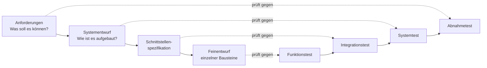
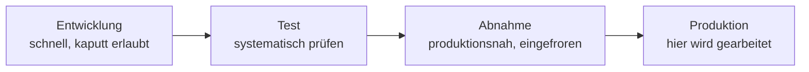

# Testszenarien & Simulation

<span class='badge badge-vertiefung'>Vertiefung</span> &nbsp; Bevor man testet, muss man wissen, **was** ein bestandener Test überhaupt bedeutet. Genau das legen Testszenarien und Testanforderungen fest – sie sind das Drehbuch der Prüfung.

Der Satz, mit dem in der Praxis die meisten Abnahmen scheitern, lautet: „Bei mir hat es funktioniert." Er ist selten gelogen. Er ist nur wertlos – weil niemand sagen kann, **was** funktioniert hat, **unter welchen Bedingungen**, **mit welchen Daten** und **woran** man das Funktionieren erkannt hat. Ein Test, den man nicht beschreiben kann, ist kein Test, sondern eine Erinnerung. Diese Seite beschäftigt sich mit dem Teil der Arbeit, der **vor** der ersten Prüfung passiert: Was wird geprüft, unter welchen Bedingungen, und woran erkennt man das Ergebnis.

!!! abstract "Was du auf dieser Seite lernst"
    - warum getestet wird und **was ein Testergebnis aussagt** – und was es grundsätzlich nicht aussagen kann
    - wie ein **Testfall** aufgebaut ist: Bezeichner, Vorbedingung, Eingabe, Schritte, erwartetes und tatsächliches Ergebnis
    - welche **Testarten** es in Infrastrukturprojekten gibt und welche Frage jede von ihnen beantwortet
    - wie du aus einer **messbaren Anforderung** einen **prüfbaren Testfall** ableitest – und Grenz- und Fehlerfälle bewusst einplanst
    - wozu **Entwicklungs-, Test-, Abnahme- und Produktivumgebung** da sind und wie realitätsnah eine Simulation sein muss
    - wie du **Testdaten** aufbaust, produktive Daten anonymisierst und die **Validität** deiner Ergebnisse sicherst
    - was in einen **Testplan** gehört

---

## Was ein Test überhaupt aussagt

Ein Test ist ein **Vergleich**: Auf der einen Seite steht ein Wert, den du gemessen oder beobachtet hast, auf der anderen ein Wert, den du **vorher** aufgeschrieben hast. Die Aussage entsteht aus der Differenz. Fehlt eine der beiden Seiten, entsteht keine Aussage – und genau das ist der häufigste Fehler.

Denk an die Abnahme einer neuen Heizungsanlage. Der Monteur dreht auf, es wird warm, alle sind zufrieden. Aber „es wird warm" ist keine Abnahme. Die Abnahme heißt: **Vorlauftemperatur 55 °C bei einer Außentemperatur von 0 °C, gemessen am Verteiler, Toleranz ±3 K.** Erst diese Formulierung entscheidet, ob die Anlage die Anforderung erfüllt oder nur irgendwie läuft. In der IT ist es identisch – nur dass „es wird warm" dort „läuft" heißt.

### „Läuft" gegen „erfüllt die Anforderung"

Diese beiden Aussagen unterscheiden sich in drei Punkten, und jeder einzelne davon hat schon Projekte gekostet:

| | **„Läuft"** | **„Erfüllt die Anforderung"** |
|---|---|---|
| Maßstab | das Gefühl der prüfenden Person | ein vorher festgelegter Sollwert |
| Bedingungen | die, die zufällig gerade herrschten | die, die vereinbart wurden (Last, Datenmenge, Nutzerzahl) |
| Ergebnis | „sieht gut aus" | erfüllt / nicht erfüllt, mit Messwert |
| Wiederholbar | nein | ja, von einer anderen Person, mit demselben Ergebnis |
| Streitfähig | nein – Aussage gegen Aussage | ja – der Messwert steht im Protokoll |

Ein Beispiel aus einem Anbindungsprojekt: Die neue Auftragsverwaltung überträgt Belege an die Buchhaltung. Der Entwickler prüft die Übertragung mit drei Testbelegen, alle kommen an, er meldet „läuft". Im Produktivbetrieb bricht die Übertragung am ersten Monatsende ab. Der Grund: Die Anforderung lautete „bis zu 4.000 Belege je Übertragungslauf" – geprüft wurden drei. Nicht die Software war falsch, sondern der Test. Er hat eine Frage beantwortet, die niemand gestellt hatte.

### Der unangenehme Grundsatz

Es gibt einen Satz über das Testen, den man einmal verstanden haben muss, weil er die Erwartungshaltung an jedes Testergebnis geraderückt: **Testen kann die Anwesenheit von Fehlern zeigen, nicht ihre Abwesenheit.** Ein bestandener Test beweist nicht, dass das System fehlerfrei ist. Er beweist, dass genau die Fälle, die du geprüft hast, unter genau den Bedingungen, unter denen du sie geprüft hast, das erwartete Ergebnis geliefert haben. Mehr nicht.

Daraus folgt praktisch etwas Wichtiges: **Die Auswahl der Testfälle ist die eigentliche fachliche Leistung.** Vollständig testen kann man nicht – schon ein einziges Eingabefeld für eine Zahl hätte Millionen möglicher Eingaben. Testen heißt deshalb immer: mit begrenzter Zeit die Fälle finden, die am meisten über das System verraten. Wer nur den Idealweg prüft, findet nur Fehler auf dem Idealweg – und den geht im Betrieb fast niemand.

!!! tip "Die Frage, die jeden Test rettet"
    Bevor du einen Test durchführst, beantworte schriftlich: **Woran würde ich erkennen, dass dieser Test fehlgeschlagen ist?** Wenn dir darauf nichts einfällt, kann der Test nicht fehlschlagen – und damit kann er auch nichts bestätigen. Ein Test, der immer besteht, ist kein Test, sondern eine Beruhigungsübung.

---

## Der Testfall: das kleinste prüfbare Stück

Alles, was geprüft wird, zerfällt am Ende in **Testfälle**. Ein Testfall ist keine Aufgabenbeschreibung („Schnittstelle prüfen"), sondern eine so genaue Anweisung, dass eine andere Person sie ohne Rückfragen ausführen und zum selben Ergebnis kommen kann. Er hat immer dieselben sechs Bestandteile:

| Bestandteil | Was hineingehört | Warum |
|---|---|---|
| **Bezeichner** | eine eindeutige Nummer, etwa `TF-LAG-014` | damit im Protokoll, im Fehlerbericht und in der Abnahme dasselbe gemeint ist |
| **Vorbedingung** | der Zustand, der vor dem Test herrschen muss – Umgebung, Datenstand, Anmeldung, laufende Dienste | ohne definierten Ausgangszustand ist das Ergebnis nicht reproduzierbar |
| **Eingabe / Testdaten** | die konkreten Werte, mit denen gearbeitet wird – nicht „ein Artikel", sondern Artikelnummer `4711`, Menge `250` | „ein Artikel" liefert bei jeder Wiederholung ein anderes Ergebnis |
| **Schritte** | die Handlungen in der Reihenfolge, in der sie ausgeführt werden, nummeriert | eine andere Person muss den Weg nachgehen können |
| **Erwartetes Ergebnis** | der Sollwert, **bevor** getestet wird – möglichst mit Zahl, Zustand oder Meldungstext | er ist der Maßstab; nachträglich formuliert ist er wertlos |
| **Tatsächliches Ergebnis** | was beobachtet wurde, mit Messwert und Nachweis | erst der Ist-Wert macht aus dem Testfall ein Testergebnis |

Dazu kommen in der Praxis noch **Status** (bestanden / fehlgeschlagen / blockiert / nicht durchgeführt), **Prüfer**, **Zeitpunkt der Durchführung** und die **Version** des geprüften Standes.

!!! example "Ein vollständiger Testfall"
    | Feld | Inhalt |
    |---|---|
    | **Bezeichner** | TF-LAG-014 – Wareneingang mit Teilmenge |
    | **Anforderung** | A-17: Teillieferungen werden mit Restmenge im Auftrag geführt |
    | **Vorbedingung** | Abnahmeumgebung, Stand 2.4.1. Bestellung `B-2200` über 500 Stück Artikel `4711` liegt im Status „bestellt" vor. Lagerbestand Artikel `4711` = 0. Benutzer `test.lager` angemeldet, Rolle „Lagerist". |
    | **Eingabe** | Wareneingang zu `B-2200`, gebuchte Menge `300`, Lagerplatz `H-04-12` |
    | **Schritte** | 1. Wareneingang öffnen, Bestellung `B-2200` aufrufen.<br>2. Menge `300` erfassen, Lagerplatz `H-04-12` wählen.<br>3. Buchung bestätigen.<br>4. Bestellung `B-2200` erneut aufrufen.<br>5. Artikelstamm `4711` aufrufen. |
    | **Erwartetes Ergebnis** | Bestellung `B-2200` steht im Status „teilgeliefert" mit Restmenge `200`. Lagerbestand Artikel `4711` = `300` auf Platz `H-04-12`. Eine Wareneingangsbuchung ist im Buchungsjournal mit Menge `300` protokolliert. Keine Fehlermeldung. |
    | **Tatsächliches Ergebnis** | *(wird bei der Durchführung ausgefüllt)* |

    Der Aufwand für diesen einen Testfall wirkt hoch. Er ist es beim ersten Mal auch. Danach ist er der einzige Grund, warum drei Monate später noch jemand nachvollziehen kann, was eigentlich geprüft wurde.

### Die Reihenfolge ist nicht verhandelbar

Das erwartete Ergebnis steht **vor** der Durchführung fest. Wer erst testet und dann aufschreibt, was herausgekommen ist, dokumentiert das Verhalten des Systems – nicht seine Richtigkeit. Das klingt selbstverständlich und passiert trotzdem ständig, weil es bequemer ist: Man klickt sich durch, sieht ein Ergebnis, findet es plausibel und trägt es als Soll ein. Damit ist jeder Fehler, den das System zeigt, automatisch das erwartete Verhalten.

!!! warning "Der Testfall gehört nicht dem, der gebaut hat"
    Wer eine Schnittstelle entwickelt hat, kennt ihre Annahmen – und prüft deshalb genau die Fälle, die zu diesen Annahmen passen. Das ist kein Charakterfehler, sondern eine Wahrnehmungsgrenze. Testfälle, die **aus den Anforderungen** abgeleitet und idealerweise von einer zweiten Person geschrieben werden, finden systematisch andere Fehler. In kleinen Teams reicht oft schon die Regel: Wer baut, schreibt die Testfälle nicht allein.

---

## Die Testarten für Infrastruktur

„Test" ist ein Sammelbegriff. Dahinter stehen Prüfungen mit völlig verschiedenen Fragen, verschiedenen Beteiligten und verschiedenen Umgebungen. Wer sie nicht auseinanderhält, prüft dreimal dasselbe und nie das Wesentliche.

| Testart | Die Frage dahinter | Typischer Gegenstand in der Infrastruktur | Wer prüft |
|---|---|---|---|
| **Funktionstest** | Tut die einzelne Funktion, was sie soll? | Ein Benutzer wird angelegt und erhält die richtigen Gruppen; ein Auftrag lässt sich erfassen | Fachlich Zuständige, Umsetzende |
| **Integrationstest** | Arbeiten zwei Bausteine über ihre Schnittstelle richtig zusammen? | Warenwirtschaft übergibt Belege an die Buchhaltung; Monitoring erreicht den neuen Switch | Umsetzende beider Seiten |
| **Systemtest** | Erfüllt das **Gesamtsystem** in produktionsnaher Umgebung die Anforderungen? | Der komplette Auftragsdurchlauf vom Angebot bis zur Rechnung, mit allen beteiligten Systemen | Projektteam |
| **Abnahmetest** | Akzeptiert der **Auftraggeber** das Ergebnis? | Vorher vereinbarte Abnahmefälle, gefahren von Anwendenden, protokolliert | Auftraggeber, begleitet |
| **Lasttest** | Verhält sich das System unter der **vereinbarten** Last noch anforderungsgerecht? | 60 gleichzeitige Nutzer, 4.000 Belege je Lauf, Backup-Fenster bei voller Datenmenge | Projektteam, oft mit Werkzeug |
| **Ausfalltest** | Was passiert, wenn eine Komponente **wegfällt**? | Ein Netzteil, ein Switch, ein Cluster-Knoten, eine WAN-Leitung wird gezogen | Betrieb, geplant und angekündigt |
| **Wiederherstellungstest** | Kommen Daten und Dienst nach einem Verlust in der **vereinbarten Zeit** zurück? | Rücksicherung einer Datenbank auf Ersatz-Hardware, gemessen gegen RTO und RPO | Betrieb |
| **Sicherheitstest** | Hält das System unbefugten Zugriff ab und protokolliert er ihn? | Rechteprüfung, Schwachstellenscan, Prüfung der Netztrennung, Penetrationstest | Sicherheitszuständige, oft extern |

Drei Abgrenzungen, die in Prüfungsaufgaben regelmäßig gefragt werden:

**Lasttest, Stresstest, Dauerlauf.** Der **Lasttest** prüft das Verhalten bei der Last, die vereinbart wurde – er beantwortet: Halten wir die Zusage? Der **Stresstest** geht bewusst darüber hinaus, bis das System kippt – er beantwortet: Wo ist die Grenze, und **wie** verhält sich das System an der Grenze? Ein System, das bei Überlast langsamer wird und Anfragen abweist, ist deutlich besser als eines, das abstürzt und Daten halb geschrieben zurücklässt. Der **Dauerlauf** hält eine normale Last über viele Stunden – er findet Fehler, die sich erst ansammeln müssen: volllaufende Protokolldateien, nicht freigegebener Speicher, ablaufende Sitzungen.

**Integrationstest gegen Systemtest.** Der Integrationstest prüft **eine Schnittstelle** zwischen zwei Bausteinen. Der Systemtest prüft **einen fachlichen Vorgang über alle beteiligten Bausteine hinweg**. Beide können denselben Datenweg berühren und stellen trotzdem verschiedene Fragen: „Kommt die Datei sauber an?" gegen „Steht am Monatsende die richtige Zahl in der Bilanz?"

**Systemtest gegen Abnahmetest.** Technisch können sie identisch aussehen. Der Unterschied liegt in der Rolle: Der Systemtest ist die **Selbstprüfung** des liefernden Teams, der Abnahmetest die **Prüfung durch den Auftraggeber** anhand vorher vereinbarter Fälle. Ein Systemtest darf scheitern, ohne dass etwas passiert. Ein gescheiterter Abnahmetest hat Folgen.

### Wo die Teststufen herkommen

Die Zuordnung von Teststufen zu Planungsstufen ist nicht willkürlich – sie stammt aus dem **V-Modell**. Der linke Ast beschreibt, wie ein System immer feiner spezifiziert wird; der rechte Ast prüft dieselben Stufen in umgekehrter Reihenfolge wieder ab. Jede Teststufe prüft gegen **das Dokument, das ihr auf gleicher Höhe gegenüberliegt**.



Der praktische Nutzen dieses Bildes liegt in einer einzigen Frage: **Wogegen prüfe ich eigentlich?** Wer einen Abnahmetest gegen den Systementwurf prüft, prüft, ob das System so gebaut ist wie geplant – und nicht, ob es das leistet, was der Auftraggeber wollte. Das sind zwei verschiedene Aussagen, und die zweite ist die, für die am Ende jemand bezahlt.

---

## Vom Anforderungssatz zum Testfall

Der Zusammenhang zwischen Anforderung und Testfall ist der Kern dieser Seite: **Eine Anforderung, aus der sich kein Testfall ableiten lässt, ist keine Anforderung.** Und umgekehrt: Ein Testfall, der zu keiner Anforderung gehört, prüft eine Meinung.

Eine messbare Anforderung hat vier Teile – dieselben vier, die auch bei [Anforderungen & Sollkonzept](../infrastruktur-planung/anforderungen-und-sollkonzept.md) den Unterschied zwischen einem Wunsch und einer Zusage ausmachen:

| Teil | Beispiel |
|---|---|
| **Wer oder was** | die Auftragssuche |
| **Messgröße** | Antwortzeit |
| **Zielwert** | in 95 % der Fälle unter 2 Sekunden |
| **Bezugsbedingung** | bei 60 gleichzeitigen Nutzern, Datenbestand von 1,2 Millionen Aufträgen |

Aus diesen vier Teilen wird der Testfall fast mechanisch: Die **Bezugsbedingung** wird zur Vorbedingung und zum Testaufbau, die **Messgröße** bestimmt, was gemessen wird, der **Zielwert** wird zum erwarteten Ergebnis, und **Wer oder was** legt fest, welche Aktion ausgeführt wird.

!!! example "Drei Anforderungen, umgesetzt in Testfälle"
    | Anforderung | Abgeleiteter Testfall (verkürzt) |
    |---|---|
    | „Die Auftragssuche liefert bei 60 gleichzeitigen Nutzern in 95 % der Fälle in unter 2 Sekunden ein Ergebnis." | Lasttest mit 60 parallelen Sitzungen über 20 Minuten auf dem Abnahmesystem mit vollem Datenbestand. Gemessen wird das 95. Perzentil der Antwortzeit der Suchanfrage. **Soll: < 2,0 s.** |
    | „Nach einem Ausfall des Datenbankservers ist die Auftragsverwaltung in höchstens 4 Stunden wieder verfügbar; es gehen höchstens die Daten der letzten 24 Stunden verloren." | Wiederherstellungstest: Datenbankserver wird auf Ersatzhardware neu aufgesetzt und aus der letzten Sicherung zurückgespielt. Gemessen wird die Zeit von der Feststellung bis zur fachlichen Freigabe (**Soll: ≤ 4 h**) und der Stand des jüngsten wiederhergestellten Belegs (**Soll: ≤ 24 h alt**). |
    | „Ein Lagermitarbeiter kann keine Buchhaltungsbelege einsehen." | Funktionstest mit Konto `test.lager`: Aufruf der Belegübersicht über Menü, über Direktlink und über die Suche. **Soll: jeweils Zugriff verweigert, Vorgang im Sicherheitsprotokoll vermerkt.** |

Beachte den dritten Fall: Er prüft dreimal denselben Sachverhalt auf drei Wegen. Das ist Absicht. Rechteprüfungen scheitern selten am Menüpunkt – sie scheitern am Direktlink, der die Prüfung überspringt.

### Die Anforderungs-Test-Matrix

Damit am Ende niemand raten muss, ob alles geprüft wurde, wird die Zuordnung aufgeschrieben: eine schlichte Tabelle, die jede Anforderung mit den Testfällen verbindet, die sie belegen.

| Anforderung | Testfälle | Testart | Abnahmerelevant |
|---|---|---|---|
| A-17 Teillieferungen mit Restmenge | TF-LAG-014, TF-LAG-015 | Funktionstest | ja |
| A-23 Belegübergabe an Buchhaltung | TF-INT-003 bis TF-INT-009 | Integrationstest | ja |
| A-31 Antwortzeit Auftragssuche | TF-LAST-002 | Lasttest | ja |
| A-40 Wiederanlauf in 4 Stunden | TF-WHT-001 | Wiederherstellungstest | ja |

Diese Matrix beantwortet zwei Fragen, die sonst am Abnahmetag gestellt werden und dann niemand beantworten kann: **Welche Anforderung ist noch durch keinen Testfall gedeckt?** (Zeilen ohne Eintrag – die sind gefährlich.) Und: **Welcher Testfall gehört zu keiner Anforderung?** (Die sind nicht falsch, kosten aber Zeit, die anderswo fehlt.)

---

## Grenzfälle und Fehlerfälle bewusst einplanen

Der Idealweg ist der Weg, den die Software gebaut hat. Er funktioniert fast immer, weil ihn alle im Kopf hatten. Interessant wird es an den Rändern – und die muss man systematisch suchen, nicht erahnen.

### Äquivalenzklassen: nicht alles prüfen, aber aus jeder Gruppe eins

Ein Eingabefeld für die Bestellmenge erlaubt Werte von 1 bis 999. Alle Werte innerhalb dieses Bereichs werden von der Software gleich behandelt – sie bilden eine **Äquivalenzklasse**. Man muss also nicht 999 Tests fahren, sondern einen Wert aus jeder Klasse:

| Klasse | Beispielwert | Erwartung |
|---|---|---|
| gültig: 1 bis 999 | 250 | wird angenommen |
| ungültig: kleiner 1 | 0 und −5 | Fehlermeldung, keine Buchung |
| ungültig: größer 999 | 1.500 | Fehlermeldung, keine Buchung |
| ungültig: kein Zahlenwert | `abc`, leer, `12,5` | Fehlermeldung, keine Buchung |

### Grenzwertanalyse: Fehler wohnen an den Kanten

Programmierfehler sitzen fast nie in der Mitte eines Bereichs, sondern an seinen Rändern – ein `<` statt `<=` reicht. Deshalb wird jede Grenze von beiden Seiten geprüft:

```text
Erlaubter Bereich: 1 bis 999

  0     ungueltig  <- direkt unter der Grenze
  1     gueltig    <- die Grenze selbst
  2     gueltig    <- direkt darueber
  998   gueltig
  999   gueltig    <- die obere Grenze
  1000  ungueltig  <- direkt darueber
```

Dieselbe Logik gilt für alles, was einen Grenzwert hat: das Backup-Fenster (was passiert, wenn die Sicherung genau bis zum Beginn der Arbeitszeit läuft?), die Speichergrenze (was passiert bei 100 % Füllstand – Warnung, Ablehnung oder stiller Datenverlust?), die Gültigkeitsdauer eines Zertifikats, das Verbindungslimit einer Datenbank.

### Fehlerfälle: was passiert, wenn etwas kaputt ist

Der Grenzfall prüft ungewöhnliche, aber gültige Situationen. Der **Fehlerfall** prüft Situationen, in denen etwas tatsächlich schiefgeht. In Infrastrukturprojekten sind das die wertvollsten Tests, weil genau dort der Betrieb später stattfindet:

| Fehlerfall | Gute Frage dazu | Schlechte Antwort des Systems |
|---|---|---|
| **Überlast** | Was passiert bei doppelter Nutzerzahl? | Absturz mit halb geschriebenen Datensätzen statt sauberer Ablehnung |
| **Ausfall einer Komponente** | Die Datenbank ist zwei Minuten weg – was macht die Anwendung? | Endlose Wartezeit ohne Meldung; nach der Rückkehr doppelte Buchungen |
| **Abgebrochene Übertragung** | Die Verbindung reißt mitten in der Belegübergabe | Die Hälfte ist übertragen, niemand weiß welche Hälfte |
| **Falsche Eingabe** | Ein Feld enthält Buchstaben statt Zahlen, ein Datum ist unmöglich | Technische Fehlermeldung mit Datenbankdetails für die Endanwenderin |
| **Doppelte Verarbeitung** | Derselbe Beleg wird zweimal übergeben | Zweimal gebucht, statt erkannt und abgewiesen |
| **Zu große Menge** | Eine Datei mit 4.000 statt 3 Belegen | Zeitüberschreitung, Abbruch ohne Hinweis |
| **Rechte fehlen** | Ein Konto ohne Berechtigung ruft die Funktion direkt auf | Zugriff gewährt, weil nur das Menü ausgeblendet war |

!!! danger "Der Fehlerfall, den fast niemand plant"
    Die unangenehmste Frage ist nicht „Bricht es ab?", sondern **„Wie sieht der Zustand danach aus?"** Ein sauberer Abbruch, nach dem alles so ist wie vorher, ist ein gutes Ergebnis. Ein Abbruch, nach dem ein Teil gebucht und ein Teil nicht gebucht ist, ist ein Datenproblem, das oft erst Wochen später auffällt – und dann von Hand nachgearbeitet werden muss. Plane deshalb zu jedem Fehlerfall einen zweiten Prüfschritt ein: **Zustand nach dem Fehler kontrollieren.**

---

## Abnahmekriterien festlegen

Ein Testfall sagt, ob eine einzelne Prüfung bestanden ist. Ein **Abnahmekriterium** sagt, wann das **Ganze** als geliefert gilt. Das ist eine andere Ebene – und die Ebene, auf der am Ende über Geld gesprochen wird.

Abnahmekriterien werden **vor** dem Test vereinbart, gemeinsam mit dem Auftraggeber, und stehen im Testplan oder im Vertrag. Ein brauchbarer Satz von Kriterien deckt vier Bereiche ab:

| Bereich | Beispielformulierung |
|---|---|
| **Funktionsumfang** | Alle als abnahmerelevant gekennzeichneten Anforderungen sind durch mindestens einen bestandenen Testfall belegt. |
| **Fehlerlage** | Keine offenen Fehler der Klasse 1 (kritisch) und höchstens drei offene Fehler der Klasse 2 (schwer), jeweils mit vereinbartem Behebungstermin. |
| **Leistungswerte** | Die vereinbarten Antwortzeiten und Durchsatzwerte sind unter den festgelegten Lastbedingungen nachgewiesen. |
| **Nachweise** | Testprotokolle, Betriebsdokumentation und Wiederanlaufbeschreibung liegen vor; die Einweisung der Anwendenden ist erfolgt. |

Beachte die Formulierung bei der Fehlerlage: Sie sagt nicht „fehlerfrei". Ein fehlerfreies System gibt es nicht, und wer es als Kriterium vereinbart, verhindert jede Abnahme. Stattdessen wird eine **Schwelle je Fehlerklasse** definiert – und für die verbleibenden Fehler ein Termin. Genau daraus entsteht später die Mängelliste im Abnahmeprotokoll.

!!! warning "Abnahmekriterium ist nicht gleich Testfall"
    Ein häufiger Fehler in Prüfungsaufgaben: Als Abnahmekriterium wird ein einzelner Testfall genannt („Der Beleg wird korrekt übertragen"). Das ist zu klein. Ein Abnahmekriterium ist eine Aussage über den **Gesamtstand** – über Abdeckung, Fehlerlage, Leistungswerte und Nachweise. Die einzelnen Testfälle sind das Mittel, mit dem es belegt wird.

---

## Testumgebungen: vier Stufen, vier Aufgaben

Ein Test braucht einen Ort. Und dieser Ort darf nicht die Produktion sein – aus einem simplen Grund: Ein Test, der ein System zum Absturz bringen **soll**, gehört nicht dorthin, wo Menschen arbeiten. In der Praxis haben sich vier Stufen etabliert; kleinere Betriebe fassen zusammen, aber die Aufgaben bleiben dieselben.



| Umgebung | Wozu sie da ist | Datenbestand | Wer ändert dort | Was sie leisten muss |
|---|---|---|---|---|
| **Entwicklung** | Bauen und ausprobieren; darf jederzeit kaputt sein | kleine, künstliche Datensätze | die Umsetzenden, jederzeit | funktionieren, sonst nichts |
| **Test** | systematisches Prüfen einzelner Funktionen und Schnittstellen | strukturierte Testdaten, alle Sonderfälle abgedeckt | die Umsetzenden, nach Absprache | dieselben Versionen und Schnittstellen wie die Produktion |
| **Abnahme** (auch Staging, Vorproduktion) | Systemtest, Lasttest und Abnahmetest; der Stand wird **eingefroren** | anonymisierte Kopie der Produktivdaten in realistischer Größe | niemand ohne Änderungsverfahren | so nah an der Produktion wie möglich – Versionen, Dimensionierung, Netzsegmente, Berechtigungen |
| **Produktion** | hier wird gearbeitet | Echtdaten | nur über das geregelte Änderungsverfahren | Verfügbarkeit, Datenschutz, Nachvollziehbarkeit |

Zwei Punkte aus dieser Tabelle entscheiden über den Wert aller Tests:

**Der Abnahmestand wird eingefroren.** Sobald der Abnahmetest läuft, wird auf dieser Umgebung nichts mehr geändert – kein „schnell noch der eine Fix". Der Grund ist nicht Bürokratie: Wenn während des Tests die Version wechselt, sagt kein einziges Ergebnis mehr etwas aus, weil niemand weiß, welcher Testfall gegen welchen Stand lief. Änderungen laufen den Weg von vorn: Entwicklung, Test, dann wieder Abnahme.

**Die Abnahmeumgebung ist die einzige, die produktionsnah sein muss.** Entwicklung und Test dürfen abweichen, weil dort andere Fragen beantwortet werden. Aber jede Aussage, auf die sich eine Abnahme stützt, muss auf einer Umgebung entstanden sein, deren Abweichungen zur Produktion bekannt und bewertet sind.

!!! danger "Tests in der Produktion"
    Manche Prüfungen lassen sich nirgends sonst durchführen – ein Failover der echten WAN-Leitungen, ein Wiederherstellungstest auf der Originalhardware, ein Lasttest gegen ein externes System, das keine Testinstanz anbietet. Dann gilt: **angekündigt, in einem vereinbarten Zeitfenster, mit einem beschriebenen Rückweg und einer Person, die den Abbruch entscheiden darf.** Ein ungeplanter Test in der Produktion heißt nicht Test, sondern Störung – und wird auch so gezählt.

---

## Wie realitätsnah muss eine Simulation sein?

Die Abnahmeumgebung ist eine **Simulation** der Produktion. Sie ist nie identisch – identisch wäre eine zweite Produktion, und die bezahlt niemand. Die eigentliche fachliche Leistung besteht deshalb nicht darin, jede Abweichung zu beseitigen, sondern darin, **jede Abweichung zu kennen und ihre Auswirkung auf die Aussagekraft zu benennen**.

| Abweichung | Vertretbar? | Was sie mit der Aussagekraft macht |
|---|---|---|
| andere Rechnernamen, anderer IP-Bereich | ja, wenn alles über Konfiguration läuft | Sie deckt sogar Fehler auf – nämlich fest eingetragene Adressen, die in der Produktion nicht passen |
| kleinere Datenmenge | nur für Funktionstests | Für Last-, Backup- und Auswertungstests wertlos. Antwortzeiten hängen an der Datenmenge |
| weniger Nutzer im Test | nur für Funktionstests | Ein Lasttest mit fünf Personen sagt nichts über sechzig |
| abweichender Versions- oder Patchstand | **nein** | Der häufigste Grund, warum ein bestandener Test in der Produktion scheitert |
| Netzsegmente und Firewall fehlen | **nein** | Genau an den Übergängen scheitern Integrationen – und der Test hätte es gezeigt |
| schwächere Hardware, langsamerer Speicher | für Funktion ja, für Leistung nein | Ergebnisse lassen sich **nicht** hochrechnen; Leistung skaliert nicht linear |
| externes System durch Simulator ersetzt | begrenzt | Prüft deine Seite der Schnittstelle, nicht das Verhalten der Gegenstelle |
| kein produktives Monitoring, keine Sicherung | ja, technisch | Aber dann ist auch nicht geprüft, ob Alarme und Sicherungen funktionieren |

!!! warning "Hochrechnen ist keine Messung"
    Die verlockendste Abkürzung lautet: „Die Testumgebung hat ein Viertel der Kerne, also nehmen wir das Ergebnis mal vier." Das unterstellt lineare Skalierung – und die gibt es praktisch nie. Systeme haben Engpässe, die erst ab einer bestimmten Last auftreten: ein Verbindungspool mit fester Obergrenze, eine Sperre in der Datenbank, ein Netzwerkpfad, der bis dahin nie ausgelastet war. Genau diese Effekte willst du finden, und genau sie verschwinden beim Hochrechnen.

    Wenn Hochrechnen unvermeidbar ist, gehört das Ergebnis mit dieser Einschränkung ins Protokoll: **„Gemessen bei X, hochgerechnet auf Y unter der Annahme linearer Skalierung – nicht nachgewiesen."** Damit weiß jeder, was er in der Hand hält.

### Was eine Simulation grundsätzlich nicht zeigt

Auch die beste Testumgebung hat blinde Flecken, die man kennen muss, statt sie wegzudiskutieren:

- **echtes Nutzerverhalten** – Menschen tun Dinge, die kein Testskript vorsieht: Sie brechen ab, laden neu, öffnen dasselbe Formular fünfmal, arbeiten zu zweit am selben Datensatz
- **gewachsene Datenbestände** – zwanzig Jahre alte Datensätze mit fehlenden Pflichtfeldern, Umlauten in falscher Kodierung, doppelten Schlüsseln
- **Gleichzeitigkeit im Betrieb** – Monatsabschluss, Inventur und Sicherungslauf treffen sich in derselben Nacht
- **Wechselwirkungen mit dem Rest des Netzes** – Backup, Virenscan, Update-Verteilung und Videokonferenzen teilen sich dieselbe Leitung

Für einige dieser Punkte gibt es Gegenmittel: einen Dauerlauf über eine Nacht, einen Test mit einer echten Datenkopie, ein bewusst ungünstig gelegtes Testfenster. Für andere gibt es nur eines – sie **als Restrisiko aufschreiben** und im Betrieb beobachten. Das ist keine Schwäche des Tests, sondern ehrliche Dokumentation; die Systematik dahinter ist dieselbe wie beim [Risikomanagement](../it-sicherheit/risikomanagement.md).

---

## Testdaten: Umfang, Repräsentativität, Anonymisierung

Ein Test ist immer nur so gut wie seine Daten. Drei Fragen entscheiden.

**Wie viel?** Für Funktionstests reichen wenige, gezielt gebaute Datensätze. Sobald es um Antwortzeiten, Auswertungen, Sicherungsläufe oder Speicherbedarf geht, muss die **Größenordnung** stimmen. Eine Suche über 1.000 Aufträge sagt nichts über eine Suche über 1,2 Millionen – nicht, weil sie tausendmal länger dauert, sondern weil ab einer bestimmten Menge ein anderer Mechanismus greift (der Index passt nicht mehr in den Arbeitsspeicher, ein Zwischenergebnis wird auf die Platte ausgelagert).

**Wie vielfältig?** Repräsentativ heißt nicht „viel", sondern „so gemischt wie in Wirklichkeit". Der Testbestand braucht auch die unbequemen Fälle: den Kunden ohne Umsatzsteuer-ID, den Artikel mit Sonderzeichen im Namen, den Auftrag über 0,00 Euro, den Datensatz aus der Altanwendung ohne Ansprechpartner, den Namen mit 60 Zeichen. Diese Fälle produzieren die Fehler – die glatten Datensätze nicht.

**Woher?** Hier wird es rechtlich ernst. Eine Kopie der Produktivdatenbank auf einem Testsystem ist die bequemste und die riskanteste Lösung zugleich: Sie enthält personenbezogene Daten, liegt aber in einer Umgebung mit weiteren Zugriffsberechtigten, ohne die Schutzmaßnahmen der Produktion und oft ohne Löschkonzept. Drei Wege stehen zur Wahl:

| Weg | Wie realistisch | Aufwand | Rechtlich |
|---|---|---|---|
| **Synthetische Daten** – künstlich erzeugt | mittel: Struktur stimmt, Verteilung und Altlasten fehlen | mittel, aber wiederholbar | unproblematisch |
| **Anonymisierte Produktivdaten** – Personenbezug unwiederbringlich entfernt | hoch | hoch, wenn es sauber gemacht wird | anonyme Daten unterliegen nicht mehr der DSGVO |
| **Pseudonymisierte Produktivdaten** – Namen ersetzt, Zuordnung über eine getrennt gehaltene Tabelle möglich | sehr hoch | mittel | **bleiben personenbezogene Daten** – volle Schutzpflichten |

!!! danger "Anonym und pseudonym sind nicht dasselbe"
    Das ist der Unterschied, der in Prüfungen und in Audits gefragt wird: **Pseudonymisierung** ersetzt identifizierende Merkmale durch Kennungen, deren Zuordnung an anderer Stelle noch existiert – die Daten bleiben personenbezogen und damit voll dem Datenschutzrecht unterworfen. **Anonymisierung** entfernt den Personenbezug so, dass eine Zuordnung mit verhältnismäßigem Aufwand nicht mehr möglich ist – erst dann fallen die Daten aus dem Anwendungsbereich der DSGVO heraus.

    Namen durch `Testkunde 0815` zu ersetzen, aber Adresse, Geburtsdatum und Kundennummer stehen zu lassen, ist **keine** Anonymisierung. Über die Kombination weniger Merkmale lassen sich Personen häufig wieder eindeutig bestimmen. Mehr dazu bei [Datenschutz & DSGVO](../recht-organisation/datenschutz-dsgvo.md).

Beim Anonymisieren gibt es eine handwerkliche Falle, die den ganzen Testbestand unbrauchbar macht: **die referenzielle Integrität**. Wird derselbe Kunde in der Auftragstabelle zu `K-0001` und in der Rechnungstabelle zu `K-0742`, zerfallen die fachlichen Zusammenhänge – und die Testfälle prüfen anschließend Sachverhalte, die es so nie gab. Die Ersetzung muss über alle Tabellen hinweg **konsistent** erfolgen, und Beträge, Mengen und Datumswerte sollten in ihrer Verteilung erhalten bleiben, sonst ist der Lasttest sinnlos.

!!! tip "Testdaten haben ein Verfallsdatum"
    Ein Testdatenbestand altert: Preise ändern sich, Artikel laufen aus, Schnittstellenformate wachsen. Halte fest, **wann** der Bestand erzeugt wurde und **aus welchem Stand** – sonst prüft man irgendwann verlässlich gegen eine Wirklichkeit, die es nicht mehr gibt. Und lege fest, **wann er gelöscht wird**: Eine anonymisierte Kopie darf bleiben, eine vergessene Produktivkopie auf einem Testserver ist ein meldepflichtiger Vorfall in Wartestellung.

---

## Reproduzierbarkeit und Validität

Zwei Wörter, die oft verwechselt werden und zwei verschiedene Qualitäten eines Testergebnisses beschreiben.

**Reproduzierbar** heißt: Wiederholt eine andere Person den Test unter denselben Bedingungen, kommt sie zum selben Ergebnis. Das ist eine Frage der Beschreibung – definierter Ausgangszustand, feste Testdaten, nummerierte Schritte, festgehaltene Version.

**Valide** heißt: Das Ergebnis lässt tatsächlich die Aussage zu, die man aus ihm zieht. Das ist eine Frage des Aufbaus. Ein perfekt reproduzierbarer Lasttest auf einer leeren Datenbank ist reproduzierbar und trotzdem wertlos – er misst zuverlässig etwas, das nicht die Frage war.

| | **Reproduzierbarkeit** | **Validität** |
|---|---|---|
| Frage | Kommt beim Wiederholen dasselbe heraus? | Beantwortet der Test die Frage, die gestellt wurde? |
| Gefährdet durch | wechselnde Datenstände, undefinierte Vorbedingungen, ungenaue Schritte | falsche Umgebung, unrealistische Daten, fehlende Nebenlast, gemessen an der falschen Stelle |
| Gegenmittel | Ausgangszustand herstellen, Version festhalten, Schritte nummerieren | Abweichungen zur Produktion benennen und bewerten |

Vier Störgrößen bringen in der Praxis die meisten Ergebnisse durcheinander:

1. **Der Zustand von vorher.** Ein Test hinterlässt Daten. Der nächste Test startet damit nicht mehr im definierten Zustand. Gegenmittel: vor jedem Lauf zurücksetzen – über Snapshot, Rücksicherung oder ein Aufräumskript.
2. **Nebenläufige Arbeit.** Während der Messung läuft ein Sicherungsjob, ein Virenscan oder ein Kollege spielt eine neue Version ein. Gegenmittel: Testfenster ankündigen und im Protokoll festhalten, was sonst noch lief.
3. **Der Aufwärmeffekt.** Der erste Aufruf ist langsam, weil Caches leer sind; der zehnte ist schnell. Gegenmittel: eine definierte Aufwärmphase, deren Werte **nicht** in die Auswertung eingehen – und das im Protokoll vermerken.
4. **Die einzelne Messung.** Ein Wert ist Zufall. Gegenmittel: mehrfach messen und **Perzentile** statt Mittelwerte betrachten. Ein Mittelwert von 0,8 Sekunden kann bedeuten, dass alle Anfragen 0,8 Sekunden brauchten – oder dass neun Anfragen 0,2 Sekunden brauchten und eine 6,2.

!!! tip "Die Referenzmessung"
    Miss den Zustand **vor** der Änderung und schreibe ihn auf. Diese Ausgangsmessung – die **Baseline** – ist später die einzige Möglichkeit, „ist langsamer geworden" von „war schon immer so" zu unterscheiden. Ohne sie diskutiert man nach der Umstellung wochenlang über Eindrücke. Woher die Zahlen kommen, steht bei [Monitoring](../betrieb/monitoring.md).

---

## Der Testplan als Dokument

Alles bisher Beschriebene wird in **einem** Dokument zusammengeführt: dem Testplan. Er ist kein Selbstzweck – er beantwortet vor Beginn die Fragen, die sonst mitten im Testbetrieb gestellt werden, wenn niemand Zeit hat.

| Abschnitt | Was darin steht |
|---|---|
| **Gegenstand und Umfang** | Was wird geprüft – und ausdrücklich: **was nicht**. Der zweite Teil ist der wichtigere |
| **Teststrategie** | Welche Testarten kommen zum Einsatz, in welcher Reihenfolge, mit welcher Tiefe |
| **Testumgebungen** | Welche Umgebung für welche Testart, mit den bekannten Abweichungen zur Produktion |
| **Testdaten** | Herkunft, Umfang, Anonymisierungsverfahren, Zuständigkeit, Löschzeitpunkt |
| **Rollen und Zuständigkeiten** | Wer schreibt Testfälle, wer führt aus, wer bewertet Fehler, wer gibt frei – mit **Namen**, nicht mit Abteilungen |
| **Eingangskriterien** | Was erfüllt sein muss, **bevor** eine Teststufe beginnt (Umgebung steht, Version ist eingespielt, Testdaten geladen) |
| **Endekriterien** | Wann eine Teststufe als abgeschlossen gilt – Abdeckung, Fehlerlage, Nachweise |
| **Abnahmekriterien** | Wann das Gesamtergebnis als abnahmefähig gilt |
| **Zeitplan** | Dauer je Teststufe, Reihenfolge, Abhängigkeiten, Puffer für Nachtests |
| **Fehlerprozess** | Wie ein Fehler gemeldet, klassifiziert, priorisiert und nachgetestet wird |
| **Risiken und Annahmen** | Was den Testbetrieb gefährdet und worauf sich der Plan verlässt |

Die **Eingangskriterien** sind der Abschnitt, der am meisten Zeit spart und am häufigsten fehlt. Ohne sie beginnt der Abnahmetest an dem Tag, an dem er im Plan steht – auch wenn die Umgebung noch nicht steht und die Testdaten fehlen. Das Ergebnis ist ein Tag, an dem sechs Leute warten, und ein Testbericht voller Einträge „blockiert".

!!! note "Woher die Gliederung kommt"
    Die Struktur von Testplänen, Testprotokollen und Testberichten ist genormt. Lange Zeit war **IEEE 829** („Standard for Software and System Test Documentation") die Referenz; sie wurde durch die Normenreihe **ISO/IEC/IEEE 29119** abgelöst, deren dritter Teil die Testdokumentation behandelt. Du musst die Normtexte nicht kennen. Wichtig ist zu wissen, dass die Abschnitte oben keine Erfindung sind – und dass ein Kunde, der „Testdokumentation nach ISO 29119" verlangt, genau diese Gliederung meint.

Der Umfang richtet sich nach dem Vorhaben. Für die Anbindung eines einzelnen Systems reichen zwei bis drei Seiten. Entscheidend ist nicht die Länge, sondern dass alle elf Fragen beantwortet sind – auch wenn manche Antwort nur ein Satz ist. Wie aus dem Testplan dann ein Zeit- und Ressourcenplan wird, gehört zur [Projektplanung](../projektmanagement/projektplanung.md).

---

## Was du jetzt wissen solltest

- Ein Test ist ein **Vergleich zwischen einem vorher festgelegten Soll und einem gemessenen Ist**. Ohne Soll gibt es keine Aussage, sondern nur eine Beobachtung.
- **„Läuft" ist kein Nachweis.** Der Nachweis besteht aus Messwert, Bedingung und Protokoll – und ist dadurch streitfähig.
- Testen zeigt die **Anwesenheit von Fehlern, nie ihre Abwesenheit**. Deshalb ist die Auswahl der Testfälle die eigentliche Leistung.
- Ein **Testfall** hat Bezeichner, Vorbedingung, Eingabe, Schritte, erwartetes und tatsächliches Ergebnis. Das erwartete Ergebnis steht **vor** der Durchführung fest.
- Die **Testarten** beantworten verschiedene Fragen: Funktion, Integration, System, Abnahme, Last, Ausfall, Wiederherstellung, Sicherheit.
- Aus einer **messbaren Anforderung** wird ein Testfall fast mechanisch – Bezugsbedingung wird Vorbedingung, Zielwert wird erwartetes Ergebnis.
- **Grenz- und Fehlerfälle** werden systematisch gesucht: Äquivalenzklassen, Grenzwerte von beiden Seiten, Überlast, Ausfall, Abbruch, doppelte Verarbeitung.
- **Abnahmekriterien** sind Aussagen über den Gesamtstand – Abdeckung, Fehlerlage je Klasse, Leistungswerte, Nachweise –, nicht einzelne Testfälle.
- Es gibt vier **Testumgebungen** mit vier Aufgaben. Die Abnahmeumgebung ist produktionsnah und wird während des Tests **eingefroren**.
- Jede **Abweichung** der Simulation von der Produktion muss bekannt und bewertet sein. Hochrechnen ist keine Messung.
- **Testdaten** brauchen Umfang und Repräsentativität; produktive Daten sind zu anonymisieren – pseudonymisierte Daten bleiben personenbezogen.
- **Reproduzierbarkeit** ist eine Frage der Beschreibung, **Validität** eine Frage des Aufbaus.
- Der **Testplan** beantwortet vor Beginn, was geprüft wird, wo, womit, durch wen, ab wann und bis wann.

---

## Beispielfragen zur Selbstkontrolle

??? question "Frage 1: Ein Kollege meldet: 'Die Anbindung an die Buchhaltung habe ich getestet, läuft.' Welche vier Rückfragen stellst du – und warum genau diese?"
    1. **„Gegen welche Anforderung hast du geprüft?"** Ohne Anforderung gibt es keinen Sollwert, und ohne Sollwert kein Ergebnis. Häufig zeigt sich hier, dass eine Anforderung wie „bis zu 4.000 Belege je Lauf" nie in einen Testfall übersetzt wurde.
    2. **„Auf welcher Umgebung, mit welchem Versionsstand?"** Ein Ergebnis von der Entwicklungsumgebung trägt keine Abnahme. Wenn außerdem der Versionsstand nicht festgehalten ist, lässt sich das Ergebnis später keinem Stand mehr zuordnen.
    3. **„Mit welchen Daten – Umfang und Sonderfälle?"** Drei saubere Testbelege beweisen den Idealweg. Interessant sind Storno, Gutschrift, Beleg über 0,00 Euro, Umlaute im Namen und ein Lauf in realistischer Größe.
    4. **„Was hast du protokolliert, und woran hätte man ein Scheitern erkannt?"** Wenn es kein Protokoll gibt, existiert das Ergebnis nur als Erinnerung. Und wenn niemand sagen kann, wie ein Fehlschlag ausgesehen hätte, konnte der Test nicht fehlschlagen.

    Der gemeinsame Kern aller vier Fragen: „Läuft" beschreibt eine Beobachtung unter unbekannten Bedingungen. Ein Nachweis besteht aus Soll, Bedingung, Ist und Protokoll.

??? question "Frage 2: Formuliere aus der Anforderung 'Nach einem Ausfall des Fileservers ist die Dateiablage in höchstens 4 Stunden wieder verfügbar, es gehen höchstens die Daten der letzten 24 Stunden verloren' einen Testfall mit allen Bestandteilen."
    **Bezeichner:** TF-WHT-002 – Wiederherstellung Dateiablage nach Totalausfall

    **Anforderung:** A-40 (RTO ≤ 4 h, RPO ≤ 24 h)

    **Vorbedingung:** Ersatzserver mit Grundinstallation steht bereit. Die letzte reguläre Sicherung ist abgeschlossen und im Sicherungsprotokoll bestätigt. Auf der Ablage liegt eine Prüfdatei mit bekanntem Zeitstempel, die **nach** der letzten Sicherung erstellt wurde, und eine zweite, die **davor** erstellt wurde. Das Wiederanlaufhandbuch liegt vor. Startzeit wird notiert.

    **Eingabe:** die letzte reguläre Sicherung des Fileservers.

    **Schritte:** 1. Ausfall auslösen beziehungsweise simulieren, Zeitpunkt notieren. 2. Wiederanlauf nach Handbuch durchführen. 3. Freigaben und Berechtigungen prüfen. 4. Von einem Arbeitsplatz aus zugreifen, Datei öffnen und speichern. 5. Zeitpunkt der fachlichen Freigabe notieren. 6. Prüfen, welche der beiden Prüfdateien vorhanden ist.

    **Erwartetes Ergebnis:** Die Zeit zwischen Ausfall und fachlicher Freigabe beträgt **höchstens 4 Stunden**. Die Datei von **vor** der Sicherung ist vorhanden und lesbar. Der Datenverlust – gemessen als Abstand zwischen dem Zeitstempel der jüngsten wiederhergestellten Datei und dem Ausfallzeitpunkt – beträgt **höchstens 24 Stunden**. Berechtigungen entsprechen dem Stand vor dem Ausfall.

    **Tatsächliches Ergebnis:** bei Durchführung ausfüllen, mit beiden gemessenen Zeiten.

    Der entscheidende Kniff sind die beiden Prüfdateien: Sie machen die RPO **messbar**, statt sie zu behaupten. Und die Zeitmessung endet nicht, wenn der Server bootet, sondern wenn ein Anwender wieder arbeiten kann.

??? question "Frage 3: Die Testumgebung hat 4 CPU-Kerne, die Produktion 16. Im Lasttest antwortet die Suche bei 15 gleichzeitigen Nutzern in 1,8 Sekunden. Darfst du daraus schließen, dass die Produktion 60 Nutzer in 1,8 Sekunden bedient?"
    Nein. Der Schluss unterstellt **lineare Skalierung**: viermal so viele Kerne, viermal so viele Nutzer, gleiche Antwortzeit. Diese Annahme trifft in der Praxis fast nie zu, aus vier Gründen:

    - **Engpässe liegen selten bei der CPU.** Häufiger sind es Verbindungspools mit fester Obergrenze, Sperren in der Datenbank, Ein-/Ausgabe auf den Speicher oder eine Netzstrecke. Diese Grenzen wachsen nicht mit den Kernen mit.
    - **Nichtlineare Effekte treten erst ab einer Schwelle auf.** Bis 20 Nutzer verhält sich ein System oft brav, ab 40 kippt es. Genau diesen Punkt hättest du finden wollen.
    - **Die Datenmenge fehlt in der Rechnung.** Wenn die Testumgebung außerdem einen kleineren Datenbestand hat, misst der Test etwas ganz anderes.
    - **Gleichzeitigkeit ist nicht dasselbe wie Menge.** 60 Nutzer sind nicht viermal 15 Nutzer, sondern erzeugen zusätzlich Konkurrenz um dieselben Datensätze.

    Sauber wäre: den Lasttest auf der Abnahmeumgebung in Produktionsdimensionierung fahren. Ist das nicht möglich, gehört das Ergebnis mit der Einschränkung ins Protokoll – „gemessen bei 15 Nutzern auf 4 Kernen, Verhalten bei 60 Nutzern auf 16 Kernen nicht nachgewiesen" – und die offene Frage als Risiko in die Abnahme.

??? question "Frage 4: Warum ist eine Kopie der Produktivdatenbank auf dem Testsystem gleichzeitig die realistischste und die riskanteste Testdatenquelle?"
    **Realistisch**, weil sie alles mitbringt, was kein synthetischer Bestand hat: die echte Datenmenge und damit realistische Antwortzeiten, die gewachsene Verteilung (wenige große Kunden, viele kleine), die Altlasten aus Vorgängersystemen, ungewöhnliche Sonderzeichen, unvollständige Datensätze, historische Sonderfälle. Genau diese Eigenschaften erzeugen die Fehler, die man finden will.

    **Riskant**, weil sie personenbezogene Daten in eine Umgebung bringt, die den Schutz der Produktion nicht hat: mehr Zugriffsberechtigte, oft keine Protokollierung, meist kein Löschkonzept, häufig schwächere Absicherung. Rechtlich ist das eine Verarbeitung personenbezogener Daten zu einem anderen Zweck – sie braucht eine Grundlage und angemessene Schutzmaßnahmen.

    Der Ausweg ist die **Anonymisierung**: Personenbezug so entfernen, dass eine Zuordnung mit verhältnismäßigem Aufwand nicht mehr möglich ist. Dabei zwei Dinge beachten: Erstens ist bloßes Ersetzen des Namens keine Anonymisierung, wenn Adresse, Geburtsdatum und Kundennummer stehen bleiben. Zweitens muss die Ersetzung **über alle Tabellen konsistent** sein, sonst zerfallen die fachlichen Zusammenhänge und der Testbestand wird wertlos. **Pseudonymisierte** Daten sind ausdrücklich keine Lösung des Problems – sie bleiben personenbezogen.

??? question "Frage 5: Was ist der Unterschied zwischen einem Abnahmekriterium und einem Testfall – und warum genügt 'das System muss fehlerfrei sein' nicht als Abnahmekriterium?"
    Ein **Testfall** prüft **einen** Sachverhalt und endet mit bestanden oder fehlgeschlagen. Ein **Abnahmekriterium** ist eine Aussage über den **Gesamtstand** der Lieferung und entscheidet, ob abgenommen wird. Testfälle sind das Mittel, Abnahmekriterien der Maßstab.

    „Fehlerfrei" scheitert aus zwei Gründen. **Fachlich**: Testen kann die Abwesenheit von Fehlern nicht nachweisen – man kann nur zeigen, dass die geprüften Fälle bestanden wurden. Ein Kriterium, das grundsätzlich nicht überprüfbar ist, ist kein Kriterium. **Praktisch**: Es blockiert jede Abnahme, weil sich in jedem System irgendein kosmetischer Mangel findet; in der Folge wird entweder gar nicht abgenommen oder das Kriterium wird stillschweigend ignoriert – und dann gilt gar keines mehr.

    Brauchbar ist stattdessen eine Schwelle je Fehlerklasse: keine offenen Fehler der Klasse 1, höchstens drei der Klasse 2 mit vereinbartem Behebungstermin, Fehler der Klassen 3 und 4 auf einer Mängelliste. Dazu Abdeckung („alle abnahmerelevanten Anforderungen durch mindestens einen bestandenen Testfall belegt"), Leistungswerte und Nachweise.

??? question "Frage 6: Nenne drei Grenz- oder Fehlerfälle für die Anforderung 'Die nächtliche Sicherung der Datenbank ist bis 6 Uhr abgeschlossen' und begründe, warum sie im Testplan stehen sollten."
    1. **Sicherung bei voller Datenmenge und gleichzeitigem Monatsabschluss.** Die Anforderung gilt an jedem Tag, auch am ungünstigsten. Wenn Abschlusslauf und Sicherung zusammentreffen, konkurrieren sie um dieselbe Ein-/Ausgabe – das ist der Fall, an dem die Zusage kippt, und er tritt planbar auf.
    2. **Abbruch der Sicherung nach der Hälfte** – etwa durch Netzunterbrechung oder vollen Sicherungsspeicher. Zu prüfen ist nicht nur, ob eine Meldung erscheint, sondern **welcher Zustand zurückbleibt**: Ist die unvollständige Sicherung als unbrauchbar gekennzeichnet, oder steht sie in der Liste, als wäre sie gültig? Der zweite Fall ist gefährlicher als gar keine Sicherung, weil er falsche Sicherheit erzeugt.
    3. **Der Grenzwert selbst.** Ein Lauf, der planmäßig um 5:55 Uhr endet, erfüllt die Anforderung – aber ohne jede Reserve. Zu prüfen ist, was bei zehn Prozent mehr Datenvolumen passiert und ob der Lauf dann in die Arbeitszeit hineinläuft und die Anwendung ausbremst. Grenzwerte werden immer von beiden Seiten betrachtet.

    Ergänzend gehört dazu die Frage nach dem **Nachweis**: Woran erkennt der Betrieb morgens, dass die Sicherung erfolgreich war – aktiv gemeldet, oder muss jemand nachsehen? Eine Sicherung ohne Erfolgsmeldung ist ein Fehlerfall in Wartestellung. Wie das im Betrieb überwacht wird, steht bei [Backup & Recovery](../betrieb/backup-und-recovery.md).

---

## Merksatz

!!! success "Merksatz"
    > **Ein Test ist ein Vergleich: Soll vorher aufschreiben, Ist messen, Differenz protokollieren. Der Testfall trägt Bezeichner, Vorbedingung, Eingabe, Schritte und erwartetes Ergebnis; jede Anforderung, die nicht in einen Testfall passt, war keine Anforderung. Getestet wird auf Funktion, Integration, System, Abnahme, Last, Ausfall, Wiederherstellung und Sicherheit – und an den Rändern, nicht auf dem Idealweg. Die Testumgebung darf abweichen, aber jede Abweichung muss bekannt und bewertet sein. Testen zeigt die Anwesenheit von Fehlern, nie ihre Abwesenheit.**

---

## Weiterlesen

- [Tests durchführen](tests-durchfuehren.md): aus dem Drehbuch wird ein Testlauf – Protokoll, Fehlerklassifizierung, Testbericht und Abnahme
- [Übung: Testkonzept für eine Systemanbindung](uebung-testkonzept.md): die Gruppenübung zu dieser Seite
- [Anforderungen & Sollkonzept](../infrastruktur-planung/anforderungen-und-sollkonzept.md): woher die messbaren Anforderungen kommen, aus denen Testfälle werden
- [Risikomanagement](../it-sicherheit/risikomanagement.md): dieselbe Denkweise für die Fälle, die man nicht testen kann
- [Backup & Recovery](../betrieb/backup-und-recovery.md): RTO und RPO, gegen die Wiederherstellungstests prüfen
- [CI/CD](../ci-cd/index.md): wo automatisierte Tests ihren Platz in der Auslieferungskette finden
- [Datenschutz & DSGVO](../recht-organisation/datenschutz-dsgvo.md): die Regeln für Testdaten aus produktiven Beständen
