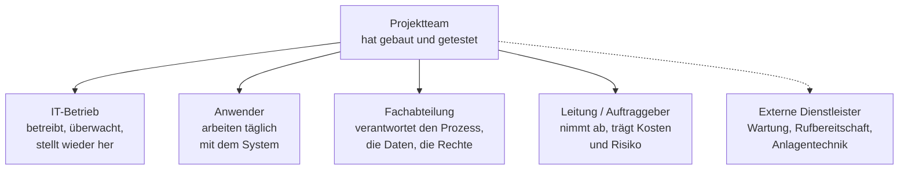
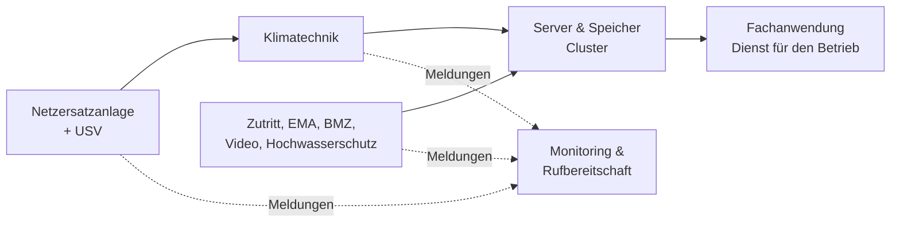
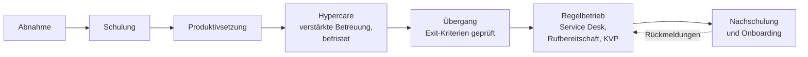

# Übergabe & Einweisung

Praxis &nbsp; Ein System ist erst dann wirklich angekommen, wenn die Menschen dahinter damit arbeiten können. Übergabe und Einweisung sind die Brücke vom fertigen System zum **genutzten** System.

Es gibt einen Projektzustand, der von außen wie Erfolg aussieht und keiner ist: Die Abnahme ist unterschrieben, alle Testfälle sind bestanden, die Technik läuft – und drei Monate später arbeitet die Hälfte der Abteilung weiter mit ihren Tabellen daneben, weil niemand weiß, wie man im neuen System einen Vorgang storniert. Das System erfüllt jede Anforderung des Pflichtenhefts und trotzdem nicht seinen Zweck.

Deshalb ist die Übergabe kein Verwaltungsakt am Projektende, sondern der Teil, an dem sich entscheidet, ob die ganze Arbeit davor etwas wert war. **Ein System, das niemand bedienen kann, ist nicht fertig.** Und ein System, dessen Betrieb niemand übernommen hat, gehört immer noch dem Projekt – auch wenn das Projekt längst abgerechnet ist.

!!! abstract "Was du auf dieser Seite lernst"
    - warum die Übergabe über den Projekterfolg entscheidet und was der Wechsel vom Projekt in den **Regelbetrieb** bedeutet
    - an **wen** übergeben wird – Betrieb, Anwender, Fachabteilung – und was jede Gruppe braucht
    - wie man den **Schulungsbedarf** über Zielgruppen, Aufgaben und eine Qualifizierungsmatrix ermittelt
    - warum **Infrastruktur- und Gebäudetechnik** – Datennetzanbindung, Cluster, Zutritt, Video, Einbruch- und Brandmeldeanlage, Klima, Netzersatzanlage, Hochwasserschutz – zur Einweisung gehören
    - was in die **Übergabedokumentation** gehört und wie man **Zugangsdaten sicher übergibt**
    - welche **Lehr- und Lernmaterialien** es gibt und wann welches passt
    - welche **Schulungsformen** sich für welche Zielgruppe eignen
    - wie man **Feedback aus mehreren Richtungen** einholt und auswertet
    - wie **Hypercare, Nachschulung und der Übergang in den Regelbetrieb** geplant werden

---

## Was bei der Übergabe eigentlich übergeben wird

Übergabe klingt nach einem Moment: Schlüssel, Handschlag, Unterschrift. Tatsächlich wechseln dabei vier verschiedene Dinge den Besitzer, und jedes kann einzeln misslingen.

| Was übergeben wird | Woran man erkennt, dass es nicht passiert ist |
|---|---|
| **Das System selbst** – Zugänge, Rechte, Konten, Betriebsmittel | das Projektteam wird noch nach Monaten für jede Änderung angerufen |
| **Das Wissen** – wie es aufgebaut ist, warum es so ist, wie man es bedient | jede Störung endet bei derselben Person, die zufällig dabei war |
| **Die Verantwortung** – wer betreibt, wer entscheidet, wer wird nachts geweckt | bei einer Störung sucht man erst einmal den Zuständigen |
| **Die Unterlagen** – Dokumentation, Verträge, Nachweise, Notfallkontakte | die Wartungsverträge tauchen erst auf, wenn sie abgelaufen sind |

Der Wechsel, um den es geht, ist der vom **Projekt** in die **Linie**. Im Projekt gibt es eine Projektleitung, ein Budget, ein Ende und Menschen, die das System gebaut haben und es deshalb kennen. In der Linie gibt es Regelaufgaben, ein Betriebsbudget, kein Ende – und Menschen, die das System nicht gebaut haben. Alles, was das Projektteam im Kopf hatte und nicht aufgeschrieben hat, geht in diesem Übergang verloren.

!!! tip "Die Wohnungsübergabe"
    Wer eine Wohnung übergibt, macht nicht nur die Tür auf. Es gibt ein **Protokoll** mit Zählerständen und Mängeln, einen **Schlüsselnachweis** über jeden ausgehändigten Schlüssel, eine **Einweisung** in Heizung und Lüftung – und die Telefonnummer des Hausmeisters für die erste Zeit.

    Genau diese vier Bestandteile hat auch eine Systemübergabe: den dokumentierten Zustand samt offener Punkte, den Nachweis über ausgehändigte Zugänge, die Einweisung in das, was man nicht sieht, und eine Ansprechstelle für die Zeit danach. Fehlt einer davon, merkt man es erst im Winter.

---

## Übergabe an wen: drei Richtungen, drei Bedürfnisse

„Wir haben geschult“ ist so lange keine Aussage, wie nicht klar ist, wer geschult wurde. Ein integriertes System wird immer in mehrere Richtungen übergeben, und die Empfänger haben wenig gemeinsam.

| Empfänger | Was er nach der Übergabe tun muss | Was er dafür braucht | Passende Form |
|---|---|---|---|
| **IT-Betrieb** | überwachen, sichern, wiederherstellen, aktualisieren, Störungen bearbeiten | Systemdokumentation, Betriebshandbuch, Notfallplan, Zugänge, Wartungsverträge, Monitoring-Anbindung | technische Einweisung am System, begleiteter Betrieb, Referenzunterlagen |
| **Anwender** | ihre täglichen Aufgaben erledigen – nicht mehr, aber das sicher | Kurzanleitungen für die eigenen Tätigkeiten, Übungsmöglichkeit, eine Ansprechstelle bei Fragen | kurze Schulung an echten Aufgaben, Kurzanleitung am Arbeitsplatz |
| **Fachabteilung** | den Prozess verantworten: Stammdaten, Berechtigungen, Auswertungen, fachliche Regeln | fachliche Dokumentation, Rollen- und Rechtekonzept, Auswertungen, Ansprechpartner beim Anbieter | Fachschulung mit Entscheidungsbezug, Übergabe der Pflegeaufgaben |
| **Leitung / Auftraggeber** | abnehmen, Restpunkte verfolgen, Kosten und Risiken tragen | Abnahmeprotokoll, Restpunkteliste, Vertragslage, Betriebskosten | kurze Vorlage mit Entscheidungspunkten, keine Technik |
| **Externe Dienstleister** | Wartung, Rufbereitschaft, Anlagenbetreuung | Schnittstellen, Meldewege, Zugänge mit Befristung, Anlagendokumentation | Vertrag, Ansprechpartnerliste, dokumentierter Meldeweg |

Die Zeile, die im Alltag am häufigsten leer bleibt, ist die **Fachabteilung**. Der Betrieb wird eingewiesen, weil er sonst laut wird; die Anwender werden geschult, weil sie sonst nicht arbeiten können. Aber wer pflegt künftig die Artikelstammdaten, wer legt neue Benutzer an, wer entscheidet, ob eine Rolle auf die Einkaufspreise sehen darf? Wird das nicht übergeben, bleibt es beim Projektteam hängen – und wandert von dort ungeplant zur IT, die diese Entscheidungen fachlich gar nicht treffen kann.

!!! warning "Zielgruppen bildet man nach Aufgaben, nicht nach Abteilungen"
    „Die Buchhaltung“ ist keine Zielgruppe. In ihr sitzen Menschen, die Rechnungen erfassen, Menschen, die Zahlungsläufe freigeben, und eine Person, die Auswertungen baut. Diese drei brauchen drei verschiedene Einweisungen – und zwei davon dauern zwanzig Minuten.

    Umgekehrt kann eine Zielgruppe quer durch den Betrieb laufen: Alle, die Belege scannen, brauchen dieselbe Anleitung, egal in welcher Abteilung sie sitzen.

---

## Bedarfsanalyse für Schulungen

Bevor irgendjemand Folien baut, muss die Frage beantwortet sein: **Wer muss nach der Übergabe was können – und was kann er heute schon?** Die Differenz ist der Schulungsbedarf. Alles andere ist Beschäftigungstherapie mit Beamer.

Der Weg dahin hat fünf Schritte:

1. **Zielgruppen bilden.** Nach Aufgabe, nicht nach Abteilung oder Hierarchie. Faustregel: Wer nach der Umstellung dieselben Handgriffe macht, gehört in dieselbe Gruppe.
2. **Aufgaben auflisten.** Was tut diese Gruppe nach der Übergabe konkret mit dem System? Eine Tätigkeitsliste in Verben: Auftrag erfassen, Lieferschein drucken, Beleg stornieren, Sicherung prüfen, Benutzer anlegen.
3. **Soll-Können festlegen.** Für jede Aufgabe eine Stufe – das ist der Kern der Sache und die Stelle, an der die meiste Zeit gespart wird.
4. **Ist-Können erheben.** Kurze Befragung, Gespräch mit den Führungskräften oder eine Selbsteinschätzung. Wichtig ist auch das Vorwissen aus dem Altsystem: Wer den Prozess kennt, braucht nur die neue Oberfläche; wer neu ist, braucht den Prozess.
5. **Lücke bestimmen.** Soll minus Ist ergibt den Bedarf je Gruppe und Aufgabe. Nur dafür wird geschult.

Drei Stufen reichen fast immer aus, um das Soll-Können zu beschreiben:

| Stufe | Bedeutung | Erkennbar daran |
|---|---|---|
| **kennen** | weiß, dass es das gibt, und weiß, wen er fragt | kann die Funktion benennen und den Zuständigen nennen |
| **anwenden** | führt die Aufgabe selbstständig und sicher aus | erledigt sie ohne Hilfe, erkennt, wenn etwas schiefgeht |
| **anleiten** | kann anderen die Aufgabe erklären und im Zweifel entscheiden | schult Kollegen ein, beantwortet Rückfragen, meldet Verbesserungen |

Trägt man Zielgruppen und Aufgaben in eine Tabelle ein, entsteht die **Qualifizierungsmatrix** – das Arbeitsmittel, aus dem sich Schulungsumfang, Gruppengrößen und Termine direkt ablesen lassen:

| Aufgabe | Anwender Vertrieb | Leitstelle | IT-Betrieb | Fachverantwortung |
|---|---|---|---|---|
| Auftrag erfassen und freigeben | anwenden | kennen | kennen | anleiten |
| Beleg stornieren | anwenden | – | kennen | anleiten |
| Benutzer und Rollen pflegen | – | – | anwenden | anleiten |
| Sicherung prüfen und wiederherstellen | – | – | anleiten | kennen |
| Schnittstellenfehler erkennen und melden | kennen | anwenden | anleiten | kennen |
| Auswertung erstellen | kennen | kennen | – | anwenden |

Aus der Matrix folgt unmittelbar der Zuschnitt: Der Vertrieb braucht eine kurze Schulung zu drei Aufgaben, der IT-Betrieb eine ausführliche zu anderen, und für jede Aufgabe gibt es genau eine Gruppe mit der Stufe **anleiten** – das sind die späteren Ansprechpersonen im eigenen Haus, oft **Key-User** genannt.

!!! tip "Lernziele mit prüfbaren Verben"
    „Die Teilnehmenden verstehen das Berechtigungskonzept“ lässt sich nicht überprüfen. „Die Teilnehmenden legen einen Benutzer an, weisen ihm eine Rolle zu und weisen nach, dass er die Einkaufspreise nicht sehen kann“ lässt sich in der Schulung selbst nachweisen – und ist gleichzeitig die Übungsaufgabe.

    Brauchbare Verben: benennen, erkennen, auslösen, erfassen, prüfen, wiederherstellen, entscheiden. Unbrauchbar: verstehen, kennenlernen, sich vertraut machen, sensibilisiert werden.

!!! warning "Der häufigste Fehler: Systemschulung statt Prozessschulung"
    Bei einer Systemumstellung ändert sich fast nie nur die Oberfläche. Meist ändert sich der Ablauf: Freigaben laufen anders, Belege entstehen an anderer Stelle, eine Zwischenstufe entfällt. Wer nur zeigt, wo die Knöpfe sind, lässt genau die Frage offen, die im Alltag Ärger macht – **wer jetzt eigentlich was tut**. Eine Einweisung, die den neuen Ablauf am Beispiel eines vollständigen Vorgangs durchspielt, ist doppelt so viel wert wie eine Führung durch die Menüs.

---

## Infrastruktur und Gebäudetechnik gehören dazu

Bei „Einweisung“ denken die meisten an eine Anwendung. In der Systemintegration hängt aber jeder Dienst an einer Kette physischer Voraussetzungen, und deren Anlagen werden bei Projektabschluss ebenfalls übergeben. Wer sie ausklammert, übergibt ein System, dessen Grundlagen niemandem gehören.

Der Zusammenhang lässt sich in einem Satz sagen: **Kein Strom, keine Kühlung – keine Server. Kein Zutritt, keine Meldewege – kein Wiederanlauf.**

Zwei Dinge macht dieses Bild deutlich. Erstens laufen alle Meldungen dieser Anlagen in dieselbe Überwachung wie die IT-Meldungen – oder eben nicht, und dann erfährt nachts niemand, dass die Kühlung ausgefallen ist. Zweitens sind die meisten dieser Anlagen inzwischen selbst vernetzte IT-Systeme mit Server, Konten und Aktualisierungsbedarf. Sie brauchen ein eigenes Netzsegment, eine Zuständigkeit und eine Übergabe – genau wie jede andere Anwendung. Zur Netztrennung siehe [Segmentierung & VPN](../netzwerke/segmentierung-und-vpn.md).

### Die Anlagen im Einzelnen

**Anbindung an Datennetze.** Gemeint sind die Leitungen, über die der Standort und seine Systeme erreichbar sind: der Hausanschluss des Providers mit seinem Übergabepunkt, die Verbindung zwischen mehreren Standorten, die strukturierte Verkabelung im Haus mit Etagenverteilern und Patchfeldern. Zur Einweisung gehören der Verlauf der Leitungen, die Vertrags- und Leitungsnummern, die Störungsmeldestelle des Providers samt zugesagter Entstörzeit und die Frage, ob eine zweite Leitung tatsächlich auf einem anderen Weg ins Haus kommt oder nur ein zweiter Vertrag über dasselbe Kabel ist. Der typische Fehler ist eine Patchdokumentation, die nach zwei Umbauten niemand mehr nachgeführt hat.

**Clustertechnologie.** Ein Cluster ist ein Verbund mehrerer Knoten, die gemeinsam einen Dienst tragen: Fällt ein Knoten aus, übernehmen die anderen. Bedienen lässt sich so ein Verbund nur mit Kenntnis seiner Regeln. Zur Einweisung gehören der Wartungsmodus (ein Knoten wird kontrolliert entlastet, nicht ausgeschaltet), die Frage der Beschlussfähigkeit – ein Cluster braucht eine Mehrheit erreichbarer Knoten, sonst schaltet er sich zum Schutz der Daten ab –, und vor allem die Kapazitätsregel: Bei vier Knoten muss die Last auf drei passen, sonst gibt es beim nächsten Ausfall keine Reserve. Der praktisch wichtigste Punkt ist unscheinbar: **Ein Cluster, in dem ein Knoten seit Wochen fehlt, sieht von außen völlig normal aus.** Wer nicht weiß, wo man das nachsieht, merkt es erst beim zweiten Ausfall.

**Zutrittsregelung.** Wer darf wann in welchen Raum? Technisch sind das Ausweise oder Transponder, Berechtigungsgruppen, Türsteuerungen und eine Protokollierung; organisatorisch die Besucherregelung, die Schlüsselverwaltung mit Notschlüssel im Tresor und die Sperrung bei Austritt. Für die Systemintegration relevant: Der Serverraum braucht eine engere Berechtigung als das Büro, externe Techniker brauchen befristeten Zutritt mit Begleitung, und die Zutrittsanlage selbst ist ein IT-System, das ausfallen kann – dann muss jemand wissen, wie man ohne sie in den Technikraum kommt.

**Videoüberwachung.** Kameras mit Aufzeichnung an Zugängen und in Technikräumen. Sie erzeugen personenbezogene Daten, deshalb gehören Zweck, Speicherdauer, Zugriffsberechtigung und Hinweisbeschilderung schriftlich festgelegt; Anlagen, mit denen sich das Verhalten von Beschäftigten überwachen ließe, sind mitbestimmungspflichtig, der Betriebsrat ist also zu beteiligen. In die Einweisung gehört vor allem, **wer unter welchen Voraussetzungen Aufzeichnungen ansehen darf** – üblich ist ein Vier-Augen-Prinzip mit Protokoll. Näheres zu den Grundsätzen steht unter [Datenschutz & DSGVO](../recht-organisation/datenschutz-dsgvo.md).

**Einbruchmeldeanlage (EMA).** Melder an Türen, Fenstern und in Räumen, eine Zentrale und meist eine Aufschaltung auf eine Notruf- und Serviceleitstelle. Bedienrelevant sind das Scharf- und Unscharfschalten und die sogenannte Zwangsläufigkeit: Die Anlage lässt sich nicht scharfschalten, solange ein Fenster offen oder ein Melder gestört ist. Genau daran scheitern Abendarbeiten im Serverraum regelmäßig. Zur Einweisung gehören außerdem das Verhalten bei Alarm, die Frage, wer Codes und Bedienteile bekommt, und der Hinweis, dass **Fehlalarme Geld kosten** – Einsätze von Leitstelle oder Polizei werden in Rechnung gestellt.

**Brandmeldezentrale (BMZ).** Die Zentrale sammelt die Meldungen automatischer Melder – Rauch- und Wärmemelder, in Rechnerräumen oft empfindliche Ansaugrauchmelder – und der Handfeuermelder und leitet den Alarm in der Regel direkt zur Feuerwehr weiter. Für die IT sind drei Punkte praktisch bedeutsam. Erstens schaltet eine Auslösung typischerweise die Lüftung ab und aktiviert, wo vorhanden, eine Löschanlage; in Rechnerräumen sind das Gaslöschanlagen, und es ist dokumentiert, dass der Schalldruck beim Ausströmen Festplatten stören kann. Zweitens müssen staubintensive Arbeiten – Bohren, Sägen, Arbeiten im Doppelboden – vorher angemeldet und die betroffenen Melder abgeschaltet werden; sonst rückt die Feuerwehr an und stellt die Kosten in Rechnung. Drittens dürfen Bedienung und Rücksetzen nur eingewiesene Personen übernehmen. Betrieb und Instandhaltung solcher Anlagen sind geregelt, unter anderem in DIN 14675 und der Normenreihe DIN VDE 0833; wiederkehrende Prüfungen sind Pflicht und laufen über einen Wartungsvertrag.

**Klimatechnik.** Rechnerräume werden mit Umluftkühlgeräten oder Splitanlagen auf einem Sollwert gehalten, häufig in einer Kalt-/Warmgang-Anordnung. Zur Einweisung gehören der Sollwert und warum er nicht „mal eben“ verstellt wird, die Redundanz (fällt ein Gerät aus, trägt das andere die Last – aber nur, wenn es nicht ebenfalls zu 100 Prozent ausgelastet ist), die Kondensat- und Leckageüberwachung, der Filterwechsel und der Alarmweg bei Übertemperatur. Praktische Regeln, die erstaunlich oft verletzt werden: Türen geschlossen halten, keine Kartons vor Luftauslässe stellen, Blindplatten in leere Höheneinheiten setzen. Bei einem Kühlungsausfall gilt fast immer: Last reduzieren und nicht kritische Systeme geordnet herunterfahren – Türen aufreißen verschlechtert die Lage meistens.

**Netzersatzanlage (NEA).** Umgangssprachlich das Notstromaggregat, meist dieselbetrieben. Es überbrückt einen längeren Netzausfall – Stunden bis Tage, je nach Kraftstoffvorrat –, braucht dafür aber einige Sekunden zum Anlauf und zur Umschaltung. Diese Lücke schließt die **USV**, die den Übergang und kurze Ausfälle abdeckt. Beide gehören zusammen: Die USV allein hält nur Minuten, die NEA allein lässt die Systeme beim Umschalten abstürzen. Zur Einweisung gehören der regelmäßige Probelauf unter Last, der Kraftstoffvorrat und der Vertrag über das Nachtanken, die Startbatterie – häufigste Ausfallursache überhaupt – und die Frage, wer die Anlage von Hand starten darf. Was in der Praxis am meisten kostet: Die NEA versorgt oft nicht alles, sondern nur bestimmte Stromkreise. Welche Steckdose im Serverraum am Notstrom hängt und welche nicht, muss dokumentiert und beschriftet sein.

**Hochwasserschutz.** Gemeint ist der Schutz vor eindringendem Wasser – von außen durch Starkregen, Rückstau aus der Kanalisation oder ein Gewässer in der Nähe, von innen durch geplatzte Leitungen und undichte Kühlgeräte. Der Innenfall ist der häufigere. Zur Einweisung gehören die Lage der Technik (Technikräume im Keller sind eine Risikoentscheidung, die man kennen sollte), Rückstausicherungen, Wassermelder im Doppelboden und unter den Kühlgeräten, ein Pumpensumpf mit funktionierender Pumpe, mobile Schutzelemente wie Dammbalken samt der Frage, wer sie bei Warnung einsetzt – und der Alarmweg, damit ein Wassermelder um drei Uhr nachts nicht nur eine Leuchtdiode zum Blinken bringt.

### Was davon in die Übergabe muss

| Anlage | Muss übergeben werden | Typischer Fehler |
|---|---|---|
| **Datennetzanbindung** | Leitungsverlauf, Vertrags- und Leitungsnummern, Störungsmeldestelle, Entstörzeit, Patchdokumentation | zweite Leitung im selben Kabelgraben, Patchplan veraltet |
| **Cluster** | Wartungsmodus, Beschlussfähigkeit, Kapazitätsgrenze, Prüfung auf fehlende Knoten | ausgefallener Knoten fällt wochenlang nicht auf |
| **Zutrittsregelung** | Berechtigungsgruppen, Ausweisvergabe und -sperrung, Besucher- und Fremdfirmenregelung, Notschlüssel | Zutritt bei Austritt nicht gesperrt; kein Weg in den Raum bei Ausfall der Anlage |
| **Videoüberwachung** | Zweck, Speicherdauer, Zugriffsregel, Beschilderung, Beteiligung des Betriebsrats | Zugriff ohne Regel, Aufzeichnungen länger gespeichert als festgelegt |
| **Einbruchmeldeanlage** | Scharf-/Unscharfschalten, Zwangsläufigkeit, Verhalten bei Alarm, Codevergabe, Aufschaltung | Fehlalarme durch nicht eingewiesene Abendarbeit |
| **Brandmeldezentrale** | Bedienung und Rücksetzen, Abschalten von Meldern bei Staubarbeiten, Folgen einer Auslösung, Wartungsvertrag | Bohren ohne Abmeldung – Feuerwehr rückt an |
| **Klimatechnik** | Sollwerte, Redundanz, Leckageüberwachung, Wartung, Verhalten bei Ausfall | Sollwert verstellt; zweites Gerät wäre allein überlastet |
| **Netzersatzanlage / USV** | Probelauf, Kraftstoff und Nachtanken, Batterien, Handstart, **welche Stromkreise versorgt sind** | Geräte an nicht abgesicherten Steckdosen |
| **Hochwasserschutz** | Wassermelder und ihr Alarmweg, Pumpe, Rückstausicherung, Einsatz mobiler Elemente | Melder meldet nur örtlich, nachts hört ihn niemand |

!!! danger "Der Meldeweg ist wichtiger als die Anlage"
    Jede dieser Anlagen erzeugt Meldungen: Störung, Vorwarnung, Alarm. Bei der Übergabe muss für jede einzelne feststehen, **wohin die Meldung geht, wer sie um drei Uhr nachts sieht und was diese Person dann tun soll**. Eine Übertemperaturwarnung, die auf einem Bedienteil im verschlossenen Technikraum steht, ist keine Warnung. Die Meldungen gehören in dieselbe Überwachung wie die IT-Meldungen und in denselben Rufbereitschaftsplan – siehe [Monitoring](../betrieb/monitoring.md) und [Incident Response & Business Continuity](../betrieb/incident-und-bcm.md).

---

## Die Übergabedokumentation

Dokumentation ist der Teil der Übergabe, den man später nicht nachholen kann, weil dann niemand mehr weiß, warum etwas so gebaut wurde. Sie besteht nicht aus einem Dokument, sondern aus einem kleinen Satz von Unterlagen mit klar verschiedenen Adressaten.

| Unterlage | Für wen | Inhalt | Wer pflegt sie |
|---|---|---|---|
| **Betriebshandbuch** | IT-Betrieb | wie das System im Alltag betrieben wird: Regelaufgaben, Überwachung, Sicherung, Störungsbehandlung | Betrieb |
| **System- und Konfigurationsdokumentation** | IT-Betrieb, Dienstleister | Aufbau, Komponenten, Versionen, Einstellungen, Abhängigkeiten, Netzpläne, Adressen | Betrieb |
| **Notfall- und Wiederanlaufplan** | Betrieb, Rufbereitschaft | was bei Ausfall zu tun ist, in welcher Reihenfolge, mit welchen Zielzeiten | Betrieb, abgestimmt mit Fachbereich |
| **Anwenderhandbuch** | Anwender | die fachlichen Abläufe im System, vollständig, zum Nachschlagen | Fachbereich |
| **Kurzanleitungen** | Anwender | je eine Aufgabe auf einer Seite, für den Moment der Nutzung | Fachbereich / Key-User |
| **Rollen- und Berechtigungskonzept** | Fachbereich, Betrieb, Revision | welche Rolle darf was, wer genehmigt, wie wird entzogen | Fachbereich |
| **Wartungsverträge und Vereinbarungen** | Betrieb, Einkauf, Leitung | Laufzeiten, Reaktions- und Entstörzeiten, Ansprechpartner, Kündigungsfristen | Einkauf / Betrieb |
| **Lizenznachweise** | Betrieb, Einkauf | was lizenziert ist, in welchem Umfang, bis wann | Einkauf |
| **Notfallkontaktliste** | alle Beteiligten | Provider, Anlagenbauer, Hersteller, Rufbereitschaft – mit Vertragsnummer und Erreichbarkeit außerhalb der Geschäftszeit | Betrieb |
| **Abnahmeprotokoll und Restpunkteliste** | Auftraggeber, Projekt, Betrieb | was abgenommen wurde, welche Punkte offen sind, mit Termin und Verantwortlichem | Projektleitung |

Für das **Betriebshandbuch** hat sich eine Gliederung eingebürgert, die man als Vorlage verwenden kann: Zweck und Geltungsbereich; Systemüberblick mit Architekturbild; Komponenten und Versionen; Betriebszeiten und Servicevereinbarungen; Rollen und Zuständigkeiten; Regelaufgaben nach Intervall; Überwachung mit Schwellen und Alarmen; Sicherung und Wiederherstellung; Änderungs- und Freigabeverfahren; Störungsbehandlung mit den häufigsten Fällen; Notfall und Wiederanlauf; Infrastruktur- und Gebäudetechnik mit Meldewegen; Zugänge und Berechtigungen; Verträge und Ansprechpartner; mitgeltende Unterlagen und Änderungsverzeichnis.

!!! tip "Zwei Fragen entscheiden über den Wert einer Dokumentation"
    **Steht ein Datum und eine Version darauf?** Ohne beides weiß niemand, ob das Dokument den heutigen Zustand beschreibt oder den vom Projektende.

    **Steht ein Name darauf?** Nicht als Autor, sondern als **Pflegeverantwortung**. Dokumentation ohne Zuständigkeit ist ein Foto, kein Spiegel – sie zeigt einen Zustand, den es einmal gab.

### Zugangsdaten sicher übergeben

Der heikelste Teil der Übergabe ist der, der am häufigsten nebenbei erledigt wird: die Übergabe von Kennwörtern, Schlüsseln und administrativen Konten. Fünf Regeln:

1. **Nicht im Klartext über E-Mail oder Chat.** Diese Nachrichten bleiben jahrelang in Postfächern, Archiven und Sicherungen liegen und sind nicht zurückholbar.
2. **Über einen Kennwort-Tresor mit Freigaben.** Übergeben wird der Zugriff auf einen Eintrag, nicht der Wert selbst. Änderungen sind dann für alle Berechtigten sofort wirksam und nachvollziehbar.
3. **Persönliche Konten statt geteilter Konten.** Nachvollziehbarkeit gibt es nur, wenn jede Anmeldung einer Person zuzuordnen ist. Wo ein gemeinsames Administratorkonto technisch unvermeidbar ist, gehört es in ein Notfallverfahren: hinterlegt im Tresor, Ausgabe nur im Vier-Augen-Prinzip, jede Nutzung dokumentiert, danach Kennwortwechsel.
4. **Alle vom Projekt genutzten Kennwörter nach der Übergabe wechseln.** Während eines Projekts kennen viele Menschen viele Zugänge – Dienstleister, Aushilfen, Testkonten. Der Kennwortwechsel ist der eigentliche Übergabeakt: Ab diesem Moment gehört das System dem Betrieb.
5. **Zugänge von Dienstleistern befristen und protokollieren.** Fernwartungszugänge werden nur bei Bedarf freigeschaltet, laufen auf benannte Personen und enden mit dem Vertrag.

!!! danger "Das Konto, das niemandem gehört"
    Die häufigste Altlast einer Übergabe ist ein administratives Konto, das seit dem Projekt existiert, dessen Kennwort drei ehemalige Beteiligte kennen und das in keiner Liste steht. Es taucht typischerweise bei der ersten Sicherheitsprüfung auf – oder gar nicht.

    Deshalb gehört zur Übergabe eine **Kontenliste**: jedes Konto mit Zweck, Typ (persönlich, technisch, Notfall), Verantwortlichem und Datum des letzten Kennwortwechsels. Nicht die Kennwörter, sondern die Konten sind die Liste, die man braucht.

---

## Lehr- und Lernmaterialien: wann was passt

Materialien scheitern selten an der Qualität und fast immer daran, dass die falsche Form für den Moment gewählt wurde, in dem sie gebraucht wird. Es gibt nämlich zwei völlig verschiedene Momente: **vorher lernen** und **im Moment der Aufgabe nachschlagen**.

!!! tip "Kochbuch und Rezeptkarte"
    Ein Kochbuch liest man in Ruhe am Küchentisch. Eine Rezeptkarte hängt am Herd, wenn die Pfanne schon heiß ist. Beide enthalten dasselbe Gericht, sind aber nicht austauschbar: Niemand blättert mit fettigen Fingern durch dreihundert Seiten, und niemand lernt Kochen von einer Karteikarte.

    Ein Anwenderhandbuch ist das Kochbuch, eine Kurzanleitung die Rezeptkarte. Wer beides in ein Dokument presst, bekommt ein Kochbuch, das am Herd nicht hilft.

| Material | Stärke | Schwäche | Passt für |
|---|---|---|---|
| **Handbuch** | vollständig, nachschlagbar, verbindlich | wird nicht gelesen, veraltet schnell, hoher Pflegeaufwand | Fachverantwortung, Betrieb, Nachweispflichten |
| **Kurzanleitung** | eine Aufgabe, eine Seite, im Moment der Nutzung greifbar | deckt nur den Standardfall ab | tägliche Anwendertätigkeiten |
| **Präsentation** | gemeinsamer Einstieg, Überblick, Zusammenhänge, Rückfragen möglich | flüchtig, ohne Übung bleibt wenig hängen | Kickoff, Prozessänderungen, Führungskräfte |
| **Video / Bildschirmaufzeichnung** | zeigt Abläufe, jederzeit abrufbar, gut für verteilte Standorte | teuer in der Pflege, schlecht durchsuchbar, keine Rückfrage möglich | wiederkehrende Standardabläufe, Schichtbetrieb |
| **Interaktive Anleitung** | geführte Schritte direkt im System, Lernen am echten Vorgang | Aufwand in Erstellung und Pflege, an die Oberfläche gebunden | häufige Aufgaben mit vielen Anwendern |
| **Rechnergestütztes Lernen (CBT/WBT, Lernplattform)** | zeitunabhängig, skaliert, Lernstand und Teilnahme nachweisbar | wenig Bezug zum eigenen Fall, Abbruchquote, träge bei Änderungen | Pflichtunterweisungen, große Gruppen, Onboarding |
| **Checkliste** | sichert Vollständigkeit bei seltenen Abläufen | ersetzt kein Verständnis | Wiederanlauf, Wartungsfenster, Umstellungstage |
| **Wissensdatenbank / FAQ** | wächst mit den echten Fragen, entlastet den Service Desk | verwildert ohne Pflege | Nachbetreuung und Regelbetrieb |

Für die **Kurzanleitung** lohnt sich eine feste Bauform, weil sie die Erstellung beschleunigt und die Qualität erzwingt:

1. **Titel als Aufgabe** in der Sprache der Anwender: „Einen Beleg stornieren“ – nicht „Modul Belegverwaltung“.
2. **Wann brauche ich das?** Ein Satz zur Situation.
3. **Voraussetzung.** Was muss vorliegen, welche Berechtigung ist nötig.
4. **Nummerierte Schritte.** Je Schritt: was man tut und was man daraufhin sieht. Bilder nur dort, wo der Text nicht reicht.
5. **Woran erkenne ich, dass es geklappt hat?** Der Punkt, der am häufigsten fehlt – und der aus einer Anleitung eine überprüfbare macht.
6. **Was tun, wenn nicht?** Die zwei häufigsten Fehlermeldungen und die Ansprechstelle mit Erreichbarkeit.

Mehr als eine Seite darf sie nicht haben. Passt sie nicht auf eine Seite, sind es meistens zwei Aufgaben.

---

## Schulungsformen

Die Form folgt dem Ziel, der Zielgruppe und den Umständen – nicht dem, was gerade üblich ist.

| Form | Stärke | Grenze | Geeignet, wenn |
|---|---|---|---|
| **Präsenzschulung** | Rückfragen, Übung am System, Beobachtung durch die Lehrenden | Termin, Raum, Reisezeit, alle gleichzeitig verfügbar | die Aufgabe geübt werden muss und der Prozess neu ist |
| **Online-Schulung / Webinar** | ohne Reisezeit, mehrere Standorte gleichzeitig, aufzeichenbar | Aufmerksamkeit schwer zu halten, Übung schwerer zu begleiten | verteilte Standorte, Überblicksthemen, Auffrischung |
| **Blended Learning** | Grundlagen selbstständig, Präsenzzeit für Übung und Fragen | Vorbereitung wird nicht von allen gemacht | umfangreiche Themen mit unterschiedlichem Vorwissen |
| **Begleitetes Arbeiten am Arbeitsplatz** | am echten Vorgang, direkt anwendbar, sehr hohe Wirkung | personalintensiv, schlecht skalierbar | wenige Personen mit hoher Verantwortung; Betriebsübernahme |
| **Multiplikatoren / Key-User** | Wissen bleibt im Haus, kurze Wege, Akzeptanz aus den eigenen Reihen | die Key-User brauchen Zeit dafür – geplant, nicht nebenbei | viele Anwender, Schichtbetrieb, mehrere Standorte |
| **Selbstlernen (CBT/WBT)** | jederzeit, wiederholbar, Nachweis der Teilnahme | kein Bezug zum eigenen Fall, keine Rückfrage | Pflichtunterweisungen, neue Beschäftigte |
| **Sprechstunde / offene Fragerunde** | greift die echten Fragen aus dem Alltag auf, sehr günstig | ungeplant im Inhalt | die ersten Wochen nach der Umstellung |

Drei Rahmenbedingungen entscheiden in der Praxis mehr als die Methode:

**Die Übungsumgebung.** Geschult wird an einem System mit realistischen, aber unkritischen Daten – einem Schulungsmandanten. Übungen im Produktivsystem erzeugen Belege, Bestellungen und Buchungen, die hinterher jemand aufräumen muss; im schlimmsten Fall gehen sie an Kunden hinaus. Wie man Testdaten so aufbereitet, dass sie realistisch und trotzdem unbedenklich sind, steht auf [Testszenarien & Simulation](testszenarien.md).

**Der Zeitpunkt.** Zu früh geschult heißt vergessen, zu spät heißt keine Zeit mehr. Als Richtwert bewährt sich die Anwenderschulung wenige Tage bis zwei Wochen vor der Produktivsetzung, ergänzt um eine kurze Auffrischung oder Sprechstunde einige Wochen danach – dann, wenn die echten Fragen entstanden sind. Die Einweisung des Betriebs liegt früher, weil er beim Umstellungstag schon arbeitsfähig sein muss.

**Die Erreichbarkeit aller.** Schichtbetrieb, Teilzeit, Außendienst, Urlaub, mehrere Standorte: Ein einziger Schulungstermin erreicht in solchen Betrieben selten mehr als die Hälfte. Wer nicht plant, wie die übrigen erreicht werden, produziert genau die Gruppe, die später am lautesten klagt – meistens die Spätschicht.

---

## Feedback einholen und auswerten

Ob eine Einweisung getragen hat, weiß man nicht durch Hinsehen. Man braucht Rückmeldungen, und zwar aus mehreren Richtungen, weil jede Quelle etwas anderes sieht:

| Quelle | Was sie zeigt | Wann sie erhoben wird |
|---|---|---|
| **Teilnehmende** | Verständlichkeit, Tempo, Praxisbezug, offene Fragen | direkt am Ende der Schulung |
| **Lehrende / Key-User** | wo es in der Übung hakte, welche Aufgabe niemand allein schaffte | direkt danach, kurz notiert |
| **Führungskräfte des Fachbereichs** | ob die Arbeit nach der Umstellung tatsächlich läuft | nach zwei bis vier Wochen |
| **Service Desk / Ticketauswertung** | die härteste Rückmeldung: Welche Fragen kommen wie oft? | fortlaufend ab Produktivsetzung |
| **Das System selbst** | Fehlbedienungen, abgebrochene Vorgänge, ungenutzte Funktionen | fortlaufend |
| **Beobachtung am Arbeitsplatz** | was die Leute wirklich tun – inklusive der Umwege, die sie sich gebaut haben | zwei bis vier Wochen nach der Umstellung |

Die **Ticketauswertung** ist dabei die ehrlichste Quelle. Häufen sich zehn gleichlautende Anfragen zu einem Schritt, ist das kein Anwenderproblem, sondern eine Lücke in der Anleitung – und die Antwort ist eine überarbeitete Kurzanleitung, nicht eine zehnte individuelle Erklärung.

Bei der Bewertung hilft es, vier Wirkungsebenen zu unterscheiden, wie sie in der Schulungsbewertung nach Kirkpatrick üblich sind:

1. **Reaktion** – Wie fanden es die Teilnehmenden? Misst Stimmung, nicht Können.
2. **Lernen** – Können sie es am Ende der Schulung? Zeigt sich in der Übungsaufgabe.
3. **Verhalten** – Wenden sie es im Alltag an? Zeigt sich nach Wochen, am Arbeitsplatz.
4. **Ergebnis** – Verändert es die Kennzahlen des Betriebs: Bearbeitungszeit, Fehlerquote, Ticketaufkommen?

!!! warning "Der Zufriedenheitsbogen misst das Falscheste von allem"
    Eine gut bewertete Schulung mit sympathischer Trainerin und gutem Kaffee kann folgenlos bleiben; eine anstrengende Schulung mit vielen Übungen wird schlechter bewertet und wirkt länger. Wenn nur eine Ebene erhoben werden kann, ist es **nicht** die Reaktion – sondern die Übungsaufgabe am Ende oder das Ticketaufkommen danach.

---

## Nachbetreuung: Hypercare und der Weg in den Regelbetrieb

Der kritischste Zeitraum eines Systems sind die ersten Wochen nach der Produktivsetzung. Alle Anwender arbeiten zum ersten Mal ernsthaft damit, alle Sonderfälle treten zum ersten Mal auf, und niemand hat Routine – auch der Betrieb nicht. Für diese Phase gibt es eine eigene Betriebsform: **Hypercare**, eine befristete, verstärkte Betreuung unmittelbar nach der Umstellung.

Hypercare ist kein Gefühl, sondern eine Vereinbarung mit vier Festlegungen:

- **Dauer.** Als Richtwert zwei bis sechs Wochen, abhängig von Umfang und Zyklen – ein System mit Monatsabschluss braucht mindestens einen vollständigen Abschluss innerhalb der Phase.
- **Besetzung und Erreichbarkeit.** Wer ist wann ansprechbar, auch in Rand- und Schichtzeiten? Übliche Formen sind eine benannte Rufnummer, Key-User in den Abteilungen und in den ersten Tagen Begehungen durch die Bereiche.
- **Verkürzte Reaktionszeiten und ein eigener Eskalationsweg.** Anfragen aus der Umstellung werden gekennzeichnet und vorrangig behandelt; für kritische Fälle steht das Projektteam bereit.
- **Tägliche kurze Lagebesprechung** in den ersten Tagen mit Betrieb, Fachbereich und Projekt: Was ist aufgelaufen, was ist entschieden, was bleibt offen?

### Wann Hypercare endet

Der Übergang in den Regelbetrieb passiert nicht durch Zeitablauf, sondern durch geprüfte **Exit-Kriterien**. Sie werden vor der Umstellung vereinbart, sonst endet Hypercare entweder nie oder still und unbemerkt:

- Das Aufkommen an Anfragen ist auf ein vereinbartes Maß gesunken und stabil.
- Es gibt keine offenen Fehler der Klassen „kritisch“ und „schwer“ mehr; die übrigen sind mit Termin und Verantwortlichem in der Restpunkteliste.
- Mindestens ein vollständiger Zyklus ist durchlaufen – Monatsabschluss, Inventur, Abrechnungslauf, was auch immer der Betrieb an Höhepunkten kennt.
- Der Betrieb führt die Regelaufgaben eigenständig aus: Überwachung, Sicherung, Wiederherstellungstest, Änderungen.
- Betriebshandbuch, Notfallplan und Kontaktlisten sind auf dem Stand nach der Umstellung, nicht auf dem Stand des Projektplans.
- Rufbereitschaft, Servicevereinbarungen und Wartungsverträge sind aktiv.

Sind sie erfüllt, wird die Übernahme schriftlich festgehalten – wer den Betrieb ab wann verantwortet, welche Punkte offen bleiben und wie sie verfolgt werden. Ab diesem Moment laufen Änderungen über das reguläre Änderungsverfahren und nicht mehr über das Projekt.

### Nachschulung ist kein Zeichen von Scheitern

Nach einigen Wochen im Alltag haben die Anwender andere Fragen als in der Schulung: Sie fragen nicht mehr, wo ein Knopf ist, sondern was zu tun ist, wenn ein Vorgang schon halb bearbeitet wurde. Eine **Nachschulung** oder eine Sprechstunde vier bis sechs Wochen nach der Umstellung greift genau diese Fragen auf und ist meist die wirksamste Schulungsstunde des ganzen Projekts – weil die Teilnehmenden jetzt wissen, was sie wissen wollen.

Zwei weitere Dinge müssen den Projektabschluss überdauern:

- **Neue Beschäftigte.** Wer ein halbes Jahr später anfängt, hat keine Einweisung erlebt. Die Materialien müssen also so hinterlegt sein, dass sie ohne das Projektteam nutzbar sind – im Onboarding, in der Lernplattform, in der Wissensdatenbank.
- **Änderungen am System.** Jede spätere Erweiterung erzeugt Schulungsbedarf. Wer das nicht mitplant, hat nach zwei Jahren ein System, das alle nur noch zur Hälfte bedienen.

### Der Verbesserungskreis gilt auch für die Schulung

Was für den technischen Betrieb gilt, gilt für die Einweisung genauso: Sie wird gemessen, bewertet und nachgebessert. Der [PDCA-Zyklus](optimierung.md#der-kontinuierliche-verbesserungsprozess-pdca) lässt sich unmittelbar übertragen – **Plan:** Schulungsbedarf und Lernziele; **Do:** Schulung durchführen; **Check:** Übungsergebnisse, Ticketauswertung, Beobachtung am Arbeitsplatz; **Act:** Materialien und Inhalte anpassen und den geänderten Stand zum Standard machen.

Das klingt nach Verwaltung, hat aber eine sehr konkrete Form: Aus den zehn häufigsten Anfragen der ersten vier Wochen entstehen zehn überarbeitete Abschnitte in den Kurzanleitungen und zwei zusätzliche Punkte in der Schulung für die nächste Gruppe. Das ist der ganze Trick – und er funktioniert nur, wenn jemand die Anfragen überhaupt auswertet.

---

## Was du jetzt wissen solltest

- **Ein System, das niemand bedienen kann, ist nicht fertig.** Die Übergabe entscheidet, ob die Arbeit davor Wirkung entfaltet.
- Bei der Übergabe wechseln **vier Dinge** den Besitzer: das System, das Wissen, die Verantwortung und die Unterlagen.
- Übergeben wird an **Betrieb, Anwender und Fachabteilung** – mit unterschiedlichen Bedürfnissen. Die Fachabteilung ist die am häufigsten vergessene Richtung.
- **Zielgruppen bildet man nach Aufgaben**, nicht nach Abteilungen. Aus Aufgaben, Soll-Können (kennen, anwenden, anleiten) und Ist-Können entsteht die **Qualifizierungsmatrix**.
- **Infrastruktur und Gebäudetechnik gehören zur Einweisung**: Datennetzanbindung, Cluster, Zutritt, Video, Einbruchmelde- und Brandmeldeanlage, Klima, Netzersatzanlage, Hochwasserschutz – und für jede Anlage ein **Meldeweg mit Adressat**.
- Die **Übergabedokumentation** ist ein Satz von Unterlagen mit verschiedenen Adressaten; jede braucht Datum, Version und eine Pflegeverantwortung.
- **Zugangsdaten** gehören in einen Tresor, nicht in eine E-Mail. Nach der Übergabe werden alle Projektkennwörter gewechselt; übergeben wird eine Kontenliste, keine Kennwortliste.
- **Material folgt dem Moment der Nutzung:** Handbuch zum Lernen, Kurzanleitung zum Nachschlagen – eine Aufgabe, eine Seite, mit Erfolgskennzeichen.
- **Schulungsform folgt Zielgruppe und Umständen**; Übungsumgebung, Zeitpunkt und die Erreichbarkeit aller entscheiden mehr als die Methode.
- **Feedback kommt aus mehreren Richtungen**; das Ticketaufkommen ist die ehrlichste Quelle, der Zufriedenheitsbogen die schwächste.
- **Hypercare ist befristet und endet an geprüften Exit-Kriterien**, nicht durch Zeitablauf. Danach beginnt der Regelbetrieb – mit Nachschulung, Onboarding und einem Verbesserungskreis auch für die Schulung.

---

## Beispielfragen zur Selbstkontrolle

??? question "Frage 1: Ein Projekt meldet: 'System läuft, Anwender wurden geschult, Übergabe erledigt.' Welche vier Fragen stellst du, bevor du das glaubst?"
    1. **An wen wurde übergeben – vollständig?** Betrieb, Anwender, Fachabteilung sind drei Richtungen. Wer pflegt künftig Stammdaten und Berechtigungen? Wenn die Antwort „das macht noch das Projekt“ lautet, ist nicht übergeben worden.
    2. **Wer trägt ab wann die Verantwortung, und wer wird nachts geweckt?** Ohne benannte Zuständigkeit und aktive Rufbereitschaft gehört das System weiter dem Projekt.
    3. **Welche Unterlagen liegen vor – mit Datum, Version und Pflegeverantwortung?** Betriebshandbuch, Notfallplan, Kontenliste, Wartungsverträge, Notfallkontakte, Restpunkteliste.
    4. **Wie wurden die Zugänge übergeben, und sind die Projektkennwörter gewechselt?** Solange das nicht passiert ist, kennt ein unbestimmter Personenkreis administrative Zugänge.

    Ergänzend: Wurde die Infrastruktur mitübergeben – Klima, Notstrom, Meldewege –, und ist Hypercare mit Dauer und Exit-Kriterien vereinbart?

??? question "Frage 2: Wie leitest du aus einer Zielgruppe den konkreten Schulungsbedarf ab?"
    In fünf Schritten: **Zielgruppe nach Aufgaben bilden**, nicht nach Abteilung. **Tätigkeiten auflisten**, die diese Gruppe nach der Übergabe im System ausführt, in Verben. Je Tätigkeit das **Soll-Können festlegen** – kennen, anwenden oder anleiten. Das **Ist-Können erheben**, einschließlich Vorwissen aus dem Altsystem. Die **Differenz** ist der Bedarf.

    Das Ergebnis ist die Qualifizierungsmatrix mit Zielgruppen in den Spalten und Aufgaben in den Zeilen. Aus ihr ergeben sich Umfang, Gruppenzuschnitt und Termine – und man sieht sofort, wer je Aufgabe die Stufe „anleiten“ erreichen muss: die künftigen Key-User.

    Wichtig: Der Bedarf ist selten nur „Bedienung der Software“. Ändert sich mit dem System auch der Ablauf, ist die Prozessschulung der wichtigere Teil.

??? question "Frage 3: Warum gehören Brandmeldezentrale, Klimatechnik und Netzersatzanlage in die Einweisung eines IT-Systems?"
    Weil jeder Dienst an einer Kette physischer Voraussetzungen hängt: Ohne Strom keine Kühlung, ohne Kühlung keine Server, ohne Server kein Dienst. Diese Anlagen werden mit dem Projekt übergeben, ihre Meldungen gehören in dieselbe Überwachung und denselben Rufbereitschaftsplan wie die IT-Meldungen, und ihre Bedienung hat unmittelbare Folgen für die IT.

    Drei Beispiele, die das konkret machen: Wer im Doppelboden bohrt, ohne die Rauchmelder vorher abzuschalten, löst einen Feuerwehreinsatz aus, der in Rechnung gestellt wird. Wer nicht weiß, welche Steckdosen im Serverraum an der Netzersatzanlage hängen, hängt beim nächsten Umbau ein wichtiges Gerät an einen ungesicherten Stromkreis. Und wer eine Übertemperaturmeldung nur auf ein Bedienteil im verschlossenen Technikraum leitet, hat nachts keine Warnung, sondern eine blinkende Leuchtdiode.

    Hinzu kommt: Diese Anlagen sind heute selbst vernetzte Systeme mit Server, Konten und Aktualisierungsbedarf – sie brauchen ein Netzsegment, eine Zuständigkeit und eine eigene Übergabe.

??? question "Frage 4: Wie übergibt man Zugangsdaten sicher – und was ist am Kennwortwechsel nach der Übergabe so wichtig?"
    Nicht im Klartext per E-Mail oder Chat, weil solche Nachrichten in Postfächern, Archiven und Sicherungen liegen bleiben. Stattdessen über einen **Kennwort-Tresor mit Freigaben**: Übergeben wird der Zugriff auf einen Eintrag, nicht der Wert. Grundsätzlich gilt: persönliche Konten statt geteilter Konten; unvermeidbare gemeinsame Administratorkonten bekommen ein Notfallverfahren mit Vier-Augen-Prinzip, Protokollierung und Kennwortwechsel nach jeder Nutzung. Dienstleisterzugänge werden befristet, personengebunden und protokolliert.

    Der **Kennwortwechsel nach der Übergabe** ist der eigentliche Übergabeakt. Während des Projekts kennt ein unbestimmter Personenkreis die Zugänge – Dienstleister, Aushilfen, Testkonten, ausgeschiedene Beteiligte. Erst mit dem Wechsel ist der Kreis derer, die Zugriff haben, wieder bekannt und begrenzt. Übergeben wird dazu eine **Kontenliste** mit Zweck, Typ, Verantwortlichem und Datum des letzten Wechsels – nicht eine Kennwortliste.

??? question "Frage 5: Wann setzt du eine Kurzanleitung ein und wann ein Handbuch – und was gehört in eine Kurzanleitung, das fast immer fehlt?"
    Das **Handbuch** ist zum Lernen und Nachschlagen in Ruhe gedacht: vollständig, verbindlich, für Fachverantwortung und Betrieb, auch als Nachweis. Die **Kurzanleitung** ist für den Moment der Aufgabe: eine Tätigkeit, eine Seite, am Arbeitsplatz griffbereit. Wer beides in ein Dokument presst, erreicht keine der beiden Gruppen.

    Was fast immer fehlt: **das Erfolgskennzeichen** – „Woran erkenne ich, dass es geklappt hat?“ Ohne diesen Punkt weiß der Anwender nicht, ob er fertig ist, und führt den Schritt im Zweifel ein zweites Mal aus. Ebenfalls häufig vergessen: die zwei häufigsten Fehlermeldungen mit der Angabe, was dann zu tun ist, und die Ansprechstelle mit ihrer Erreichbarkeit.

??? question "Frage 6: Was ist Hypercare, wie lange dauert es – und woran erkennst du, dass es beendet werden kann?"
    Hypercare ist eine **befristete, verstärkte Betreuung unmittelbar nach der Produktivsetzung**: benannte Ansprechstelle, verkürzte Reaktionszeiten, Key-User in den Abteilungen, tägliche kurze Lagebesprechung, Projektteam in Bereitschaft. Als Richtwert dauert sie zwei bis sechs Wochen und muss mindestens einen vollständigen fachlichen Zyklus abdecken – etwa einen Monatsabschluss.

    Beendet wird sie nicht durch Zeitablauf, sondern über vorher vereinbarte **Exit-Kriterien**: Das Anfrageaufkommen ist gesunken und stabil; keine offenen kritischen oder schweren Fehler; ein vollständiger Zyklus ist durchlaufen; der Betrieb führt Überwachung, Sicherung und Wiederherstellung eigenständig aus; Betriebshandbuch, Notfallplan und Kontaktlisten sind aktuell; Rufbereitschaft, Servicevereinbarungen und Wartungsverträge sind aktiv.

    Der Übergang wird schriftlich festgehalten, mit Restpunkteliste und Terminen. Danach laufen Änderungen über das reguläre Änderungsverfahren, und die Einweisung geht in den Regelbetrieb über: Nachschulung nach einigen Wochen, Onboarding für neue Beschäftigte, Auswertung der Anfragen als laufende Verbesserung.

---

## Merksatz

!!! success "Merksatz"
    > **Übergeben werden vier Dinge: das System, das Wissen, die Verantwortung und die Unterlagen. Zielgruppen bildet man nach Aufgaben, den Schulungsbedarf aus Soll-Können minus Ist-Können – und zur Einweisung gehört auch das Gebäude: Netzanbindung, Cluster, Zutritt, Video, Einbruch- und Brandmeldeanlage, Klima, Notstrom, Wasser, jeweils mit einem Meldeweg, der einen Adressaten hat. Handbuch zum Lernen, Kurzanleitung zum Nachschlagen, Zugänge über den Tresor und Projektkennwörter gewechselt. Hypercare ist befristet und endet an geprüften Kriterien, nicht am Kalender. Ein System, das niemand bedienen kann, ist nicht fertig.**

---

## Weiterlesen

- [Übung: Übergabekonzept für ein neu integriertes System](uebung-uebergabe.md): die Gruppenübung zu dieser Seite
- [Tests durchführen](tests-durchfuehren.md): die Abnahme, die der Übergabe vorausgeht
- [Betrieb optimieren](optimierung.md): der Verbesserungskreis, der auch für Schulung und Dokumentation gilt
- [Schulung & Training](../projektmanagement/schulung-und-training.md): Qualifikationsformen und die Vorbereitung von Schulungen
- [Projektplanung](../projektmanagement/projektplanung.md): Übergabe und Schulung als Vorgänge im Projektplan
- [Incident Response & Business Continuity](../betrieb/incident-und-bcm.md): Meldewege, Rufbereitschaft und Wiederanlauf nach der Übergabe
- [Monitoring](../betrieb/monitoring.md): wohin die Meldungen von IT und Gebäudetechnik laufen
- [Datenschutz & DSGVO](../recht-organisation/datenschutz-dsgvo.md): die Regeln für Videoüberwachung und Zutrittsprotokolle
- [IT-Verträge](../recht-organisation/it-vertraege.md): Wartungsverträge, Servicevereinbarungen und die Abnahme
- [Segmentierung & VPN](../netzwerke/segmentierung-und-vpn.md): warum Gebäudetechnik in ein eigenes Netzsegment gehört
