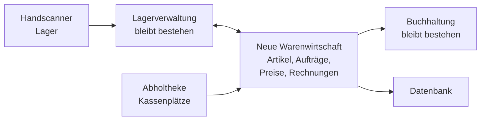

# Übung: Testkonzept für eine Systemanbindung

Gruppenübung &nbsp; Eine neue Warenwirtschaft wird an bestehende Systeme angebunden. Eure Aufgabe ist nicht, sie einzuführen – sondern zu bestimmen, **woran man erkennt, dass sie funktioniert**.

Diese Übung führt zusammen, was auf den Seiten [Testszenarien & Simulation](testszenarien.md) und [Tests durchführen](tests-durchfuehren.md) einzeln steht. Ihr bekommt eine betriebliche Situation, eine Anforderungsliste und ein paar unbequeme Rahmenbedingungen. Daraus entwickelt ihr ein Testkonzept, das man einem Auftraggeber hinlegen könnte.

!!! abstract "Was ihr in dieser Übung tut"
    - eine **Anforderungsliste prüfen** und die Sätze, die keine prüfbare Aussage enthalten, messbar machen
    - daraus **Testfälle ableiten** und ihnen die passende **Testart** zuordnen
    - **Grenzfälle und Fehlerfälle** systematisch suchen statt zu raten
    - **Abnahmekriterien** formulieren, die eine Abnahme möglich machen statt sie zu verhindern
    - **Testumgebung und Testdaten** planen und jede Abweichung zur Produktion bewerten
    - **einen Testfall vollständig ausformulieren**, so dass eine fremde Person ihn ausführen kann

!!! info "Rahmen"
    - **Gruppengröße:** 3 bis 5 Personen
    - **Dauer:** 60 bis 90 Minuten Gruppenarbeit, danach gemeinsame Auswertung
    - **Material:** Papier oder ein geteiltes Dokument. Keine Spezialsoftware, kein Zugang zu einem System nötig
    - **Ergebnis:** ein Testkonzept auf zwei bis vier Seiten, plus ein vollständig ausformulierter Testfall

---

## Die Ausgangslage

Die **Nordlicht Haustechnik GmbH** ist ein Großhandel für Sanitär-, Heizungs- und Klimatechnik. 140 Beschäftigte, ein Zentrallager mit angeschlossener Abholtheke, drei kleinere Abholstandorte. Der Betrieb führt rund 180.000 Artikel und beliefert überwiegend Handwerksbetriebe.

Die bisherige Warenwirtschaft läuft seit vierzehn Jahren. Der Hersteller stellt den Support ein, eine Nachfolgelösung ist ausgewählt und beschafft. **Die neue Warenwirtschaft ersetzt nur die Warenwirtschaft** – Lagerverwaltung und Buchhaltung bleiben, wie sie sind, und werden über Schnittstellen angebunden.

**Die beiden Schnittstellen im Einzelnen:**

| Schnittstelle | Richtung und Verfahren | Fachlicher Inhalt |
|---|---|---|
| **Warenwirtschaft ↔ Lagerverwaltung** | beide Richtungen, ereignisgesteuert über einen Dienst | Freigegebene Aufträge werden als Kommissionieraufträge übergeben; das Lager meldet Entnahmen, Teilmengen und Wareneingänge zurück |
| **Warenwirtschaft → Buchhaltung** | eine Richtung, nächtlicher Dateilauf | Alle Rechnungs- und Gutschriftsbelege des Tages, dazu geänderte Debitorenstammdaten |

**Weitere Rahmenbedingungen aus dem Vorgespräch:**

- Die Altdaten müssen übernommen werden: Artikelstamm, Kundenstamm, offene Posten, Auftragshistorie der letzten drei Jahre.
- Das Lager arbeitet in zwei Schichten, die Abholtheke ist werktags durchgehend besetzt. Ein Stillstand von mehr als vier Stunden bringt die Belieferung der Handwerksbetriebe durcheinander.
- Es gibt eine Testumgebung. Sie hat vier CPU-Kerne, die Produktivumgebung sechzehn. Der Datenbestand auf der Testumgebung stammt aus einem Vorprojekt und umfasst etwa 3.000 Artikel.
- Zwischen Lagernetz und Verwaltungsnetz steht in der Produktion eine Firewall. Auf der Testumgebung liegen beide Seiten im selben Netzsegment.
- Die Buchhaltung besteht auf einem Punkt: **Was in der Buchhaltung ankommt, muss auf den Cent mit der Warenwirtschaft übereinstimmen.**
- Der Geschäftsführer möchte „möglichst schnell umstellen" und hält Tests für „das, was der Anbieter macht".

### Die Anforderungsliste

Aus dem Pflichtenheft sind zehn Anforderungen für die Abnahme markiert. Sie sind unterschiedlich gut formuliert – das ist Absicht.

| Nr. | Anforderung |
|---|---|
| **A-01** | Ein Auftrag mit bis zu 200 Positionen lässt sich erfassen, speichern und freigeben. |
| **A-02** | Die Artikelsuche liefert bei 45 gleichzeitigen Nutzern in 95 % der Fälle in unter 1,5 Sekunden ein Ergebnis, bezogen auf den vollständigen Artikelstamm. |
| **A-03** | Ein freigegebener Auftrag steht spätestens 2 Minuten später als Kommissionierauftrag in der Lagerverwaltung bereit. |
| **A-04** | Wird eine Position nur teilweise entnommen, führt die Warenwirtschaft den Auftrag mit korrekter Restmenge weiter. |
| **A-05** | Alle Rechnungs- und Gutschriftsbelege eines Tages – bis zu 3.500 Stück – werden im nächtlichen Lauf an die Buchhaltung übergeben. Der Lauf ist bis 5:30 Uhr abgeschlossen. |
| **A-06** | Die Summe der übergebenen Belegwerte stimmt mit der Tagesauswertung der Warenwirtschaft überein. |
| **A-07** | Beschäftigte mit der Rolle „Lager" können weder Einkaufspreise noch Buchhaltungsbelege einsehen. |
| **A-08** | Das System soll ausfallsicher sein. |
| **A-09** | Die Bedienung soll für die Lagermitarbeitenden einfach sein. |
| **A-10** | Die Datenübernahme aus dem Altsystem muss vollständig sein. |

---

## Eure Aufgabe

Erstellt ein **Testkonzept** für dieses Vorhaben. Es besteht aus sechs Teilen. Arbeitet sie der Reihe nach ab – die späteren Teile bauen auf den früheren auf.

!!! tip "Zeitvorschlag für 90 Minuten"
    Etwa 20 Minuten für Teil 1 und 2, 15 Minuten für Teil 3, 10 Minuten für Teil 4, 15 Minuten für Teil 5, 20 Minuten für Teil 6, 10 Minuten zum Ordnen der Ergebnisse. Bei 60 Minuten kürzt ihr Teil 3 auf vier Fälle und Teil 5 auf die Tabelle der Abweichungen.

### Rollen in der Gruppe

Verteilt die Rollen zu Beginn. Jede Rolle sieht andere Risiken – genau darin liegt der Ertrag der Gruppenarbeit. Bei drei Personen fasst ihr zusammen; die Testleitung sollte immer besetzt sein.

| Rolle | Blickwinkel und Aufgabe |
|---|---|
| **Testleitung** | hält die Reihenfolge ein, führt das Ergebnisdokument, achtet auf die Zeit |
| **Fachvertretung Lager** | kennt Schichtbetrieb, Teilmengen, Scanner, kaputte Etiketten – findet die praktischen Fehlerfälle |
| **Fachvertretung Buchhaltung** | denkt in Summen, Abschlüssen und Nachvollziehbarkeit – besteht auf Konsistenz |
| **IT-Betrieb** | verantwortet Umgebungen, Sicherung, Wiederanlauf, Netzsegmente |
| **Auftraggeberseite** | vertritt Abnahme, Termine und Datenschutz – fragt: „Wovon hängt unsere Unterschrift ab?" |

---

### Teil 1 – Anforderungen prüfbar machen

1. Geht die zehn Anforderungen durch und entscheidet für jede: **Lässt sich daraus ein Testfall ableiten – ja oder nein?**
2. Für jede Anforderung, bei der die Antwort Nein lautet: **Formuliert sie so um, dass am Ende jemand mit Ja oder Nein beantworten kann, ob sie erfüllt ist.** Erfindet dabei plausible Zahlen – es geht um die Bauform, nicht um die konkrete Höhe.
3. Notiert bei jeder Umformulierung, **welche Angabe gefehlt hat**.

### Teil 2 – Testfälle ableiten und Testarten zuordnen

1. Leitet aus der bereinigten Anforderungsliste **mindestens zehn Testfälle** ab. Für diesen Teil genügt je Testfall eine Zeile: Bezeichner, Kurzbeschreibung, zugehörige Anforderung.
2. Ordnet jedem Testfall eine **Testart** zu: Funktions-, Integrations-, System-, Abnahme-, Last-, Ausfall-, Wiederherstellungs- oder Sicherheitstest.
3. Benennt **mindestens eine Anforderung, die mehr als eine Testart braucht**, und begründet warum.
4. Prüft am Ende: **Gibt es eine Anforderung ohne Testfall?** Wenn ja, ist das ein Befund und gehört ins Konzept.

### Teil 3 – Grenzfälle und Fehlerfälle

Findet **mindestens sechs** Grenz- oder Fehlerfälle, die in der Anforderungsliste nicht vorkommen, aber im Betrieb auftreten werden. Mindestens zwei davon müssen den **Ausfall einer Komponente** oder eine **Überlastsituation** betreffen.

Notiert je Fall drei Dinge: **die Situation**, **was ihr prüft** und **was das System tun soll**. Der dritte Punkt ist der wichtigste – und der, den Gruppen am häufigsten überspringen.

### Teil 4 – Abnahmekriterien

Formuliert **vier bis fünf Abnahmekriterien** für dieses Vorhaben. Sie sollen die Bereiche Funktionsumfang, Fehlerlage, Leistungswerte und Nachweise abdecken.

Legt dazu fest, **welche Fehlerklassen ihr verwendet** und was jede Klasse bedeutet. Achtet darauf, dass eure Kriterien eine Abnahme **ermöglichen** – ein Kriterium, das nie erfüllbar ist, ist kein Kriterium.

### Teil 5 – Testumgebung und Testdaten

1. Legt fest, **welche Umgebungen** ihr braucht und wofür jede zuständig ist.
2. Stellt in einer Tabelle die **bekannten Abweichungen** der vorhandenen Testumgebung zur Produktion zusammen. Bewertet je Abweichung: **vertretbar oder nicht – und was macht sie mit der Aussagekraft?**
3. Entscheidet, **woher die Testdaten kommen**, in welchem Umfang, und was beim Umgang mit produktiven Daten zu beachten ist.
4. Benennt **eine Aussage, die ihr auf dieser Testumgebung nicht treffen könnt.** Was schlagt ihr stattdessen vor?

### Teil 6 – Ein Testfall in voller Länge

Wählt **einen** Testfall aus Teil 2 – am besten einen an einer Schnittstelle – und formuliert ihn vollständig nach der Vorlage aus. Maßstab: **Eine Person, die bei eurer Diskussion nicht dabei war, muss ihn ohne Rückfragen ausführen können.**

!!! example "Testfall-Vorlage"
    | Feld | Inhalt |
    |---|---|
    | **Bezeichner** | Kennung und Kurztitel, z. B. `TF-INT-004 – Belegübergabe an die Buchhaltung, Tagesmenge` |
    | **Zugehörige Anforderung** | Nummer aus der Liste |
    | **Testart** | Funktions-, Integrations-, System-, Abnahme-, Last-, Ausfall-, Wiederherstellungs- oder Sicherheitstest |
    | **Umgebung und Stand** | welche Umgebung, welcher Versionsstand, welcher Datenbestand |
    | **Vorbedingung** | Zustand vor dem Test: Daten, Dienste, Anmeldung, Berechtigungen, was zurückgesetzt wurde |
    | **Eingabe / Testdaten** | konkrete Werte – Nummern, Mengen, Beträge; keine Platzhalter wie „ein Beleg" |
    | **Schritte** | nummeriert, in Ausführungsreihenfolge |
    | **Erwartetes Ergebnis** | der Sollwert, mit Zahl, Zustand oder Meldungstext – **vor** der Durchführung festgelegt |
    | **Nachweis** | was als Beleg gesichert wird: Protokollauszug, Summenabfrage, Bildschirmfoto |
    | **Tatsächliches Ergebnis** | bleibt leer, wird bei der Durchführung ausgefüllt |
    | **Status** | bestanden / fehlgeschlagen / blockiert / nicht durchgeführt |

### Präsentation

Bereitet eine Vorstellung von fünf bis acht Minuten vor. Zeigt daraus:

- die drei Anforderungen, die ihr umformulieren musstet – und wie
- eure zwei interessantesten Grenz- oder Fehlerfälle
- eure Abnahmekriterien
- den vollständig ausformulierten Testfall
- die eine Aussage, die eure Testumgebung **nicht** hergibt

---

## Hilfekarten

!!! tip "Spielregel"
    Nutzt die Karten **nur**, wenn ihr wirklich feststeckt – und immer erst nach zehn Minuten eigener Diskussion. Jede Karte gibt einen Denkanstoß, keine Lösung.

??? info "Hilfekarte 1 – Wir wissen nicht, ob eine Anforderung prüfbar ist"
    Nutzt die Prüffrage: **Könnten zwei Personen unabhängig voneinander zum selben Ergebnis kommen, ob die Anforderung erfüllt ist?**

    Eine prüfbare Anforderung hat vier Teile:

    | Teil | Frage |
    |---|---|
    | Wer oder was | Welcher Teil des Systems ist gemeint? |
    | Messgröße | Was genau wird gemessen oder beobachtet? |
    | Zielwert | Welcher Wert gilt als erfüllt? |
    | Bezugsbedingung | Unter welchen Umständen? Wie viele Nutzer, wie viele Daten, welche Zeit? |

    Der vierte Teil fehlt am häufigsten – und er entscheidet. „Antwortzeit unter 1,5 Sekunden" ist bei einem Nutzer auf einem leeren System etwas völlig anderes als bei 45 Nutzern auf 180.000 Artikeln.

    Wörter, die fast immer ein Warnsignal sind: *zuverlässig, ausfallsicher, einfach, benutzerfreundlich, zeitnah, vollständig, performant, modern*.

??? info "Hilfekarte 2 – Wir wissen nicht, welche Testart wohin gehört"
    Fragt nicht „Was ist das für ein Test?", sondern **„Welche Frage beantworte ich damit?"**

    | Die Frage lautet … | … dann ist es ein |
    |---|---|
    | Tut diese eine Funktion, was sie soll? | Funktionstest |
    | Arbeiten zwei Systeme über ihre Schnittstelle richtig zusammen? | Integrationstest |
    | Läuft ein kompletter fachlicher Vorgang über alle Systeme hinweg? | Systemtest |
    | Akzeptiert der Auftraggeber das Ergebnis? | Abnahmetest |
    | Hält es die zugesagte Menge oder Nutzerzahl aus? | Lasttest |
    | Was passiert, wenn eine Komponente wegfällt? | Ausfalltest |
    | Kommen Daten und Dienst nach einem Verlust rechtzeitig zurück? | Wiederherstellungstest |
    | Wird verhindert, was verhindert werden soll – und wird es protokolliert? | Sicherheitstest |

    Eine Anforderung kann mehrere Testarten brauchen. Schaut euch A-05 an: Der Lauf muss **funktionieren** (Funktionstest mit wenigen Belegen), er muss die **Schnittstelle korrekt bedienen** (Integrationstest) und er muss **die Tagesmenge im Zeitfenster schaffen** (Lasttest). Drei Fragen, drei Tests.

??? info "Hilfekarte 3 – Uns fallen keine Grenz- und Fehlerfälle ein"
    Geht die Anforderungen durch und stellt zu jeder vier Fragen:

    1. **Was ist der größte erlaubte Wert – und was passiert direkt darüber?** (200 Positionen, 3.500 Belege, 45 Nutzer)
    2. **Was ist der kleinste denkbare Wert?** (ein Auftrag mit 0 Positionen, ein Beleg über 0,00 Euro, eine Entnahme von 0 Stück)
    3. **Was passiert, wenn mittendrin etwas abbricht?** (Verbindung reißt während der Belegübergabe – wie viel ist übertragen, was steht wo?)
    4. **Was passiert, wenn etwas zweimal kommt?** (derselbe Beleg zweimal übergeben, derselbe Scan zweimal ausgelöst)

    Zwei zusätzliche Quellen für diesen Fall:

    - **Der Kalender des Betriebs.** Wann treffen sich Dinge, die sich sonst aus dem Weg gehen? Monatsabschluss und nächtlicher Lauf. Inventur und Schichtwechsel. Jahreswechsel mit doppelter Belegmenge.
    - **Die Wege, die nicht durchs Menü führen.** Rechteprüfungen scheitern selten am ausgeblendeten Menüpunkt, sondern am direkten Aufruf, an der Suche und am Bericht.

??? info "Hilfekarte 4 – Unsere Abnahmekriterien klingen wie Testfälle"
    Der Unterschied liegt in der Ebene:

    - Ein **Testfall** prüft **einen** Sachverhalt und endet mit bestanden oder fehlgeschlagen.
    - Ein **Abnahmekriterium** ist eine Aussage über den **Gesamtstand** der Lieferung.

    Fangt eure Kriterien mit einer dieser vier Formulierungen an:

    - „**Alle** als abnahmerelevant gekennzeichneten Anforderungen sind durch …"
    - „**Es sind keine** offenen Fehler der Klasse … und höchstens … der Klasse …"
    - „Die vereinbarten **Werte für** … sind unter den Bedingungen … nachgewiesen."
    - „**Folgende Nachweise liegen vor:** …"

    Und prüft zum Schluss: **Kann dieses Kriterium überhaupt erfüllt werden?** „Das System ist fehlerfrei" kann es nicht – in jedem System findet sich ein kosmetischer Mangel. Solche Kriterien führen dazu, dass entweder nie abgenommen wird oder die Kriterien stillschweigend ignoriert werden.

??? info "Hilfekarte 5 – Was muss an der Testumgebung wirklich gleich sein?"
    Fragt bei jeder Abweichung: **Welche Aussage kann ich wegen dieser Abweichung nicht mehr treffen?**

    | Abweichung | Aussage, die dadurch verlorengeht |
    |---|---|
    | weniger Kerne, schwächerer Speicher | jede Aussage über Antwortzeiten und Durchsatz |
    | 3.000 statt 180.000 Artikel | Antwortzeiten, Laufzeit von Auswertungen, Sicherungsfenster |
    | keine Firewall zwischen den Segmenten | ob die Schnittstelle im Produktivnetz überhaupt durchkommt |
    | anderer Versionsstand | praktisch alles – dann prüft ihr ein anderes System |
    | Gegenstelle durch einen Simulator ersetzt | wie die echte Gegenstelle reagiert |

    Die Zeile mit der Firewall ist die gefährlichste: Ein Integrationstest, der im selben Netzsegment läuft, sagt über die Produktion nichts aus – und der Fehler fällt dann am Umstellungswochenende auf.

    **Und Hochrechnen zählt nicht.** „Vier Kerne im Test, sechzehn in der Produktion, also mal vier" unterstellt lineare Skalierung. Die gibt es praktisch nie, weil die Engpässe woanders sitzen: Verbindungsgrenzen, Sperren, Ein- und Ausgabe. Genau diese Effekte wolltet ihr finden.

??? info "Hilfekarte 6 – Unser Testfall ist noch zu ungenau"
    Drei Prüfungen, die fast immer etwas finden:

    1. **Streicht alle unbestimmten Artikel.** Steht irgendwo „ein Beleg", „ein Artikel", „ein Kunde"? Ersetzt sie durch konkrete Nummern, Mengen und Beträge. Sonst liefert jede Wiederholung ein anderes Ergebnis.
    2. **Lest das erwartete Ergebnis laut vor.** Enthält es eine Zahl, einen Zustand oder einen Meldungstext? „Der Beleg wird korrekt übertragen" ist kein erwartetes Ergebnis – „In der Buchhaltung stehen 3.500 Belege mit einer Summe von … Euro, Status ,gebucht', keine Fehlerdatei" schon.
    3. **Prüft die Vorbedingung auf Vollständigkeit.** Wenn jemand euren Testfall morgen ausführt: Weiß er, welcher Datenbestand geladen sein muss, welche Dienste laufen, mit welchem Konto er sich anmeldet und was **vorher zurückgesetzt** wurde?

    Und ein vierter Punkt, der oft fehlt: **Was wird als Nachweis gesichert?** Ohne Nachweis existiert das Ergebnis später nur als Erinnerung.

---

## Musterlösung

!!! warning "Erst selbst arbeiten"
    Die Musterlösung ist ausführlicher, als eine Gruppe es in 90 Minuten schafft – das ist Absicht. Sie ist für die gemeinsame Auswertung gedacht, nicht als Messlatte. Eure Lösung ist gut, wenn sie **begründet** ist, nicht wenn sie identisch ist.

??? tip "Musterlösung Teil 1 – Anforderungen prüfbar machen"
    **Die Einschätzung im Überblick**

    | Nr. | Prüfbar? | Warum |
    |---|---|---|
    | A-01 | ja | Zahl (200 Positionen), klare Aktionen, eindeutiges Ergebnis |
    | A-02 | ja | Musterbeispiel: Messgröße, Zielwert, Perzentil, Nutzerzahl, Datenbezug |
    | A-03 | ja | Zeitgrenze und beobachtbarer Zustand („steht bereit") |
    | A-04 | ja | fachlich eindeutig; „korrekte Restmenge" ist im Testfall ausrechenbar |
    | A-05 | ja | Menge, Zeitgrenze, Umfang – sehr gut formuliert |
    | A-06 | ja | Konsistenzaussage, durch Summenvergleich prüfbar |
    | A-07 | ja | negative Anforderung, aber klar prüfbar – und wichtig |
    | A-08 | **nein** | „ausfallsicher" enthält weder Messgröße noch Zielwert |
    | A-09 | **nein** | „einfach" ist eine Empfindung, kein Kriterium |
    | A-10 | **nein** | sieht prüfbar aus, ist es aber nicht: „vollständig" ist nirgends definiert |

    ---

    **A-08 – „Das System soll ausfallsicher sein."**

    Was fehlt: **alles außer der Absicht.** Weder ist gesagt, gegen welchen Ausfall geschützt werden soll, noch wie lange ein Ausfall dauern darf, noch wie viel Datenverlust hinnehmbar ist. „Ausfallsicher" ist außerdem ein Bündel: Es steckt Redundanz **und** Wiederanlauf **und** Datensicherheit darin.

    Sauber sind daraus drei Anforderungen:

    - **A-08a:** Fällt einer der beiden Anwendungsknoten aus, übernimmt der zweite innerhalb von 60 Sekunden. Angemeldete Nutzer können nach der Umschaltung weiterarbeiten; bereits gespeicherte Auftragspositionen gehen nicht verloren.
    - **A-08b:** Nach einem Totalausfall des Warenwirtschaftsservers ist die Auftragserfassung in **höchstens 4 Stunden** wieder verfügbar, gemessen von der Feststellung des Ausfalls bis zur fachlichen Freigabe. *(RTO)*
    - **A-08c:** Bei einem solchen Ausfall gehen **höchstens die Daten der letzten 15 Minuten** verloren. *(RPO)*

    Die 4 Stunden stammen nicht aus der IT, sondern aus der Ausgangslage: Ein Stillstand von mehr als vier Stunden bringt die Belieferung durcheinander. Genau so gehört eine Zeitvorgabe begründet – sie kommt aus dem Fachbereich, nicht aus dem Bauchgefühl.

    ---

    **A-09 – „Die Bedienung soll für die Lagermitarbeitenden einfach sein."**

    Was fehlt: eine **beobachtbare Handlung**. Man kann nicht messen, ob etwas „einfach" ist – aber man kann messen, ob jemand eine bestimmte Aufgabe nach einer bestimmten Einweisung selbstständig schafft.

    - **A-09 neu:** Nach einer Einweisung von 45 Minuten erfasst eine Lagerkraft ohne Vorkenntnisse einen Wareneingang mit Teilmenge selbstständig und ohne Rückfrage. Geprüft mit fünf Personen; mindestens vier müssen es schaffen. Die benötigte Zeit wird protokolliert.

    Das wirkt umständlich und ist trotzdem die einzige ehrliche Übersetzung: Der Satz beschreibt jetzt ein Ereignis, das eintritt oder nicht. Wer den Aufwand scheut, sollte die Anforderung streichen – eine nicht prüfbare Anforderung in der Abnahmeliste hilft niemandem und erzeugt am Abnahmetag Streit.

    ---

    **A-10 – „Die Datenübernahme aus dem Altsystem muss vollständig sein."**

    Das ist die interessanteste der drei. Sie **klingt** prüfbar, weil „vollständig" nach einem Ja-oder-Nein aussieht. Aber niemand weiß, woran man Vollständigkeit erkennt: an der Zahl der Datensätze? An den Feldern je Datensatz? An den Beträgen? Alle drei können auseinanderlaufen – ein Datensatz kann mitgekommen sein und trotzdem halb leer.

    - **A-10 neu:** Nach der Datenübernahme stimmen die folgenden Werte mit dem Altsystem überein: Anzahl Artikelstammsätze (Soll: 180.412), Anzahl Kundenstammsätze (Soll: 8.640), Anzahl offener Posten (Soll: 4.117) und deren Summe (Soll: 3.284.596,15 EUR). Zusätzlich stimmt bei einer Stichprobe von 50 zufällig gezogenen Artikeln und 25 Kunden jedes Pflichtfeld überein. Abweichungen werden einzeln aufgelistet und begründet.

    Der **Summenabgleich** ist dabei wichtiger als die Anzahl: Zahlen können stimmen, während Beträge falsch übernommen wurden – etwa durch eine andere Rundung, ein anderes Vorzeichen bei Gutschriften oder ein vertauschtes Dezimaltrennzeichen. Und die **Stichprobe** ergänzt beides um die Feldebene, die keine Summe abdeckt.

    ---

    **Was in allen drei Fällen gefehlt hat**

    | Anforderung | Fehlende Angabe |
    |---|---|
    | A-08 | Messgröße und Zielwert – dazu war der Satz ein Bündel aus drei Anforderungen |
    | A-09 | eine beobachtbare Handlung statt einer Empfindung |
    | A-10 | die Definition des Prüfmaßstabs: woran erkennt man „vollständig"? |

    Das ist das Muster, das ihr mitnehmen solltet: Nicht prüfbare Anforderungen fallen in genau diese drei Sorten – **ohne Zahl**, **ohne beobachtbares Ereignis**, **ohne definierten Maßstab**.

??? tip "Musterlösung Teil 2 – Testfälle und Testarten"
    **Testfälle im Überblick** (eine Zeile je Fall; die Bezeichner sind nach Testart gruppiert)

    | Bezeichner | Kurzbeschreibung | Anforderung | Testart |
    |---|---|---|---|
    | TF-FKT-001 | Auftrag mit 200 Positionen erfassen, speichern, freigeben | A-01 | Funktionstest |
    | TF-FKT-002 | Teilentnahme buchen, Restmenge im Auftrag prüfen | A-04 | Funktionstest |
    | TF-FKT-003 | Wareneingang mit Teilmenge durch eingewiesene Person | A-09 | Funktions-/Abnahmetest |
    | TF-INT-001 | Auftrag freigeben, Ankunft als Kommissionierauftrag im LVS prüfen | A-03 | Integrationstest |
    | TF-INT-002 | Entnahmemeldung vom LVS zurück in die Warenwirtschaft | A-03, A-04 | Integrationstest |
    | TF-INT-003 | Nächtlicher Belegübergabelauf mit 20 Belegen, Formatprüfung | A-05 | Integrationstest |
    | TF-INT-004 | Belegübergabe mit voller Tagesmenge (3.500 Belege) im Zeitfenster | A-05 | Lasttest |
    | TF-INT-005 | Summenabgleich Warenwirtschaft gegen Buchhaltung nach dem Lauf | A-06 | Integrations-/Systemtest |
    | TF-SYS-001 | Kompletter Durchlauf: Auftrag → Kommissionierung → Teillieferung → Rechnung → Übergabe an die Buchhaltung | A-01, A-03, A-04, A-05, A-06 | Systemtest |
    | TF-LAST-001 | Artikelsuche mit 45 gleichzeitigen Nutzern auf vollem Artikelstamm | A-02 | Lasttest |
    | TF-SEC-001 | Konto mit Rolle „Lager": Einkaufspreise über Menü, Direktaufruf, Suche und Bericht | A-07 | Sicherheitstest |
    | TF-SEC-002 | Konto mit Rolle „Lager": Zugriff auf Buchhaltungsbelege, inklusive Protokollprüfung | A-07 | Sicherheitstest |
    | TF-AUS-001 | Anwendungsknoten hart abschalten, Übernahme und Umschaltdauer messen | A-08a | Ausfalltest |
    | TF-AUS-002 | Zurückschalten auf den wiederhergestellten Knoten | A-08a | Ausfalltest |
    | TF-WHT-001 | Totalausfall: Wiederherstellung auf Ersatzhardware, RTO und RPO messen | A-08b, A-08c | Wiederherstellungstest |
    | TF-MIG-001 | Datenübernahme: Anzahlen, Summe der offenen Posten, Stichprobe | A-10 | Systemtest (Migrationsprüfung) |

    ---

    **Anforderungen, die mehrere Testarten brauchen**

    **A-05** ist das deutlichste Beispiel und braucht drei:

    - **Funktioniert der Lauf überhaupt?** Ein kleiner Lauf mit 20 Belegen prüft Format, Zeichenkodierung, Dateiablage und Rückmeldung. Er ist schnell und findet die meisten Fehler.
    - **Arbeitet die Schnittstelle fachlich korrekt?** Sonderfälle wie Gutschriften, Storni und Belege mit Fremdwährung oder abweichendem Steuersatz gehören dazu.
    - **Schafft der Lauf die Tagesmenge im Zeitfenster?** Das ist eine reine Mengenfrage und damit ein Lasttest – und der einzige, der die Zusage „bis 5:30 Uhr" belegt.

    Wer nur den ersten Test fährt, hat eine funktionierende Schnittstelle und keine belastbare Zusage.

    **A-07** braucht ebenfalls mehrere Zugänge, aber innerhalb einer Testart: Menü, Direktaufruf, Suchfunktion und Berichtswesen. Rechteprüfungen scheitern fast nie am ausgeblendeten Menüpunkt.

    **A-08** zerfällt nach der Umformulierung ohnehin in Ausfalltest (A-08a) und Wiederherstellungstest (A-08b, A-08c) – zwei verschiedene Ereignisse mit zwei verschiedenen Zielwerten.

    ---

    **Der Befund: eine Anforderung ohne Testfall**

    Wer die Liste sauber durchgeht, stellt fest: **Die Abholtheke kommt in keiner Anforderung vor.** Sie steht in der Ausgangslage – drei Standorte, werktags durchgehend besetzt –, aber im Pflichtenheft-Auszug taucht sie nicht auf. Das ist genau der Befund, den ein Testkonzept sichtbar machen soll: Entweder ist die Kasse nicht Teil des Vorhabens, dann gehört das ausdrücklich unter „nicht Gegenstand" – oder sie ist es, dann fehlen Anforderungen.

    Diesen Punkt zu **benennen** ist wertvoller als zehn weitere Testfälle. Ein Testkonzept, das eine Lücke im Auftrag findet, hat sich bereits bezahlt gemacht.

??? tip "Musterlösung Teil 3 – Grenzfälle und Fehlerfälle"
    | # | Situation | Was geprüft wird | Was das System tun soll |
    |---|---|---|---|
    | 1 | **Auftrag mit 201 Positionen** – direkt über der Grenze aus A-01 | Erfassung der 201. Position | Eindeutige, fachliche Meldung; die ersten 200 Positionen bleiben erhalten und der Auftrag bleibt speicherbar. Kein Abbruch, kein Datenverlust |
    | 2 | **Auftrag ohne Position** wird freigegeben | Freigabe eines leeren Auftrags | Freigabe wird abgelehnt; **kein** leerer Kommissionierauftrag im Lager – sonst läuft jemand eine leere Runde |
    | 3 | **Verbindung zum Lager fällt während der Übergabe aus** | Auftrag freigeben, Verbindung während der Übertragung trennen | Der Auftrag bleibt in der Warenwirtschaft im Zustand „Übergabe offen", wird nach Rückkehr der Verbindung automatisch erneut übergeben – **und nicht doppelt**. Der Zustand ist im Protokoll sichtbar |
    | 4 | **Derselbe Beleg wird zweimal übergeben** – etwa nach einem abgebrochenen nächtlichen Lauf, der neu gestartet wird | Zweiter Lauf mit derselben Belegmenge | Die Buchhaltung erkennt die Belegnummern als bereits vorhanden und weist sie ab. Doppelbuchungen sind der teuerste Fehler dieser Schnittstelle |
    | 5 | **Nächtlicher Lauf mit doppelter Menge** – 7.000 Belege am Monatsabschluss | Laufzeit bei doppelter Belegmenge | Der Lauf läuft durch. Wird das Zeitfenster überschritten, muss das **gemeldet** werden, nicht stillschweigend in die Arbeitszeit hineinlaufen |
    | 6 | **Ausfall eines Anwendungsknotens während einer Erfassung** | Knoten hart abschalten, während ein Auftrag mit 80 Positionen erfasst wird | Übernahme in unter 60 Sekunden. Gespeicherte Positionen bleiben erhalten; die nicht gespeicherten sind eindeutig verloren – **nicht halb** |
    | 7 | **Speicher der Sicherung läuft voll** | Sicherungslauf mit zu wenig freiem Platz | Der abgebrochene Sicherungslauf wird als **unbrauchbar gekennzeichnet** und gemeldet. Eine unvollständige Sicherung, die als gültig in der Liste steht, ist gefährlicher als gar keine |
    | 8 | **Beleg über 0,00 Euro** – etwa eine Gutschrift, die einen Beleg vollständig ausgleicht | Übergabe an die Buchhaltung | Wird übergeben und korrekt verarbeitet, nicht als Fehler abgewiesen und nicht stillschweigend übersprungen |
    | 9 | **Artikel mit Sonderzeichen und langer Bezeichnung** aus dem Altbestand | Übernahme, Anzeige, Etikettendruck, Übergabe an die Buchhaltung | Zeichen bleiben über alle Systemgrenzen erhalten. Kodierungsfehler zeigen sich fast immer erst an der Schnittstelle |
    | 10 | **Lagerkonto ruft eine Einkaufspreis-Seite direkt auf**, ohne Menü | Direktaufruf, Suchfunktion, Bericht | Zugriff wird verweigert und der Versuch protokolliert |

    ---

    **Warum die dritte Spalte die wichtigste ist**

    Viele Gruppen kommen auf die Situationen. Was regelmäßig fehlt, ist der **Sollzustand danach**. „Es bricht ab" ist kein Testergebnis – die Frage ist, **wie** es abbricht:

    - Bricht es sauber ab und hinterlässt den Zustand von vorher? Gutes Verhalten.
    - Bricht es ab und hinterlässt die Hälfte gebucht? Ein Datenproblem, das oft erst Wochen später auffällt und von Hand nachgearbeitet werden muss.

    Genau deshalb gehört zu jedem Fehlerfall ein zweiter Prüfschritt: **Zustand nach dem Fehler kontrollieren.** Bei Fall 3 und Fall 4 ist das der eigentliche Testinhalt.

    **Die beiden lehrreichsten Fälle** dieser Liste sind Nummer 4 und Nummer 7. Fall 4, weil doppelte Buchungen im Rechnungswesen mit Abstand am teuersten sind und weil ein neu gestarteter Lauf nach einem Abbruch der Normalfall ist, nicht die Ausnahme. Fall 7, weil er eine Prüfung beschreibt, die niemand fordert – aber eine als gültig geführte, tatsächlich unbrauchbare Sicherung erzeugt genau die falsche Sicherheit, die im Ernstfall den Schaden verdoppelt.

??? tip "Musterlösung Teil 4 – Abnahmekriterien und Fehlerklassen"
    **Fehlerklassen für dieses Vorhaben**

    | Klasse | Definition für Nordlicht | Beispiel |
    |---|---|---|
    | **1 – kritisch** | Auftragsabwicklung oder Belegübergabe sind nicht möglich, oder es entstehen falsche beziehungsweise doppelte Buchungen. Keine zumutbare Umgehung | Belegübergabe bricht ab und hinterlässt einen Teil gebucht |
    | **2 – schwer** | Eine wesentliche Funktion ist gestört, eine Umgehung existiert, ist aber aufwendig | Sammelrechnungen nur einzeln druckbar |
    | **3 – leicht** | Funktion eingeschränkt, Umgehung zumutbar | Sortierung einer Übersicht lässt sich nicht speichern |
    | **4 – kosmetisch** | Darstellung oder Text, keine fachliche Auswirkung | Beschriftung abgeschnitten |

    Zwei Festlegungen gehören ausdrücklich dazu, weil sie sonst später bestritten werden: **Die Umgehungsmöglichkeit ist Teil der Einstufung** – derselbe technische Fehler ist Klasse 1 ohne und Klasse 3 mit zumutbarem zweiten Weg. Und: **Alles, was zu falschen oder doppelten Buchungen führt, ist immer Klasse 1**, unabhängig von der Häufigkeit. Ein Fehler, der stillschweigend falsche Zahlen erzeugt, ist gefährlicher als ein Absturz.

    ---

    **Die Abnahmekriterien**

    | # | Bereich | Kriterium |
    |---|---|---|
    | **AK-1** | Funktionsumfang | Alle als abnahmerelevant gekennzeichneten Anforderungen (A-01 bis A-10 in der bereinigten Fassung) sind durch mindestens einen **bestandenen und protokollierten** Testfall belegt. Blockierte oder nicht durchgeführte Testfälle sind einzeln aufgeführt und bewertet. |
    | **AK-2** | Fehlerlage | Es sind **keine offenen Fehler der Klasse 1** vorhanden und **höchstens drei der Klasse 2**, jeweils mit vereinbartem Behebungstermin und benannter verantwortlicher Person. Fehler der Klassen 3 und 4 stehen auf der Mängelliste. |
    | **AK-3** | Leistungswerte | Die Werte aus A-02 (Antwortzeit bei 45 Nutzern), A-03 (2 Minuten bis zum Kommissionierauftrag) und A-05 (3.500 Belege bis 5:30 Uhr) sind **auf der Abnahmeumgebung in Produktionsdimensionierung** nachgewiesen. |
    | **AK-4** | Datenübernahme und Konsistenz | Die Prüfwerte aus A-10 stimmen überein; nach einem vollständigen Testtag stimmt der Summenabgleich zwischen Warenwirtschaft und Buchhaltung **auf den Cent**. Abweichungen sind einzeln erklärt. |
    | **AK-5** | Nachweise | Testprotokolle, Testbericht, Betriebs- und Wiederanlaufdokumentation liegen vor. Der Wiederherstellungstest ist durchgeführt und protokolliert. Die Einweisung der Lager- und Thekenkräfte ist erfolgt und bestätigt. |

    ---

    **Warum diese Kriterien so und nicht anders**

    **AK-1 verlangt „bestanden und protokolliert".** Ohne das Wort „protokolliert" reicht die Behauptung, es sei geprüft worden. Und der Zusatz zu blockierten Testfällen verhindert den häufigsten Trick am Abnahmetag: Was nicht geprüft wurde, verschwindet aus der Statistik.

    **AK-2 sagt nicht „fehlerfrei".** Das ist keine Nachlässigkeit, sondern Notwendigkeit. Fehlerfreiheit lässt sich nicht nachweisen – Testen zeigt die Anwesenheit von Fehlern, nicht ihre Abwesenheit. Ein Kriterium, das grundsätzlich nicht überprüfbar ist, wird entweder ignoriert oder blockiert jede Abnahme. Die Schwelle „höchstens drei der Klasse 2 mit Termin" ist verhandelbar; die Struktur ist es nicht.

    **AK-3 nennt ausdrücklich die Umgebung.** Ohne diesen Zusatz könnte der Nachweis auf der vorhandenen Testumgebung mit vier Kernen und 3.000 Artikeln geführt werden – und wäre wertlos. Das ist der Punkt, an dem Teil 4 und Teil 5 dieser Übung zusammenhängen.

    **AK-4 greift die Forderung der Buchhaltung auf.** „Auf den Cent" ist eine harte Formulierung und genau richtig: Bei Beträgen gibt es kein „ungefähr". Der Zusatz „nach einem vollständigen Testtag" ist wichtig, weil ein Abgleich über drei Belege nichts beweist.

    **AK-5 fordert Nachweise, keine Zusagen.** Besonders der durchgeführte Wiederherstellungstest gehört hierher: Er ist der Test, der am häufigsten im Plan steht und am seltensten stattfindet – und ohne Abnahmekriterium fällt er als Erstes aus, wenn der Termin drückt.

    ---

    !!! note "Der Geschäftsführer aus der Ausgangslage"
        Er möchte schnell umstellen und hält Tests für Anbietersache. Diese fünf Kriterien sind die sachliche Antwort darauf – nicht als Widerspruch, sondern als Angebot: Sie sagen genau, wovon die Unterschrift abhängt, und machen den Umfang planbar. Ein Testkonzept ist auch ein Instrument, um über den Zeitplan zu verhandeln, ohne über Bauchgefühle zu streiten.

??? tip "Musterlösung Teil 5 – Testumgebung und Testdaten"
    **Welche Umgebungen gebraucht werden**

    | Umgebung | Wofür | Anmerkung für dieses Vorhaben |
    |---|---|---|
    | **Test** | Funktionstests, erste Schnittstellenläufe mit kleinen Mengen, Einarbeitung der Schlüsselanwender | Die vorhandene Umgebung reicht dafür aus |
    | **Abnahme** | Systemtest, Lasttests (A-02, A-05), Sicherheitstest, Abnahmetest, Migrationsprüfung | **Muss neu geschaffen werden** – in Produktionsdimensionierung, mit Firewall zwischen den Segmenten und vollem Datenbestand |
    | **Produktion** | Nur zwei Prüfungen gehören zwingend hierher: der Wiederherstellungstest auf Ersatzhardware und die Pfadprüfung durch die echte Firewall | Beide nur angekündigt, in einem vereinbarten Fenster, mit beschriebenem Rückweg und einer Person, die den Abbruch entscheiden darf |
    | *(Entwicklung)* | liegt beim Anbieter, nicht in eurer Verantwortung | im Konzept erwähnen, nicht planen |

    ---

    **Die Abweichungen der vorhandenen Testumgebung**

    | Abweichung | Vertretbar? | Wirkung auf die Aussagekraft |
    |---|---|---|
    | 4 statt 16 CPU-Kerne | für Funktionstests ja, für Leistungsaussagen **nein** | A-02 und A-05 lassen sich hier nicht nachweisen. Hochrechnen ist keine Messung – Engpässe sitzen meist nicht bei der CPU, sondern bei Verbindungsgrenzen, Sperren und Ein-/Ausgabe |
    | 3.000 statt 180.000 Artikel | **nein** für alles Mengenabhängige | Antwortzeiten, Laufzeiten von Auswertungen, Sicherungsfenster und die Migrationsprüfung sind so nicht bewertbar |
    | keine Firewall zwischen Lager- und Verwaltungsnetz | **nein** | Der Integrationstest zum Lager sagt nichts über die Produktion. Genau an diesem Übergang scheitern Anbindungen – und der Fehler fiele erst am Umstellungswochenende auf |
    | Buchhaltung nur als Simulator vorhanden | begrenzt | Prüft eure Seite der Schnittstelle, nicht das Verhalten der echten Buchhaltung – etwa deren Verhalten bei doppelten Belegnummern |
    | keine produktive Sicherung eingerichtet | ja, mit Folge | Dann ist auch nicht geprüft, ob die Sicherung funktioniert. Der Wiederherstellungstest muss anderswo stattfinden |
    | andere Rechnernamen und Adressbereiche | ja | Deckt sogar Fehler auf, nämlich fest eingetragene Adressen |

    ---

    **Testdaten**

    | Zweck | Herkunft | Umfang |
    |---|---|---|
    | Funktionstests | gezielt gebaute, künstliche Datensätze | wenige, aber mit allen Sonderfällen: Teilmenge, Gutschrift, Beleg über 0,00 Euro, Artikel mit Sonderzeichen, Kunde ohne Umsatzsteuer-ID |
    | Lasttests und Migrationsprüfung | **anonymisierte Kopie des Produktivbestands** | volle Größenordnung – 180.000 Artikel, 8.640 Kunden; Verteilung erhalten |
    | Abnahmetest | derselbe anonymisierte Bestand | zusätzlich ein „Testtag" mit realistischer Belegmenge für den Summenabgleich |

    Beim Umgang mit produktiven Daten sind vier Punkte zu beachten:

    1. **Anonymisieren, nicht pseudonymisieren.** Pseudonymisierte Daten bleiben personenbezogen und unterliegen weiter vollständig dem Datenschutzrecht. Erst wenn eine Zuordnung mit verhältnismäßigem Aufwand nicht mehr möglich ist, sind die Daten anonym. Namen zu ersetzen und Adresse, Kundennummer und Ansprechpartner stehen zu lassen, genügt dafür nicht.
    2. **Konsistent über alle Tabellen.** Wird derselbe Kunde in Auftrag, Rechnung und offenem Posten unterschiedlich ersetzt, zerfallen die fachlichen Zusammenhänge – und der Summenabgleich aus AK-4 wird sinnlos.
    3. **Beträge, Mengen und Zeitverteilung erhalten.** Sonst ist der Lasttest wertlos: Die Verteilung „wenige große Kunden, viele kleine" erzeugt ganz andere Zugriffsmuster als ein gleichmäßiger Bestand.
    4. **Löschzeitpunkt festlegen.** Eine vergessene Kopie auf einem Testserver ist ein meldepflichtiger Vorfall in Wartestellung.

    ---

    **Die Aussage, die diese Testumgebung nicht hergibt**

    Am deutlichsten: **„Der nächtliche Belegübergabelauf schafft 3.500 Belege bis 5:30 Uhr."** Diese Aussage hängt an Rechenleistung, Datenmenge und dem Weg durch die Firewall – drei Punkte, die auf der vorhandenen Umgebung alle abweichen.

    Der Vorschlag hat drei Stufen, je nach dem, was der Betrieb bereit ist auszugeben:

    - **Am besten:** eine Abnahmeumgebung in Produktionsdimensionierung, mit Firewall und vollem anonymisiertem Datenbestand. Sie wird ohnehin für den Systemtest und den Abnahmetest gebraucht – die Kosten fallen also nicht nur für diese eine Aussage an.
    - **Wenn das nicht geht:** den Lauf einmalig auf der **Produktivumgebung vor der Umstellung** fahren, in einem angekündigten Fenster, gegen einen Testbereich der Buchhaltung, mit beschriebenem Rückweg.
    - **Was nicht geht:** auf vier Kernen mit 3.000 Artikeln messen und mal vier nehmen. Wenn es dennoch die einzige Möglichkeit ist, gehört das Ergebnis mit der Einschränkung ins Protokoll – „gemessen bei X, Verhalten bei Y nicht nachgewiesen" – und die offene Frage als Risiko in die Abnahme.

    Der Zusammenhang zu Teil 4 ist der eigentliche Ertrag dieser Aufgabe: **Ein Abnahmekriterium ist nur so viel wert wie die Umgebung, auf der es nachgewiesen werden kann.**

??? tip "Musterlösung Teil 6 – Ein Testfall in voller Länge"
    | Feld | Inhalt |
    |---|---|
    | **Bezeichner** | `TF-INT-004` – Belegübergabe an die Buchhaltung mit voller Tagesmenge |
    | **Zugehörige Anforderung** | A-05 (Menge und Zeitfenster), A-06 (Summenkonsistenz) |
    | **Testart** | Lasttest an der Schnittstelle, verbunden mit einer Konsistenzprüfung |
    | **Umgebung und Stand** | Abnahmeumgebung in Produktionsdimensionierung (16 Kerne), Warenwirtschaft Stand 3.2.0, Schnittstellenmodul 1.4, Buchhaltung Stand 8.1 im Testmandanten. Firewall zwischen Verwaltungs- und Buchhaltungssegment aktiv, Regelwerk entspricht dem Produktivstand. Datenbestand `abn-voll-02` (anonymisierte Kopie, 180.412 Artikel, 8.640 Kunden) |
    | **Vorbedingung** | 1. Datenbestand `abn-voll-02` eingespielt, Zustand über Snapshot zurückgesetzt. 2. Im Testmandanten der Buchhaltung sind keine Belege des Prüftags vorhanden (Nachweis: Belegliste leer). 3. Für den Prüftag liegen in der Warenwirtschaft **3.500 fakturierte Belege** vor: 3.380 Rechnungen, 120 Gutschriften. Darunter befinden sich mindestens ein Beleg über 0,00 EUR, ein Beleg mit Fremdwährung und fünf Belege mit Sonderzeichen im Kundennamen. 4. Der Übergabedienst ist gestartet, das Zielverzeichnis ist leer und beschreibbar. 5. Es läuft kein weiterer Testlauf und keine Sicherung auf dieser Umgebung. |
    | **Eingabe / Testdaten** | Belegmenge des Prüftags: 3.500 Belege, Gesamtwert laut Tagesauswertung der Warenwirtschaft **412.850,75 EUR**. Startzeitpunkt des Laufs wird notiert. |
    | **Schritte** | 1. Tagesauswertung in der Warenwirtschaft erzeugen, Belegzahl und Summe notieren und als Nachweis sichern. 2. Nächtlichen Übergabelauf manuell starten, Startzeitpunkt notieren. 3. Lauf bis zum Abschluss beobachten, Endzeitpunkt notieren. 4. Übertragungsprotokoll auf Fehler- und Warnmeldungen prüfen. 5. Im Testmandanten der Buchhaltung Belegzahl und Summe der eingegangenen Belege ermitteln. 6. Beide Summen vergleichen. 7. Die fünf Belege mit Sonderzeichen, den Beleg über 0,00 EUR und den Fremdwährungsbeleg einzeln aufrufen und mit dem Original vergleichen. 8. Prüfen, ob eine Fehlerdatei oder eine Liste nicht übernommener Belege entstanden ist. |
    | **Erwartetes Ergebnis** | 1. In der Buchhaltung stehen **3.500 Belege**, davon 3.380 Rechnungen und 120 Gutschriften, alle im Status „gebucht". 2. Die Summe der Belegwerte beträgt **412.850,75 EUR** – Abweichung **0,00 EUR**. 3. Die Gesamtlaufzeit beträgt **höchstens 85 Minuten**, so dass der Lauf bei regulärem Start um 4:00 Uhr spätestens um 5:25 Uhr und damit vor der Zeitgrenze aus A-05 abgeschlossen ist. 4. Das Übertragungsprotokoll enthält keine Fehlermeldung; Warnungen sind einzeln bewertet. 5. Sonderzeichen sind unverändert; der Beleg über 0,00 EUR ist übernommen und nicht übersprungen; der Fremdwährungsbeleg trägt Betrag und Währungskennung korrekt. 6. Es existiert keine Fehlerdatei und keine Liste nicht übernommener Belege. |
    | **Nachweis** | Ausdruck der Tagesauswertung, Auszug des Übertragungsprotokolls mit Start- und Endzeitstempel, Bildschirmfoto der Belegliste in der Buchhaltung mit Summenzeile, Gegenüberstellung der sieben Sonderfallbelege |
    | **Tatsächliches Ergebnis** | *(bleibt leer – wird bei der Durchführung ausgefüllt)* |
    | **Status** | *(bleibt leer)* |

    ---

    **Warum dieser Testfall so aussieht**

    **Die Vorbedingung nennt einen leeren Zielmandanten.** Ohne diesen Punkt sind die Belege des vorherigen Laufs noch da, und der Summenvergleich in Schritt 6 misst zwei Läufe. Das ist der Fehler, der bei Schnittstellentests am häufigsten passiert.

    **Die Belegzusammensetzung steht fest.** 3.380 Rechnungen und 120 Gutschriften ergeben zusammen 3.500 – und die Gutschriften sind Absicht: Sie tragen ein anderes Vorzeichen und sind die Position, an der Summenabgleiche am häufigsten auseinanderlaufen. Ein Testfall mit 3.500 gleichartigen Rechnungen prüft weniger.

    **Das erwartete Ergebnis nennt eine Zahl, keine Eigenschaft.** Nicht „die Summe stimmt", sondern „412.850,75 EUR, Abweichung 0,00 EUR". Nur so lässt sich hinterher belegen, was geprüft wurde.

    **Die Zeitgrenze ist umgerechnet, nicht abgeschrieben.** Die Anforderung sagt „bis 5:30 Uhr". Für den Testfall wird daraus eine **Laufzeit**, weil der Lauf im Test manuell gestartet wird und nicht um 4:00 Uhr. Die Umrechnung gehört sichtbar in den Testfall, damit später niemand über den Maßstab streitet.

    **Schritt 7 prüft die Sonderfälle einzeln.** Eine stimmende Gesamtsumme kann Fehler verdecken: Zwei entgegengesetzte Abweichungen heben sich auf. Deshalb wird zusätzlich auf Belegebene verglichen – auf Feldebene, nicht nur betragsmäßig.

    **Schritt 8 sucht nach dem, was nicht da sein soll.** Eine leise entstandene Fehlerdatei mit acht übersprungenen Belegen ist der klassische Befund, den ein Test ohne diesen Schritt übersieht – und der in der Produktion erst beim Monatsabschluss auffällt.

---

## Für die gemeinsame Auswertung

### Reflexionsfragen

1. **Welche der zehn Anforderungen war am schwersten prüfbar zu machen – und warum?** Vergleicht die Gruppen: Meist ist es A-10, weil sie prüfbar aussieht. Was sagt das über Anforderungslisten allgemein aus?
2. **Wie viele eurer Grenz- und Fehlerfälle standen in der Anforderungsliste?** Fast keiner. Woher kamen sie stattdessen – und was heißt das für die Rolle der Fachbereiche im Testkonzept?
3. **Welche Abweichung eurer Testumgebung hat euch am meisten gekostet?** Und hättet ihr sie bemerkt, wenn sie nicht in der Aufgabe gestanden hätte?
4. **Was hättet ihr geantwortet, wenn der Geschäftsführer eure Abnahmekriterien als „zu aufwendig" abgelehnt hätte?** Welche zwei Kriterien würdet ihr zuletzt aufgeben – und mit welchem Argument?
5. **Vergleicht die vollständig ausformulierten Testfälle der Gruppen.** Wo unterscheiden sie sich in der Genauigkeit? Welcher wäre von einer fremden Person ohne Rückfragen ausführbar?
6. **Welche Erkenntnis aus dieser Übung würdet ihr in eurem eigenen Betrieb als Erstes anwenden?**

### Woran ihr ein gutes Ergebnis erkennt

| Merkmal | Schwach | Stark |
|---|---|---|
| **Umformulierte Anforderungen** | eine Zahl angehängt | vier Teile vorhanden, Zahl aus dem Fachbereich begründet |
| **Testarten** | jedem Testfall eine Art zugeordnet | erkannt, dass eine Anforderung mehrere braucht – mit Begründung |
| **Grenz- und Fehlerfälle** | Situationen aufgezählt | zu jedem Fall steht, **was das System tun soll** und wie der Zustand danach geprüft wird |
| **Abnahmekriterien** | verkleidete Testfälle, „fehlerfrei" gefordert | Aussagen über den Gesamtstand, Schwellen je Fehlerklasse, Umgebung benannt |
| **Testumgebung** | Abweichungen aufgelistet | je Abweichung benannt, **welche Aussage** dadurch verlorengeht |
| **Ausformulierter Testfall** | „ein Beleg wird korrekt übertragen" | konkrete Zahlen, definierte Vorbedingung, Sollwert mit Betrag, benannter Nachweis |
| **Befunde** | keine | Lücken im Auftrag benannt, etwa die fehlenden Anforderungen zur Abholtheke |

---

## Weiterlesen

- [Testszenarien & Simulation](testszenarien.md): Testfallaufbau, Testarten, Testumgebungen, Testdaten und Testplan
- [Tests durchführen](tests-durchfuehren.md): Protokoll, Fehlerklassifizierung, Testbericht, Nachtest und Abnahme
- [Anforderungen & Sollkonzept](../infrastruktur-planung/anforderungen-und-sollkonzept.md): woher messbare Anforderungen kommen
- [Risikomanagement](../it-sicherheit/risikomanagement.md): wie man mit den Fällen umgeht, die kein Test abdeckt
- [Backup & Recovery](../betrieb/backup-und-recovery.md): RTO und RPO, die hinter A-08 stecken
- [IT-Verträge](../recht-organisation/it-vertraege.md): was die Abnahme rechtlich bedeutet
