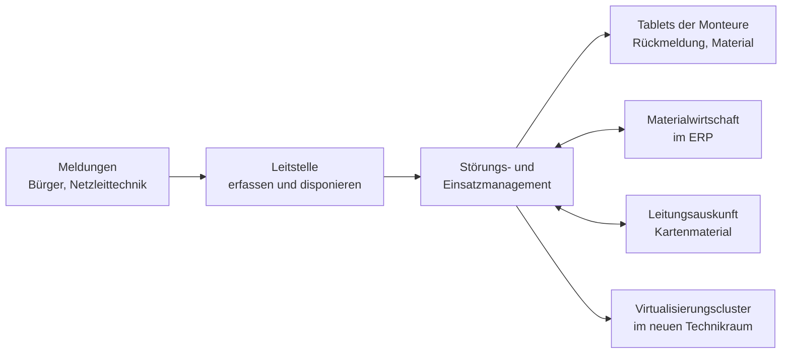

# Übung: Übergabekonzept für ein neu integriertes System

Gruppenübung &nbsp; Die Abnahme ist unterschrieben, die Technik läuft. Jetzt geht es um die Frage, die über den Projekterfolg entscheidet: **Wie kommt dieses System in die Hände der Leute, die künftig damit arbeiten?**

Diese Übung setzt um, was auf der Seite [Übergabe & Einweisung](uebergabe-und-training.md) steht. Ihr bekommt eine betriebliche Situation, eine Liste von Beteiligten und einige unbequeme Rahmenbedingungen. Daraus entwickelt ihr ein Übergabekonzept, das man einer Betriebsleitung vorlegen könnte – mit Zielgruppen, Schulungsbedarf, Dokumentationsgliederung, einer fertigen Kurzanleitung und einer Nachbetreuung, die ein Ende hat.

!!! abstract "Was ihr in dieser Übung tut"
    - **Zielgruppen bestimmen** und je Gruppe festlegen, was übergeben werden muss
    - den **Schulungsbedarf ableiten** und in einer Qualifizierungsmatrix darstellen
    - die **Gliederung eines Betriebshandbuchs** entwerfen – einschließlich der Gebäudetechnik
    - eine **Kurzanleitung** für eine typische Anwenderaufgabe vollständig schreiben
    - die **Nachbetreuung planen**: Hypercare, Exit-Kriterien, Übergang in den Regelbetrieb
    - die **Übergabe der Zugangsdaten** regeln und die Lücken im Auftrag benennen

!!! info "Rahmen"
    - **Gruppengröße:** 3 bis 5 Personen
    - **Dauer:** 60 bis 90 Minuten Gruppenarbeit, danach gemeinsame Auswertung
    - **Material:** Papier oder ein geteiltes Dokument. Keine Spezialsoftware, kein Zugang zu einem System nötig
    - **Ergebnis:** ein Übergabekonzept auf zwei bis vier Seiten, plus eine fertig ausformulierte Kurzanleitung auf einer Seite

---

## Die Ausgangslage

Die **Stadtwerke Talheim** sind ein kommunaler Versorger mit 240 Beschäftigten. Sie betreiben das Strom- und das Wassernetz der Stadt, ein Fernwärmenetz und das Hallenbad. Es gibt zwei Standorte: die Verwaltung in der Innenstadt und den Betriebshof am Ortsrand, direkt an einem Bach gelegen.

Ein Projekt ist gerade abgeschlossen, die Abnahme ist erteilt, die Produktivsetzung steht bevor. Es hatte zwei Teile.

**Teil 1 – die Infrastruktur.** Die IT stand bisher in zwei alten Serverräumen an beiden Standorten. Sie wurde in einen **neuen Technikraum im Betriebshof** zusammengeführt. Neu sind dort:

- ein **Virtualisierungscluster aus drei Knoten** mit gemeinsamem Speichersystem
- eine **redundante Standortverbindung** zwischen Betriebshof und Verwaltung über zwei getrennte Wege
- eine **USV** und eine neue **Netzersatzanlage** mit Dieselaggregat
- **zwei Klimageräte** in Reserveauslegung, ausgelegt für den Ausfall eines Geräts
- eine **Zutrittsanlage** mit Transpondern, eine **Videoüberwachung** am Zugang, eine **Einbruchmeldeanlage** mit Aufschaltung auf eine Leitstelle und eine **Brandmeldeanlage** mit Aufschaltung zur Feuerwehr
- **Wassermelder** im Doppelboden und unter den Klimageräten

**Teil 2 – die Anwendung.** Neu eingeführt wurde ein **Störungs- und Einsatzmanagement**. Meldungen von Bürgerinnen, aus der Netzleittechnik und von der Leitstelle werden dort erfasst, Einsätze werden disponiert, die Monteure erhalten ihre Aufträge auf **Tablets**, erfassen vor Ort die Rückmeldung und das verbrauchte Material. Die Anwendung läuft auf dem neuen Cluster und ist an zwei bestehende Systeme angebunden: an die **Materialwirtschaft** im ERP und an das **Leitungsauskunftssystem** für die Karten.

### Wer beteiligt ist

| Gruppe | Anzahl | Aufgaben und Vorwissen |
|---|---|---|
| **IT-Betrieb** | 2 | betreiben künftig Cluster, Speicher, Anwendung. Eine Person ist seit drei Monaten im Haus. Bisher gab es weder Cluster noch Technikraum in dieser Form |
| **Leitstelle / Disposition** | 6 | nehmen Meldungen auf und disponieren Einsätze, Schichtdienst rund um die Uhr. Arbeiten seit Jahren mit einer Karteikartenlösung und Telefon |
| **Bereitschaft / Monteure** | 34 | fahren die Einsätze, in vier Bereitschaftsgruppen mit wöchentlichem Wechsel montags. Gemischte Altersstruktur, ein Teil arbeitet erstmals mit einem Tablet |
| **Netzdokumentation** | 3 | pflegen Stammdaten, Leitungsdaten und Auswertungen; verantworten fachlich die Datenqualität |
| **Haustechnik** | 1 | betreut Gebäude und Hallenbadtechnik, bisher keine Technikräume |
| **Betriebsleitung Netze** | 1 | fachlich verantwortlich für den Störungsprozess |
| **Kaufmännische Leitung** | 1 | Auftraggeberin, trägt Kosten und Verträge |
| **Externer Dienstleister** | – | hat Technikraum und Cluster gebaut, hat einen Wartungsvertrag mit Rufbereitschaft rund um die Uhr |

### Rahmenbedingungen aus dem Vorgespräch

- Der Dienstleister bietet **„eine Einweisung, zwei Stunden, für alle zusammen"** an.
- Die kaufmännische Leitung hat für Schulungen **einen Tag** eingeplant.
- Die Monteure sind nie alle gleichzeitig im Haus. Der Bereitschaftswechsel findet montags statt.
- Zwei Monteure haben keinen betrieblichen E-Mail-Zugang.
- Bei Unwetter kommen in wenigen Stunden bis zu **200 Meldungen** herein. Dieser Fall ist der eigentliche Grund für das neue System – und er wird im Normalbetrieb nie geübt.
- Die Zugangsdaten für Cluster, Klimasteuerung, Fernzugang zur Brandmeldezentrale und Zutrittsanlage liegen derzeit in einer **Tabellendatei auf dem Projektlaufwerk**, auf das auch der Dienstleister Zugriff hat.
- Es gibt ein **Ticketsystem**, aber die Leitstelle nutzt es nicht; sie ruft direkt in der IT an.
- Der **alte Serverraum** in der Verwaltung wird zurückgebaut.
- Die **Fernwärme-Sparte** arbeitet vorerst mit ihrem Altsystem weiter und soll später folgen.

---

## Eure Aufgabe

Erstellt ein **Übergabekonzept** für dieses Vorhaben. Es besteht aus fünf Teilen und einem Zusatzteil. Arbeitet sie der Reihe nach ab – die späteren bauen auf den früheren auf.

!!! tip "Zeitvorschlag für 90 Minuten"
    Etwa 15 Minuten für Teil 1, 20 Minuten für Teil 2, 20 Minuten für Teil 3, 15 Minuten für Teil 4, 15 Minuten für Teil 5, dann 5 Minuten zum Ordnen. Der Zusatzteil ist für Gruppen gedacht, die früher fertig sind. Bei 60 Minuten lasst ihr Teil 3 bei der reinen Kapitelliste und kürzt Teil 5 auf Hypercare und Exit-Kriterien.

### Rollen in der Gruppe

Verteilt die Rollen zu Beginn. Jede Rolle vertritt eine andere Übergaberichtung – genau daraus entsteht der Ertrag der Gruppenarbeit. Bei drei Personen fasst ihr zusammen; die Übergabeleitung sollte immer besetzt sein.

| Rolle | Blickwinkel und Aufgabe |
|---|---|
| **Übergabeleitung** | hält die Reihenfolge und die Zeit, führt das Ergebnisdokument, achtet darauf, dass keine Zielgruppe verlorengeht |
| **IT-Betrieb** | fragt: Was muss ich am Montag nach der Übergabe allein können? Was fehlt mir dafür? |
| **Leitstelle** | denkt in Schichten, Ausnahmefällen und Telefonaten; vertritt die Anwender im Dauerbetrieb |
| **Bereitschaft / Monteure** | vertritt die Leute im Fahrzeug: wenig Zeit, kalte Finger, schlechter Empfang, unterschiedliches Vorwissen |
| **Haustechnik und Auftraggeberseite** | verantwortet Gebäudetechnik, Verträge und Kosten – fragt: Wer wird nachts angerufen, und was kostet das? |

---

### Teil 1 – Zielgruppen bestimmen und Übergabeumfang klären

1. Bildet die **Zielgruppen** für die Übergabe. Bildet sie nach **Aufgaben**, nicht nach Abteilungen – prüft, ob eine der genannten Gruppen in Wahrheit zwei ist.
2. Legt je Zielgruppe fest:
    - **Was tut sie nach der Übergabe konkret?** (in Verben)
    - **Was muss sie dafür bekommen?** (Zugänge, Unterlagen, Rechte, Ansprechpartner)
    - **In welcher Form wird übergeben?** (Einweisung am System, Schulung, Unterlage, Vertrag)
3. Benennt die **Richtung, die im Auftrag bisher gar nicht vorkommt**, und begründet, warum sie gebraucht wird.

### Teil 2 – Schulungsbedarf ableiten

1. Sammelt **mindestens acht Aufgaben**, die nach der Übergabe im Betrieb anfallen – aus Anwendung *und* Infrastruktur.
2. Baut daraus eine **Qualifizierungsmatrix**: Aufgaben in den Zeilen, Zielgruppen in den Spalten, in den Feldern eine der drei Stufen **kennen – anwenden – anleiten** (oder ein Strich).
3. Formuliert **drei Lernziele** mit prüfbaren Verben, je eines für Leitstelle, Monteure und IT-Betrieb.
4. Legt je Zielgruppe **Schulungsform, Dauer und Zeitpunkt** fest. Beachtet dabei ausdrücklich die Rahmenbedingungen: Schichtdienst, Bereitschaftswechsel, ein eingeplanter Schulungstag, zwei Monteure ohne E-Mail-Zugang.
5. Notiert, **wie der Unwetterfall geübt wird**, obwohl er im Alltag nicht vorkommt.

### Teil 3 – Gliederung des Betriebshandbuchs

1. Entwerft die **Gliederung eines Betriebshandbuchs** für dieses System: mindestens **zwölf Kapitel**, je mit einem Satz, was darin steht.
2. Die **Gebäude- und Infrastrukturtechnik** muss darin vorkommen. Entscheidet, ob sie ein eigenes Kapitel bekommt oder verteilt wird – und begründet eure Entscheidung.
3. Arbeitet **ein Kapitel vollständig aus**: eine Tabelle der **Meldewege** für mindestens fünf Anlagen oder Systeme, mit Meldung, Empfänger, Uhrzeitbezug und erwarteter Reaktion.
4. Grenzt ab: Was gehört ins **Betriebshandbuch**, was in die **Systemdokumentation**, was in den **Notfallplan**?

### Teil 4 – Eine Kurzanleitung schreiben

Wählt **eine** dieser beiden Aufgaben und schreibt dafür eine vollständige Kurzanleitung auf **einer Seite**:

- **A:** „Einen Einsatz auf dem Tablet abschließen und das verbrauchte Material erfassen" (Zielgruppe Monteure)
- **B:** „Eine Störungsmeldung aufnehmen und an die Bereitschaft disponieren" (Zielgruppe Leitstelle)

Haltet euch an die Bauform: Titel als Aufgabe, Situation, Voraussetzung, nummerierte Schritte mit dem, was man jeweils sieht, **Erfolgskennzeichen**, die zwei häufigsten Fehlerfälle mit Handlungsanweisung und die Ansprechstelle mit Erreichbarkeit. Erfindet die Bedienschritte plausibel – bewertet wird die Bauform, nicht die Kenntnis eines bestimmten Produkts.

### Teil 5 – Nachbetreuung planen

1. Plant die **Hypercare-Phase**: Dauer mit Begründung, Besetzung, Erreichbarkeit über alle Schichten, Eskalationsweg, Form der täglichen Abstimmung.
2. Formuliert **mindestens fünf Exit-Kriterien**, an denen erkennbar ist, dass Hypercare beendet werden kann. Sie müssen überprüfbar sein.
3. Beschreibt den **Übergang in den Regelbetrieb**: Was ist danach anders, was muss dafür vorliegen?
4. Plant **Nachschulung und Onboarding**: Wann, für wen, und wie überlebt das Material den Projektabschluss?
5. Benennt **drei Feedbackquellen** und sagt, was ihr aus jeder ablesen wollt.

### Zusatzteil – Zugangsdaten und Befunde

1. Regelt die **Übergabe der Zugangsdaten**. Was passiert mit der Tabellendatei auf dem Projektlaufwerk? Welche Konten gibt es, und was gehört auf welche Liste?
2. Benennt **drei Lücken im Auftrag** – Punkte, die niemand beschrieben hat, die aber im Betrieb sofort auffallen werden. Formuliert sie als Befund mit Vorschlag.

---

## Hilfekarten

Nutzt sie erst, wenn ihr an einer Stelle wirklich feststeckt – und nur die, die zu eurem Problem passt.

??? tip "Hilfekarte 1 – Wir kommen bei den Zielgruppen nicht weiter"
    Stellt für jede genannte Person oder Gruppe genau eine Frage: **Was tut diese Person am ersten Montag nach der Umstellung mit dem System?** Wer dieselbe Antwort gibt, gehört in dieselbe Zielgruppe.

    Prüft danach zwei Dinge:

    - **Zerfällt eine Gruppe?** Die Leitstelle nimmt Meldungen auf *und* disponiert – ist das dieselbe Tätigkeit? Bei den Monteuren gibt es welche, die mit Tablets vertraut sind, und welche, die zum ersten Mal eines in der Hand halten. Das ist unterschiedliches Vorwissen bei gleicher Aufgabe – zwei Schulungsvarianten, eine Zielgruppe.
    - **Fehlt eine Gruppe?** Geht die Liste der Übergaberichtungen durch: Betrieb, Anwender, Fachverantwortung, Leitung, externe Dienstleister – und die Gebäudetechnik.

??? tip "Hilfekarte 2 – Unsere Matrix wird zu grob"
    Zwei Ursachen sind wahrscheinlich.

    **Die Aufgaben sind zu groß.** „Mit dem System arbeiten" ist keine Aufgabe. Schreibt Verben mit Objekt: Meldung erfassen, Einsatz disponieren, Rückmeldung abschließen, Material buchen, Benutzer anlegen, Sicherung prüfen, Knoten in Wartung nehmen, Übertemperaturmeldung bearbeiten.

    **Die Stufen werden nicht getrennt.** Fragt je Feld: Muss die Person das nur *wissen und weitermelden* (kennen), *selbst und sicher tun* (anwenden) oder *anderen erklären und im Zweifel entscheiden* (anleiten)? Für jede Aufgabe sollte es mindestens eine Gruppe mit „anleiten" geben – sonst gibt es im Haus niemanden, den man fragen kann.

??? tip "Hilfekarte 3 – Ein Schulungstag reicht nicht"
    Das ist die richtige Erkenntnis – und der Auftrag lautet nicht, sie hinzunehmen, sondern einen tragfähigen Vorschlag zu machen. Drei Hebel:

    - **Staffeln statt bündeln.** Nicht alle brauchen dasselbe. Für die Monteure sind 45 Minuten am Tablet mit zwei Übungsaufträgen mehr wert als ein ganzer Tag Theorie.
    - **Multiplikatoren.** Aus jeder Bereitschaftsgruppe wird eine Person ausführlich geschult und weist die eigene Gruppe ein – der Bereitschaftswechsel am Montag ist ein Termin, an dem die Gruppe ohnehin zusammenkommt.
    - **Die Form dem Ort anpassen.** Wer kein betriebliches Postfach hat, bekommt die Unterlage auf Papier ins Fahrzeug und die Anleitung als aufrufbare Seite auf dem Tablet. Eine Einladung per E-Mail erreicht ihn nicht.

    Und: Begründet gegenüber der Leitung, was ein zusätzlicher halber Tag kostet – und was ein Unwettertag mit unsicherer Bedienung kostet.

??? tip "Hilfekarte 4 – Unser Betriebshandbuch wird zur Systemdokumentation"
    Trennt nach der Frage, **wann** jemand das Dokument aufschlägt.

    - **Betriebshandbuch:** im Alltag. Regelaufgaben, Überwachung, Sicherung, häufige Störungen, Zuständigkeiten, Meldewege. Antwort auf: „Was ist zu tun?"
    - **Systemdokumentation:** beim Umbau oder bei der Analyse. Aufbau, Komponenten, Versionen, Adressen, Abhängigkeiten. Antwort auf: „Wie ist es gebaut?"
    - **Notfallplan:** wenn etwas ausgefallen ist. Reihenfolge des Wiederanlaufs, Zielzeiten, Rufnummern, Entscheidungsbefugnisse. Antwort auf: „Was jetzt zuerst?"

    Faustregel für das Handbuch: Steht in einem Kapitel keine **Handlung**, gehört es woanders hin.

??? tip "Hilfekarte 5 – Unsere Kurzanleitung wird zu lang"
    Prüft drei Dinge.

    **Sind es zwei Aufgaben?** „Einsatz abschließen und Material erfassen" kann eine sein – wenn es im Ablauf zusammengehört. „Einsatz abschließen und einen neuen anlegen" sind zwei.

    **Erklärt ihr, statt anzuleiten?** In eine Kurzanleitung gehört kein Hintergrund. Warum das Material gebucht wird, steht im Handbuch.

    **Fehlt das Erfolgskennzeichen?** Das ist der Punkt, an dem Gruppen fast immer scheitern – nicht an der Länge. Schreibt einen Satz, an dem der Anwender **selbst** erkennt, dass er fertig ist: „Der Einsatz steht in der Liste unter *abgeschlossen*, das Statusfeld ist grün."

??? tip "Hilfekarte 6 – Unsere Nachbetreuung ist nur eine Zahl"
    „Vier Wochen Hypercare" ist keine Planung, sondern eine Dauer. Es fehlen die Antworten auf vier Fragen: **Wer** ist ansprechbar, **wann** (auch nachts und am Wochenende – die Leitstelle arbeitet rund um die Uhr), **worüber** (Telefon, Ticket, Vor-Ort-Runde) und **was passiert, wenn niemand erreichbar ist**.

    Und für das Ende braucht ihr überprüfbare Kriterien. Formuliert sie mit Zahl oder klarem Zustand: „weniger als X Anfragen je Woche über zwei Wochen", „kein offener Fehler der Klasse kritisch oder schwer", „ein Unwetterereignis oder eine Übung damit ist durchlaufen", „der IT-Betrieb hat einen Wiederherstellungstest allein durchgeführt".

---

## Musterlösung

Die folgenden Lösungen sind ausführlicher, als es eine Gruppe in 90 Minuten schafft. Sie zeigen die **Bauform** und die Denkschritte – vergleicht eure Ergebnisse damit, nicht die Menge.

??? tip "Musterlösung Teil 1 – Zielgruppen und Übergabeumfang"
    **Zielgruppen nach Aufgaben.** Aus den acht genannten Gruppen werden sieben Zielgruppen; zwei Beobachtungen sind entscheidend:

    - Die **Leitstelle** zerfällt fachlich nicht – Erfassen und Disponieren gehören zum selben Arbeitsgang –, wohl aber organisatorisch: Sie arbeitet in Schichten rund um die Uhr, also muss jede Schicht erreicht werden.
    - Die **Monteure** sind eine Zielgruppe mit **zwei Vorwissensständen**. Gleiche Aufgabe, zwei Schulungsvarianten: eine kurze für die Tablet-Erfahrenen, eine längere mit Grundlagen zur Bedienung des Geräts für die übrigen.

    | Zielgruppe | Aufgaben nach der Übergabe | Muss übergeben werden | Form |
    |---|---|---|---|
    | **IT-Betrieb** | Cluster und Speicher betreiben, Knoten warten, Sicherung und Wiederherstellung, Benutzer und Rollen, Störungen bearbeiten, Anlagenmeldungen entgegennehmen | Systemdokumentation, Betriebshandbuch, Notfallplan, Zugänge, Wartungsverträge, Monitoring-Anbindung, Kontenliste | technische Einweisung am System, begleiteter Betrieb über mehrere Tage, Referenzunterlagen |
    | **Leitstelle** | Meldungen erfassen, Einsätze disponieren, Rückfragen der Monteure beantworten, Unwetterfall bewältigen | Kurzanleitungen je Tätigkeit, Zugang, Übungsmandant, Ansprechstelle, Vorgehen bei Systemausfall | kurze Schulung an echten Fällen je Schicht, Kurzanleitung am Arbeitsplatz |
    | **Monteure (Tablet-erfahren)** | Auftrag annehmen, Karte nutzen, Rückmeldung und Material erfassen, Einsatz abschließen | Tablet mit Zugang, Kurzanleitung im Fahrzeug, Ansprechstelle, Vorgehen bei fehlendem Empfang | 45 Minuten mit zwei Übungsaufträgen, beim Bereitschaftswechsel |
    | **Monteure (ohne Tablet-Erfahrung)** | dasselbe | zusätzlich Grundbedienung des Geräts, Anmeldung, Akku und Laden | 90 Minuten in Kleingruppen, mit Begleitung in der ersten Bereitschaftswoche |
    | **Netzdokumentation** | Stammdaten pflegen, Datenqualität verantworten, Auswertungen erstellen, fachliche Regeln entscheiden | fachliche Dokumentation, Rollen- und Rechtekonzept, Auswertungen, Ansprechpartner beim Hersteller | Fachschulung mit Entscheidungsbezug, Übergabe der Pflegeaufgaben |
    | **Haustechnik** | Gebäudetechnik im Technikraum betreuen: Klima, Zutritt, EMA, BMZ, Wassermelder, Netzersatzanlage | Anlagendokumentation, Wartungsverträge, Bedienunterlagen, Prüfpflichten, Meldewege | Einweisung durch die Errichter je Anlage, mit Nachweis |
    | **Betriebs- und kaufmännische Leitung** | abnehmen, Restpunkte verfolgen, Verträge und Kosten verantworten | Abnahmeprotokoll, Restpunkteliste, Vertragsübersicht, Betriebskosten, Zuständigkeitsregelung | kurze Vorlage mit Entscheidungspunkten |

    **Die fehlende Richtung.** Im Auftrag kommt die **Haustechnik** nicht vor – und damit niemand, der die Gebäudetechnik des neuen Technikraums verantwortet. Bisher betreut diese Person Gebäude und Hallenbad, aber keine Technikräume. Ohne diese Übergabe gibt es für Klimageräte, Netzersatzanlage, Brandmelde- und Einbruchmeldeanlage weder eine Zuständigkeit noch eine Wartungsverfolgung, und die Prüfpflichten laufen ins Leere.

    Zwei weitere Richtungen werden häufig übersehen: der **externe Dienstleister** – er hat einen Vertrag, aber Meldewege, Befristung seiner Zugänge und Erreichbarkeit außerhalb der Geschäftszeit müssen geregelt sein – und die **Fernwärme-Sparte**, die vorerst außen vor bleibt und deren spätere Anbindung als Restpunkt mit Termin gehört.

??? tip "Musterlösung Teil 2 – Qualifizierungsmatrix, Lernziele und Schulungsplanung"
    **Die Matrix.** Aufgaben aus Anwendung und Infrastruktur gemischt – das ist der Punkt, an dem sich diese Übung von einer reinen Softwareschulung unterscheidet:

    | Aufgabe | Leitstelle | Monteure | IT-Betrieb | Netzdoku | Haustechnik |
    |---|---|---|---|---|---|
    | Meldung erfassen | anleiten | kennen | kennen | kennen | – |
    | Einsatz disponieren | anwenden | kennen | – | kennen | – |
    | Auftrag auf dem Tablet annehmen und abschließen | kennen | anwenden | kennen | – | – |
    | Material zum Einsatz erfassen | kennen | anwenden | – | anleiten | – |
    | Stammdaten und Auswertungen pflegen | – | – | kennen | anleiten | – |
    | Benutzer und Rollen anlegen | – | – | anwenden | anleiten | – |
    | Sicherung prüfen und Wiederherstellung durchführen | – | – | anleiten | – | – |
    | Clusterknoten in Wartung nehmen | – | – | anwenden | – | – |
    | Übertemperatur- oder Klimastörung bearbeiten | kennen | – | anwenden | – | anleiten |
    | Störungsmeldung der Netzersatzanlage bearbeiten | kennen | – | kennen | – | anleiten |
    | Melder bei Bohrarbeiten abschalten und wieder freigeben | – | – | kennen | – | anleiten |
    | Zutritt für Fremdfirmen vergeben und entziehen | – | – | anwenden | – | anleiten |

    Aus der Matrix lässt sich sofort ablesen, wo Doppelbesetzungen fehlen: Beim **IT-Betrieb** steht bei „Sicherung und Wiederherstellung" nur eine Gruppe mit zwei Personen, von denen eine seit drei Monaten im Haus ist. Fällt eine aus, ist niemand mehr da – ein Befund, der ins Konzept gehört und für den es zwei Antworten gibt: den Dienstleister vertraglich einbinden oder eine dritte Person ausbilden.

    **Drei Lernziele mit prüfbaren Verben.**

    - *Leitstelle:* „Die Teilnehmenden nehmen eine Störungsmeldung mit allen Pflichtangaben auf, ordnen sie einer Bereitschaftsgruppe zu und weisen im System nach, dass der Auftrag auf dem Tablet des Monteurs angekommen ist."
    - *Monteure:* „Die Teilnehmenden schließen einen Einsatz auf dem Tablet ab, erfassen zwei Materialpositionen und erkennen an der Statusanzeige, dass die Rückmeldung übertragen wurde."
    - *IT-Betrieb:* „Die Teilnehmenden nehmen einen Clusterknoten in den Wartungsmodus, weisen nach, dass die virtuellen Maschinen auf die verbleibenden Knoten gewandert sind, und geben den Knoten wieder frei."

    Man beachte: Jedes dieser Ziele ist gleichzeitig die Übungsaufgabe und der Nachweis. Formulierungen wie „verstehen den Störungsprozess" wären nicht prüfbar.

    **Schulungsplanung unter den gegebenen Bedingungen.**

    | Zielgruppe | Form | Dauer | Zeitpunkt |
    |---|---|---|---|
    | IT-Betrieb | Einweisung durch Dienstleister am System, danach begleiteter Betrieb | 2 Tage plus eine begleitete Woche | deutlich vor der Produktivsetzung – der Betrieb muss am Umstellungstag arbeitsfähig sein |
    | Leitstelle | Schulung am Übungsmandanten, je Schicht getrennt | 3 Stunden je Schicht | in der Woche vor der Produktivsetzung, alle Schichten abgedeckt |
    | Monteure, Multiplikatoren | ausführliche Schulung von vier Personen, eine je Bereitschaftsgruppe | halber Tag | zwei Wochen vor der Produktivsetzung |
    | Monteure, übrige | Einweisung durch den Multiplikator beim Bereitschaftswechsel | 45 bis 90 Minuten je nach Vorwissen | montags beim Wechsel, über vier Wochen rollierend |
    | Netzdokumentation | Fachschulung mit Entscheidungsthemen | halber Tag | vor der Produktivsetzung |
    | Haustechnik | Einweisung je Anlage durch den jeweiligen Errichter, mit Nachweis | je Anlage 1 bis 2 Stunden | bei der Anlagenübergabe |
    | Leitung | Kurzvorlage mit Zuständigkeiten und Restpunkten | 30 Minuten | zur Übergabebesprechung |

    **Zum „einen Schulungstag".** Der Vorschlag des Dienstleisters – zwei Stunden für alle zusammen – ist für keine der Zielgruppen brauchbar: Die Monteure brauchen Übung am Gerät, der Betrieb braucht Tage, die Leitstelle muss je Schicht erreicht werden. Der Gegenvorschlag an die Leitung besteht aus zwei Zahlen: dem tatsächlichen Aufwand (rund vier Schulungstage plus rollierende Einweisungen, überwiegend intern erbracht) und dem, was ein unsicher bedienter Unwettertag kostet – wenn von 200 Meldungen ein Teil nicht sauber disponiert wird, sind das nicht Minuten, sondern nicht abgearbeitete Einsätze.

    **Den Unwetterfall üben.** Er kommt im Alltag nicht vor und ist genau der Fall, für den das System beschafft wurde. Deshalb wird er **simuliert**: eine Trockenübung im Übungsmandanten mit 30 vorbereiteten Meldungen in 20 Minuten, gefahren mit der Leitstelle und zwei Monteuren. Geübt wird nicht nur die Bedienung, sondern die Frage, was zu tun ist, wenn die Warteschlange wächst – Reihenfolge, Rückfragen, Ausweichweg bei Systemausfall (Papierformular, Telefonliste). Diese Übung gehört wiederholt, mindestens einmal je Jahr.

??? tip "Musterlösung Teil 3 – Gliederung des Betriebshandbuchs und Meldewege"
    **Gliederung.**

    1. **Zweck und Geltungsbereich** – welches System, welche Standorte, für wen dieses Handbuch gilt.
    2. **Systemüberblick** – Architekturbild, beteiligte Komponenten, Anbindungen an ERP und Leitungsauskunft.
    3. **Rollen und Zuständigkeiten** – wer betreibt, wer verantwortet fachlich, wer wird wann gerufen, Vertretungsregelung.
    4. **Betriebszeiten und Servicevereinbarungen** – Verfügbarkeitszusagen, Reaktionszeiten, Wartungsfenster.
    5. **Regelaufgaben** – nach Intervall geordnet: täglich, wöchentlich, monatlich, jährlich, mit Verantwortlichem.
    6. **Überwachung und Alarmierung** – überwachte Werte, Schwellen, Betriebszustände, Empfänger der Meldungen.
    7. **Sicherung und Wiederherstellung** – Verfahren, Zeitpunkte, Aufbewahrung, Zielwerte, Ablauf und Nachweis des Wiederherstellungstests.
    8. **Benutzer, Rollen und Berechtigungen** – Antrag, Genehmigung, Vergabe, Entzug bei Austritt.
    9. **Störungsbehandlung** – die zehn häufigsten Fälle mit Erkennung, Sofortmaßnahme und Eskalation.
    10. **Infrastruktur und Gebäudetechnik** – Klima, USV und Netzersatzanlage, Zutritt, Video, Einbruch- und Brandmeldeanlage, Wassermelder: Bedienung, Prüfpflichten, Meldewege, Wartungsverträge.
    11. **Änderungs- und Freigabeverfahren** – wer darf was ändern, wie wird geprüft, dokumentiert und zurückgerollt.
    12. **Notfall und Wiederanlauf** – Verweis auf den Notfallplan, Reihenfolge des Wiederanlaufs, Ausweichverfahren bei Systemausfall.
    13. **Verträge und Ansprechpartner** – Hersteller, Dienstleister, Errichter der Anlagen, Provider, mit Vertragsnummern und Erreichbarkeit außerhalb der Geschäftszeit.
    14. **Mitgeltende Unterlagen und Änderungsverzeichnis** – Systemdokumentation, Notfallplan, Kontenliste, Kurzanleitungen; Datum, Version, Pflegeverantwortung.

    **Eigenes Kapitel oder verteilt?** Die tragfähigere Entscheidung ist ein **eigenes Kapitel 10** – mit zwei Begründungen: Die Anlagen haben eine andere Zuständigkeit (Haustechnik und Errichter statt IT), und sie unterliegen eigenen Prüf- und Wartungspflichten, die zusammen verfolgt werden müssen. Ihre **Meldungen** dagegen gehören in Kapitel 6 zur übrigen Überwachung, damit nachts nicht zwei Systeme zwei Wege gehen.

    **Kapitel 10, Abschnitt Meldewege – vollständig ausgearbeitet.**

    | Anlage / System | Meldung | Empfänger | Zeitbezug | Erwartete Reaktion |
    |---|---|---|---|---|
    | **Klimatechnik** | Übertemperatur Stufe 1 (Zielwert überschritten) | Monitoring → Rufbereitschaft IT | rund um die Uhr | Lage prüfen, zweites Gerät kontrollieren, Haustechnik informieren |
    | **Klimatechnik** | Ausfall eines Klimageräts | Monitoring → Rufbereitschaft IT und Haustechnik | rund um die Uhr | Wartungsfirma nach Vertrag rufen, Last im Blick behalten, kein Wartungsfenster ansetzen |
    | **Netzersatzanlage** | Netzausfall, Aggregat läuft | Monitoring → Rufbereitschaft IT, Meldung an Betriebsleitung | rund um die Uhr | Betriebsdauer und Kraftstoffstand prüfen, ab vereinbarter Schwelle Nachtankung auslösen |
    | **Netzersatzanlage** | Startfehler oder Batteriestörung | Monitoring → Haustechnik, nachrichtlich IT | Geschäftszeit, bei Alarm sofort | Wartungsfirma beauftragen; bis zur Behebung gilt: keine geplanten Arbeiten am Stromnetz |
    | **USV** | Batterietest fehlgeschlagen | Monitoring → IT-Betrieb | Geschäftszeit | Austausch über Wartungsvertrag beauftragen |
    | **Brandmeldezentrale** | Alarm | automatisch zur Feuerwehr; parallel Haustechnik und Rufbereitschaft IT | rund um die Uhr | Gebäude räumen, Feuerwehr einweisen, Technikraum nicht betreten |
    | **Brandmeldezentrale** | Störung oder abgeschalteter Melder | Haustechnik | Geschäftszeit | Ursache klären, Abschaltung dokumentieren und befristen |
    | **Einbruchmeldeanlage** | Alarm | Notruf- und Serviceleitstelle nach Vertrag, parallel Haustechnik | rund um die Uhr | Vorgehen nach Vereinbarung mit der Leitstelle, Zutritt nur begleitet |
    | **Zutrittsanlage** | Tür Technikraum länger offen als zulässig | Monitoring → IT-Betrieb | Geschäftszeit | prüfen, wer im Raum ist, Tür schließen, Vorfall dokumentieren |
    | **Wassermelder** | Feuchtigkeit im Doppelboden oder unter einem Klimagerät | Monitoring → Rufbereitschaft IT und Haustechnik | rund um die Uhr | vor Ort prüfen, betroffenes Gerät abschalten, Wartungsfirma rufen |
    | **Cluster** | Knoten nicht erreichbar | Monitoring → Rufbereitschaft IT, Ticket an Dienstleister | rund um die Uhr | Reservekapazität prüfen; solange ein Knoten fehlt, keine Wartungsarbeiten |
    | **Standortverbindung** | eine der beiden Strecken ausgefallen | Monitoring → IT-Betrieb, Störung beim Provider melden | rund um die Uhr | Störungsmeldung mit Leitungsnummer, Entstörzeit verfolgen |

    Die entscheidende Spalte ist die letzte. Eine Meldung ohne erwartete Reaktion ist eine Benachrichtigung; erst mit ihr wird daraus ein Meldeweg.

    **Abgrenzung.** Ins **Betriebshandbuch** gehört, was regelmäßig getan wird. In die **Systemdokumentation** gehört, wie das System gebaut ist: Knotennamen, Adressen, Speicherzuordnung, Version der Anwendung, Schnittstellenparameter zu ERP und Leitungsauskunft, Netzplan, Patchdokumentation. In den **Notfallplan** gehört, was bei Ausfall zu tun ist: Reihenfolge des Wiederanlaufs, Zielzeiten, Entscheidungsbefugnisse, Ausweichverfahren der Leitstelle mit Papierformular und Telefonliste.

??? tip "Musterlösung Teil 4 – Kurzanleitung (Variante A)"
    So sieht eine brauchbare Kurzanleitung aus. Sie passt auf eine Seite, hat ein Erfolgskennzeichen und behandelt die zwei Fehlerfälle, die im Fahrzeug tatsächlich auftreten.

    ---

    **Einen Einsatz auf dem Tablet abschließen**

    *Wann brauche ich das?* Sobald die Arbeit an der Einsatzstelle beendet ist und bevor du zur nächsten Stelle fährst.

    *Voraussetzung:* Du bist am Tablet angemeldet, und der Einsatz steht bei dir unter **Meine Einsätze** im Status *in Arbeit*.

    1. Tippe auf den Einsatz. Oben stehen Adresse und Meldungsnummer, unten die Schaltfläche **Rückmeldung**.
    2. Tippe auf **Rückmeldung**. Es öffnet sich ein Formular mit drei Feldern: *Was war die Ursache*, *Was wurde getan*, *Ist die Störung behoben*.
    3. Fülle die drei Felder aus. Die ersten beiden sind Freitext, das dritte ist eine Auswahl: **behoben** oder **Folgeeinsatz nötig**.
    4. Tippe auf **Material**. Wähle je verbrauchtem Teil die Position aus der Liste und trage die Menge ein. Mit **+ Position** fügst du weitere hinzu.
    5. Prüfe die Zeiten: Beginn und Ende werden automatisch eingetragen. Weichen sie ab, korrigiere sie von Hand.
    6. Tippe auf **Einsatz abschließen** und bestätige die Rückfrage.

    *Woran erkenne ich, dass es geklappt hat?* Der Einsatz verschwindet aus **Meine Einsätze** und erscheint unter **Abgeschlossen** mit einem grünen Haken. In der Kopfzeile steht kurz **Übertragen**. Solange dort **Wartet auf Übertragung** steht, ist die Rückmeldung noch auf dem Gerät.

    *Wenn etwas nicht klappt:*

    - **„Wartet auf Übertragung" bleibt stehen** – kein Empfang. Nichts löschen, nichts neu eingeben. Die Rückmeldung wird automatisch übertragen, sobald wieder Netz da ist; du kannst weiterarbeiten. Bleibt es nach der Rückkehr auf den Hof stehen: Leitstelle anrufen.
    - **Materialposition nicht in der Liste** – Position **Sonstiges** wählen, Bezeichnung im Textfeld eintragen und der Leitstelle telefonisch durchgeben. Nicht auf eine ähnliche Position ausweichen, sonst stimmt der Lagerbestand nicht.

    *Wer hilft?* Leitstelle, Durchwahl 100, rund um die Uhr besetzt. Technische Störung am Tablet: IT-Betrieb während der Geschäftszeit, außerhalb über die Leitstelle.

    ---

    **Worauf es in der Bewertung ankommt.** Die Anleitung nennt je Schritt, **was man tut und was man daraufhin sieht**. Sie hat ein Erfolgskennzeichen, das der Anwender selbst prüfen kann. Sie behandelt den Fall „kein Empfang" – den häufigsten Fall im Außendienst überhaupt – und sagt ausdrücklich, was man **nicht** tun soll. Und sie nennt eine Ansprechstelle mit Erreichbarkeit. Was fehlt und auch fehlen soll: jede Erklärung, warum Material erfasst wird. Das steht im Handbuch.

??? tip "Musterlösung Teil 5 – Nachbetreuung, Exit-Kriterien und Regelbetrieb"
    **Hypercare.**

    - **Dauer:** sechs Wochen, nicht vier. Begründung: Die Phase muss mindestens einen vollständigen Abrechnungslauf für die Materialbuchungen und einen Bereitschaftsdurchlauf **aller vier Gruppen** abdecken – bei wöchentlichem Wechsel sind das vier Wochen allein für den Durchlauf, ohne Puffer für Nacharbeit.
    - **Besetzung:** benannte Ansprechperson im IT-Betrieb während der Geschäftszeit; je Bereitschaftsgruppe der geschulte Multiplikator; für die Leitstelle in der ersten Woche in jeder Schicht eine Begleitung, auch nachts; der Dienstleister in Bereitschaft nach Vertrag.
    - **Erreichbarkeit:** eine Rufnummer für alle Fragen zur Umstellung, rund um die Uhr, weil die Leitstelle rund um die Uhr arbeitet. Für die Monteure zusätzlich der Multiplikator der eigenen Gruppe – wer im Fahrzeug sitzt, ruft niemanden an, den er nicht kennt.
    - **Eskalation:** Anfragen zur Umstellung werden im Ticketsystem gekennzeichnet und vorrangig behandelt; kritische Fälle gehen unmittelbar an die Projektleitung und den Dienstleister.
    - **Abstimmung:** in der ersten Woche täglich eine Viertelstunde mit IT-Betrieb, Leitstelle und Betriebsleitung; danach zweimal wöchentlich. Ergebnis jeweils: was ist aufgelaufen, was ist entschieden, was bleibt offen.
    - **Nebenbefund:** Dass die Leitstelle das Ticketsystem nicht nutzt, muss in dieser Phase gelöst werden – sonst gibt es keine auswertbare Datengrundlage. Der pragmatische Weg: Die Begleitung erfasst die Anfragen in den ersten zwei Wochen stellvertretend und übt dabei die Nutzung ein.

    **Exit-Kriterien.**

    1. Weniger als fünf Anfragen zur Umstellung je Woche, über zwei aufeinanderfolgende Wochen.
    2. Kein offener Fehler der Klassen kritisch oder schwer; alle übrigen stehen mit Termin und Verantwortlichem in der Restpunkteliste.
    3. Alle vier Bereitschaftsgruppen haben mindestens eine vollständige Bereitschaftswoche mit dem System gefahren.
    4. Ein Abrechnungslauf der Materialbuchungen ist vollständig und ohne Nacharbeit durchgelaufen.
    5. Der IT-Betrieb hat eine Wiederherstellung aus der Sicherung selbstständig durchgeführt und protokolliert.
    6. Die Unwetter-Trockenübung ist mit der Leitstelle gefahren worden; das Ausweichverfahren bei Systemausfall ist geübt.
    7. Betriebshandbuch, Notfallplan, Kontaktlisten und Kurzanleitungen sind auf dem Stand nach der Umstellung.
    8. Rufbereitschaft, Servicevereinbarung und alle Wartungsverträge – auch für Klima, Netzersatzanlage, Brandmelde- und Einbruchmeldeanlage – sind aktiv und terminlich verfolgt.

    **Übergang in den Regelbetrieb.** Die Übernahme wird schriftlich festgehalten: wer den Betrieb ab wann verantwortet, welche Punkte offen bleiben, wie sie verfolgt werden. Ab diesem Zeitpunkt laufen Änderungen über das reguläre Änderungsverfahren statt über das Projekt, Anfragen laufen über den normalen Weg statt über die Sondernummer, und die Projektleitung ist nicht mehr Eskalationsstelle. Der Restpunkt „Anbindung der Fernwärme-Sparte" bekommt einen Termin und einen Verantwortlichen, sonst verschwindet er.

    **Nachschulung und Onboarding.**

    - Vier bis sechs Wochen nach der Produktivsetzung je eine Sprechstunde für Leitstelle und Monteure – jetzt kommen die Fragen aus dem Alltag: halb bearbeitete Vorgänge, Sonderfälle, Materialpositionen, die es nicht gibt.
    - Die Kurzanleitungen werden aus den häufigsten Anfragen überarbeitet; die drei häufigsten Fragen werden aufgenommen.
    - Für neue Beschäftigte wird eine Einweisungsmappe hinterlegt: Kurzanleitungen, eine kurze Aufzeichnung der Tablet-Bedienung, die Zuständigkeit für die Einweisung. Zuständig ist der Multiplikator der jeweiligen Gruppe, nicht das Projekt.
    - Die Unwetterübung wird als jährlich wiederkehrender Termin eingeplant.

    **Drei Feedbackquellen.**

    | Quelle | Was daraus abgelesen wird |
    |---|---|
    | **Ticket- und Anrufauswertung** | welche Schritte im Alltag Fragen erzeugen – daraus folgt, welche Kurzanleitung überarbeitet wird |
    | **Rückmeldung der Multiplikatoren nach jedem Bereitschaftswechsel** | wo die Einweisung nicht getragen hat und welche Gruppe Nachhilfe braucht |
    | **Auswertung im System** | Anteil unvollständiger Rückmeldungen, Einsätze ohne Materialerfassung, Vorgänge, die von der Leitstelle nachbearbeitet werden mussten – das ist der Nachweis auf der Verhaltensebene, nicht nur der Stimmungsebene |

??? tip "Musterlösung Zusatzteil – Zugangsdaten und Befunde"
    **Die Tabellendatei.** Sie ist kein Übergabemittel, sondern ein Befund. Sie liegt auf einem Laufwerk, auf das auch der Dienstleister Zugriff hat, sie ist kopierbar, sie enthält keine Historie, und niemand weiß, wer sie gelesen hat. Vorgehen:

    1. **Kontenliste erstellen** – jedes Konto mit Zweck, System, Typ (persönlich, technisch, Notfall), Verantwortlichem und Datum des letzten Kennwortwechsels. Diese Liste wird übergeben, nicht die Kennwörter.
    2. **Alle Kennwörter wechseln**, die im Projekt verwendet wurden – Cluster, Speicher, Klimasteuerung, Fernzugang der Brandmeldezentrale, Zutrittsanlage, Anwendung. Das ist der eigentliche Übergabeakt.
    3. **Neue Kennwörter in einen Kennwort-Tresor** legen, Freigabe je Eintrag nur für die Personen, die ihn brauchen.
    4. **Persönliche Konten** für IT-Betrieb und Dienstleister; gemeinsame Administratorkonten nur, wo technisch unvermeidbar, dann als Notfallzugang: hinterlegt, Ausgabe im Vier-Augen-Prinzip, jede Nutzung dokumentiert, danach erneuter Wechsel.
    5. **Dienstleisterzugänge befristen** und auf benannte Personen ausstellen; Fernwartung nur bei Bedarf freischalten und protokollieren.
    6. **Tabellendatei sicher löschen**, einschließlich der Kopien im Postfach und in den Sicherungen, soweit erreichbar – und im Übergabeprotokoll festhalten, dass sie bestanden hat und wer Zugriff hatte.

    **Drei Lücken im Auftrag.**

    - **Befund 1: Für die Gebäudetechnik im neuen Technikraum gibt es keine Zuständigkeit.** Die Haustechnik betreut bisher keine Technikräume und wurde nicht eingeplant; damit fehlen Bedienzuständigkeit, Wartungsverfolgung und die Erfüllung der Prüfpflichten. *Vorschlag:* Einweisung je Anlage durch die Errichter mit Nachweis, benannte Zuständigkeit mit Vertretung, Wartungstermine in einen Kalender mit Erinnerung.
    - **Befund 2: Der IT-Betrieb ist einfach besetzt.** Zwei Personen, davon eine neu, sollen einen Cluster betreiben, den bisher niemand im Haus kennt. Bei Urlaub oder Krankheit gibt es niemanden, der eine Wiederherstellung durchführen kann. *Vorschlag:* Rufbereitschaft des Dienstleisters vertraglich mit Reaktionszeit absichern, eine dritte Person ausbilden, den Wiederherstellungstest ausdrücklich mit beiden Personen fahren.
    - **Befund 3: Für den Systemausfall gibt es kein Ausweichverfahren.** Fällt die Anwendung während eines Unwetters aus, kann die Leitstelle weder erfassen noch disponieren. *Vorschlag:* Papierformular und aktuelle Telefonliste im Notfallplan, jährlich geübt; die Übung ist zugleich Exit-Kriterium der Hypercare-Phase.

    Weitere häufig genannte, ebenfalls richtige Befunde: die fehlende Regelung für den Rückbau des alten Serverraums (Datenträger, Konten, Verkabelung), der unbestimmte Termin für die Fernwärme-Anbindung und die Frage, wer die Videoaufzeichnungen unter welchen Voraussetzungen ansehen darf.

---

## Für die gemeinsame Auswertung

### Reflexionsfragen

1. **Welche Zielgruppe habt ihr zuerst vergessen – und woran lag das?** Vergleicht die Gruppen: Meist fehlt die Haustechnik oder die Fachverantwortung für die Daten. Was sagt das darüber aus, welche Übergaberichtungen in Projekten regelmäßig untergehen?
2. **Wie habt ihr auf den „einen Schulungstag" reagiert?** Habt ihr den Rahmen hingenommen, überzogen oder einen begründeten Gegenvorschlag gemacht? Mit welchem Argument geht ihr in dieses Gespräch?
3. **Wie viele eurer Handbuchkapitel beschreiben eine Handlung – und wie viele nur einen Zustand?** Was sagt das über die Grenze zwischen Betriebshandbuch und Systemdokumentation?
4. **Hatte eure Kurzanleitung ein Erfolgskennzeichen?** Wenn nein: Woran hätte der Monteur erkennen sollen, dass er fertig ist? Und wie oft hätte er den Schritt vorsichtshalber wiederholt?
5. **Sind eure Exit-Kriterien überprüfbar oder sind es Absichtserklärungen?** Lest sie euch gegenseitig vor und fragt jedes Mal: Wer stellt das wann fest, und woran?
6. **Was hättet ihr an dieser Übergabe getan, wenn das Budget bei null gelegen hätte?** Welche drei Maßnahmen behaltet ihr auf jeden Fall – und warum genau diese?

### Woran ihr ein gutes Ergebnis erkennt

| Merkmal | Schwach | Stark |
|---|---|---|
| **Zielgruppen** | die Abteilungen aus dem Text abgeschrieben | nach Aufgaben gebildet, Gruppen mit gleichem Auftrag und unterschiedlichem Vorwissen erkannt, fehlende Richtung benannt |
| **Qualifizierungsmatrix** | nur Aufgaben aus der Anwendung | Anwendung und Infrastruktur gemischt, je Aufgabe eine Gruppe mit „anleiten", Einfachbesetzungen als Befund benannt |
| **Lernziele** | „verstehen", „kennenlernen" | prüfbare Verben; das Lernziel ist zugleich die Übungsaufgabe |
| **Schulungsplanung** | ein Termin für alle | gestaffelt, Multiplikatoren, Schichten und Bereitschaftswechsel berücksichtigt, Menschen ohne E-Mail-Zugang mitgedacht |
| **Betriebshandbuch** | Inhaltsverzeichnis der Systemdokumentation | Kapitel beschreiben Handlungen; Gebäudetechnik enthalten; Abgrenzung zu Systemdoku und Notfallplan begründet |
| **Meldewege** | Meldung und Empfänger | zusätzlich Zeitbezug und **erwartete Reaktion**; rund um die Uhr von Geschäftszeit getrennt |
| **Kurzanleitung** | Menüführung ohne Ziel | eine Aufgabe, sichtbare Rückmeldung je Schritt, Erfolgskennzeichen, die zwei realen Fehlerfälle, Ansprechstelle |
| **Hypercare** | eine Dauer | Dauer begründet aus den fachlichen Zyklen, Besetzung über alle Schichten, Eskalation, Abstimmungsrhythmus |
| **Exit-Kriterien** | „läuft stabil" | überprüfbar, mit Zahl oder klarem Zustand, einschließlich geübtem Ausnahmefall |
| **Zugangsdaten** | „werden übergeben" | Kontenliste statt Kennwortliste, Tresor, Kennwortwechsel als Übergabeakt, Dienstleisterzugänge befristet |
| **Befunde** | keine | Lücken im Auftrag benannt und mit einem Vorschlag versehen |

---

## Weiterlesen

- [Übergabe & Einweisung](uebergabe-und-training.md): die Theorieseite zu dieser Übung
- [Betrieb optimieren](optimierung.md): Betriebszustände, Meldeschwellen und der Verbesserungskreis nach der Übergabe
- [Tests durchführen](tests-durchfuehren.md): die Abnahme, die dieser Übergabe vorausgeht
- [Übung: Testkonzept für eine Systemanbindung](uebung-testkonzept.md): die Gruppenübung zur Prüfseite
- [Schulung & Training](../projektmanagement/schulung-und-training.md): Qualifikationsformen und Schulungsvorbereitung
- [Incident Response & Business Continuity](../betrieb/incident-und-bcm.md): Meldewege, Rufbereitschaft und Ausweichverfahren
- [Monitoring](../betrieb/monitoring.md): wohin die Meldungen von IT und Gebäudetechnik laufen
- [Datenschutz & DSGVO](../recht-organisation/datenschutz-dsgvo.md): Videoüberwachung und Zutrittsprotokolle
- [IT-Verträge](../recht-organisation/it-vertraege.md): Wartungsverträge und Servicevereinbarungen
