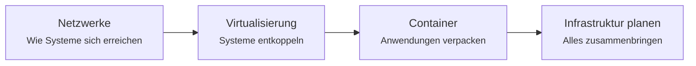

# Thema 1 – Planung, Konzeptionierung, Integration

Der erste und größte Themenblock. Hier geht es um die Frage, **wie eine IT-Infrastruktur entsteht**: von der Analyse dessen, was schon da ist, über die Auswahl passender Technik bis zur Inbetriebnahme der Komponenten.

!!! abstract "Was du am Ende können sollst"
    - eine **bestehende Systemlandschaft analysieren** – Hardware, Netz, Software
    - **Anforderungen erheben** und in ein Sollkonzept übersetzen
    - **Architekturen auswählen** und begründen: zentral oder dezentral, Cloud oder eigener Betrieb
    - **Netze verstehen und planen**, inklusive der Protokolle für Maschinen- und Anlagenkommunikation
    - **Virtualisierung und Container** einordnen, installieren und betreiben
    - **Speicherlösungen, Ressourcen und Lizenzmodelle** bewerten und auswählen
    - **Chancen und Risiken** einer Lösung gegeneinander abwägen

---

## Warum dieser Block zuerst kommt

Alles Weitere setzt darauf auf. Ein System betreiben (Thema 2) kannst du erst, wenn du weißt, woraus es besteht. Und absichern (Thema 3) kannst du nur, was du verstanden hast.

Innerhalb des Blocks bauen die Abschnitte aufeinander auf:

**Netzwerke** stehen am Anfang, weil ohne sie nichts miteinander spricht – weder Server noch Container noch Maschinen. **Virtualisierung** zeigt, wie man mehrere Systeme auf einer Maschine trennt. **Container** treiben diesen Gedanken weiter und sind heute der Normalfall, wenn Anwendungen ausgeliefert werden. **Infrastrukturplanung** führt alles zusammen: Was brauche ich, was kostet es, wie begründe ich meine Wahl?

---

## Die Abschnitte

### Netzwerke

Das Fundament. Vom OSI-Modell über IP-Adressierung und Subnetting bis zu Routing, DNS und DHCP. Danach die Protokolle: TCP und UDP, die Anwendungsprotokolle des Alltags und die Protokolle der Industrie – Profinet, OPC UA, MQTT. Zum Schluss Segmentierung, VPN und Netzwerksicherheit.

Praktisch übst du hier Subnetting, liest echten Netzwerkverkehr mit und suchst systematisch Fehler in vorbereiteten Störfällen.

[:octicons-arrow-right-24: Zum Netzwerk-Block](netzwerke/index.md)

### Virtualisierung

Warum kapselt man Systeme überhaupt? Was macht ein Hypervisor, und wo liegt der Unterschied zwischen Typ 1 und Typ 2? Welche Werkzeuge gibt es, und wann nimmt man welches?

Praktisch startest du eigene virtuelle Maschinen, gibst ihnen Ressourcen und richtest sie automatisiert ein.

[:octicons-arrow-right-24: Zum Virtualisierungs-Block](virtualisierung/index.md)

### Container

Der Schritt von der virtuellen Maschine zum Container: leichter, schneller, aber mit anderen Regeln. Images und Container, eigene Images bauen, Daten dauerhaft speichern, mehrere Dienste zu einem Stack verbinden.

Praktisch baust du eigene Images, betreibst Datenbanken mit dauerhaftem Speicher und stellst ganze Anwendungen aus einer einzigen Beschreibungsdatei bereit.

[:octicons-arrow-right-24: Zum Docker-Block](docker/index.md)

### Infrastruktur und Architektur

Der planerische Abschluss: Bestandsanalyse, Anforderungskatalog, Lasten- und Pflichtenheft. Zentrale gegen dezentrale Architektur, eigener Betrieb gegen Cloud. Speicherlösungen von RAID bis Objektspeicher. Ressourcen schätzen, Kosten rechnen, Lizenzmodelle vergleichen.

Praktisch arbeitest du an einem durchgehenden Unternehmensszenario und triffst begründete Entscheidungen – genau wie in der Prüfung.

[:octicons-arrow-right-24: Zum Planungs-Block](infrastruktur-planung/index.md)

---

## Bezug zur Prüfung

Dieser Block deckt den **ersten Qualifikationsschwerpunkt** ab, der im Rahmenplan mit rund einem Drittel der Gesamtstunden der umfangreichste ist.

Die zugehörigen Prüfungsinhalte:

| Nr. | Inhalt |
|---|---|
| 1.1 | Vernetzung und Inbetriebnahme cyber-physischer Systeme planen |
| 1.2 | Komponenten bestehender Infrastrukturen parametrisieren |
| 1.3 | Betriebssysteme, Plattformen und Architekturen integrieren |
| 1.4 | Protokolle zum Datenaustausch und zur Maschinenüberwachung einbinden |
| 1.5 | Benötigte Ressourcen planen |
| 1.6 | Lizenzmodelle auswählen |
| 1.7 | Virtualisierungslösungen installieren, konfigurieren, betreiben |
| 1.8 | Möglichkeiten und Risiken von Virtualisierungslösungen bewerten |

!!! tip "Achte auf die Begriffe"
    In der Prüfung tauchen die Formulierungen des Rahmenplans auf. Wenn du in den Unterlagen einen Fachbegriff siehst, den du noch nicht sicher erklären kannst, schlag ihn im [Glossar](glossar.md) nach.

---

Weiter geht es danach mit **[Thema 2 – Sicherstellung des laufenden Betriebs](thema-2.md)**: Ein System steht. Wie hältst du es am Laufen?
