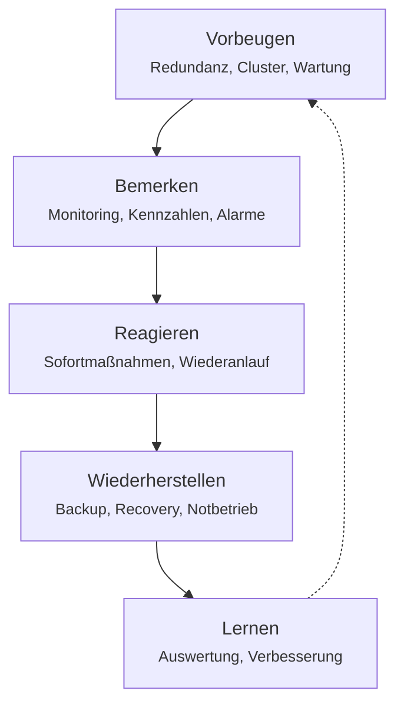

# Thema 2 – Sicherstellung des laufenden Betriebs

Ein System aufzubauen ist die eine Hälfte. Die andere ist, es **am Laufen zu halten** – auch dann, wenn Hardware ausfällt, eine Anwendung abstürzt oder tausend Geräte gleichzeitig ein Update brauchen.

!!! abstract "Was du am Ende können sollst"
    - **Ausfallrisiken erkennen** und bewerten, welchen Schaden ein Ausfall anrichtet
    - **Wiederherstellungskonzepte entwickeln**: Redundanz, Cluster, Ersatzteile, Serviceverträge
    - eine **Backup- und Recoverystrategie** aufsetzen und einen Wiederanlaufplan schreiben
    - **Betriebsdaten auswerten**, Kennzahlen festlegen und bei Abweichungen reagieren
    - **Monitoring und Alarmierung** einrichten
    - **Software automatisiert verteilen** und Deployment-Strategien auswählen
    - **Container über einen Cluster orchestrieren**
    - nach einem Vorfall den **sicheren Betrieb wiederherstellen**

---

## Der Gedanke dahinter

Im Betrieb geht es fast immer um dieselbe Frage in verschiedenen Gewändern: **Was passiert, wenn etwas kaputtgeht – und wie schnell bin ich wieder da?**

Diese Schleife zieht sich durch den gesamten Block. Jedes Werkzeug, das du kennenlernst, sitzt an einer dieser fünf Stellen.

---

## Die Abschnitte

### Betrieb und Verfügbarkeit

Der theoretische Kern. Ausfallrisiken analysieren, Schadenshöhen abschätzen, Verfügbarkeit rechnen. Redundanz planen: Cluster, doppelte Wege, Ersatzteilhaltung, Serviceverträge. Backup nach der 3-2-1-Regel, Snapshots gegen echte Sicherungen abgrenzen, Recovery testen. Wiederanlaufpläne schreiben, Sicherheitsvorfälle eindämmen, Notbetrieb organisieren.

[:octicons-arrow-right-24: Zum Betriebs-Block](betrieb/index.md)

### Monitoring und Betriebsdaten

Wer nicht misst, merkt nichts. Welche Daten fallen im Betrieb an, welche Kennzahlen sind sinnvoll, und ab wann ist eine Abweichung ein Problem? Schwellenwerte, Alarmierungswege und der Umgang mit Alarmmüdigkeit.

Praktisch baust du einen kompletten Überwachungsstapel auf, sammelst Metriken einer Anwendung, baust ein Dashboard und lässt dir einen Alarm auslösen.

[:octicons-arrow-right-24: Zum Monitoring-Block](monitoring-praxis/index.md)

### Softwareverteilung und Orchestrierung

Von Hand installieren funktioniert bis etwa drei Rechnern. Danach braucht es Verfahren: Imaging, unbeaufsichtigte Installation, Paketverteilung, Pilotgruppen und Rückholbarkeit. Und für Container: Orchestrierung.

[:octicons-arrow-right-24: Zur Softwareverteilung](orchestrierung/index.md)

### Kubernetes

Der praktische Teil der Orchestrierung. Container über einen Cluster verteilen, Ausfälle automatisch abfangen, skalieren, Konfiguration und Zugangsdaten sauber trennen, Anwendungen betriebsreif konfigurieren.

Praktisch betreibst du eine Anwendung im Cluster, skalierst sie, zerstörst sie absichtlich und siehst zu, wie sie sich selbst wiederherstellt.

[:octicons-arrow-right-24: Zum Kubernetes-Block](kubernetes-praxis/index.md)

### CI/CD

Wie Software automatisiert getestet und ausgeliefert wird. Vom manuellen Hochladen zur Pipeline, die bei jeder Änderung baut, prüft und verteilt.

[:octicons-arrow-right-24: Zum CI/CD-Block](ci-cd/index.md)

---

## Bezug zur Prüfung

Dieser Block deckt den **zweiten Qualifikationsschwerpunkt** ab.

| Nr. | Inhalt |
|---|---|
| 2.1 | Wiederherstellungskonzepte für den Ausfall von Komponenten entwickeln |
| 2.2 | Betriebs-, Prozess- und Sensordaten aufbereiten und auswerten |
| 2.3 | Automatisierte Bereitstellung und Verteilung von Software unterstützen |
| 2.4 | Betrieb der IT-gestützten Automatisierungsinfrastruktur sicherstellen |
| 2.5 | Sicheren Betrieb von Systemen und Diensten wiederherstellen |

!!! warning "Die häufigste Falle"
    Container und Cluster sind spannend, machen aber nur einen Teil dieses Schwerpunkts aus. In der Prüfung geht es genauso um Themen ohne Technik-Glanz: Wie oft sicherst du? Wie lange darf ein Ausfall dauern? In welcher Reihenfolge fährst du Systeme wieder hoch? Wer wird wann informiert?

---

Weiter geht es danach mit **[Thema 3 – Qualitätssicherung und IT-Sicherheit](thema-3.md)**: Läuft das System auch richtig – und ist es sicher?
