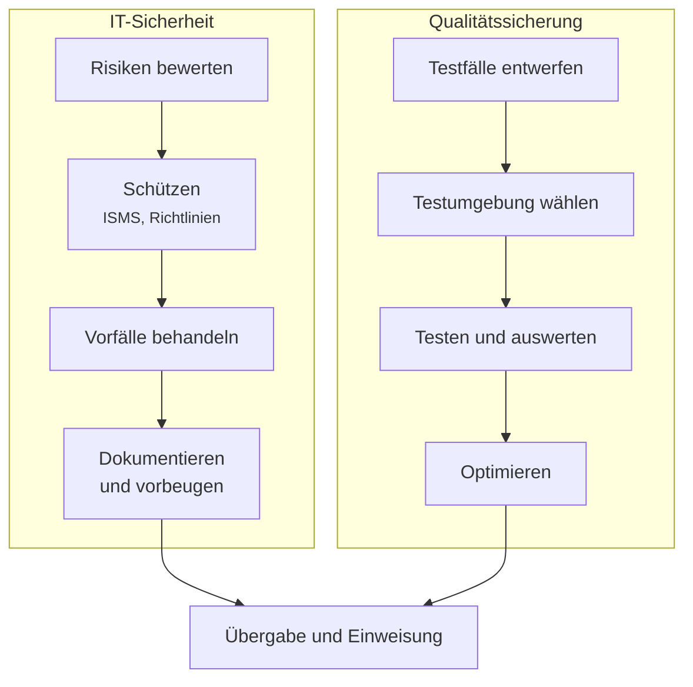

# Thema 3 – Qualitätssicherung und IT-Sicherheit

Der abschließende Block. Hier geht es um zwei Fragen, die eng zusammenhängen: **Funktioniert das System nachweislich richtig?** Und: **Ist es gegen Angriffe und Pannen gewappnet?**

!!! abstract "Was du am Ende können sollst"
    - **Risiken systematisch ermitteln und bewerten**, besonders bei Integration und Migration
    - an **IT-Sicherheitskonzepten** mitwirken und Sicherheitsrichtlinien umsetzen
    - **Sicherheitsvorfälle erkennen**, protokollieren und mit Sofortmaßnahmen eindämmen
    - Vorfälle **beweissicher dokumentieren** und daraus Prävention ableiten
    - **Testszenarien entwickeln** und passende Simulationsumgebungen auswählen
    - **Tests durchführen**, auswerten und daraus Maßnahmen ableiten
    - **Betriebszustände bewerten** und Abläufe optimieren
    - **Übergabe und Einweisung** planen und durchführen

---

## Zwei Stränge, ein Ziel

Der Block hat zwei Hälften, die beide auf dasselbe hinauslaufen: nachweisen können, dass das System tut, was es soll.

**Risikomanagement** ist dabei die Klammer um alles: Es liefert die Methode, mit der du entscheidest, was überhaupt geschützt und getestet werden muss.

---

## Die Abschnitte

### IT-Sicherheit und Risiko

Die Schutzziele Vertraulichkeit, Integrität und Verfügbarkeit – und warum in der Produktion oft die Verfügbarkeit zuerst kommt. Der Risikomanagement-Prozess von der Identifikation bis zur Überwachung, mit Schutzbedarfsfeststellung, Risikomatrix und Methoden wie der Fehlermöglichkeitsanalyse.

Dazu Informationssicherheits-Managementsysteme nach ISO 27001 und BSI-Grundschutz, der Umgang mit Sicherheitsvorfällen von der Erkennung bis zur Sofortmaßnahme, und die beweissichere Dokumentation.

Praktisch führst du vollständige Risikoanalysen durch, bewertest Szenarien in der Gruppe und entscheidest, welche Maßnahme sich lohnt.

[:octicons-arrow-right-24: Zum Sicherheits-Block](it-sicherheit/index.md)

### Tests und Qualität

Wie entsteht ein sinnvoller Testfall? Was gehört in einen Testplan, und woran erkennst du, dass ein Test aussagekräftig ist? Integrations- und End-to-End-Tests, Grenzfälle, Testumgebungen und die Frage, wie realitätsnah eine Simulation sein muss.

Danach die Auswertung: Ergebnisse dokumentieren, Schwachstellen ableiten, Maßnahmen umsetzen – und der geordnete Übergang in den Betrieb mit Einweisung der Anwender.

[:octicons-arrow-right-24: Zum Qualitäts-Block](testen-qualitaet/index.md)

---

## Bezug zur Prüfung

Dieser Block deckt den **dritten Qualifikationsschwerpunkt** ab und ist im Rahmenplan genauso umfangreich gewichtet wie der Betriebsteil.

| Nr. | Inhalt |
|---|---|
| 3.1 | Risiken ermitteln und bewerten, besonders bei Integration und Migration |
| 3.2 | Bei IT-Sicherheitskonzepten und deren Umsetzung mitwirken |
| 3.3 | Sicherheitsvorfälle identifizieren, protokollieren, Sofortmaßnahmen einleiten |
| 3.4 | Beweissicher dokumentieren und Präventionsmaßnahmen umsetzen |
| 3.5 | Testszenarien durch Simulation von Betriebssituationen entwickeln |
| 3.6 | Tests zur Funktion und zum Zusammenwirken der Infrastruktur durchführen |
| 3.7 | Betriebszustände bewerten, Abläufe und Ressourcennutzung optimieren |
| 3.8 | Übergabe- und Trainingsmaßnahmen planen und umsetzen |

!!! tip "Warum dieser Block am Schluss steht"
    Er greift alles auf, was vorher kam. Eine Risikoanalyse kannst du erst schreiben, wenn du die Systeme kennst. Ein Testszenario erst entwerfen, wenn du weißt, was getestet werden soll. Deshalb ist dieser Block auch die beste Vorbereitung auf die Prüfung: Die Aufgaben dort funktionieren genauso – sie setzen alles voraus.

---

## Und danach?

Nach diesem Block folgen im Kurs noch zwei Themenschwerpunkte, die von anderer Seite unterrichtet werden: **organisatorische und rechtliche Vorgaben** sowie **Projektunterstützung und -koordination**. Beide sind ebenfalls prüfungsrelevant.

Eine kurze Einordnung, worum es dort geht, findest du unter **[Weitere Prüfungsthemen](weitere-themen.md)**.
