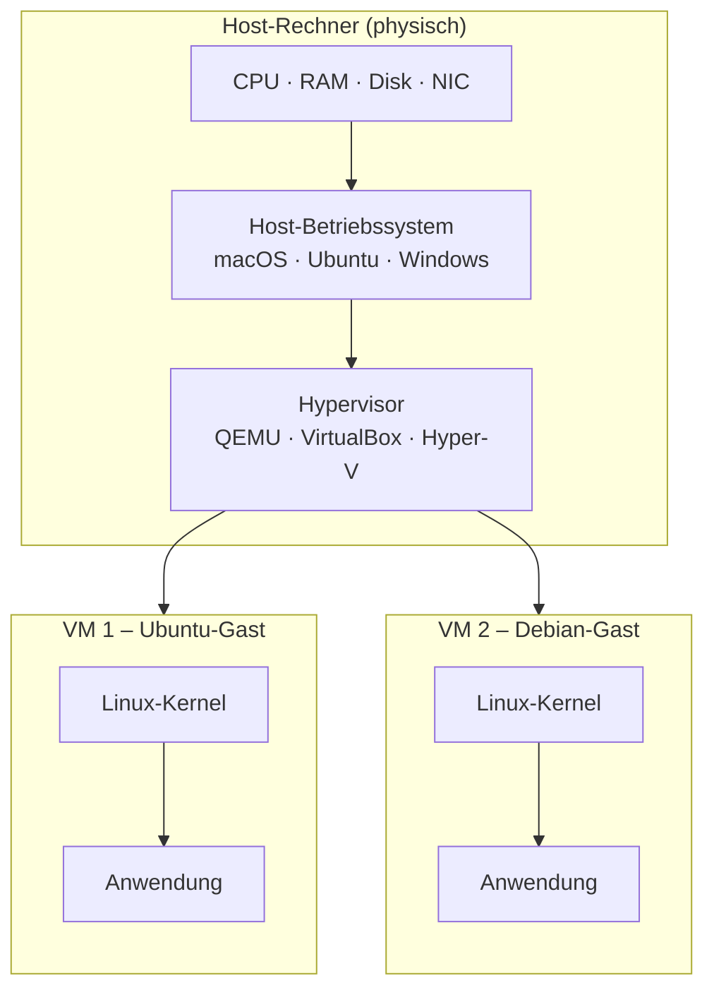

# Grundbegriffe der Virtualisierung

!!! abstract "Lernziel"
    Nach dieser Seite kannst du:

    - **Host** und **Gast** klar voneinander trennen
    - erklären, was ein **Hypervisor** tut
    - die Begriffe **vCPU**, **virtuelle Festplatte** und **virtuelle Netzwerkkarte** einordnen
    - benennen, was beim Start einer VM „unter der Haube" passiert

---

## Warum das wichtig ist

Sobald wir in der Praxis mit Multipass, VirtualBox oder Docker arbeiten, begegnen uns diese Begriffe ständig. Wer **Host**, **Gast** und **Hypervisor** sicher unterscheiden kann, versteht später auch, warum Fehlermeldungen wie „der Hypervisor ist nicht erreichbar" oder „die virtuelle Festplatte ist voll" sofort einleuchten.

---

## Host und Gast

**Host** ist der physische Rechner, an dem du sitzt. Auf dem Host läuft dein „normales" Betriebssystem – macOS, Windows oder Linux. Dort startest du Programme, öffnest Mails, schreibst diese Seite.

**Gast** ist ein Betriebssystem, das **innerhalb** einer virtuellen Maschine läuft. Der Gast „glaubt", er sei auf einem echten Rechner – sieht Prozessor, Arbeitsspeicher, Festplatte und Netzwerk ganz normal. In Wirklichkeit sind das aber **virtuelle Nachbildungen**, die vom Host bereitgestellt werden.

| Begriff | Beispiel |
|---------|----------|
| Host | dein MacBook mit macOS 15 |
| Gast | eine Ubuntu-22.04-VM, die auf dem MacBook läuft |
| Gast-OS | Ubuntu 22.04 (das Betriebssystem im Gast) |

!!! note "Ein Host, viele Gäste"
    Auf einem Host können gleichzeitig **mehrere Gäste** laufen. Dein Laptop kann z.B. eine Ubuntu-VM, eine Windows-VM und eine Debian-VM parallel betreiben – solange RAM und CPU mitspielen.

---

## Hypervisor – der Vermittler zwischen Host und Gast

Der **Hypervisor** ist die Software, die virtuelle Maschinen verwaltet. Er ist der **Türsteher** und **Vermittler**:

- Er teilt die echten Ressourcen (CPU, RAM, Disk, Netzwerk) unter den VMs auf.
- Er sorgt dafür, dass sich die VMs nicht gegenseitig in die Quere kommen.
- Er startet, pausiert, stoppt und löscht VMs.

Typische Namen, die dir begegnen werden: **VMware ESXi**, **KVM**, **Hyper-V**, **VirtualBox**, **QEMU**. Die Unterschiede sortieren wir auf der nächsten Seite unter [Hypervisor-Typen](hypervisor-typen.md).

---

## Virtuelle Hardware – was sieht der Gast?

Wenn du in einer VM `lscpu` oder `free -h` ausführst, zeigt Linux dir eine CPU, ein paar GB RAM und eine Festplatte an. Das sieht aus wie bei einem echten Rechner – ist aber **alles virtuell**:

### vCPU (virtuelle CPU)

Eine **vCPU** ist ein Anteil am physischen Prozessor. Wenn dein Laptop 8 Kerne hat und du einer VM 2 vCPUs gibst, darf die VM zwei Kerne gleichzeitig nutzen. Der Hypervisor teilt die echten Kerne unter den VMs auf, oft nach einem fairen Rotationsverfahren.

### Virtuelle Festplatte

Die „Festplatte" einer VM ist aus Sicht des Hosts meist **eine einzige große Datei**. Die Datei wächst, während die VM Daten schreibt – deshalb ist eine „5-GB-Disk" bei Multipass in der Realität oft nur 1–2 GB groß, solange noch nichts installiert wurde.

Typische Dateiendungen:

- `.qcow2` (QEMU/KVM – häufig bei Multipass)
- `.vdi` (VirtualBox)
- `.vmdk` (VMware)
- `.vhdx` (Hyper-V)

Vorteil: du kannst diese Datei kopieren, sichern oder auf einen anderen Rechner übertragen – und die ganze VM wandert mit.

??? info "Wo liegt die Disk-Datei meiner VM konkret?"
    Bei Multipass (und ähnlich bei anderen Tools) findest du die Disk-Dateien hier:

    | Host-OS | Pfad (meist Admin-geschützt) |
    |---------|------------------------------|
    | **macOS** | `/var/root/Library/Application Support/multipassd/qemu/vault/instances/<vm-name>/` |
    | **Linux** (Snap) | `/var/snap/multipass/common/data/multipassd/vault/instances/<vm-name>/` |
    | **Windows** | `C:\Windows\System32\config\systemprofile\AppData\Roaming\multipassd\vault\instances\<vm-name>\` |

    Die Verzeichnisse sind **root/Admin-geschützt**. Manipulationen von Hand bringen meist Multipass' Datenbank durcheinander – lieber Multipass-Befehle nutzen.

    Gesamtverbrauch prüfen:

    === "macOS"
        ```bash
        sudo du -sh "/var/root/Library/Application Support/multipassd"
        ```

    === "Linux (Snap)"
        ```bash
        sudo du -sh /var/snap/multipass/common/data/multipassd
        ```

    === "Windows PowerShell (als Admin)"
        ```powershell
        Get-ChildItem -Recurse "C:\Windows\System32\config\systemprofile\AppData\Roaming\multipassd" |
            Measure-Object -Property Length -Sum |
            ForEach-Object { "{0:N2} MB" -f ($_.Sum / 1MB) }
        ```

### Virtuelle Netzwerkkarte (vNIC)

Die VM hat eine eigene Netzwerkkarte mit eigener IP-Adresse. Meist hängt sie über ein **virtuelles Switch** am Netzwerk des Hosts. Du kannst die VM damit so behandeln, als sei sie ein eigener Rechner im Netz – inklusive Ping, `ssh` und Webzugriff.

### RAM

Der Hypervisor **reserviert** einen Teil des Host-RAM für die VM. Das bedeutet: solange die VM läuft, ist dieser RAM für den Host blockiert. Deshalb merkt dein Laptop deutlich, wenn du einer VM großzügig 4 GB gibst.

---

## Was beim Start einer VM passiert



Beim Start einer VM laufen grob folgende Schritte ab:

1. Du rufst `multipass launch` (oder ein anderes Tool) auf.
2. Der Hypervisor **reserviert** RAM und CPU-Kerne.
3. Er legt eine **virtuelle Festplatte** an oder öffnet eine vorhandene.
4. Er startet eine **virtuelle Firmware** (BIOS/UEFI) – genau wie beim echten Rechner.
5. Die Firmware lädt den **Kernel** des Gast-Betriebssystems.
6. Der Kernel startet seine Init-Prozesse, legt das Dateisystem an, bringt das Netzwerk hoch.
7. Der Gast ist erreichbar, du kannst dich z.B. per `multipass shell` oder `ssh` einloggen.

Das ist **dieselbe Prozedur** wie bei einem frischen physischen Rechner – nur eben vollständig in Software.

---

## Merksatz

!!! success "Merksatz"
    > **Ein Hypervisor gaukelt dem Gast-System einen eigenen Computer vor – inklusive CPU, RAM, Festplatte und Netzwerk. Der Gast bringt seinen eigenen Kernel mit.**

Dieser Satz wird im Docker-Block nochmal wichtig. Er ist der **genaue Unterschied** zu Containern.

---

## Weiterlesen

- [Hypervisor-Typen](hypervisor-typen.md)
- [Werkzeuge im Überblick](werkzeuge-im-ueberblick.md)
