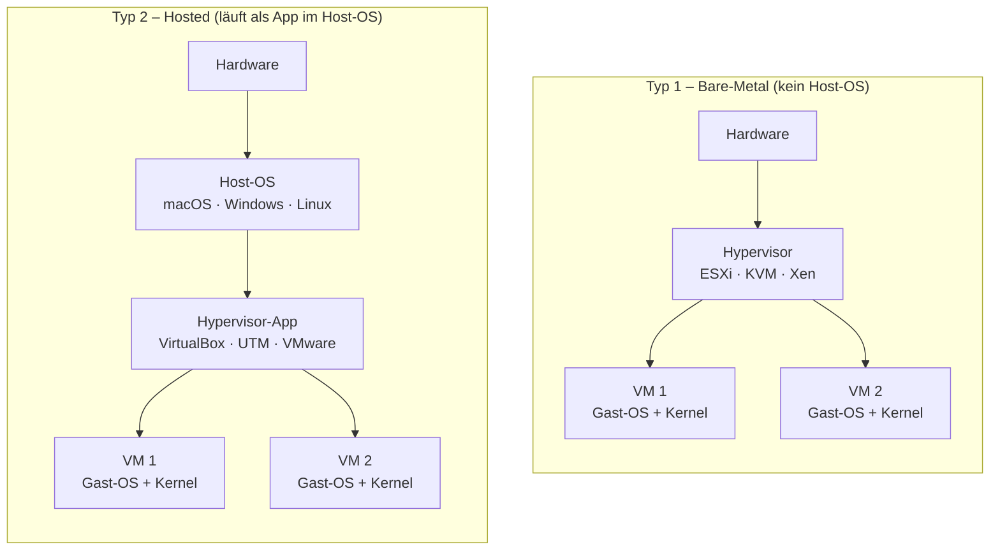

# Hypervisor-Typen: Typ 1 und Typ 2

!!! abstract "Lernziel"
    Nach dieser Seite kannst du:

    - **Typ-1-** und **Typ-2-Hypervisoren** unterscheiden
    - drei reale Produkte pro Typ nennen
    - einordnen, warum **Multipass** je nach Betriebssystem ein anderes Backend verwendet
    - erklären, warum Hyper-V und VirtualBox sich auf Windows oft streiten

---

## Warum das wichtig ist

„Hypervisor" ist kein einzelnes Produkt, sondern eine **Kategorie**. Innerhalb dieser Kategorie gibt es zwei grundlegende Bauarten – und sie unterscheiden sich darin, **wie nah am Metall** der Hypervisor sitzt.

Wer das kennt, versteht auch Fehlermeldungen wie „VT-x/AMD-V ist bereits in Benutzung" (spoiler: da streiten sich zwei Hypervisoren um dieselbe CPU-Funktion).

---

## Typ 1 – „Bare-Metal"-Hypervisor

Ein **Typ-1-Hypervisor** läuft **direkt auf der Hardware**. Es gibt kein „normales" Betriebssystem darunter. Der Hypervisor **ist** das Betriebssystem der Maschine, und seine einzige Aufgabe ist es, VMs zu betreiben.

### Merkmale

- **Sehr performant**: keine Umwege über ein Host-OS.
- **Hohe Isolation**: weniger Angriffs­fläche, weil kaum Software dazwischen­hängt.
- **Typisch für Server und Rechen­zentren.**
- **Keine bunten GUIs lokal**: meist Fernwartung über eigene Konsole oder Web-Interfaces.

### Reale Produkte

| Produkt | Anbieter | Typischer Einsatz |
|---------|----------|-------------------|
| **VMware ESXi** | Broadcom (ehem. VMware) | Unternehmens-Rechen­zentren |
| **Microsoft Hyper-V** (Server-Rolle) | Microsoft | Windows-Server-Umgebungen |
| **KVM** | Linux-Kernel-Modul | Cloud-Provider wie AWS, Azure, GCP, Hetzner |
| **Xen** | Linux Foundation | AWS EC2 historisch, heute noch bei einigen Providern |

!!! info "Cloud-Fun-Fact"
    Wenn du eine virtuelle Maschine bei AWS, Hetzner oder Azure mietest, läuft diese VM mit sehr hoher Wahrscheinlichkeit auf einem **Typ-1-Hypervisor** (meist KVM oder eine spezialisierte Variante davon). Cloud-Provider bauen ihre ganze Geschäfts­logik darauf, dass Typ-1-Hypervisoren viele Kundinnen und Kunden **parallel** auf denselben Server­maschinen bedienen können – ohne dass die sich gegenseitig sehen.

---

## Typ 2 – „Hosted"-Hypervisor

Ein **Typ-2-Hypervisor** läuft als **Anwendung innerhalb eines normalen Betriebssystems**. Du hast also zuerst dein Host-OS (z.B. macOS, Windows, Ubuntu), und installierst darauf ein Programm, das dann VMs hostet.

### Merkmale

- **Bequem**: installieren wie jedes andere Programm, oft mit GUI.
- **Weniger performant als Typ 1**: der Weg zur Hardware führt über das Host-OS.
- **Typisch für Entwickler­rechner, Test-Laptops, Schulungen.**
- **Schnell installiert und schnell wieder entfernt.**

### Reale Produkte

| Produkt | Host-OS | Kostet | Typischer Einsatz |
|---------|---------|--------|-------------------|
| **Oracle VirtualBox** | Win/Mac/Linux | frei | Lernen, Testen, Mehrfach-OS |
| **VMware Workstation / Fusion** | Win/Mac/Linux | frei für privat | Pro-Anwender, Schulung |
| **Parallels Desktop** | macOS | kostenpflichtig | beste Mac-Integration |
| **UTM** | macOS | frei | ARM-native auf Apple Silicon |
| **QEMU** | Linux/Mac/Win | frei | Basis vieler Tools (auch Multipass) |
| **Hyper-V** (Client) | Windows Pro+ | inkludiert | Windows-Entwicklung |

!!! note "Hyper-V ist beides"
    Microsoft Hyper-V ist ein Zwitter: Als **Server-Rolle** verhält er sich wie ein Typ-1-Hypervisor. Als **Windows-Client-Feature** ist er technisch eine Mischung – er lädt einen schmalen Hypervisor unter das laufende Windows und schiebt Windows selbst in eine „Root-Partition". Für den Alltag darfst du Hyper-V unter Windows Client trotzdem als Typ-2 betrachten.

---

## Multipass – welcher Typ, welches Backend?

Multipass ist kein Hypervisor, sondern ein **CLI-Werkzeug**, das intern auf einen passenden Hypervisor zurückgreift. Das Backend wählt Multipass automatisch nach Betriebssystem:

| Host-OS | Standard-Backend | Typ |
|---------|------------------|-----|
| **macOS** (Intel + Apple Silicon) | QEMU mit Apple HVF | Typ 2 |
| **Linux** | KVM | Typ 1 (Kernel-Modul) |
| **Windows** | Hyper-V | Typ 2 (Client) / Typ 1 (Server) |

Für dich als Nutzer ist das schön: du verwendest **dieselben Multipass-Befehle auf jedem System**, und Multipass kümmert sich darum, das passende Backend anzusteuern.

---

## Warum sich Hyper-V und VirtualBox auf Windows streiten

Beide Produkte wollen auf die **Virtualisierungs­funktionen des Prozessors** (Intel VT-x oder AMD-V) zugreifen – und zwar jeweils als „Erster" auf dem Ring-0, also der privilegiertesten Stufe im Kernel. Wenn beide gleichzeitig aktiv sind, gewinnt Hyper-V, und VirtualBox meldet:

> VT-x is not available

Abhilfe:

- Entweder Hyper-V deaktivieren (`bcdedit /set hypervisorlaunchtype off` als Administrator, dann Neustart)
- Oder VirtualBox ab Version 6.1 nutzen, das Hyper-V als „Backend" akzeptieren kann (aber mit Performance-Einbußen).

Auf modernen Macs stellt sich diese Frage nicht mehr so hart, weil fast alle Tools inzwischen Apples gemeinsame **Hypervisor Framework (HVF)**-Schnittstelle nutzen.

---

## Diagramm: Typ 1 vs. Typ 2

Der entscheidende Unterschied liegt nicht in den VMs oben (die sehen gleich aus), sondern **darunter**: beim Typ 1 ist der Hypervisor das unterste Element, beim Typ 2 liegt noch ein komplettes Betriebs­system dazwischen.

---

## Merksatz

!!! success "Merksatz"
    > **Typ 1 läuft direkt auf der Hardware und ist schnell und schlank. Typ 2 läuft als Programm in einem Host-Betriebssystem und ist bequem zu installieren.**

Multipass benutzt je nach Host entweder Typ-1- (KVM auf Linux) oder Typ-2-Backends (Hyper-V auf Windows, QEMU/HVF auf macOS) – für dich als Nutzer macht das im Alltag keinen Unterschied.

---

## Weiterlesen

- [Werkzeuge im Überblick](werkzeuge-im-ueberblick.md)
- [Multipass – Einstieg](multipass-einstieg.md)
