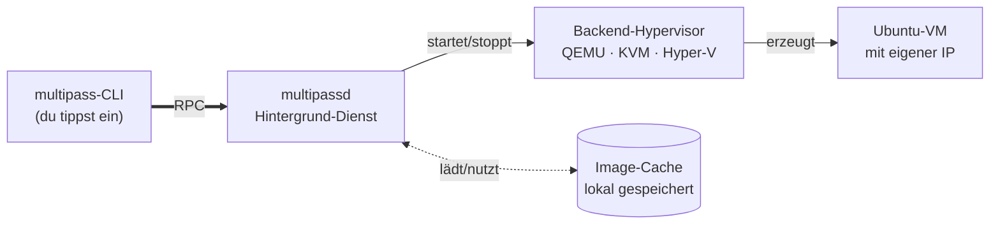

# Multipass – Einstieg und Installation

!!! abstract "Lernziel"
    Nach dieser Seite kannst du:

    - erklären, **was Multipass ist** und was es von VirtualBox oder Docker unterscheidet
    - Multipass auf **macOS, Linux oder Windows** installieren – je nach Rechner den richtigen Weg
    - die **aktuellen Fallstricke** pro Betriebssystem benennen und umgehen
    - auf typische Installations­fehler reagieren, ohne im Dunkeln zu stochern

---

## Warum Multipass?

Multipass ist ein Kommandozeilen-Werkzeug von **Canonical**, also der Firma hinter Ubuntu. Seine Mission in einem Satz:

> **Starte eine Ubuntu-VM so schnell, wie du einen Container startest.**

Das bedeutet:

- **Ein Befehl** (`multipass launch`), und eine Ubuntu-VM läuft.
- **Ein weiterer Befehl** (`multipass shell`), und du bist in der Shell dieser VM.
- **Ein letzter Befehl** (`multipass delete && multipass purge`), und die VM ist weg.

Kein Download eines ISO-Images, kein Klicken durch einen Installer, kein Einrichten eines Benutzer­kontos. Multipass erledigt das alles automatisch im Hintergrund.

### Was Multipass gut kann

- **Ubuntu-VMs in Sekunden** starten (nach dem ersten Image-Download, das ca. 350–500 MB groß ist).
- **Identische CLI** auf macOS, Linux und Windows – deine Notizen funktionieren überall.
- Cloud-Init-Support (Setup-Skripte beim Start), Datei­mounts vom Host in die VM, `multipass exec` für einmalige Befehle.
- **Kostenlos und Open Source** (Apache-Lizenz).

### Was Multipass nicht kann

- Offiziell keine **anderen Distributionen** als Ubuntu (Fedora, Debian, Arch, Alpine).
- Keine **grafischen Oberflächen**: Multipass startet Ubuntu-Server-Images, keine Ubuntu-Desktop-Images.
- Keine **Windows-VMs** oder andere Betriebs­systeme.
- Kein **komplexes Netzwerk-Setup** wie bei VirtualBox oder VMware.

Für all das nimmst du ein anderes Werkzeug aus dem [Überblick](werkzeuge-im-ueberblick.md).

---

## Vor der Installation – kurze Selbst­auskunft

Bevor du loslegst, ein kurzer Check, welchen Weg du gehen wirst:

??? question "Welches Betriebssystem hast du?"
    - **macOS** (Intel oder Apple Silicon) → [Abschnitt macOS](#installation-macos)
    - **Ubuntu / Debian / andere Linux-Distribution** → [Abschnitt Linux](#installation-linux)
    - **Windows 10/11 Pro, Enterprise oder Education** → [Abschnitt Windows](#installation-windows)
    - **Windows 10/11 Home** → siehe [Hinweis weiter unten](#windows-home) – Multipass geht dort nicht direkt

??? question "Wie viel Platz sollte frei sein?"
    - **Multipass selbst**: ca. 150 MB.
    - **Pro Ubuntu-VM**: ca. 2–5 GB (Image + Arbeits­platz).
    - Plane mindestens **10 GB frei** ein, wenn du ein, zwei VMs parallel betreiben willst.

??? question "Wie viel RAM brauche ich?"
    - **Host mindestens 4 GB RAM.**
    - **Pro VM** reserviert Multipass standardmäßig **1 GB**.
    - Für den Kurs reicht eine VM – also idealerweise 8 GB RAM im Host, damit neben Browser, IDE usw. noch Luft bleibt.

---

## <span id="installation-macos"></span>Installation auf macOS

Multipass läuft auf **macOS 10.15 (Catalina) und neuer**, sowohl auf Intel als auch Apple Silicon.

### Variante A – über Homebrew (empfohlen)

Wenn du [Homebrew](https://brew.sh) installiert hast (oder gleich installierst), ist das der sauberste Weg:

```bash
brew install --cask multipass
```

Der Installer läuft, fragt nach deinem Mac-Passwort und richtet den Hintergrund­dienst `multipassd` ein.

??? info "Homebrew noch nicht installiert?"
    Einmal-Installation mit einem Befehl:

    ```bash
    /bin/bash -c "$(curl -fsSL https://raw.githubusercontent.com/Homebrew/install/HEAD/install.sh)"
    ```

    Ausführliche Doku: <https://brew.sh>

### Variante B – direkter Installer

Wenn du Homebrew nicht nutzen willst:

1. Installer laden: <https://multipass.run/download/macos>
2. `.pkg`-Datei doppelklicken.
3. Installer durch­klicken, Admin-Passwort eingeben.

### Prüfen, ob alles läuft

```bash
multipass version
```

Du solltest etwas wie dies sehen (Versionen variieren):

```text
multipass   1.14.0
multipassd  1.14.0
```

??? warning "„multipass: command not found" direkt nach der Installation"
    Dein Terminal kennt den frisch hinzugefügten `multipass`-Pfad noch nicht. Zwei Lösungen:

    1. **Terminal schließen und neu öffnen.** Das lädt den PATH frisch.
    2. Oder aktuelles Shell-Profil neu einlesen: `source ~/.zshrc` (bei Zsh, dem Standard ab macOS Catalina) oder `source ~/.bash_profile` (bei Bash).

### Typische Probleme auf macOS

??? danger "„Multipass failed to launch: QEMU: HVF error"
    Das Apple Hypervisor Framework (HVF) ist blockiert.

    **Ursachen und Lösungen:**

    1. **Docker Desktop oder andere VM-Software** belegt das Framework. Für den Multipass-Start Docker Desktop kurz beenden.
    2. **Alte Multipass-Version.** `brew upgrade multipass` oder manuell neu installieren – Multipass 1.13+ nutzt Apples neuere `Virtualization.framework` und ist deutlich stabiler als alte Releases.

??? warning "Multipass ist extrem langsam auf Apple Silicon"
    Meist liegt das am **Image**. Aktuelle Multipass-Versionen wählen automatisch die ARM64-Variante, aber ältere Aliase zeigen manchmal noch auf x86_64. Prüfen:

    ```bash
    multipass exec demo -- uname -m
    ```

    Sollte `aarch64` zurückgeben. Zeigt es `x86_64`, läuft die VM emuliert. Dann neu launchen mit explizitem ARM-Alias (siehe Multipass-Release-Notes).

??? warning "„Timed out waiting for response" beim `launch`"
    Auf Apple Silicon gelegentlich beim ersten Boot eines frisch heruntergeladenen Images. Meist hilft:

    ```bash
    multipass delete <name>
    multipass purge
    multipass launch <image> --name <name>
    ```

    Erneut versuchen. Falls es erneut timeouts gibt, kann der Mac einen Neustart gebrauchen – manche Hintergrund­prozesse blockieren das Hypervisor-Framework.

??? info "Apple-Silicon-Tipp: Ressourcen großzügiger vergeben"
    Default ist 1 vCPU, 1 GB RAM, 5 GB Disk. Für ernsthaftes Arbeiten in der VM:

    ```bash
    multipass launch 22.04 --name demo --cpus 2 --memory 2G --disk 10G
    ```

    Das skaliert deutlich besser.

---

## <span id="installation-linux"></span>Installation auf Linux

### Ubuntu / Debian – via Snap (empfohlen)

Der offizielle Weg für Ubuntu und die meisten Debian-basierten Distributionen:

```bash
sudo snap install multipass
```

Das installiert Multipass samt `multipassd`-Hintergrund­dienst und richtet die Backends (KVM) automatisch ein.

??? info "Snap nicht installiert?"
    Auf Debian und einigen anderen Distributionen fehlt `snap` standardmäßig:

    ```bash
    sudo apt update
    sudo apt install -y snapd
    sudo systemctl enable --now snapd
    ```

    Kurz warten, dann Multipass installieren.

### Nach der Installation

```bash
multipass version
```

Du solltest Client- und Daemon-Versionen sehen.

### Typische Probleme auf Linux

??? danger "„cannot list: cannot connect to Multipass service"
    Der Multipass-Daemon läuft nicht oder du bist nicht in der `multipass`-Gruppe.

    **Fix:**

    ```bash
    sudo snap restart multipass
    sudo usermod -aG lxd $USER  # Multipass nutzt auf neueren Versionen teils die lxd-Gruppe
    newgrp lxd                  # oder: einmal ab- und anmelden
    ```

??? warning "KVM-Modul nicht geladen"
    Multipass auf Linux setzt auf **KVM**. Ist das Kernel-Modul nicht da, bricht der Start ab.

    ```bash
    lsmod | grep kvm
    ```

    Wenn die Ausgabe leer ist:

    1. Prüfe im BIOS/UEFI, dass **Intel VT-x** bzw. **AMD-V** aktiviert ist.
    2. Auf Ubuntu:
       ```bash
       sudo apt install -y qemu-kvm
       sudo modprobe kvm_intel   # oder kvm_amd
       ```

??? warning "Konflikt mit VirtualBox auf Linux"
    VirtualBox und KVM vertragen sich zwar inzwischen gut, aber gelegentlich kommt es zu Performance­problemen.

    **Im Zweifel:** VirtualBox beenden, bevor Multipass startet. Oder umgekehrt.

??? info "Multipass auf Fedora / Arch / openSUSE"
    Offiziell wird nur Snap unterstützt. Die Community bietet aber Build-Varianten für andere Distris:

    - Fedora / RHEL: <https://multipass.run/docs/installing-multipass>
    - Arch: AUR-Paket `multipass`
    - openSUSE: Snap nutzbar, wenn snapd installiert wird.

---

## <span id="installation-windows"></span>Installation auf Windows 10/11 Pro, Enterprise, Education

!!! warning "Nicht für Windows Home!"
    Multipass setzt auf **Hyper-V**, das bei Windows Home fehlt. Wenn du Home hast, siehe [den Abschnitt direkt hierunter](#windows-home) – dort gibt es den Alternativweg.

### Schritt 1 – Hyper-V aktivieren (falls nicht schon geschehen)

Multipass aktiviert Hyper-V im Zweifel selbst. Du kannst es aber auch vorab tun:

1. **Systemsteuerung → Programme → Programme und Features → Windows-Features aktivieren oder deaktivieren**
2. Haken setzen bei **Hyper-V** (alle Unterpunkte).
3. Mit **OK** bestätigen. Windows installiert die Komponenten und fragt nach einem **Neustart**.

??? info "Warum ein Neustart?"
    Hyper-V sitzt extrem nah am Kernel. Die Aktivierung lädt einen neuen Hypervisor beim nächsten Boot, der dann Windows selbst in eine „Root-Partition" schiebt. Das geht nur mit Neustart.

### Schritt 2 – Multipass herunterladen und installieren

1. Installer laden: <https://multipass.run/download/windows>
2. Installer als **Administrator** ausführen (Rechtsklick → „Als Administrator ausführen").
3. Durchklicken, Hyper-V aktivieren lassen, wenn gefragt.
4. Nach der Installation einmal neu starten.

### Schritt 3 – Prüfen

PowerShell öffnen (**kein** Admin nötig):

```powershell
multipass version
```

Erwartete Ausgabe: Client- und Daemon-Version.

### Typische Probleme auf Windows

??? danger "„Failed to create virtual machine" – Hyper-V startet die VM nicht"
    Meist einer dieser Gründe:

    1. **Virtualisierung im BIOS deaktiviert.** Prüfen im Task-Manager (Leistung → CPU → Virtualisierung).
    2. **Kollision mit Docker Desktop**, das ebenfalls Hyper-V nutzt. Docker Desktop kurz beenden und erneut versuchen.
    3. **VirtualBox mit älterer Version**, die Hyper-V ausschließt. VirtualBox auf 7.0+ aktualisieren oder beim Multipass-Start deinstalliert lassen.

??? danger "„The client could not connect to the Multipass daemon"
    Der `multipassd`-Dienst läuft nicht.

    **Lösung (PowerShell als Admin):**

    ```powershell
    Restart-Service -Name "Multipass"
    ```

    Hilft das nicht: Multipass-Client neu starten oder Rechner neu starten.

??? warning "Antivirus-Software blockiert Multipass"
    Viele Antivirus-Produkte betrachten frisch gebaute Hypervisor-VMs mit Misstrauen. Wenn `launch` immer wieder hängt oder abbricht, prüfe:

    - Windows Defender Firewall: eingehenden Zugriff für Multipass erlauben.
    - Drittanbieter-AV (McAfee, Norton, Kaspersky, …): Multipass-Installations­pfad als Ausnahme eintragen.

### <span id="windows-home"></span>Windows Home ohne Multipass – der Alternativweg

Wenn du Windows Home hast, kannst du die Multipass-Übungen **nicht 1:1** nachmachen, weil Hyper-V fehlt. Aber du hast zwei gute Optionen:

??? tip "Option 1: VirtualBox + Ubuntu-ISO"
    1. **VirtualBox** installieren: <https://www.virtualbox.org>
    2. **Ubuntu-Server-ISO** laden: <https://ubuntu.com/download/server>
    3. In VirtualBox eine neue VM erstellen, Ubuntu installieren (dauert ca. 20 Minuten).
    4. Danach kannst du alle Linux-Übungen inklusive Docker in dieser VM durchlaufen.

    Ist langsamer im Setup, aber genauso gut für das Verständnis.

??? tip "Option 2: Windows Home auf Pro upgraden"
    Microsoft verlangt dafür eine **Lizenz** (~145 €). Geht über **Einstellungen → System → Aktivierung**. Danach stehen Hyper-V und Multipass normal zur Verfügung.

??? tip "Option 3: WSL2 für den Docker-Teil"
    Der Virtualisierungs-Block setzt auf Multipass, aber der Docker-Block läuft auf Windows Home **problemlos** über **Docker Desktop + WSL2**. Dafür brauchst du kein Hyper-V. Du kannst also den Docker-Teil ohne Multipass mitmachen.

---

## Was passiert beim ersten Start einer VM?

Wenn du das allererste Mal `multipass launch` aufrufst, passieren einige Dinge:

1. **Backend-Check**: Multipass prüft, ob das passende Backend vorhanden ist (QEMU/HVF auf macOS, KVM auf Linux, Hyper-V auf Windows).
2. **Image-Download**: das Standard-Ubuntu-LTS-Image wird heruntergeladen. Größe: ca. **350–500 MB**. Dauert je nach Internet­leitung ein bis zwei Minuten.
3. **Virtuelle Disk anlegen**: Multipass erzeugt eine `.qcow2`-Datei mit Standard­größe (5 GB, anpassbar mit `--disk`).
4. **Cloud-Init ausführen**: ein vorgefertigtes Skript erstellt den Standard-Benutzer `ubuntu`, setzt die Sprache, richtet SSH ein.
5. **Start**: die VM bootet, bekommt eine IP-Adresse vom virtuellen Switch, ist dann per `multipass shell` erreichbar.

Beim **zweiten** und allen weiteren Starts derselben Image-Version entfällt Schritt 2. Multipass prüft lokal anhand eines Hashes (SHA-256), ob es dieses Image schon hat – wenn ja, wird es wiederverwendet. Deshalb startet die zweite VM innerhalb weniger Sekunden. Die Image-Dateien werden zentral gecached und liegen unter demselben Pfad wie die Disk-Dateien (siehe [Grundbegriffe → Wo liegt die Disk-Datei?](grundbegriffe.md)).

---

## Ein Blick hinter die Kulissen



- Die **CLI** (`multipass`) ist nur die Bedien­oberfläche.
- Die eigentliche Arbeit macht der **Daemon** (`multipassd`), ein Hintergrund-Dienst.
- Der Daemon spricht mit dem **Backend** (dem echten Hypervisor) über dessen native Schnittstelle.
- **Ubuntu-Images** werden einmalig geladen und für spätere VMs gecached.

Das ist der Grund, warum Multipass sich so schnell anfühlt: Das Image muss nur einmal herunter, und das Backend ist bereits vorhanden.

---

## Wichtige Parameter, die wir in der Praxis verwenden

| Parameter | Bedeutung | Beispiel |
|-----------|-----------|----------|
| `--name` | gibt der VM einen festen Namen | `--name demo` |
| `--cpus` | Anzahl der virtuellen CPUs | `--cpus 2` |
| `--memory` | RAM für die VM | `--memory 2G` |
| `--disk` | Größe der virtuellen Festplatte | `--disk 10G` |
| Positional | Image-Name / Version | `22.04` oder `24.04` |

Beispiel mit allem:

```bash
multipass launch 22.04 --name demo --cpus 2 --memory 2G --disk 10G
```

Ohne diese Flags nimmt Multipass **Defaults**: 1 CPU, 1 GB RAM, 5 GB Disk, aktuellstes LTS.

---

## Corporate-Firmenumgebung: Proxy, Zertifikate

Wenn du auf einem Firmenlaptop sitzt und das Firmen­netz Internet­zugriffe filtert:

??? info "HTTP-Proxy für Image-Downloads"
    Multipass nutzt die System-Proxy-Einstellungen. Wenn die VMs keine Images bekommen:

    === "macOS / Linux (bash/zsh)"
        ```bash
        export HTTP_PROXY=http://proxy.firma:8080
        export HTTPS_PROXY=http://proxy.firma:8080
        multipass launch 22.04 --name demo
        ```

        Persistent machst du das, indem du die Umgebungs­variablen in dein Shell-Profil (`~/.zshrc`, `~/.bashrc`) einträgst.

    === "Windows PowerShell"
        ```powershell
        $env:HTTP_PROXY  = "http://proxy.firma:8080"
        $env:HTTPS_PROXY = "http://proxy.firma:8080"
        multipass launch 22.04 --name demo
        ```

        Persistent machst du das in PowerShell mit `[Environment]::SetEnvironmentVariable("HTTP_PROXY","http://proxy.firma:8080","User")` (User-Scope, ohne Admin-Rechte).

    === "Windows CMD"
        ```cmd
        set HTTP_PROXY=http://proxy.firma:8080
        set HTTPS_PROXY=http://proxy.firma:8080
        multipass launch 22.04 --name demo
        ```

        Persistent über `setx HTTP_PROXY "http://proxy.firma:8080"` (wirkt erst in **neu geöffneten** CMD-Fenstern).

??? info "Zertifikats-Probleme (selbstsignierte Firmen-Root-CA)"
    Wenn die Firma einen eigenen Root-CA nutzt, den Multipass nicht kennt, schlägt der Image-Download mit SSL-Fehlern fehl. Lösung:

    1. Das Firmen-Zertifikat als `.crt` vorliegen haben.
    2. System-Keystore erweitern (macOS: Schlüsselbund­verwaltung; Linux: `/usr/local/share/ca-certificates/`; Windows: Zertifikats­speicher).

    Im Zweifel: IT-Support fragen – das ist Standard-Firmenproblem.

---

## Merksatz

!!! success "Merksatz"
    > **Multipass ist „Ubuntu auf Knopfdruck". Eine CLI, ein Befehl, eine VM – auf jedem Betriebssystem gleich bedienbar.**

---

## Weiterlesen

- [Praxis mit Multipass](praxis-multipass.md) – jetzt wird es ernst
- [Stolpersteine](stolpersteine.md) – wenn beim Alltag etwas hakt
- [Cheatsheet Multipass](../cheatsheets/multipass.md) – alle Befehle in einer Tabelle
