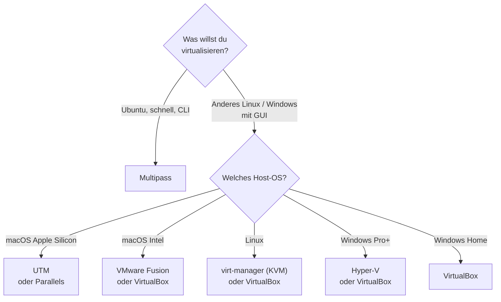

# Werkzeuge im Überblick

!!! abstract "Lernziel"
    Nach dieser Seite kannst du:

    - die wichtigsten Werkzeuge zur Virtualisierung einordnen
    - zu deinem Betriebssystem **das passende Tool** auswählen
    - erklären, warum Apple Silicon (M-Chips) einige Produkte ausschließt

---

## Warum das wichtig ist

Es gibt dutzende Tools, um VMs zu betreiben. Im Kurs konzentrieren wir uns auf **Multipass**, weil es das einfachste Werkzeug für einen schnellen Ubuntu-Start ist. Aber es lohnt sich, die anderen Kandidaten zu kennen – spätestens dann, wenn du eine andere Linux-Distribution brauchst, eine Windows-VM starten willst oder ein älteres Image mit GUI mitbringt.

---

## Die wichtigsten Werkzeuge im Vergleich

| Tool | Host-OS | Kostet | Stärken | Schwächen |
|------|---------|--------|---------|-----------|
| **Multipass** | macOS / Linux / Windows | frei | Ubuntu-VMs per einem Befehl; gleiche CLI auf allen Hosts | Offiziell nur Ubuntu-Images; kein GUI |
| **VirtualBox** | macOS / Linux / Windows | frei | Viele Gast-Betriebssysteme; gutes GUI; verbreitet in Lehrmaterial | Auf Apple Silicon (seit VirtualBox 7.1 / Sept 2024) offiziell unterstützt, aber spürbar langsamer als UTM/Parallels |
| **UTM** | macOS (Intel + Apple Silicon) | frei (App Store: kleiner Betrag) | ARM-native auf Apple Silicon; beliebig viele Gast-OS | GUI etwas eigen; Performance je nach Konfiguration |
| **VMware Fusion / Workstation** | macOS / Windows / Linux | seit 2024 frei für privaten Gebrauch | Stabil, performant, viele Features | Registrierung notwendig; teils komplex |
| **Parallels Desktop** | macOS | kostenpflichtig (~100 € / Jahr) | Beste Integration mit macOS; starke Windows-Performance | Lizenzkosten |
| **Hyper-V** | Windows Pro / Enterprise | im Windows enthalten | Tief integriert, performant | Nicht auf Windows Home; blockiert andere Hypervisoren |
| **QEMU** | Linux / macOS / Windows | frei | Basis vieler anderer Tools; sehr flexibel | Rohe CLI; hohe Einstiegshürde |
| **KVM + libvirt + virt-manager** | Linux | frei | Standard in Linux-Umgebungen; sehr performant (Typ 1) | Nur unter Linux; Einstieg ist etwas ruppig |

---

## Welches Tool für welches Ziel?

### „Ich will schnell und unkompliziert Ubuntu starten."

→ **Multipass**. Ein Befehl, eine VM, keine Klickstrecke. Funktioniert identisch auf Mac, Linux und Windows.

### „Ich brauche einen anderen Linux-Desktop, etwa Fedora oder Debian, mit grafischer Oberfläche."

→ **UTM** (auf Mac, v.a. Apple Silicon) oder **VirtualBox** (auf Intel-Mac, Linux, Windows). Beide unterstützen beliebige Gast-Betriebssysteme und bieten ein GUI.

### „Ich brauche eine Windows-VM auf einem Mac."

- Auf Apple Silicon: **Parallels Desktop** (am polierten) oder **UTM** (kostenfrei, aber mehr Hand­arbeit).
- Auf Intel-Mac: **VMware Fusion** (frei für privat) oder **Parallels**.

### „Ich möchte Virtualisierung auf Windows lernen."

→ **Hyper-V** (falls Windows Pro+), sonst **VirtualBox**. Für Ubuntu-Einstieg zusätzlich **Multipass**.

### „Ich baue einen Homeserver und will viele VMs parallel."

→ **Proxmox VE** (ein KVM-basiertes Linux-System speziell für Virtualisierung) oder **ESXi**. Beides Typ-1-Hypervisoren, die direkt auf der Hardware laufen.

---

## Apple Silicon (M1/M2/M3/M4) – was du wissen musst

Seit Apples Wechsel auf die ARM-Architektur 2020 hat sich die VM-Welt auf macOS stark verändert.

### Was neu ist

- Apple stellt mit dem **Hypervisor Framework (HVF)** eine einheitliche Schnittstelle bereit, auf die alle Tools zurückgreifen.
- Parallels, VMware Fusion, UTM und Multipass nutzen HVF.

### Was einfacher wurde

- **ARM-native Gäste** wie Ubuntu ARM64 laufen extrem schnell, oft spürbar schneller als auf alten Intel-Macs.
- Multipass startet in Sekunden eine Ubuntu-ARM-VM.

### Was schwieriger wurde

- **Klassische Intel-Windows-VMs** (x86_64) laufen nicht mehr nativ – sie müssen über einen **Emulator** ausgeführt werden, was extrem langsam ist.
- **Oracle VirtualBox** hat seit Version 7.1 (September 2024) offiziellen Apple-Silicon-Support – aber nicht so optimiert wie UTM oder Parallels. Für Performance-kritische Workloads sind die macOS-nativen Tools besser.
- **Einige Docker-Images** liegen nur in x86_64-Versionen vor. Docker Desktop emuliert sie über Rosetta 2, aber mit Performance-Einbußen (siehe [Docker-Stolpersteine](../docker/stolpersteine.md)).

!!! tip "Mac-User in diesem Kurs"
    Für den heutigen Kursteil reicht Multipass mit Ubuntu ARM64 vollkommen aus. Wenn du später spezifische x86_64-Software in einer VM testen willst, sind UTM, VMware Fusion oder Parallels die bessere Wahl als VirtualBox.

---

## Kurzes Werkzeug-Entscheidungs­diagramm

---

## Merksatz

!!! success "Merksatz"
    > **Für einen reibungslosen Ubuntu-Einstieg ist Multipass fast immer die beste Wahl. Für andere Betriebssysteme oder GUI-lastige Gäste greifst du zu UTM, VirtualBox, VMware oder Parallels – abhängig von deinem Host.**

---

## Weiterlesen

- [Multipass – Einstieg](multipass-einstieg.md)
- [Praxis mit Multipass](praxis-multipass.md)
